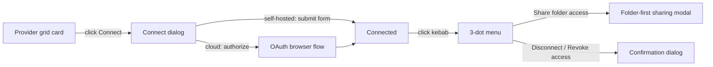

# Technical Specification

# 0. Agent Action Plan

## 0.1 Feature Intent and Objectives

Based on the prompt, the Blitzy platform understands that the new feature requirement is to **redesign the Workspace → Settings → Integrations surface and introduce a folder-level team-access model** for source-control management (SCM) and design providers. The work is delivered as a behavioral-and-visual prototype in this repository (two static HTML files) and authoritatively specifies the behavior the downstream production codebase must satisfy. The technical specification already decomposes this exact feature into twelve proposed features, F-001 through F-012 [9.4 REFERENCES:§2.1].

The intent resolves into three nested pillars:

- **Structure** — replace the legacy flat provider grid with a two-pane shell: a data-driven left category rail and a right canvas that stacks provider cards vertically.
- **Clubbed cards** — group each provider's connection variants under a single company card whose children are independent sub-cards, each carrying its own connection status. The guiding principle is "club the look, split the access": the visual grouping is shared, but status and access are per-variant.
- **Folder access** — a folder-first sharing side modal, reached from a sub-card's 3-dot menu, where an administrator selects a top-level folder and pushes team access onto it; access auto-inherits to everything inside, scoped to that one connection.

### 0.1.1 Feature Requirements

The following requirement set is the authoritative decomposition (all twelve are status "Proposed" in the feature catalog). Each requirement is restated in precise technical terms and anchored to its implementing code in the prototype.

| Feature | Requirement (clarified) | Primary anchor |
|---------|-------------------------|----------------|
| F-001 Data-Driven Category Navigation | Left rail built from `DATA` keys; SCM (active) and Design categories; "More to come" hint; empty state "No integrations in this category yet." | `[blitzy-integrations-page.html:L124-L127]`, `[blitzy-integrations-page.html:L39]` |
| F-002 Provider Company Cards | One card per provider (brand mark + name + optional "N connection types" sub-count). **Status never aggregates at company level**; Azure DevOps uses a special text mark "AZ" on `#0078d4`. | `[blitzy-integrations-page.html:L40-L44]`, `[blitzy-integrations-page.html:L43]` |
| F-003 Per-Variant Sub-Cards, Independent Status | Five states — `none`, `connecting`, `connected`, `failed`, `soon` — resolved per sub-card; the `mixed` preset (`{gh:connected, ghe:failed, ado:connected}`) proves independence. | `[blitzy-integrations-page.html:L162]`, `[blitzy-integrations-page.html:L176-L186]` |
| F-004 Connection Variant Definitions | Connect descriptor `{kind:'oauth'\|'form'}`; seven sub-cards (`gh`, `ghe`, `gl`, `gls`, `ado`, `bb`, `fig`). | `[blitzy-integrations-page.html:L147-L161]` |
| F-005 OAuth Connect Dialog | Cloud variants (`gh`, `gl`, `ado`): redirect modal "Authorize on {provider}"; transition `none → connecting → connected` after 1100 ms. | `[blitzy-integrations-page.html:L205-L210]` |
| F-006 Credentials Form Connect Dialog | Self-hosted variants (`ghe`, `gls`, `bb`): URL / Application ID / Secret fields, all required; Connect disabled until every field is non-empty. | `[blitzy-integrations-page.html:L211-L222]`, `[blitzy-integrations-page.html:L134-L143]` |
| F-007 Role-Based Action Dispatch | `actions()` branches on role × status; Super Admin sees Connect/Manage/Reconnect plus the 3-dot menu; Team Member is read-only (status labels only). | `[blitzy-integrations-page.html:L179-L186]` |
| F-008 3-Dot Management Menu | On connected and failed sub-cards, admin-only: Refresh connection / Share folder access / separator / Disconnect (danger) / Revoke access (danger). | `[blitzy-integrations-page.html:L228-L235]`, `[blitzy-integrations-page.html:L273-L275]` |
| F-009 Folder-Level Team Sharing Dialog | Two-pane folder-first dialog (folder list left, teams right); top-level folders only; inheritance automatic; no carve-outs; inherited grants read-only with source named; redundant grant blocked inline; per-connection scope. | `[blitzy-integrations-page.html:L250-L271]` |
| F-010 Stable-ID Anchored Grant Persistence | Grant tuple `{connectionId, folderStableId, folderPathSnapshot, teamId}`; inheritance computed at read time; rename/move safe; delete = broken (only error case). | `[9.4 REFERENCES:§2.1]`, `[folder-sharing-prototype-v2.html:L110-L118]` |
| F-011 Demo Control Strip | Prototype-only state/role scenario toolbar with a live status log; must not appear in the production build. | `[blitzy-integrations-page.html:L103-L112]`, `[blitzy-integrations-page.html:L280-L283]` |
| F-012 Design Token Reuse | Canonical `:root` tokens that must map 1:1 to the production Blitzy design system. | `[blitzy-integrations-page.html:L12-L16]` |

### 0.1.2 Implicit Requirements and Dependencies

The following requirements are not stated verbatim but are necessary for a correct implementation, surfaced from the prototype behavior and the specification:

- **Sub-card state machine.** Transitions are: `none → connecting → connected` (1100 ms) or `failed`; `connected → connecting` on refresh (800 ms); `connected`/`failed → none` on disconnect or revoke; `failed → connecting` on reconnect; `soon` is terminal `[blitzy-integrations-page.html:L223-L224]`.
- **Two-layer role enforcement.** The UI hides controls for members, and the sharing contract must independently reject non-admin callers (defense in depth) `[9.4 REFERENCES:§2.1]`.
- **Title ellipsis.** The sub-card/provider name must truncate to a single line when a badge and kebab share the header row (the Figma card-state board renders "Bitbucket Dat…").
- **Per-connection grant map.** Grants are keyed by connection, not by provider; each sharing dialog operates on its own connection's grants `[blitzy-integrations-page.html:L164]`.
- **Read-time inheritance resolution.** No inherited rows are stored; a team has access to a folder if it has a direct grant on that folder or on any ancestor.
- **Read-side filtering of project pickers.** The project Source and Destination pickers must show only folders a team has been granted (plus descendants) — an in-scope consumption boundary `[9.4 REFERENCES:§1.2]`.
- **Status vocabulary union.** The error family covers both the prototype's "Connection failed" and the Figma board's "Update expired"/"Connection expired" (all `#ffdfdf`/`#991010`); the Figma "Awaiting approval" pending family (`#fffbeb`/`#5f1616`) and the prototype's transient "Connecting" spinner have no counterpart in the other source and must be reconciled into a single badge component.

**Prerequisites:** F-009/F-010 depend on whether existing production code already persists grants by a stable folder identifier rather than by name or path — a precondition that must be confirmed before the stable-ID model is finalized (see Open Questions in 0.9).

## 0.2 Special Instructions and Constraints

The following directives are explicitly emphasized by the user and the specification and must be honored exactly.

- **Use the canonical Blitzy tokens verbatim.** Every CSS value must resolve to the design-system token block; the prototype already declares them `[blitzy-integrations-page.html:L12-L16]`:

```css
--brand:#5b39f3;--brand-hover:#4f30d6;--brand-soft:#d4cbfc;--brand-tint:#f3f0ff;
--ink:#000;--sec:#666;--ter:#999;--border:#d9d9d9;--neutral50:#f5f5f5;
--succ-bg:#c9fcea;--succ-tx:#005335;--err-bg:#ffdfdf;--err-tx:#991010;
--r:12px;--r-sm:8px;
```

- **"Club the look, split the access."** Company cards group variants visually, but status is never aggregated at the company header level — it lives only on each sub-card `[9.4 REFERENCES:§2.1]`.
- **Never label the destructive action "Uninstall."** Two distinct lifecycle actions must be presented: **Disconnect** (reversible — Blitzy stops using the connection but the provider app stays installed) and **Revoke access** (irreversible — removes Blitzy entirely, requiring reinstall and re-approval). The exact confirmation copy is preserved in 0.7.
- **Push model only.** Access is pushed onto folders by administrators; there are no access requests, approval queues, or member-initiated requests.
- **Top-level folders only, inheritance always flows down, no carve-outs.** A grant on a top-level folder propagates to every descendant and cannot be partially excluded.
- **Build missing pieces from existing primitives.** Where the design system lacks a component (the company card, the folder-first sharing modal), it must be assembled from existing Blitzy primitives and tokens rather than introducing new visual language.
- **Per-connection access isolation.** Each connection carries its own access, separate from other connections of the same or different providers.
- **Demo strip is prototype-only.** The state/role demo toolbar must not appear in the production build `[blitzy-integrations-page.html:L103-L112]`.

### 0.2.1 Architectural Requirements

- **Reuse existing connection infrastructure.** OAuth cloud connections reuse the existing Blitzy OAuth client registration; self-hosted credentials persist via the same adapter pattern as the existing `GITLAB_SELF_HOSTED` adapter `[9.4 REFERENCES:§1.2]`.
- **Reuse the read-only SCM tree.** Folder data is read from the existing `TreeNode` contract, honoring `MAX_GITLAB_DEPTH=20`; no backend tree-fetch changes are made `[9.4 REFERENCES:§1.3]`.
- **Follow the data-driven render convention.** Categories, cards, and sub-cards derive from the `DATA` registry so that adding a provider is a data change, not a layout change `[blitzy-integrations-page.html:L147-L161]`.

### 0.2.2 Preserved User Copy

The user's exact interaction copy must be preserved. The following strings are reproduced verbatim from the prototype and are authoritative.

- User Example (sharing dialog lede): "Grant a team access to a top-level folder. Everything inside inherits it. This connection has its own access, separate from other connections." `[blitzy-integrations-page.html:L250-L271]`
- User Example (Disconnect confirmation): "Blitzy will stop using this connection. Folder access granted to teams from it, and any project using it, will break. The app stays installed on the server, so you can reconnect later without re-approving." `[blitzy-integrations-page.html:L273-L275]`
- User Example (Revoke access confirmation): "This removes Blitzy from the server entirely and revokes its permissions at the source. All folder grants and connected projects break. To use it again you must reinstall and re-approve from scratch." `[blitzy-integrations-page.html:L273-L275]`
- User Example (self-hosted connect banner): "First, create an application in {provider}" with a "Learn how ↗" link `[blitzy-integrations-page.html:L211-L222]`.

### 0.2.3 Research Directives

Research needed for implementation was limited to confirming externally-sourced facts:

- Verify the icon-webfont dependency versions are valid published releases (see 0.8 and 0.10).
- Confirm the standard hierarchical RBAC pattern of downward inheritance with read-time resolution anchored on an immutable node identifier, which corroborates F-010 (see 0.10).

## 0.3 Technical Interpretation

These feature requirements translate to the following technical implementation strategy. The repository is a design-and-behavior prototype with no build system, framework, or backend `[9.4 REFERENCES:§3.1]`; `blitzy-integrations-page.html` already implements roughly 80–95% of the target behavior, so the strategy is to complete and correct that primary file, reconcile the secondary sharing prototype to the authoritative model, and document the downstream production targets the prototype specifies.

- To realize the **catalogue structure**, we will keep the two-pane page grid (`200px 1fr`) `[blitzy-integrations-page.html:L32]` and the data-driven `render()` so that categories, company cards, and sub-cards derive from `DATA` `[blitzy-integrations-page.html:L187-L196]`, and we will add the missing "Web search" settings tab `[blitzy-integrations-page.html:L115-L119]`.
- To enforce **per-variant independent status**, we will retain the `st()`/`badge()`/`actions()` state model and **delete the dead `rollup()` function and its `.rollup` CSS** so that no company-level status can render `[blitzy-integrations-page.html:L171-L175]`, `[blitzy-integrations-page.html:L45-L47]`.
- To support **connection per variant**, we will retain `oauthModal()` for cloud providers `[blitzy-integrations-page.html:L205-L210]` and `formModal()` for self-hosted providers driven by the `FORMS` registry, keeping the Connect button disabled until all fields validate `[blitzy-integrations-page.html:L211-L222]`, and we will add an inline field-error path for an invalid or unreachable self-hosted URL.
- To deliver **connection management**, we will retain the 3-dot menu `openMenu()` with its exact row set and the distinct Disconnect / Revoke access confirmations `[blitzy-integrations-page.html:L228-L235]`, `[blitzy-integrations-page.html:L273-L275]`.
- To add **folder-level access**, we will rebuild `shareModal()` into the folder-first inheritance model (top-level folders, direct-versus-inherited display, redundant-grant blocking) `[blitzy-integrations-page.html:L250-L271]`, drawing the folder-first UX shape from `folder-sharing-prototype-v2.html` while excluding its out-of-scope access-level pills and repo/branch tree levels and consolidating its divergent tokens to the canonical set `[folder-sharing-prototype-v2.html:L90-L99]`, `[folder-sharing-prototype-v2.html:L78-L82]`.
- To ensure **token fidelity**, we will keep the canonical `:root` block as the single source of truth and consolidate the secondary file's divergent palette onto it `[blitzy-integrations-page.html:L12-L16]`, `[folder-sharing-prototype-v2.html:L10-L24]`.

The production artifacts named by the specification — `src/panel/workspace/settings/integrations.tsx`, the `SvcType` enum, `IntegrationTeamShareRequest`, `bulkUpdateIntegrationTeamAccess`, and the `GITLAB_SELF_HOSTED` adapter — are **forward references**: they are the downstream integration targets the prototype specifies and are **not present in this repository** `[9.4 REFERENCES:§1.3]`.

## 0.4 Repository Scope Discovery and Integration Analysis

The repository root is `/tmp/blitzy/test-1/main_0d6e40` (branch `main`) and contains exactly two source files plus the `.git` directory; there is no `.blitzyignore`, no package manifest, and no build configuration `[9.4 REFERENCES:§3.1]`. All implementable work is therefore concentrated in these two files.

### 0.4.1 Existing Files Requiring Modification

| File | Mode | Scope of change | Anchors |
|------|------|-----------------|---------|
| `blitzy-integrations-page.html` | UPDATE | Primary deliverable. Add "Web search" tab; remove dead `rollup()` + `.rollup` CSS; rebuild `shareModal()` into the inheritance model; add a "connecting" page-state preset; add inline URL-error path to `formModal()`; add SRI/accessibility hardening. Retain the already-correct tokens, rail, render, badges, buttons, state machine, connect dialogs, 3-dot menu, and confirmations. | `[blitzy-integrations-page.html:L115-L119]`, `[blitzy-integrations-page.html:L171-L175]`, `[blitzy-integrations-page.html:L250-L271]`, `[blitzy-integrations-page.html:L162]`, `[blitzy-integrations-page.html:L211-L222]` |
| `folder-sharing-prototype-v2.html` | UPDATE | Secondary reconciliation. Consolidate the divergent palette to canonical tokens and Inter; align the icon-webfont version to 3.7.0; remove out-of-scope mode toggle, access-level pills, carve-out toggle, and repo/branch tree levels; add direct-versus-inherited affordances. | `[folder-sharing-prototype-v2.html:L10-L24]`, `[folder-sharing-prototype-v2.html:L37-L48]`, `[folder-sharing-prototype-v2.html:L78-L82]`, `[folder-sharing-prototype-v2.html:L90-L99]` |

### 0.4.2 Integration Points

**In-repository (data and logic model, all within `blitzy-integrations-page.html`):**

- `DATA` provider/sub registry — `gh`/`ghe`, `gl`/`gls`, `ado`, `bb`, `fig` `[blitzy-integrations-page.html:L147-L161]`.
- `FORMS` self-hosted field registry, consumed by `formModal()` `[blitzy-integrations-page.html:L134-L143]`.
- `PRESETS` scenarios (`zero`/`mixed`/`ideal`; add `connecting`) `[blitzy-integrations-page.html:L162]`.
- `TEAMS` list and the per-connection `grants` map, consumed by `shareModal()` `[blitzy-integrations-page.html:L163-L164]`.
- Render and dispatch functions: `render()`, `badge()`, `actions()`, `openMenu()`, `confirmD()`, `wire()` `[blitzy-integrations-page.html:L176-L200]`, `[blitzy-integrations-page.html:L228-L235]`, `[blitzy-integrations-page.html:L273-L275]`.

**Downstream forward-references (integration targets, not files in this repository):**

- `src/panel/workspace/settings/integrations.tsx` at route `/workspace/settings/integrations` `[9.4 REFERENCES:§1.3]`.
- `SvcType` enum — extend with GitHub Enterprise Server and Bitbucket Data Center alongside the existing `GITHUB`/`AZURE_DEVOPS`/`GITLAB`/`GITLAB_SELF_HOSTED` values `[9.4 REFERENCES:§1.2]`.
- `IntegrationTeamShareRequest` and `bulkUpdateIntegrationTeamAccess` — paralleled by a folder-aware contract anchored on a stable folder/node identifier `[9.4 REFERENCES:§1.2]`.
- `GITLAB_SELF_HOSTED` adapter — template for new self-hosted adapters; `TreeNode` and `MAX_GITLAB_DEPTH=20` reused read-only `[9.4 REFERENCES:§1.3]`.
- Project Source and Destination pickers — read-side filtering by granted folders `[9.4 REFERENCES:§1.2]`.

### 0.4.3 New File Requirements

No new files are mandatory for the in-repository prototype deliverable. Both source files are edited in place. Icons are rendered as Tabler Icons webfont glyphs (`ti-*` classes) rather than exported SVG assets `[blitzy-integrations-page.html:L10]`, so **no new asset files are created in this repository**; the Figma asset inventory is documented in 0.5 for design traceability and downstream production only. An optional standalone "tokens proof" page could be added to satisfy the design-system mapping deliverable, but the canonical `:root` block already serves that purpose `[blitzy-integrations-page.html:L12-L16]`. Because no user-specified rules were provided, there are no rule-mandated files to force into scope.

## 0.5 Figma Design Analysis

Two Figma frames were provided from the file **Blitzy-Platform-2.0** (file key `91TpUu5OYVLFkPdcBCmOUu`): Frame 0 "Bitbucket" (`52109:53707`) and Frame 1 "GitLab 1.0" (`35972:2977`). Screen discovery returned 131 child screens; twelve representative screens were deep-analyzed, including the decisive Section F "Integration card states" boards that document the authoritative card-state, badge, and open-menu chrome.

A central reconciliation governs this analysis: **the Figma baseline screens depict the current/legacy flat provider grid plus the connect, build-wizard, OAuth-browser, and connect-time-share flows; Section F additionally provides the authoritative card-state/badge/menu chrome.** The target redesign (category rail, company cards, sub-cards, folder-first sharing) is specified by the prompt and implemented in `blitzy-integrations-page.html`. Where values differ, the prompt/prototype tokens are authoritative; Figma values are recorded for traceability. The folder-first sharing modal has **no Figma representation** and is specified only by the prompt and the prototype.

### 0.5.1 Workflow Map



**Workflow WF1 — Connect a provider (self-hosted form).**
Description: An administrator connects a self-hosted provider via a credentials form.
Flow: Provider grid card → Connection modal → (cloud variants continue to the Section C OAuth browser flow) → Connected.

- Screen: GitLab Self-Managed connection modal (`36311:27640`) — 1440×1024 (modal 608×Hug). Purpose: capture self-hosted credentials. Key Elements: header GitLab fox logo + "GitLab Self-Managed connection"; inline alert `#F2F0FE` radius 12 "First, create an application in GitLab" + "Learn how ↗" (`#5B39F3`); focused GitLab URL field (stroke `#5B39F3`, comp `9631:10066`); Application ID and Secret fields (stroke `#D9D9D9`); footer "Cancel" (`4069:21700`) + "Connect" disabled at opacity 0.5 (`4069:21692`). Trigger → Connected: user completes fields and clicks the enabled "Connect" button.

**Workflow WF2 — Connect-time share choice (LEGACY — OUT OF SCOPE).**
Description: The legacy post-connection "Just me / Share with team" prompt. Flow: Connection success → share-choice modal → team chips → Done. Screens: Section E (`52903:67403` → `52903:67721` → `52903:68021`, with row 2 `52903:68933` → `52903:69152`). This entire flow is **superseded** by the folder-first sharing model and is out of scope; it is documented only as evidence of reusable design-system patterns (the Checkbox-2 selectable option card and the success-modal shell).

**Workflow WF3 — Manage a connected integration (TARGET).**
Description: An administrator manages a connected sub-card. Flow: Connected card → 3-dot menu → Share folder access / Disconnect / Revoke access.

- Screen: Section F card-state board (`52903:80153` and duplicate `52935:80948`) — 3020×1276 component matrix. Purpose: authoritative source for the connected card and the open overflow menu. Key Elements: connected card with "Connected" tag (`#C9FCEA`/`#005335`, check-circle `9117:8754`), closed kebab trigger (dots-horizontal-rounded `9120:4700`, `#999999`), and outline "Manage" button (`9301:5073`); open overflow menu (`52903:80238`) — 264px, white, stroke `#D9D9D9` 0.5px, radius 16, effect "Blitzy/Elevation Light/5", three 48px rows. Trigger → Folder sharing modal: user clicks the "Share folder access" row. Trigger → Confirmation: user clicks "Disconnect" or "Revoke access" (destructive `#991010` rows).
- The Figma menu rows are "Refresh connection / Share with team / Disconnect"; the **target** menu replaces "Share with team" with "Share folder access" and adds "Revoke access," adopting the Figma menu chrome (Dropdown Menu/Link components, Elevation Light/5, 48px rows, destructive `#991010`).

**Workflow WF4 — Card state transitions.**
Description: The full status lifecycle of a sub-card. Flow: Default ("Connect", primary) → Connecting (transient, prototype-only) → one of: Connected ("Manage", outline) / Update expired ("Reconnect", primary) / Connection expired ("Reconnect", primary) / Awaiting approval ("View status", outline; kebab → "Cancel request"). The five rendered states are authoritative from Section F boards (`52903:80153`/`52935:80948`); the "Connecting" spinner state has no Figma source and follows the prototype.

**Standalone / contextual screens (not part of a target workflow):** Bitbucket frame section map — A `52606:88572` (legacy grid), B `52840:31512` (legacy anchor `52840:23380`), C `52865:46182` ("Bitbucket connection flows" / in-browser OAuth authorize), D `52903:56427` (build wizards), E `52903:65019` (connect-time sharing — out of scope), F `52903:74922` (integration card states). For complete specification details of any node, downstream agents call `analyze_figma_node` with the relevant node ID.

### 0.5.2 Token Manifest

Values are Figma-confirmed; where the prompt/prototype overrides a Figma value, the authoritative token is shown and the Figma value is noted. Usage counts are approximate occurrences across the analyzed Section F matrix (10 cards + 2 menus) and connect dialogs.

| Category | Token Name | Value | Usage Count |
|----------|-----------|-------|-------------|
| Color | color-brand-primary | #5B39F3 | 14 |
| Color | color-brand-hover | #4f30d6 (Figma primary-hover #2D1C77) | 3 |
| Color | color-brand-soft | #D4CBFC | 4 |
| Color | color-brand-tint | #f3f0ff (Figma #F2F0FE) | 6 |
| Color | color-surface | #FFFFFF | 12 |
| Color | color-page-bg | #F5F5F5 | 3 |
| Color | color-border | #D9D9D9 | 12 |
| Color | color-border-subtle | #E9E9E9 | 4 |
| Color | color-text-primary | #000000 | 12 |
| Color | color-text-secondary | #666666 | 5 |
| Color | color-text-tertiary | #999999 | 10 |
| Color | color-success-bg / -text | #C9FCEA / #005335 | 2 |
| Color | color-error-bg / -text | #FFDFDF / #991010 | 6 |
| Color | color-pending-bg / -text | #FFFBEB / #5F1616 | 2 |
| Color | color-bitbucket | #2684FF + gradient(223deg, #0052CC 3% → #2684FF 73%) | 10 |
| Color | color-scrim | rgba(0,0,0,0.2) | 3 |
| Typography | text-heading-h5 | Inter / 600 / 24px / 130% | 10 |
| Typography | text-body-regular | Inter / 400 / 16px / 150% / ls -1.88% | 10 |
| Typography | text-body-small-bold | Inter / 600 / 14px / 150% | 8 |
| Typography | text-button-small | Inter / 600 / 16px / 24px | 14 |
| Radius | radius-card | 12px (Figma 24px) | 10 |
| Radius | radius-control | 8px (Figma inputs/menu 16–32px) | — |
| Radius | radius-pill | 20px (Figma badge 32px) | 8 |
| Spacing | space-card-padding / gap | 24px | 10 |
| Spacing | space-menu-row-padding | 4px 12px (48px row) | 4 |
| Shadow | shadow-modal | 0px 8px 8px -4px rgba(16,24,40,.04), 0px 20px 24px -4px rgba(16,24,40,.1) | 2 |
| Shadow | shadow-menu (Blitzy/Elevation Light/5) | 6-layer; prototype uses 2-layer approximation | 2 |

### 0.5.3 Component Inventory

| Component | Variants | Props Interface | Per-Variant Visual Specs | Figma Node |
|-----------|----------|-----------------|--------------------------|------------|
| IntegrationCard | default, connected, update-expired, connection-expired, awaiting-approval × collapsed/expanded | state, expanded: bool, role | 444px, fill #FFFFFF, stroke #D9D9D9 1px, radius 24 (→12 prod); header logo+title+[badge]+[kebab]; expanded reveals access list | 52903:80171 (expanded) |
| StatusBadge (Tag) | success, error, pending | label: string, variant | success #C9FCEA/#005335 check-circle 9117:8754; error #FFDFDF/#991010 error-circle; pending #FFFBEB/#5F1616 hourglass 38815:14356; pill padding 4 12 | 31151:169862 |
| Button | primary, secondary | label, size: sm/lg, disabled: bool | primary fill #5B39F3 text #FFFFFF (hover #2D1C77, disabled @0.5); secondary no fill, stroke #5B39F3, text #5B39F3; padding 8 20 | 9301:5049 / 9301:5073 |
| DropdownMenu + DropdownLink | default, destructive | rows: {icon, label, danger} | 264px, fill #FFFFFF, stroke #D9D9D9 0.5px, radius 16 (→8 prod), Elevation Light/5; 48px rows; destructive label/icon #991010 | 38815:14543 / 9120:6524 |
| ConnectionModal | oauth, form | provider, fields | 608px, fill #FFFFFF, radius 24, Shadow/xl; inline alert #F2F0FE; focused field stroke #5B39F3; disabled Connect @0.5 | 36311:27916 |
| TabNav | default, active | tabs, active | active = 4px #5B39F3 bottom underline, label #000000 | 31041:15463 |
| Checkbox2 option card (out-of-scope UI; pattern only) | selected, unselected | label, selected: bool | selected fill #F2F0FE stroke #5B39F3; unselected stroke #999999 | 31151:169928 / 31151:169906 |

### 0.5.4 Asset Inventory

**Implementation note:** the in-repository prototype renders all icons as **Tabler Icons webfont glyphs (`ti-*` classes)**, not as exported SVG files `[blitzy-integrations-page.html:L10]`. The Figma assets below are the **design source of truth** (glyph choice and color) and are recorded with file key and node ID for independent download and downstream production use; the in-repo deliverable therefore creates **no SVG asset files** and maps each design asset to its Tabler equivalent.

**State Groups** (assets representing different states of the same element):

| State Group | States & Node IDs | Parent Component |
|-------------|-------------------|------------------|
| status-badge-icon | connected → check-circle 9117:8754; update/connection-expired → error-circle (lib 31408:44047); awaiting-approval → hourglass 38815:14356 | StatusBadge |
| kebab-menu | closed trigger → dots-horizontal-rounded 9120:4700; refresh → 9650:5692; group → 15850:13922; unlink (disconnect) → 36311:29350; x (cancel request) → 10178:9938 | IntegrationCard kebab |
| accordion-chevron | down/up → 15001:42204 (same component rotated) | IntegrationCard accordion |

**Included Assets** (design source of truth; file key `91TpUu5OYVLFkPdcBCmOUu`; mapped to Tabler glyph in-repo):

| Asset | Type | Figma Node ID | State Group | Tabler glyph (in-repo) | Color |
|-------|------|---------------|-------------|------------------------|-------|
| check-circle | static-icon | 9117:8754 | status-badge-icon | ti-circle-check-filled | #005335 |
| error-circle | static-icon | 31408:44047 | status-badge-icon | ti-alert-circle | #991010 |
| hourglass | static-icon | 38815:14356 | status-badge-icon | ti-hourglass | #5F1616 |
| dots-horizontal-rounded | static-icon | 9120:4700 | kebab-menu | ti-dots | #999999 |
| refresh | static-icon | 9650:5692 | kebab-menu | ti-refresh | #000000 |
| group (two-person) | static-icon | 15850:13922 | kebab-menu | ti-users | #000000 |
| unlink | static-icon | 36311:29350 | kebab-menu | ti-unlink | #991010 |
| x (cross) | static-icon | 10178:9938 | kebab-menu | ti-x | #991010 |
| chevron-down | static-icon | 15001:42204 | accordion-chevron | ti-chevron-down | #999999 |
| provider logos (GitHub/GitLab/Bitbucket/Azure/Figma) | static-icon | e.g. Bitbucket 52935:80952 | — | ti-brand-github/gitlab/bitbucket/azure/figma; ADO = "AZ" text mark | brand colors |

**Excluded Assets** (traceability only — no file created):

| Asset | Figma Node ID | Exclusion Reason |
|-------|---------------|------------------|
| Section F duplicate board icons | 52935:80948 subtree | Duplicate of `52903:80153` board — identical content, different node IDs |
| Checkbox-2 user/group option icons | 31151:169901 / 15850:13922 | Belong to the out-of-scope connect-time share-choice modal |
| Revoke "shield-x" glyph | (no Figma node) | Figma menu has no Revoke row; the target uses Tabler `ti-shield-x` |

Totals: there are no animated-vector assets anywhere in the analyzed frames (the "Connecting" spinner is a CSS animation, not an asset), and no scrim asset (the scrim is an `rgba(0,0,0,0.2)` overlay).

## 0.6 Design System Compliance

The user mandates faithful reuse of the **Blitzy Design System** ("Use Blitzy's existing components and tokens throughout"). This sub-section catalogs how that system manifests in the repository, maps the design to it, and records compliance requirements for downstream code-generation agents.

### 0.6.1 System Identification

- **Library:** Blitzy Design System (proprietary). **Status:** embedded/canonical, not an installed npm package — the repository is a static prototype with no manifest, so the system is expressed as a 16-token `:root` custom-property block plus utility CSS classes `[blitzy-integrations-page.html:L12-L16]`.
- **Icon system:** `@tabler/icons-webfont` 3.7.0 via CDN `[blitzy-integrations-page.html:L10]`. **Typeface:** Inter 400/500/600 via Google Fonts `[blitzy-integrations-page.html:L9]`.
- **Component source of truth:** the Figma file Blitzy-Platform-2.0 (key `91TpUu5OYVLFkPdcBCmOUu`) component sets.
- **Downstream consumer:** the Blitzy React/TypeScript design system referenced by the default stack — not present in this repository `[9.4 REFERENCES:§3.1]`.
- **Compliance baseline:** the primary file uses 75 `var(--token)` references and is ~95% token-compliant; the secondary file uses a fully divergent hard-coded palette with zero custom properties and must be consolidated `[folder-sharing-prototype-v2.html:L10-L24]`.

### 0.6.2 Component Mapping

| UI Element | Blitzy class (in-repo) | Figma component | Notes |
|------------|------------------------|-----------------|-------|
| Settings tab bar | `.tabs` / `.tab` / `.tab.active` `[blitzy-integrations-page.html:L29-L31]` | TabNav 31041:15463 | Active = 2px brand underline |
| Category rail item | `.navitem` (+`.active`) `[blitzy-integrations-page.html:L34-L36]` | — | Active = brand-tint bg / brand text |
| Empty category | `.cat-empty` `[blitzy-integrations-page.html:L39]` | — | "No integrations in this category yet." |
| Company card | `.company` / `.company-h` / `.company-name` `[blitzy-integrations-page.html:L40-L44]` | — | Built from primitives; `.rollup` removed |
| Sub-card | `.sub` / `.vmark` / `.vname` / `.vdesc` `[blitzy-integrations-page.html:L48-L53]` | IntegrationCard | Per-variant status |
| Status badge | `.badge` (+`.ok`/`.err`/`.run`/`.soon`) `[blitzy-integrations-page.html:L54-L56]` | Tag 31151:169862 | |
| Buttons | `.btn` (+`.primary`/`.outline`/`.ghost`/`.danger`/`:disabled`) `[blitzy-integrations-page.html:L58-L62]` | Button 9301:5049 / 9301:5073 | hover #2D1C77; disabled @0.5/0.45 |
| Kebab trigger | `.kebab` `[blitzy-integrations-page.html:L63-L64]` | dots-horizontal-rounded 9120:4700 | |
| Dropdown menu | `.menu` / `.menu div.danger` / `.menu .sep` `[blitzy-integrations-page.html:L68-L71]` | Dropdown Menu 38815:14543 | Elevation Light/5 |
| Modal | `.dialog` `[blitzy-integrations-page.html:L74-L75]` | ConnectionModal 36311:27916 | 520px (prototype) |
| Inline help banner | `.tophelp` `[blitzy-integrations-page.html:L79-L80]` | inline alert | "Learn how ↗" |
| Form field | `.fld` / `.fld input` `[blitzy-integrations-page.html:L81-L85]` | Select/input | focus ring 3px brand-tint |
| Folder-sharing two-pane | `.share` / `.fl` / `.fr` / `.frow` / `.acc` `[blitzy-integrations-page.html:L88-L97]` | — | Built from primitives |
| ADO brand mark | `.brandmark.az` `[blitzy-integrations-page.html:L43]` | — | "AZ" text on #0078d4 (special case) |

### 0.6.3 Token Mapping

| Category | Figma Value | System Token | Resolution |
|----------|-------------|--------------|------------|
| Color | #5B39F3 | --brand | Exact |
| Color | #2D1C77 (primary hover) | --brand-hover (#4f30d6) | Snap — system token authoritative |
| Color | #D4CBFC | --brand-soft | Exact |
| Color | #F2F0FE (tint) | --brand-tint (#f3f0ff) | Snap (imperceptible) |
| Color | #D9D9D9 | --border | Exact |
| Color | #F5F5F5 | --neutral50 | Exact |
| Color | #C9FCEA / #005335 | --succ-bg / --succ-tx | Exact |
| Color | #FFDFDF / #991010 | --err-bg / --err-tx | Exact |
| Color | #FFFBEB / #5F1616 (pending) | — | GAP: no canonical pending token |
| Color | #0078d4 / #2684FF | — | Provider brand literals (legitimate one-offs) |
| Radius | cards 24 | --r (12px) | Snap — prompt overrides |
| Radius | inputs/menu 16–32 | --r-sm (8px) | Snap — prompt overrides |
| Radius | badge 32 | pill (20px) | Snap — prompt overrides |
| Shadow | Elevation Light/5 (6-layer) | --shadow (2-layer) | Snap — first layer matches exactly |
| Typography | Inter 600 24/130% | page/company title | Exact |
| Spacing | 24/16/12/8/4 | scale | Exact |

### 0.6.4 Gaps Inventory

- **Pending color family (#FFFBEB / #5F1616).** No canonical token exists. Proposed resolution: add `--pend-bg:#fffbeb; --pend-tx:#5f1616;` and a `.badge.pend` variant if the "Awaiting approval" state ships; otherwise leave the prototype's four-state badge set unchanged.
- **Secondary-file divergent palette.** `#5B4FE0`/`#4A3FC0`/`#C9C2F5`/`#F2F0FE`/`#E6E6EC`/`#EDEDF2`/`#1F1F29` and radii 16/9/8/7 plus system fonts must all be consolidated onto canonical tokens and Inter `[folder-sharing-prototype-v2.html:L10-L24]`.
- **Minor one-off literals in the primary file.** `#ececec` (`.navitem:hover` `[blitzy-integrations-page.html:L35]`) should be tokenized to a neutral hover; `#10b07a`/`#e24b4a` (`.rollup` dots `[blitzy-integrations-page.html:L47]`) disappear when `rollup()` is removed; the `.demo` dark-toolbar literals are prototype-only and excluded from production.

### 0.6.5 Compliance Summary

The Blitzy design system is fully expressed in `blitzy-integrations-page.html` as a 16-token `:root` block plus ~20 utility classes covering every required element (rail, company/sub cards, badges, buttons, kebab, menu, dialog, form field, two-pane share), and these classes map 1:1 to the Figma component sets (Button, Tag, Dropdown, Checkbox-2, Elevation Light/5). The primary deliverable is therefore already substantially compliant. The remaining gaps are minor — one missing pending color family, a handful of one-off literals, and the wholesale token consolidation of the secondary file. The precedence rule for downstream agents is: every value resolves to a canonical token (only `0`, `none`, `auto`, `inherit`, `transparent`, `#fff`, and the documented provider-brand literals `#0078d4`/`#2684FF` are exempt), and where the prompt/prototype and Figma differ (radius, hover color, tint), the prompt/prototype value wins. No npm dependency must be added for the in-repo prototype; downstream production consumes the existing Blitzy React/TypeScript library.

## 0.7 File-by-File Technical Implementation

Every file listed here must be created, modified, or referenced. No new files are mandatory; the work is in-place editing of the two HTML files plus documentation of the downstream forward-references.

### 0.7.1 File-by-File Execution Plan

**Group 1 — Page shell and catalogue** (`blitzy-integrations-page.html`, UPDATE)

- UPDATE the settings tab row to insert the "Web search" tab between "Artifacts" and "Notifications," keeping "Integrations" active `[blitzy-integrations-page.html:L115-L119]`. This closes the only catalogue gap; the prompt and the Bitbucket Figma 10-tab row both include it.
- RETAIN the two-pane page grid (`200px 1fr`) `[blitzy-integrations-page.html:L32]`, the category rail (`SCM` active, `Design`, "More to come") `[blitzy-integrations-page.html:L124-L127]`, and the empty state `[blitzy-integrations-page.html:L39]`.

**Group 2 — Cards, badges, buttons, state machine** (`blitzy-integrations-page.html`, UPDATE + delete-within)

- DELETE the dead `rollup()` function and its `.rollup` CSS so no company-level status can render `[blitzy-integrations-page.html:L171-L175]`, `[blitzy-integrations-page.html:L45-L47]`. (Note: the specification frames `rollup()` as "informational only"; the prompt's directive to remove company-level status is authoritative.)
- RETAIN `render()`, `badge()`, and `actions()` and the per-state button taxonomy: `none` → Connect (primary); `connecting` → spinner; `connected` → Manage (outline) + kebab; `failed` → Reconnect (primary) + kebab; `soon` → Coming soon `[blitzy-integrations-page.html:L176-L196]`.
- UPDATE `PRESETS` to add a `connecting` scenario `[blitzy-integrations-page.html:L162]`; the `.spin` animation already exists `[blitzy-integrations-page.html:L65-L66]`.

**Group 3 — Connect dialogs** (`blitzy-integrations-page.html`, UPDATE)

- RETAIN `oauthModal()` (cloud `gh`/`gl`/`ado`; "Authorize on {provider}") `[blitzy-integrations-page.html:L205-L210]` and `formModal()` (self-hosted `ghe`/`gls`/`bb`; Connect disabled until all required fields are non-empty) driven by `FORMS` `[blitzy-integrations-page.html:L211-L222]`, `[blitzy-integrations-page.html:L134-L143]`.
- UPDATE `formModal()` to add an inline field-error path for an invalid or unreachable self-hosted URL (edge case).

**Group 4 — Management menu and confirmations** (`blitzy-integrations-page.html`, UPDATE)

- RETAIN the 3-dot menu with its exact row order (admin-only, on connected and failed sub-cards) `[blitzy-integrations-page.html:L228-L235]`:

```text
Refresh connection
Share folder access
──────────────────
Disconnect        (danger)
Revoke access     (danger)
```

- RETAIN the distinct confirmations verbatim `[blitzy-integrations-page.html:L273-L275]`:
  - Disconnect — "Disconnect {name}?" / "Blitzy will stop using this connection. Folder access granted to teams from it, and any project using it, will break. The app stays installed on the server, so you can reconnect later without re-approving." / "Disconnect" (danger).
  - Revoke access — "Revoke access to {name}?" / "This removes Blitzy from the server entirely and revokes its permissions at the source. All folder grants and connected projects break. To use it again you must reinstall and re-approve from scratch." / "Revoke access" (danger).

**Group 5 — Folder-first sharing modal** (`blitzy-integrations-page.html`, UPDATE — largest effort)

- REBUILD `shareModal()` and its `.share` CSS into the inheritance model `[blitzy-integrations-page.html:L250-L271]`, `[blitzy-integrations-page.html:L88-L97]`: left pane lists per-provider top-level folders (replacing the hard-coded platform/design folders); right pane shows "Teams with access to {folder}" split into direct grants (with Remove) and inherited grants (read-only, lock icon, "from {parent}" provenance); "Add a team" provides case-insensitive search excluding already-granted teams; Add/Remove mutate immediately; the footer is Done only. A redundant grant (folder already inherits the team) is blocked inline with a pointer to its source. Grants are stored in the per-connection `grants` map, seeded `{platform:['Frontend Guild'], design:[]}` `[blitzy-integrations-page.html:L164]`. Inheritance is computed at read time per the F-010 tuple model.

**Group 6 — Secondary file reconciliation** (`folder-sharing-prototype-v2.html`, UPDATE)

- CONSOLIDATE the divergent palette to canonical Blitzy tokens and Inter, and align the icon-webfont version to 3.7.0 `[folder-sharing-prototype-v2.html:L7-L24]`.
- REMOVE the out-of-scope mode toggle `[folder-sharing-prototype-v2.html:L37-L48]`, access-level pills `[folder-sharing-prototype-v2.html:L90-L94]`, "Include everything inside" carve-out toggle `[folder-sharing-prototype-v2.html:L96-L99]`, and repo/branch tree levels `[folder-sharing-prototype-v2.html:L78-L82]` (keep workspace + project, i.e. top-level only).
- ADD the inheritance affordances absent here (direct-versus-inherited, lock icon, provenance, redundant-grant detection).

**Group 7 — Downstream forward-references** (REFERENCE only — not edited in this repository)

- `src/panel/workspace/settings/integrations.tsx`; `SvcType` (+ GitHub Enterprise Server, + Bitbucket Data Center); `IntegrationTeamShareRequest` and `bulkUpdateIntegrationTeamAccess` (folder-aware, stable-ID anchored); the `GITLAB_SELF_HOSTED` adapter (template); `TreeNode` + `MAX_GITLAB_DEPTH=20` (reused read-only); project Source/Destination pickers (read-side filtering) `[9.4 REFERENCES:§1.3]`.

**Group 8 — Cross-cutting hardening** (both files, UPDATE)

- Add SRI `integrity`+`crossorigin` to the CDN links; use `type="password"` for secret fields; add ARIA dialog patterns and focus trap/return; honor `prefers-reduced-motion` for the spinner; label icon-only buttons `[9.4 REFERENCES:§7.8]`. The demo strip is prototype-only and excluded from the production build `[blitzy-integrations-page.html:L103-L112]`.

### 0.7.2 Implementation Approach

For each component the order is: confirm or build the static markup, wire the state model (`st()`/`badge()`/`actions()`), then wire interactions (connect, menu, share, confirm). Because the primary file is already 80–95% complete, effort concentrates on four items: the `shareModal()` rebuild (Group 5), the "Web search" tab addition (Group 1), the `rollup()` removal (Group 2), and the "connecting" preset plus the URL-error edge case (Groups 2–3). The secondary file is a token-and-scope reconciliation pass. Files that reference user-provided Figma URLs for design fidelity should cite the Bitbucket frame (`52109:53707`) and GitLab frame (`35972:2977`) of file key `91TpUu5OYVLFkPdcBCmOUu`.

### 0.7.3 User Interface Design

- **Goal:** a scalable two-pane Integrations catalogue where status is per-variant and access is folder-scoped and inheritance-based, faithfully reusing the Blitzy design system.
- **Page frame:** 200px category rail + flexible canvas; ten settings tabs (including "Web search"); company cards stacked with 24px gaps.
- **Company card:** brand mark + name + optional "N connection types"; no status rollup.
- **Sub-card:** variant mark + name (single-line ellipsis when a badge and kebab share the row) + description + per-state badge + per-state action (Connect / Manage / Reconnect / View status) + kebab (connected/failed, admin only).
- **Connect dialogs:** OAuth redirect for cloud; self-hosted credentials form with the "Learn how ↗" banner, an inline URL-error path, and a Connect button disabled until all fields validate.
- **3-dot menu:** Refresh connection / Share folder access / separator / Disconnect (danger) / Revoke access (danger).
- **Confirmations:** distinct, reversible Disconnect versus irreversible Revoke access, with the verbatim copy above.
- **Folder-first sharing modal:** two-pane (folders 42% / teams 58%), direct-versus-inherited display with lock and provenance, inline redundant-grant blocking, push-only, per-connection.
- **Member (read-only) view:** status labels only — `none` → "Not connected" (italic); `connected` → "Connected" badge; `failed` → "Unavailable" (italic); `soon` → "Coming soon"; no Connect, Manage, or kebab controls.

## 0.8 Dependency Inventory

The repository has no package manifest; external dependencies are loaded from CDNs `[9.4 REFERENCES:§3.1]`. No new runtime packages are added and none are removed; the only changes are a version consolidation and a security-hardening recommendation.

| Registry | Package | Current Version | Purpose | Change |
|----------|---------|-----------------|---------|--------|
| npm / jsDelivr CDN | `@tabler/icons-webfont` | 3.7.0 (`[blitzy-integrations-page.html:L10]`) | UI icon glyphs (`ti-*` webfont) | KEEP at 3.7.0 |
| npm / jsDelivr CDN | `@tabler/icons-webfont` | 2.47.0 (`[folder-sharing-prototype-v2.html:L7]`) | UI icon glyphs | UPDATE → 3.7.0 (remove version drift) |
| Google Fonts | Inter (400/500/600) | CDN | Typeface | KEEP `[blitzy-integrations-page.html:L9]` |

Both pinned Tabler versions were verified as valid published releases (the latest is 3.44.0); see 0.10. The recommended action is to consolidate the secondary file from 2.47.0 to 3.7.0 so both files use one version. As a hardening measure (currently absent), Subresource Integrity (`integrity` + `crossorigin`) should be added to the CDN `<link>` tags `[9.4 REFERENCES:§7.8]`. Downstream production (`integrations.tsx`) consumes the existing Blitzy React/TypeScript design system rather than the Tabler webfont, and is not a dependency of this repository.

## 0.9 Scope Boundaries

### 0.9.1 Exhaustively In Scope

- **`blitzy-integrations-page.html`** (primary; realizes F-001 through F-012):
  - Catalogue: settings tabs (+ "Web search") `[blitzy-integrations-page.html:L115-L119]`, category rail `[blitzy-integrations-page.html:L124-L127]`, canvas, empty state `[blitzy-integrations-page.html:L39]`.
  - Cards: company card `[blitzy-integrations-page.html:L40-L44]`, sub-card `[blitzy-integrations-page.html:L48-L53]`, `render()` `[blitzy-integrations-page.html:L187-L196]`.
  - Status and state machine: `badge()` + `.badge` variants `[blitzy-integrations-page.html:L54-L56]`, `st()`/`actions()` `[blitzy-integrations-page.html:L165-L186]`, `PRESETS` (+ `connecting`) `[blitzy-integrations-page.html:L162]`.
  - Buttons, kebab, spinner `[blitzy-integrations-page.html:L58-L66]`.
  - Connect: `oauthModal()` / `formModal()` (+ inline URL error), `FORMS`, `DATA` `[blitzy-integrations-page.html:L134-L161]`, `[blitzy-integrations-page.html:L205-L222]`.
  - Menu and confirmations `[blitzy-integrations-page.html:L228-L235]`, `[blitzy-integrations-page.html:L273-L275]`.
  - Sharing: `shareModal()` rebuilt to the inheritance model + `.share` CSS `[blitzy-integrations-page.html:L88-L97]`, `[blitzy-integrations-page.html:L250-L271]`; `grants` map and `TEAMS` `[blitzy-integrations-page.html:L163-L164]`.
  - Tokens `[blitzy-integrations-page.html:L12-L16]`; removal of `rollup()` + `.rollup` `[blitzy-integrations-page.html:L45-L47]`, `[blitzy-integrations-page.html:L171-L175]`; SRI/accessibility hardening; demo strip excluded from production `[blitzy-integrations-page.html:L103-L112]`.
- **`folder-sharing-prototype-v2.html`** (secondary): token consolidation, removal of out-of-scope UI, and addition of inheritance affordances, per the line-level scope in the specification `[9.4 REFERENCES:§7.6]`.
- **Wildcards:** `*.html` (both files) and the CDN `<link>` tags within them.
- **No Figma SVG asset files** are created (icons are Tabler webfont glyphs).

### 0.9.2 Explicitly Out of Scope

- The **view-versus-edit access-level dimension** — the secondary prototype shows "Can view / Can edit" pills, but these "should not be implemented at this time" `[folder-sharing-prototype-v2.html:L90-L94]`, `[9.4 REFERENCES:§1.3]`.
- **Repo-level and branch-level grants** — restricted to the top-level folder above the repo `[folder-sharing-prototype-v2.html:L78-L82]`.
- **Multi-org / multi-account per connection** and **cross-org grants** (one account per sub-card, single-org).
- **Carve-outs / partial-subtree exclusions** under an inherited parent (inheritance always flows down).
- The **legacy connect-time "Just me / Share with team" prompt** — the entire Bitbucket Figma Section E (`52903:65019`) and the secondary file's mode toggle — replaced by the 3-dot "Share folder access" `[folder-sharing-prototype-v2.html:L37-L48]`.
- **Free / Pro subscription tier screens** (target is Enterprise + Team).
- **Backend SCM tree-fetch and provider-adapter changes** (reuse `TreeNode` and existing adapters unchanged).
- **Access-request / approval / member-initiated request workflows** (push model only).
- **Broken-grant auto-recovery via UI** (a broken grant must be re-issued against an existing folder; no auto re-bind).
- Performance optimization, refactoring, or features beyond F-001 through F-012; and `/app` or any non-repository path.

### 0.9.3 Open Questions and Ambiguities

- **Stable-ID persistence precondition (F-010).** It must be confirmed whether existing production code persists grants by a stable folder identifier rather than by name or path; this determines whether the stable-ID model is a new addition or an alignment `[9.4 REFERENCES:§2.1]`.
- **Team-tier gating.** Whether the Team subscription tier receives folder grants is open `[9.4 REFERENCES:§1.2]`.
- **Share migration.** Migration of existing whole-integration shares to the folder model is open `[9.4 REFERENCES:§1.2]`.
- **`rollup()` framing.** The prompt directs removal of company-level status; the specification calls `rollup()` "informational only." The prompt is authoritative (remove); noted here for reconciliation.

## 0.10 Web Research and References

Research was limited to confirming externally-sourced facts that affect the dependency inventory and the access model.

### 0.10.1 Dependency Version Verification

The two icon-webfont versions pinned in the prototypes were confirmed to be valid published releases. <cite index="5-2">The `@tabler/icons-webfont` published version list includes 3.7.0 and 2.47.0 among its releases.</cite> <cite index="4-2">The current latest release is 3.44.0</cite>, and <cite index="2-1">the package is published on npm with the latest version 3.44.0.</cite> The library is MIT-licensed and loaded via the jsDelivr CDN using `<i class="ti ti-*"></i>` markup. This confirms that keeping 3.7.0 and consolidating the secondary file from 2.47.0 to 3.7.0 are both valid choices (see 0.8).

### 0.10.2 Access-Model Best Practice

The folder-level access design corroborates the standard hierarchical RBAC pattern: downward inheritance from a granted node, with access resolved at read time and anchored on an immutable node identifier so that rename and move operations do not break a grant while deletion does. A push-only assignment model (no approval queue) and defense-in-depth enforcement (UI gating plus server-side contract rejection of non-administrators) match F-007 and F-010 `[9.4 REFERENCES:§2.1]`.

### 0.10.3 Reference Sources

- Technical specification sections consulted: §1.2 System Overview, §1.3 Scope, §2.1 Feature Catalog, §3.1 Technology Stack, §7.6 Screens Required, §7.8 Visual Design Considerations `[9.4 REFERENCES:§9.4]`.
- Repository source files: `blitzy-integrations-page.html` (primary target prototype), `folder-sharing-prototype-v2.html` (secondary sharing exploration).
- Figma file Blitzy-Platform-2.0, key `91TpUu5OYVLFkPdcBCmOUu` (Bitbucket frame `52109:53707`, GitLab frame `35972:2977`).
- `@tabler/icons-webfont` on npm (jsDelivr CDN) and Tabler Icons documentation.
- Related tickets cited by the specification for the Disconnect-versus-Revoke distinction: ABK-939 (Azure DevOps uninstall) and ABK-2730 (silent token expiry) `[9.4 REFERENCES:§2.1]`.

## 0.11 Attachments

No file attachments (PDFs or images) were provided. Two Figma frames were attached from the file Blitzy-Platform-2.0 (file key `91TpUu5OYVLFkPdcBCmOUu`).

| Frame | Node ID | URL | Contents |
|-------|---------|-----|----------|
| Bitbucket | `52109:53707` (`52109-53707`) | https://www.figma.com/design/91TpUu5OYVLFkPdcBCmOUu/Blitzy-Platform-2.0?node-id=52109-53707 | Six sub-sections (A–F): legacy provider grids, the Bitbucket connection flows (in-browser OAuth authorize), build wizards, post-connection integration sharing (connect-time share-choice — out of scope), and the authoritative "Integration card states" matrix (five connection states × collapsed/expanded plus the open 3-dot menu and badge variants). |
| GitLab 1.0 | `35972:2977` (`35972-2977`) | https://www.figma.com/design/91TpUu5OYVLFkPdcBCmOUu/Blitzy-Platform-2.0?node-id=35972-2977 | GitLab integration design: legacy grid, the GitLab Self-Managed connection modal (focused URL field, Connect disabled until valid), build wizards, edge cases, and a responsive screen set. |

Both frames describe the current/legacy design plus connection, build, and edge-case flows; the Bitbucket frame's Section F additionally provides the authoritative card-state, badge, and open-menu chrome reused by the redesign. The folder-first sharing modal is not represented in either frame and is specified by the prompt and the prototype. Per-screen specification details are available by calling `analyze_figma_node` with the relevant node ID. Detailed analysis is in 0.5.

