# Technical Specification

# 1. Introduction

## 1.1 EXECUTIVE SUMMARY

### 1.1.1 Project Overview

This Technical Specification documents the **Integrations Redesign and Folder-Level Team Access** feature for Blitzy — an enterprise AI development workspace. The deliverable redefines how Blitzy connects to external source control management (SCM) systems and design tools, and how access to those connections is delegated to internal teams.

The repository under specification is a **design-and-behavior prototype repository**, not a runnable application. It contains two self-contained HTML prototypes that establish the visual contract, interaction model, and behavioral acceptance criteria for the downstream production implementation:

| Artifact | Purpose |
|---|---|
| `blitzy-integrations-page.html` | End-to-end mockup of the redesigned Integrations settings page — category navigation, company cards, per-variant sub-cards, OAuth and credentials connect flows, 3-dot management menu, and the folder-share dialog entry point. |
| `folder-sharing-prototype-v2.html` | Dedicated prototype for the Bitbucket Data Center folder-level sharing workflow — folder picker, team multi-select with chips, access-level pills, and the include-subfolders toggle. |

These prototypes act as the executable specification: behaviors observable in the rendered HTML define the target user experience that the production implementation in `src/panel/workspace/settings/integrations.tsx` (and its associated provider adapters and sharing contract) is expected to honor.

### 1.1.2 Core Business Problem

In Blitzy's current state, an SCM connection can only be shared with an internal team **as a whole**. The sharing model is binary: a team either sees the entire connection or none of it. This all-or-nothing constraint is incompatible with enterprise customers, where multiple business units, product lines, and security boundaries co-exist inside a single SCM tenant.

The concrete consequences of this limitation are:

- Enterprises cannot onboard Blitzy onto a single shared GitHub Enterprise Server or Bitbucket Data Center instance without exposing every team's repositories to every other team.
- Super admins must choose between connecting once and over-exposing, or connecting many times and fragmenting governance.
- The Integrations settings page itself does not differentiate between cloud and self-hosted variants of the same provider (e.g., GitHub vs. GitHub Enterprise Server), so each new provider variant added increases visual clutter without scaling structurally.

This feature solves both problems together: it restructures the page so that providers and their variants render cleanly from data, and it introduces folder-scoped access so that a team sees only the folders that belong to its work.

### 1.1.3 Key Stakeholders and Users

| Stakeholder | Role | Primary Interaction |
|---|---|---|
| Super Admin | Owns workspace-level integration and access governance | Connects providers, manages connections (Refresh / Disconnect / Revoke), grants folder access to teams |
| Team Member | Consumes granted access to build projects | Sees only granted folders in project source and destination pickers; sees status but no management controls |
| Enterprise Customer | Account purchasing Blitzy at the Enterprise tier | Primary commercial driver for the granular access capability |
| Team Tier Customer | Account purchasing Blitzy at the Team tier | Secondary in-scope tier (gating for grant action to be confirmed in implementation) |
| Provider Vendors | GitHub, GitLab, Atlassian (Bitbucket), Microsoft (Azure DevOps), Figma | External OAuth or self-hosted credential surfaces consumed but not modified |

The two roles modeled directly in the prototypes are **Super Admin** and **Team Member**, switchable via a demo control strip in `blitzy-integrations-page.html` so that reviewers can confirm role-gated controls behave as specified.

### 1.1.4 Expected Business Impact and Value Proposition

The feature delivers three categories of value:

1. **Enterprise unblocking.** Granular folder-level grants are a prerequisite for adoption in organizations with multi-team SCM tenants. Without this capability, security and governance review blocks rollout.
2. **Self-service scalability.** A super admin can grant the right teams the right folders without engineering involvement, push-style. There is no approval queue, no request workflow, and no engineering escalation path required for routine access changes.
3. **Catalog scalability.** A data-driven category and company-card layout allows new providers (additional SCMs, additional design tools, future analytics or CI categories) to be added by extending the provider catalogue rather than by reworking the page.

---

## 1.2 SYSTEM OVERVIEW

### 1.2.1 Project Context

#### Business Context and Market Positioning

Blitzy positions itself as an enterprise AI development workspace where source and destination repositories are first-class inputs to AI-generated work. The value of that proposition is directly proportional to the breadth and granularity of the SCM and design-tool integrations a customer can safely connect. The Integrations settings page is therefore both an operational surface (where connections live) and a commercial surface (where the breadth and trustworthiness of the platform is communicated).

The feature targets the **Enterprise** and **Team** tiers; **Free** and **Pro** tier behavior is deferred. Team management is currently Enterprise-gated in the broader product, and final gating for the folder-grant action on the Team tier is an explicit open question carried forward to implementation.

#### Current System Limitations

The existing system has two reinforcing limitations that this feature addresses simultaneously:

| Limitation | Symptom | Resolution Path |
|---|---|---|
| Single-status integration card | Cloud and self-hosted variants of the same provider cannot be distinguished or operated independently | Per-variant **sub-cards** under a single **company card**, each with its own status, lifecycle, and actions |
| Whole-connection sharing | Sharing a connection with a team exposes the entire tenant tree | **Top-level folder grants** with automatic inheritance, anchored on the provider's stable folder identifier |
| Combined "uninstall" semantics | A single Disconnect action conflates "stop using" with "remove and revoke" | Distinct **Disconnect** and **Revoke access** actions with separate, role-appropriate confirmation copy |
| Connect-time share prompt | The legacy "Just me / Share with team" prompt forces an access decision at connect time that is then hard to change | Connect is purely a connection action; sharing moves to the 3-dot menu on a connected sub-card |

#### Integration with the Existing Enterprise Landscape

The feature is a settings-layer addition to the existing Blitzy workspace application. It integrates with — and explicitly does **not** rewrite — several existing platform contracts. The named integration points described in the feature prompt are:

| Integration Point | Role in this Feature |
|---|---|
| `src/panel/workspace/settings/integrations.tsx` | The page being restructured into category nav + company cards + sub-cards (route `/workspace/settings/integrations`). |
| `SvcType` provider enumeration | Extended to represent GitHub Enterprise Server and Bitbucket Data Center as variants alongside existing `GITHUB`, `AZURE_DEVOPS`, `GITLAB`, `GITLAB_SELF_HOSTED`. |
| Existing provider adapters | Reused as-is to normalize provider data to the shared `TreeNode` contract that backs the folder picker; `MAX_GITLAB_DEPTH = 20` is respected. |
| `IntegrationTeamShareRequest` / `bulkUpdateIntegrationTeamAccess` | Extended (or paralleled) by a folder-aware sharing contract that references a stable folder/node ID rather than an entire integration. |
| Disconnect lifecycle | Augmented with a new, distinct `Revoke access` action; related ticket references in the prompt are `ABK-939` (ADO uninstall) and `ABK-2730` (silent token expiry). |

> **Note on repository scope.** None of the files named above (`integrations.tsx`, adapters, `SvcType`, `IntegrationTeamShareRequest`, `bulkUpdateIntegrationTeamAccess`, `MAX_GITLAB_DEPTH`) exist in this repository. They reside in the downstream production Blitzy codebase and are documented here as **integration targets** described by the feature prompt rather than as observed source artifacts. The two HTML prototypes in this repository serve as the behavioral and visual specification that the downstream implementation must satisfy.

### 1.2.2 High-Level Description

#### Primary System Capabilities

The feature provides six top-level capabilities, in priority order:

1. **Data-driven category navigation** — Categories (initial: `SCM`, `Design`) render from a data structure, allowing new categories to be added without layout changes.
2. **Per-variant sub-card status** — Each connection variant (e.g., GitHub Cloud vs. GitHub Enterprise Server) carries its own status, badge, and primary action independently of its sibling.
3. **Config-driven connect dialog** — Cloud variants open an OAuth authorize step; self-hosted variants open a credentials form whose fields are declared per-provider (e.g., Bitbucket Data Center: `Bitbucket URL`, `Application ID`, `Secret`).
4. **Connection lifecycle menu** — A 3-dot menu on a connected sub-card exposes Refresh connection, Share folder access, Disconnect, and Revoke access, with disconnect-vs-revoke confirmation copy that distinguishes "stop using" from "uninstall."
5. **Folder-level team access** — Super admins grant teams access to top-level folders inside a connection, with automatic inheritance to everything nested below, no carve-outs, and no approval queue (push model).
6. **Stable-ID anchored grants** — Each grant is persisted against the provider's permanent folder/node ID so that rename and move operations do not break access; only deletion of the underlying folder produces an error state.

#### Major System Components

The end-to-end feature comprises five logical components, as illustrated below:

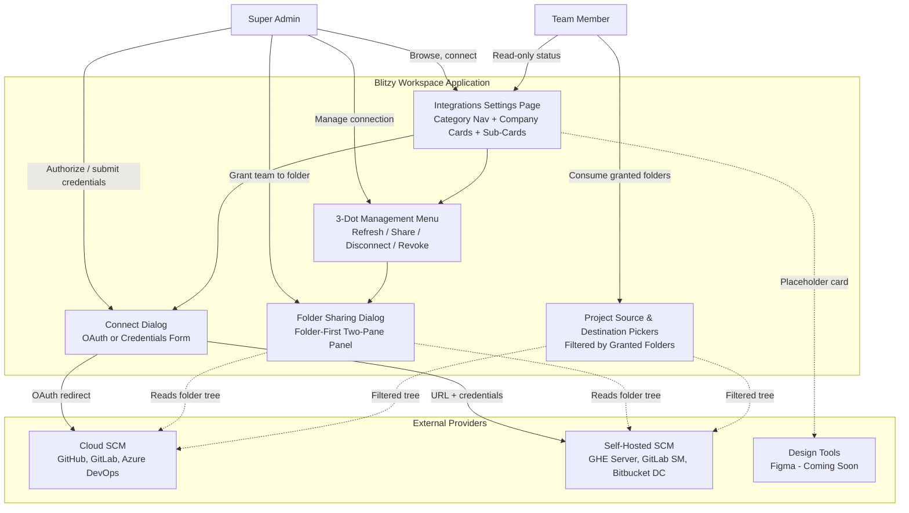

#### Core Technical Approach

The technical approach is built on four design choices, all of which are visible in the prototypes:

1. **Data-driven catalogue.** `blitzy-integrations-page.html` derives the entire rendered catalogue from a single `DATA` object keyed by category, with each provider declaring one or more sub-cards and each sub-card declaring its connect descriptor (`{kind: 'oauth' | 'form', ...}`). Adding a category, a provider, or a variant is a pure data change.
2. **Per-variant state model.** Status is held per sub-card identifier, not per company. The prototype models five states (`none`, `connecting`, `connected`, `failed`, `soon`) and renders the appropriate badge, primary action, and management surface for each.
3. **Push-only sharing with inheritance.** The sharing model is grant-based and one-way: an admin directly assigns a team to a folder, and access flows down by inheritance. There is no request, no approval queue, and no carve-out under an inherited parent.
4. **Stable-ID anchored persistence.** Grants are conceptually `{ connectionId, folderStableId, folderPathSnapshot, teamId }`. The path snapshot is for display only; resolution always reads the live tree by stable ID, making rename and move safe and isolating delete as the only error condition.

The feature **explicitly reuses** the design system tokens and adapter contracts already present in the broader product: Inter typography, the `#5b39f3` brand color, 12 px and 8 px corner radii, the `#c9fcea`/`#005335` success palette, the `#ffdfdf`/`#991010` error palette, `#d9d9d9` borders, and the existing `TreeNode` normalization in the GitHub, GitLab, and Azure DevOps adapters. These tokens are observable directly in the CSS variables of `blitzy-integrations-page.html`.

### 1.2.3 Success Criteria

#### Measurable Objectives

| Objective | Definition of Done |
|---|---|
| Catalogue scalability | Adding a new category or provider variant requires only a data-object change; no markup or layout edit. |
| Per-variant lifecycle independence | A failed GitHub Enterprise Server sub-card does not affect the connected status of its sibling GitHub Cloud sub-card. |
| Folder-scoped consumption | A team granted access to one top-level folder sees only that folder (and its descendants) in the project source and destination pickers. |
| Stable-ID resilience | Renaming or moving a granted folder in the provider does not break the grant; only deletion produces an error state. |
| Confirmation distinctness | Disconnect and Revoke access surface different confirmation copy and result in different downstream effects. |

#### Critical Success Factors

1. **Faithful reuse of the existing design system.** The redesigned page must visually integrate with the rest of the Blitzy workspace settings — the same typography, spacing, badge, and dialog patterns. The prototype's CSS token block establishes this baseline.
2. **Provider parity at first ship.** All six SCM variants (GitHub Cloud, GitHub Enterprise Server, GitLab Cloud, GitLab Self-Managed, Azure DevOps, Bitbucket Data Center) must be available at first ship; Figma renders as a "Coming soon" placeholder.
3. **Migration of existing whole-integration shares.** Existing `IntegrationTeamShareRequest` records must be migrated coherently — either auto-mapped to the connection root or grandfathered — without silently expanding or contracting any team's access. The chosen strategy is an open question carried forward to implementation.
4. **Role enforcement at the UI and contract layers.** Management actions must be hidden for team members and rejected by the sharing contract for any non-super-admin caller; the prototype hides actions correctly when Role is switched to Team Member.

#### Key Performance Indicators

| KPI | Target Signal |
|---|---|
| Enterprise customers using folder-level grants | Adoption rate of folder grants per Enterprise workspace within 30 days of release |
| Time-to-onboard a new team to an existing connection | Measurable reduction vs. baseline of re-connecting or escalating to engineering |
| Connection lifecycle failures requiring engineering escalation | Reduction in tickets related to "uninstall vs. disconnect" confusion (informed by `ABK-939`, `ABK-2730`) |
| Broken-grant error rate | Should remain near zero except in the legitimate "folder deleted" case |
| New provider variants added per quarter | Indirect measure of catalogue extensibility; lower friction expected after restructure |

---

## 1.3 SCOPE

### 1.3.1 In-Scope Capabilities

#### Core Features and Functionalities

**Integrations page restructure (must-have):**

| Capability | Specification |
|---|---|
| Category navigation | Left-rail navigation rendered from a data structure; initial categories `SCM` and `Design`; adding a category requires no layout change. |
| Company cards | One per provider within a category — `GitHub`, `GitLab`, `Azure DevOps`, `Bitbucket`, `Figma` (Design). |
| Sub-cards per variant | `GitHub` and `GitHub Enterprise Server`; `GitLab` and `GitLab Self-Managed`; single `Azure DevOps`; `Bitbucket Data Center`; `Figma` as "Coming soon." |
| Independent status per sub-card | One of `not connected`, `connecting`, `connected`, `failed/expired`, `coming soon` — never aggregated to a company-level prescriptive status. |

**Connect flow per variant (must-have):**

| Variant Class | Connect Mechanism | Required Inputs |
|---|---|---|
| Cloud (GitHub, GitLab, Azure DevOps) | OAuth authorize redirect to the provider | None beyond consent on the provider side |
| Self-hosted GitHub Enterprise Server | Credentials form | Server URL, Client ID, Client secret |
| Self-hosted GitLab Self-Managed | Credentials form | GitLab URL, Application ID, Secret |
| Self-hosted Bitbucket Data Center | Credentials form | Bitbucket URL, Application ID, Secret |

The Connect button stays disabled until all required fields are non-empty. Each self-hosted dialog displays a "First, create an application in {provider}" helper banner with a "Learn how" link.

**Connection management 3-dot menu (must-have):**

| Action | Effect | Confirmation Severity |
|---|---|---|
| Refresh connection | Re-validates the existing connection | None |
| Share folder access | Opens the folder-level sharing dialog | None |
| Disconnect | Blitzy stops using the connection; provider-side app remains; reversible without re-approval | Warns that folder grants and dependent projects will break |
| Revoke access | Removes Blitzy from the provider entirely; requires reinstall + re-approval to return | Heavier warning; warns of breakage and irreversibility without re-approval |

**Folder-level team access (must-have):**

| Capability | Specification |
|---|---|
| Grantable scope | **Top-level folders only** — GitHub org, ADO project, GitLab group/subgroup, Bitbucket project/workspace. Repos and branches are not grantable. |
| Assignment model | Push: super admin assigns directly. No requests, no approvals. |
| Inheritance | Granting a parent folder grants everything nested under it automatically. |
| Carve-outs | Not permitted. Access under a parent is all-or-nothing. |
| Source and destination | A granted folder is usable by the team both as project source and as destination for generated code. |
| Multiple grants | A team can hold multiple folders across multiple connections; each connection's grants are independent. |
| Inherited-access display | On a child folder, inherited teams display with their source parent named and are read-only there. |
| Redundant grant prevention | Attempting to grant a team a folder it already inherits is blocked inline, with a pointer to the actual source. |
| Persistence anchor | Each grant is stored against the provider's stable folder/node ID, with a display-only path snapshot refreshed from the live tree. |
| Sharing UI | Folder-first panel: folder tree/list on the left, selected folder's teams (direct + inherited) and search-to-add on the right. |

#### Implementation Boundaries

| Boundary Dimension | In Scope |
|---|---|
| System boundary | The Integrations settings page (`/workspace/settings/integrations`), the connect dialogs, the 3-dot menu and its confirmations, the folder-sharing dialog, and the read-side filtering applied to project source and destination pickers. |
| User groups | Super Admin (write + read) and Team Member (read-only on this page; consumes granted folders elsewhere). |
| Tier coverage | Enterprise and Team tiers. |
| Provider coverage | GitHub (Cloud + Enterprise Server), GitLab (Cloud + Self-Managed), Azure DevOps, Bitbucket Data Center, Figma (placeholder). |
| Data domains | Connection metadata, sub-card status, folder grants (by stable ID), team membership lookups, normalized provider tree (read-only consumption). |
| Connection identity | One account per sub-card (single-org per connection). |

### 1.3.2 Out-of-Scope Capabilities

#### Explicitly Excluded Features

The following are explicitly out of scope per the feature prompt and must not be implemented in this iteration:

| Excluded Item | Rationale |
|---|---|
| Multi-org or multi-account per connection | One account per sub-card; multi-org is a separate, future capability. |
| Cross-org folder grants | Each connection's grants are independent; no grant spans connections. |
| Carve-out / exception rules under an inherited parent | Inheritance is all-or-nothing; granting a parent and then hiding a child is not permitted. |
| Legacy "Just me / Share with team" connect-time prompt | Replaced; sharing now occurs only via the 3-dot menu on a connected sub-card. |
| Free / Pro tier behavior | Deferred; the feature is gated to Team and Enterprise tiers. |
| Backend changes to SCM tree fetching | The existing tree fetcher and `TreeNode` contract are reused unchanged. |
| Access-request / approval workflows | The model is push-only. No request, no approval queue, no notifications-for-approval. |
| `view` vs. `edit` access-level dimension | The folder-sharing prototype (`folder-sharing-prototype-v2.html`) demonstrates view/edit access pills, but this dimension is not part of the feature specification and should not be implemented at this time. |
| Repo-level or branch-level grants | The folder-sharing prototype models repos and branches as selectable, but the spec restricts grants to the top-level folder above repo only. |

#### Future Phase Considerations

| Deferred Capability | Notes |
|---|---|
| Free and Pro tier rollout | Tier gating may be widened in a later phase once Enterprise/Team adoption is validated. |
| Multi-org per connection | A logical follow-on once single-org folder grants are stable. |
| Additional categories | The category system is data-driven specifically so future categories (CI, analytics, observability) can be added without rework. |
| Carve-out exceptions | Not planned, but the architectural choice to anchor by stable folder ID does not preclude a future, scoped exception model. |
| Notification model on broken grants | Who is notified when a granted folder is deleted (granting admin, consuming member, or both) is an open question; resolution may produce its own feature. |

#### Unsupported Use Cases

The following workflows are intentionally not supported and should be either prevented or surfaced with explanatory messaging:

1. **Granting a team a folder it already inherits.** Blocked inline with a message pointing the admin to the parent grant.
2. **Removing an inherited team from a child folder.** Read-only on the child; the grant must be changed on the originating parent.
3. **Granting a single team across two unrelated connections in one action.** Each connection's sharing dialog is independent.
4. **Sharing at connect time.** The connect dialog no longer offers a "Just me / Share with team" choice; sharing is exclusively post-connect via the 3-dot menu.
5. **Team-member-initiated access requests.** Team members have no path to request access from the Integrations page; the model is push-only.
6. **Recovery of a broken grant via UI.** When a granted folder is deleted at the provider, the grant surfaces as broken and must be re-issued against a different (still-existing) folder; there is no automatic re-binding.

---

#### References

**Repository files examined:**

- `blitzy-integrations-page.html` — Self-contained prototype establishing the redesigned Integrations page UX, including the data-driven `DATA.scm` and `DATA.design` provider catalogue, the `FORMS` connect-form configurations for self-hosted variants, the `PRESETS` demo scenarios, the per-sub-card status model, the design tokens (Inter, `#5b39f3`, radii 12/8, success/error palettes, neutral borders), and the 3-dot menu with distinct Disconnect and Revoke access confirmations.
- `folder-sharing-prototype-v2.html` — Dedicated prototype establishing the folder-sharing workflow shape (folder picker, team chips, include-subfolders toggle, summary panel). Note that view/edit access levels and the "Just me / Share with team" mode toggle present in this prototype are explicitly out of scope for the production implementation.
- Repository root directory — Verified to contain only the two HTML files above plus the `.git` directory; no application source tree, package manifest, or build configuration is present in this repository.

**Specification inputs:**

- Feature prompt: "Blitzy Feature Prompt — Integrations Redesign & Folder-Level Team Access" (WHY / WHAT / HOW / Scope / Business Requirements / Edge Cases / Acceptance Criteria / Open Questions) — provided as authoritative user context; defines named integration points (`src/panel/workspace/settings/integrations.tsx`, `SvcType`, `IntegrationTeamShareRequest`, `bulkUpdateIntegrationTeamAccess`, `MAX_GITLAB_DEPTH = 20`) in the downstream Blitzy production codebase that this prototype repository specifies the behavior for.

# 2. Product Requirements

## 2.1 FEATURE CATALOG

### 2.1.1 Feature Categorization Framework

The Integrations Redesign & Folder-Level Team Access feature decomposes into twelve discrete, independently testable features. These features are organized into four functional categories that reflect the architectural separation observed in the two prototype HTML files and corroborated by the in-scope capability list documented in Section 1.3.1.

| Category | Member Features | Architectural Role |
|---|---|---|
| Catalogue Layer | F-001, F-002, F-003, F-004 | Data-driven rendering of categories, providers, and connection variants |
| Connection Lifecycle | F-005, F-006, F-007, F-008 | Connect, manage, refresh, disconnect, and revoke operations |
| Access Governance | F-009, F-010 | Folder-level team grants and stable-ID anchored persistence |
| Cross-Cutting Concerns | F-011, F-012 | Test affordances and reusable design tokens |

The status of every feature listed in this catalog is **Proposed**. The two HTML prototypes (`blitzy-integrations-page.html` and `folder-sharing-prototype-v2.html`) establish the executable behavioral specification; the production implementation has not yet been authored in the downstream `src/panel/workspace/settings/integrations.tsx` target.

### 2.1.3 F-001: Data-Driven Category Navigation

#### Feature Metadata

| Attribute | Value |
|---|---|
| Unique ID | F-001 |
| Feature Name | Data-Driven Category Navigation |
| Feature Category | Catalogue Layer |
| Priority Level | Critical |
| Status | Proposed |

#### Description

**Overview.** A left-rail navigation control that renders the available integration categories from a single declarative data structure rather than from hand-authored markup. The initial categories are `SCM` (active by default) and `Design`, with an explicit "More to come" hint label rendered below the list as observed in `blitzy-integrations-page.html` line 126.

**Business Value.** Catalogue extensibility is one of the three primary business outcomes named in Section 1.1.4. Adding a future category (CI, analytics, observability) becomes a pure data change rather than a layout edit, enabling product teams to expand provider coverage without engineering re-work.

**User Benefits.** Super admins gain a predictable, scalable surface for browsing all available integration categories. The left-rail pattern matches existing Blitzy workspace settings conventions, reducing the learning curve.

**Technical Context.** The prototype derives the entire rendered navigation from the keys of the `DATA` object (`blitzy-integrations-page.html` lines 147–161). Switching categories re-renders the `#canvas` element with the new category's providers. When a category contains no integrations, an empty-state placeholder reading "No integrations in this category yet." is rendered.

#### Dependencies

| Dependency Type | Specification |
|---|---|
| Prerequisite Features | None — this is a root-level catalogue feature |
| System Dependencies | A renderable container element (`#canvas`) and an active-category state holder |
| External Dependencies | Tabler Icons set (`ti-code` for SCM, `ti-palette` for Design) loaded via CDN |
| Integration Requirements | Must be implemented inside `src/panel/workspace/settings/integrations.tsx` at route `/workspace/settings/integrations` |

---

### 2.1.4 F-002: Provider Company Cards

#### Feature Metadata

| Attribute | Value |
|---|---|
| Unique ID | F-002 |
| Feature Name | Provider Company Cards |
| Feature Category | Catalogue Layer |
| Priority Level | Critical |
| Status | Proposed |

#### Description

**Overview.** Within an active category, one company card is rendered per provider. A company card consists of a brand mark (logo or icon), the company name, an optional sub-count label (e.g., "2 connection types"), and an optional informational rollup status. The card serves as a visual container for one or more per-variant sub-cards (F-003) but does **not** carry the authoritative status — Section 1.2.2 explicitly states that status lives on the sub-card, never aggregated at the company level.

**Business Value.** A consistent card layout per provider lets the Integrations page scale visually as more SCMs and design tools are added, satisfying the catalogue scalability objective stated in Section 1.2.3.

**User Benefits.** Users see all variants of a single provider grouped together, reducing visual scanning effort and aligning with users' mental model that "GitHub Cloud" and "GitHub Enterprise Server" are two flavors of the same product family.

**Technical Context.** The provider catalogue is declared in `DATA.scm` (containing GitHub, GitLab, Azure DevOps, Bitbucket) and `DATA.design` (containing Figma). Azure DevOps uses a special-case text mark (`AZ` on `#0078d4`) rather than a Tabler brand icon; all other providers use a Tabler `ti-brand-*` icon. The rollup label is informational only and is computed from the underlying sub-card states (e.g., "All connected", "2 of 3 connected", "1 needs attention", "Not connected").

#### Dependencies

| Dependency Type | Specification |
|---|---|
| Prerequisite Features | F-001 (provides the active category context) |
| System Dependencies | Brand-mark asset library (Tabler Icons) and one custom Azure DevOps mark |
| External Dependencies | None |
| Integration Requirements | Provider entries must align with the `SvcType` enum in the downstream production codebase |

---

### 2.1.5 F-003: Per-Variant Sub-Cards with Independent Status

#### Feature Metadata

| Attribute | Value |
|---|---|
| Unique ID | F-003 |
| Feature Name | Per-Variant Sub-Cards with Independent Status |
| Feature Category | Catalogue Layer |
| Priority Level | Critical |
| Status | Proposed |

#### Description

**Overview.** Each company card contains one sub-card per connection variant. Every sub-card carries its own status, status badge, primary action, and management surface independently of its siblings. This addresses the limitation called out in Section 1.2.1: a single-status integration card cannot distinguish cloud from self-hosted variants of the same provider.

**Business Value.** Independent per-variant lifecycle is the foundation for the enterprise unblocking value described in Section 1.1.4 — organizations can operate GitHub Cloud and GitHub Enterprise Server side-by-side without coupling their connection state.

**User Benefits.** A failure on one variant (e.g., GitHub Enterprise Server token expiry) does not visually or operationally affect the working state of its sibling (e.g., GitHub Cloud), satisfying the "Per-variant lifecycle independence" success criterion in Section 1.2.3.

**Technical Context.** The prototype models five status states — `none`, `connecting`, `connected`, `failed`, `soon` — via the `st()` function. The `PRESETS` object demonstrates independence with a `mixed` preset containing `{gh:'connected', ghe:'failed', ado:'connected'}`. Sub-card rendering composes a brand mark, name, optional badge (via `badge()`), description text, and an actions area (via `actions()`).

#### Sub-Card Status Enumeration

| Status | Badge Rendering | Admin Primary Action |
|---|---|---|
| `none` (not connected) | No badge | Connect button (primary) |
| `connecting` | "Connecting" with animated spinner | No action button (spinner only) |
| `connected` | "Connected" (success palette) | Manage button (outline) + 3-dot menu |
| `failed` | "Connection failed" (error palette) | Reconnect button (primary, with refresh icon) + 3-dot menu |
| `soon` | "Coming soon" (neutral) | No action (informational only) |

#### Dependencies

| Dependency Type | Specification |
|---|---|
| Prerequisite Features | F-002 (sub-cards are rendered inside a company card) |
| System Dependencies | Per-sub-card state holder keyed by sub-card identifier |
| External Dependencies | None |
| Integration Requirements | Status semantics must align with the downstream connection lifecycle in the Blitzy production codebase |

---

### 2.1.6 F-004: Provider Connection Variant Definitions

#### Feature Metadata

| Attribute | Value |
|---|---|
| Unique ID | F-004 |
| Feature Name | Provider Connection Variant Definitions |
| Feature Category | Catalogue Layer |
| Priority Level | Critical |
| Status | Proposed |

#### Description

**Overview.** Each sub-card declares a connect descriptor of shape `{kind: 'oauth' | 'form', ...}` that determines which connect dialog opens when the user clicks Connect. This descriptor-based dispatch is what enables config-driven connect dialogs (capability 3 in Section 1.2.2) without conditional logic at every call site.

**Business Value.** Adding a new connection variant — for example, a self-hosted Azure DevOps Server in the future — requires only adding a new entry to the provider catalogue with the appropriate `connect` descriptor, supporting the catalogue scalability KPI in Section 1.2.3.

**User Benefits.** Indirect — users experience this feature through the correct dialog opening for the connection variant they choose.

**Technical Context.** The seven sub-cards declared in `DATA.scm` and `DATA.design` are summarized below.

#### Connection Variant Manifest

| Sub-Card ID | Display Name | Connect Kind |
|---|---|---|
| `gh` | GitHub (Cloud, github.com) | `oauth` (provider: GitHub) |
| `ghe` | GitHub Enterprise Server | `form` (key: github) |
| `gl` | GitLab (Cloud, gitlab.com) | `oauth` (provider: GitLab) |
| `gls` | GitLab Self-Managed | `form` (key: gitlab) |
| `ado` | Azure DevOps (dev.azure.com) | `oauth` (provider: Azure DevOps) |
| `bb` | Bitbucket Data Center | `form` (key: bitbucket) |
| `fig` | Figma | `soon: true` (no connect action) |

#### Dependencies

| Dependency Type | Specification |
|---|---|
| Prerequisite Features | F-003 (sub-cards consume these descriptors) |
| System Dependencies | OAuth client registration for each cloud provider; per-provider form configuration registry |
| External Dependencies | GitHub OAuth, GitLab OAuth, Azure DevOps OAuth provider endpoints |
| Integration Requirements | Variant identities must map cleanly onto the extended `SvcType` enum (existing values plus new GitHub Enterprise Server and Bitbucket Data Center variants) |

---

### 2.1.7 F-005: OAuth Connect Dialog (Cloud Variants)

#### Feature Metadata

| Attribute | Value |
|---|---|
| Unique ID | F-005 |
| Feature Name | OAuth Connect Dialog |
| Feature Category | Connection Lifecycle |
| Priority Level | Critical |
| Status | Proposed |

#### Description

**Overview.** When a user clicks Connect on a sub-card whose `connect.kind === 'oauth'` (GitHub Cloud, GitLab Cloud, Azure DevOps), an authorization dialog opens explaining the OAuth redirect flow. The dialog presents an explanatory lede paragraph stating that the user will be redirected to the provider to authorize Blitzy and will return with the connection active.

**Business Value.** Streamlined OAuth connect aligns with cloud-tenant onboarding norms and minimizes friction for the majority case of cloud SCM adoption.

**User Benefits.** A single primary action button labeled "Authorize on {provider}" with an external-link affordance sets clear expectations for the redirect step. Cancel is always available as a ghost button.

**Technical Context.** Implemented via the `oauthModal()` function in `blitzy-integrations-page.html` (lines 205–210). On authorization confirmation, the dialog closes and `doConnect(sub.id)` runs, transitioning the sub-card status from `none` → `connecting` → `connected` after a simulated 1100 ms delay in the prototype.

#### Dependencies

| Dependency Type | Specification |
|---|---|
| Prerequisite Features | F-004 (provides OAuth provider name from `connect.provider`); F-003 (status transition target) |
| System Dependencies | Shared modal scrim and dialog container; per-sub-card state writer |
| External Dependencies | Provider OAuth authorization endpoints (GitHub, GitLab, Azure DevOps) |
| Integration Requirements | Must reuse the existing Blitzy OAuth client registration plumbing in the production codebase |

---

### 2.1.8 F-006: Credentials Form Connect Dialog (Self-Hosted Variants)

#### Feature Metadata

| Attribute | Value |
|---|---|
| Unique ID | F-006 |
| Feature Name | Credentials Form Connect Dialog |
| Feature Category | Connection Lifecycle |
| Priority Level | Critical |
| Status | Proposed |

#### Description

**Overview.** When a user clicks Connect on a sub-card whose `connect.kind === 'form'` (GitHub Enterprise Server, GitLab Self-Managed, Bitbucket Data Center), a credentials form opens whose field list and helper copy are driven by a per-provider configuration in the `FORMS` registry.

**Business Value.** Self-hosted provider support is non-negotiable for enterprise customers operating on-premises SCM infrastructure. The config-driven form structure makes adding a future self-hosted variant a pure data change.

**User Benefits.** Each form leads with a banner explaining the prerequisite step on the provider side (e.g., "First, register an OAuth app in GitHub Enterprise") and an associated "Learn how" link, reducing time-to-success for first-time configuration.

**Technical Context.** Implemented via the `formModal()` function (`blitzy-integrations-page.html` lines 211–222). The `FORMS` configuration registry (lines 133–146) declares title, mark, top banner, learn-link presence, and the field list for each form key.

#### Form Field Manifest

| Provider | Field 1 | Field 2 | Field 3 |
|---|---|---|---|
| GitHub Enterprise Server | Server URL (`https://github.yourcompany.com`) | Client ID | Client secret |
| GitLab Self-Managed | GitLab URL (`https://gitlab.yourcompany.com`) | Application ID | Secret |
| Bitbucket Data Center | Bitbucket URL (`https://bitbucket.yourcompany.com`) | Application ID | Secret |

All three fields per provider are marked `req: true`. The Connect button is `disabled` until every required field is non-empty (trimmed) per the `valid()` predicate at line 212. On successful submit, the same `doConnect(sub.id)` path used for OAuth is invoked.

#### Dependencies

| Dependency Type | Specification |
|---|---|
| Prerequisite Features | F-004 (provides `connect.form` key); F-003 (status transition target) |
| System Dependencies | Shared modal scrim and dialog container; field validation predicate; per-sub-card state writer |
| External Dependencies | Self-hosted provider OAuth app registration UIs (linked via "Learn how"); reachability of the user-supplied instance URL |
| Integration Requirements | Form configuration must be persisted server-side using the same provider adapter pattern that powers `GITLAB_SELF_HOSTED` today |

---

### 2.1.9 F-007: Role-Based Action Dispatch

#### Feature Metadata

| Attribute | Value |
|---|---|
| Unique ID | F-007 |
| Feature Name | Role-Based Action Dispatch |
| Feature Category | Connection Lifecycle |
| Priority Level | Critical |
| Status | Proposed |

#### Description

**Overview.** The actions rendered inside each sub-card are computed by the `actions()` function based on the current user's role (Super Admin or Team Member) and the sub-card's status. Admin users see write-capable controls (Connect, Manage, Reconnect, plus the 3-dot management menu); team members see read-only status indicators only.

**Business Value.** Role-correct UI is a security and governance requirement. Section 1.2.3 names "Role enforcement at the UI and contract layers" as a critical success factor.

**User Benefits.** Team members are not confused by controls they cannot use; super admins retain full management capability without role-switching overhead.

**Technical Context.** The `actions()` function (`blitzy-integrations-page.html` lines 179–186) branches on `role` and `status`. The role is held in module-scoped state and switched via the demo control strip (F-011).

#### Role-State Rendering Matrix

| Status | Super Admin Rendering | Team Member Rendering |
|---|---|---|
| `none` | Connect button (primary) | "Not connected" italic read-only label |
| `connecting` | Spinner badge only | Spinner badge only |
| `connected` | Manage button (outline) + 3-dot menu | "Connected" badge only |
| `failed` | Reconnect button (primary) + 3-dot menu | "Unavailable" italic read-only label |
| `soon` | "Coming soon" badge | "Coming soon" badge |

#### Dependencies

| Dependency Type | Specification |
|---|---|
| Prerequisite Features | F-003 (provides status); F-011 (provides role-switching affordance in the prototype) |
| System Dependencies | Authenticated user session with resolved role; per-sub-card status state |
| External Dependencies | None |
| Integration Requirements | Production implementation must hide management actions for team members at the UI layer and reject non-admin callers at the sharing-contract layer (defense in depth per Section 1.2.3 critical success factor 4) |

---

### 2.1.10 F-008: 3-Dot Connection Management Menu

#### Feature Metadata

| Attribute | Value |
|---|---|
| Unique ID | F-008 |
| Feature Name | 3-Dot Connection Management Menu |
| Feature Category | Connection Lifecycle |
| Priority Level | Critical |
| Status | Proposed |

#### Description

**Overview.** A kebab menu is exposed on every connected (or failed) sub-card for super admin users. It hosts four lifecycle actions plus a separator, in fixed order: Refresh connection, Share folder access, Disconnect, and Revoke access. The last two are styled as destructive (`btn danger`) and require explicit confirmation.

**Business Value.** The distinction between Disconnect ("stop using") and Revoke access ("uninstall and revoke at the source") resolves a long-standing user confusion documented in tickets `ABK-939` (ADO uninstall) and `ABK-2730` (silent token expiry) per Section 1.2.1.

**User Benefits.** Confirmation copy is tailored to each action's downstream consequences, giving the admin the information needed to choose between a reversible operational pause and a destructive uninstall.

**Technical Context.** Implemented via the `openMenu()` and `onMenu()` functions (`blitzy-integrations-page.html` lines 226–247). Each destructive action opens a confirmation dialog rendered via the shared scrim and dialog container, with a Cancel ghost button and a primary danger-styled action button.

#### Menu Item Definitions

| Menu Item | Effect | Confirmation Body Highlight |
|---|---|---|
| Refresh connection | Transitions status to `connecting` then back to `connected` after 800 ms; logs "Refreshing… / refreshed" | None — direct execution |
| Share folder access | Opens the folder-sharing dialog (F-009) | None |
| Disconnect | Sets status to `none`; Blitzy stops using the connection but the provider-side app stays installed | Warns folder grants and dependent projects will break; reversible without re-approval |
| Revoke access | Sets status to `none`; removes Blitzy from the provider entirely; reinstall + re-approval required to return | Heavier warning; irreversible without re-approval; all grants and projects break |

#### Dependencies

| Dependency Type | Specification |
|---|---|
| Prerequisite Features | F-003 (only shown on connected/failed sub-cards); F-007 (admin-only); F-009 (Share action destination) |
| System Dependencies | Shared modal scrim and dialog container; confirmation dialog pattern with danger button styling |
| External Dependencies | Provider-side OAuth app registry (for Revoke); provider-side token store (for Refresh) |
| Integration Requirements | Disconnect and Revoke must map to distinct downstream operations in the production Blitzy codebase; tickets `ABK-939` and `ABK-2730` identify the existing engineering work in this area |

---

### 2.1.11 F-009: Folder-Level Team Sharing Dialog

#### Feature Metadata

| Attribute | Value |
|---|---|
| Unique ID | F-009 |
| Feature Name | Folder-Level Team Sharing Dialog |
| Feature Category | Access Governance |
| Priority Level | Critical |
| Status | Proposed |

#### Description

**Overview.** The folder-sharing dialog is the user-facing surface for the core capability of this feature: granting a team access to a specific top-level folder inside a connected SCM. It opens from the Share folder access item in the 3-dot menu (F-008) and presents a two-pane layout — a folder list on the left and the selected folder's teams (with a search-to-add control) on the right.

**Business Value.** Folder-level grants are the single most important capability in this feature and the primary unblocker for Enterprise adoption (Section 1.1.4 value category 1).

**User Benefits.** Super admins can grant a specific team access to only the top-level folders that belong to its work, eliminating the all-or-nothing tradeoff of the current whole-connection sharing model described in Section 1.1.2.

**Technical Context.** Implemented via the `shareModal()` function (`blitzy-integrations-page.html` lines 250–271). Folders are hard-coded as `platform` and `design` in the prototype (matching the top-level folder grantable scope from Section 1.3.1). The `TEAMS` array (`['Galatea UI','Infra','QA Automation','Back-end','Frontend Guild','Security','Payments']`) provides the searchable team pool. Initial grants are seeded as `{platform: ['Frontend Guild'], design: []}` and stored per-connection in a `grants[key]` map. The dialog lede reads: "Grant a team access to a top-level folder. Everything inside inherits it. This connection has its own access, separate from other connections." Search is case-insensitive; teams already granted are filtered out of "Add a team" results. Add and Remove mutate state immediately; only a Done button is offered (no save).

#### Behavioral Rules (in-scope)

| Rule | Specification |
|---|---|
| Grantable scope | Top-level folders only (GitHub org, ADO project, GitLab group/subgroup, Bitbucket project/workspace) |
| Inheritance | Granting a parent folder grants every descendant automatically; not user-toggleable |
| Carve-outs | Not permitted; access under an inherited parent is all-or-nothing |
| Inherited-access display | On a child folder, inherited teams display with their source parent named and are read-only there |
| Redundant grant | Granting a team a folder it already inherits is blocked inline with a pointer to the actual source |

#### Dependencies

| Dependency Type | Specification |
|---|---|
| Prerequisite Features | F-008 (entry point); F-010 (grant persistence model); F-007 (admin-only) |
| System Dependencies | Shared modal scrim and dialog container; per-connection grant state map; team directory lookup |
| External Dependencies | Existing provider adapter `TreeNode` contract (read-only) for the live folder tree |
| Integration Requirements | Must consume the extended folder-aware sharing contract that parallels or extends `IntegrationTeamShareRequest` and `bulkUpdateIntegrationTeamAccess` per Section 1.2.1 |

---

### 2.1.12 F-010: Stable-ID Anchored Grant Persistence Model

#### Feature Metadata

| Attribute | Value |
|---|---|
| Unique ID | F-010 |
| Feature Name | Stable-ID Anchored Grant Persistence Model |
| Feature Category | Access Governance |
| Priority Level | Critical |
| Status | Proposed |

#### Description

**Overview.** Every folder grant is persisted as a tuple `{ connectionId, folderStableId, folderPathSnapshot, teamId }` where `folderStableId` is the provider's permanent internal identifier and `folderPathSnapshot` is for display only. This model makes folder renames and moves transparent to access control; only deletion of the underlying folder produces an error state.

**Business Value.** Stable-ID resilience is one of the five measurable success objectives in Section 1.2.3 and the architectural foundation for the broader access model — without it, every rename or reorganization at the provider would silently break enterprise governance.

**User Benefits.** Super admins do not need to re-issue grants after routine folder renames or reorganizations at the provider; team members do not lose access unexpectedly.

**Technical Context.** The model is conceptual in this prototype repository and aligns with the folder metadata pattern `FM` observed in `folder-sharing-prototype-v2.html` (lines 110–118), which carries a stable folder ID, a `path` for display, and an `inc` summary string describing what is included by inheritance. Inheritance is computed at read time: a team has access to a folder if it has a direct grant on that folder or a direct grant on any ancestor folder. Section 6 of the user context (Open Question 1) flags that confirming whether the existing code persists by stable ID or by name/path is a precondition to implementation.

#### Behavior on Tree Changes

| Provider Operation | Effect on Grant |
|---|---|
| Rename | No break; stable ID still resolves; path snapshot updated for display |
| Move | No break; stable ID still resolves; path snapshot updated for display |
| Delete | Stable ID resolves to nothing; grant marked broken; error state surfaced (the only error condition) |

#### Dependencies

| Dependency Type | Specification |
|---|---|
| Prerequisite Features | F-009 (consumer of this model) |
| System Dependencies | Persistent store for grant tuples; resolver against the live provider tree |
| External Dependencies | Provider's stable folder/node identifier returned via the existing `TreeNode` contract |
| Integration Requirements | Extends or parallels `IntegrationTeamShareRequest` / `bulkUpdateIntegrationTeamAccess` to accept folder/node ID granularity; migration strategy for existing whole-integration shares is an explicit open question (Section 1.2.3 critical success factor 3) |

---

### 2.1.13 F-011: Demo Control Strip (Prototype Test Affordance)

#### Feature Metadata

| Attribute | Value |
|---|---|
| Unique ID | F-011 |
| Feature Name | Demo Control Strip |
| Feature Category | Cross-Cutting Concerns |
| Priority Level | Low |
| Status | Proposed (prototype-only; not for production) |

#### Description

**Overview.** A horizontal control strip at the top of the prototype that exposes radio-style state and role scenarios for reviewer evaluation. Three state scenarios (`Zero`, `Connected (mixed)` as default, `Ideal (all)`) and two role scenarios (`Super Admin` as default, `Team Member`) are provided. A live status log on the right edge surfaces the most recent action message.

**Business Value.** Allows non-engineering stakeholders (product, design, QA) to verify acceptance criteria visually without writing code or wiring up a backend.

**User Benefits.** Indirect — this is a reviewer tool, not a production end-user surface.

**Technical Context.** Implemented at `blitzy-integrations-page.html` lines 20–24 (CSS), 103–112 (HTML), and 280–283 (wire-up). This is the mechanism by which the "Per-variant lifecycle independence" success criterion (failed GHE alongside connected GitHub Cloud) and the role-gating critical success factor are demonstrably testable from the rendered prototype. It must not appear in the production build.

#### Dependencies

| Dependency Type | Specification |
|---|---|
| Prerequisite Features | F-003 (manipulates sub-card state); F-007 (manipulates role) |
| System Dependencies | Prototype-only DOM affordance |
| External Dependencies | None |
| Integration Requirements | Explicitly excluded from the production page; production gating handled by environment configuration |

---

### 2.1.14 F-012: Design Token Reuse (Cross-Cutting)

#### Feature Metadata

| Attribute | Value |
|---|---|
| Unique ID | F-012 |
| Feature Name | Design Token Reuse |
| Feature Category | Cross-Cutting Concerns |
| Priority Level | High |
| Status | Proposed |

#### Description

**Overview.** All visual elements in the redesigned Integrations page consume a shared set of CSS custom properties (design tokens) declared in the `:root` block at the top of `blitzy-integrations-page.html` (lines 12–17). These tokens must match the corresponding values in the existing Blitzy design system in the downstream production codebase.

**Business Value.** Visual consistency with the rest of the Blitzy workspace is named as a critical success factor in Section 1.2.3. Token reuse also reduces visual maintenance cost.

**User Benefits.** A seamless visual experience across workspace surfaces; no unexpected style shifts when navigating into the redesigned page.

**Technical Context.** The token block is shared by cards, buttons (primary, outline, ghost, danger), badges (success, error, neutral), inputs, modals, and the demo strip. The Inter typeface is loaded from Google Fonts at weights 400, 500, and 600.

#### Token Manifest

| Token Family | Tokens |
|---|---|
| Brand | `--brand` (`#5b39f3`), `--brand-hover` (`#4f30d6`), `--brand-soft` (`#d4cbfc`), `--brand-tint` (`#f3f0ff`) |
| Text | `--ink` (`#000`), `--sec` (`#666`), `--ter` (`#999`) |
| Surface | `--border` (`#d9d9d9`), `--neutral50` (`#f5f5f5`) |
| Status | `--succ-bg` (`#c9fcea`), `--succ-tx` (`#005335`), `--err-bg` (`#ffdfdf`), `--err-tx` (`#991010`) |
| Geometry | `--r` (`12px`) for cards, `--r-sm` (`8px`) for buttons; spacing scale 4/8/12/16/24 |

#### Dependencies

| Dependency Type | Specification |
|---|---|
| Prerequisite Features | None — consumed by all UI features |
| System Dependencies | Existing Blitzy design system in the downstream production codebase |
| External Dependencies | Google Fonts (Inter) |
| Integration Requirements | Tokens must match the production design system 1:1; any divergence is a visual-regression risk |

---

## 2.2 FUNCTIONAL REQUIREMENTS TABLES

The following tables decompose each feature into discrete, testable requirements. Requirement IDs follow the format `F-XXX-RQ-YYY` where `F-XXX` is the parent feature and `YYY` is a sequential index within that feature.

### 2.2.1 F-001 Requirements — Data-Driven Category Navigation

#### Requirement Details

| Req ID | Description | Acceptance Criteria | Priority |
|---|---|---|---|
| F-001-RQ-001 | Render category list from a data structure | Categories appear in left rail keyed off `DATA` object keys; no hard-coded category markup | Must-Have |
| F-001-RQ-002 | Initial categories must be `SCM` (active default) and `Design` | Page loads with SCM highlighted and SCM's providers in the canvas | Must-Have |
| F-001-RQ-003 | Switching categories re-renders the canvas | Clicking a category swaps the canvas to that category's providers within one render frame | Must-Have |
| F-001-RQ-004 | Empty-category fallback message | If a category has zero providers, render "No integrations in this category yet." | Should-Have |
| F-001-RQ-005 | "More to come" hint label below the category list | Hint label visible at the bottom of the left rail | Could-Have |

#### Technical Specifications

| Req ID | Complexity | Inputs | Outputs |
|---|---|---|---|
| F-001-RQ-001 | Low | `DATA` object keys | Rendered `<nav>` items with icon + label per category |
| F-001-RQ-002 | Low | Initial active state = `'scm'` | Initial canvas content for SCM |
| F-001-RQ-003 | Low | Click event on category item | Re-rendered `#canvas` content |
| F-001-RQ-004 | Low | Empty category provider array | `<div class="cat-empty">` placeholder |
| F-001-RQ-005 | Low | Static text | Static label DOM node |

#### Validation Rules

| Req ID | Business Rule | Security / Compliance |
|---|---|---|
| F-001-RQ-001 | Adding a new category must require only a data-object change (no markup edit) | Read-only catalogue surface; no auth required to view category list |
| F-001-RQ-002 | SCM is always present at first ship | None |
| F-001-RQ-003 | Active category state is module-local; not persisted across sessions in MVP | None |

---

### 2.2.2 F-002 Requirements — Provider Company Cards

#### Requirement Details

| Req ID | Description | Acceptance Criteria | Priority |
|---|---|---|---|
| F-002-RQ-001 | One company card per provider in the active category | All providers in `DATA[activeCat]` render as company cards | Must-Have |
| F-002-RQ-002 | Company card carries brand mark + name + optional sub-count | All three elements visible per Section 1.3.1 sub-card specification | Must-Have |
| F-002-RQ-003 | Azure DevOps must use a custom `AZ` text mark on `#0078d4` | Visible in the prototype line 43, 190 | Must-Have |
| F-002-RQ-004 | Rollup status text is informational only (never authoritative) | Status of record is on the sub-card, not the company card | Must-Have |

#### Technical Specifications

| Req ID | Complexity | Inputs | Outputs |
|---|---|---|---|
| F-002-RQ-001 | Low | Active category provider list | Rendered company-card DOM nodes |
| F-002-RQ-002 | Low | Provider name and brand-mark identifier | Brand mark + name + sub-count label |
| F-002-RQ-003 | Low | Hard-coded special case for Azure DevOps | `AZ` text mark element |
| F-002-RQ-004 | Medium | Computed rollup from sub-card states | Rollup label string (e.g., "2 of 3 connected") |

#### Validation Rules

| Req ID | Business Rule | Security / Compliance |
|---|---|---|
| F-002-RQ-001 | Catalogue scalability: adding a provider entry is sufficient to add a company card | Public read; no privileged data |
| F-002-RQ-004 | Rollup must never override or hide individual sub-card status | Same |

---

### 2.2.3 F-003 Requirements — Per-Variant Sub-Cards with Independent Status

#### Requirement Details

| Req ID | Description | Acceptance Criteria | Priority |
|---|---|---|---|
| F-003-RQ-001 | Each sub-card maintains its own status independent of siblings | `mixed` preset proves GitHub `connected` + GHE `failed` + ADO `connected` coexist | Must-Have |
| F-003-RQ-002 | Status enumeration: `none`, `connecting`, `connected`, `failed`, `soon` | Each status is renderable and reachable via state transitions | Must-Have |
| F-003-RQ-003 | Each status maps to a unique badge style | Connected → success palette; Failed → error palette; Coming soon → neutral | Must-Have |
| F-003-RQ-004 | Sub-card structure: brand mark + name + badge + description + actions | Visible in `.sub` block (lines 48–56) and rendering loop | Must-Have |
| F-003-RQ-005 | Status state is keyed by sub-card identifier | State map uses sub-card `id` as key | Must-Have |

#### Technical Specifications

| Req ID | Complexity | Inputs | Outputs |
|---|---|---|---|
| F-003-RQ-001 | Medium | Per-sub-card state map | Independent rendering per sub-card |
| F-003-RQ-002 | Low | State value from enumeration | Badge component selection |
| F-003-RQ-003 | Low | State value | CSS class selection (`badge ok`, `badge err`, etc.) |
| F-003-RQ-004 | Low | Sub-card descriptor + state | Composite DOM node |
| F-003-RQ-005 | Low | Sub-card ID | State map lookup |

#### Validation Rules

| Req ID | Business Rule | Security / Compliance |
|---|---|---|
| F-003-RQ-001 | A failure on one variant must not affect siblings (Section 1.2.3) | Status visible to all roles; management actions gated separately |
| F-003-RQ-002 | `soon` is reserved for Figma at first ship | None |

---

### 2.2.4 F-004 Requirements — Provider Connection Variant Definitions

#### Requirement Details

| Req ID | Description | Acceptance Criteria | Priority |
|---|---|---|---|
| F-004-RQ-001 | Each sub-card declares a connect descriptor | `connect: {kind: 'oauth'|'form', ...}` present on every connectable sub-card | Must-Have |
| F-004-RQ-002 | Cloud variants use `kind: 'oauth'` with `provider` name | GitHub, GitLab, Azure DevOps each declare an `oauth` descriptor | Must-Have |
| F-004-RQ-003 | Self-hosted variants use `kind: 'form'` with `form` key | GHE Server, GitLab Self-Managed, Bitbucket DC each declare a `form` descriptor | Must-Have |
| F-004-RQ-004 | Figma declares `soon: true` (no connect descriptor) | Figma sub-card renders as Coming soon and is not clickable | Must-Have |
| F-004-RQ-005 | Sub-card identifiers must be stable across releases | IDs (`gh`, `ghe`, `gl`, `gls`, `ado`, `bb`, `fig`) treated as durable | Should-Have |

#### Technical Specifications

| Req ID | Complexity | Inputs | Outputs |
|---|---|---|---|
| F-004-RQ-001 | Low | Sub-card descriptor object | Connect dispatch routing |
| F-004-RQ-002 | Low | OAuth provider name | Selects `oauthModal()` |
| F-004-RQ-003 | Low | Form configuration key | Selects `formModal()` with that key |
| F-004-RQ-004 | Low | `soon: true` flag | Suppresses connect action; renders Coming soon badge |
| F-004-RQ-005 | Low | Sub-card ID literal | Used as state map key and grant scoping key |

#### Validation Rules

| Req ID | Business Rule | Security / Compliance |
|---|---|---|
| F-004-RQ-001 | Adding a new variant must require only a new entry in `DATA` | None |
| F-004-RQ-005 | Changing a sub-card ID is a breaking change for existing grants | Migration required if ever changed |

---

### 2.2.5 F-005 Requirements — OAuth Connect Dialog

#### Requirement Details

| Req ID | Description | Acceptance Criteria | Priority |
|---|---|---|---|
| F-005-RQ-001 | Opens when `connect.kind === 'oauth'` | Dispatch from Connect button routes correctly | Must-Have |
| F-005-RQ-002 | Dialog header carries provider icon and "Connect {provider}" title | Visible in `oauthModal()` rendering | Must-Have |
| F-005-RQ-003 | Lede paragraph explains redirect-and-return flow | Text matches the prototype copy | Must-Have |
| F-005-RQ-004 | Primary action labeled "Authorize on {provider}" with external-link icon | Button visible and styled as primary | Must-Have |
| F-005-RQ-005 | Cancel ghost button always available | Cancel closes the dialog with no state change | Must-Have |
| F-005-RQ-006 | On Authorize: status transitions `none` → `connecting` → `connected` | Sub-card visibly transitions; prototype simulates 1100 ms delay | Must-Have |
| F-005-RQ-007 | On OAuth cancel/deny: status returns to `not connected` with retry | Edge case from user context Section 6 | Must-Have |

#### Technical Specifications

| Req ID | Complexity | Inputs | Outputs |
|---|---|---|---|
| F-005-RQ-001 | Low | Sub-card `connect.kind` | Dialog open call |
| F-005-RQ-002 | Low | Sub-card name and brand mark | Dialog header DOM |
| F-005-RQ-006 | Medium | Authorize click event | State transitions; OAuth redirect (production) |
| F-005-RQ-007 | Medium | OAuth error callback | Reset state; display retry affordance |

#### Validation Rules

| Req ID | Business Rule | Security / Compliance |
|---|---|---|
| F-005-RQ-001 | Cloud variants only — never used for self-hosted | None |
| F-005-RQ-006 | No connect-time share prompt (replaced by 3-dot menu sharing per Section 1.2.1) | OAuth tokens stored per existing Blitzy token store conventions |
| F-005-RQ-007 | User must be able to retry without page reload | Token handling must follow existing OAuth security model |

---

### 2.2.6 F-006 Requirements — Credentials Form Connect Dialog

#### Requirement Details

| Req ID | Description | Acceptance Criteria | Priority |
|---|---|---|---|
| F-006-RQ-001 | Opens when `connect.kind === 'form'` with correct `FORMS[key]` configuration | Dispatch routes to correct provider form | Must-Have |
| F-006-RQ-002 | Dialog header carries provider icon and title from `FORMS[key].title` | Title displays "Connect {Provider}" with correct mark | Must-Have |
| F-006-RQ-003 | Helper banner with provider-specific copy and "Learn how" link | Banner visible above field list per Section 1.3.1 | Must-Have |
| F-006-RQ-004 | Field list rendered per `FORMS[key].fields` declaration | All three fields rendered with correct labels and placeholders | Must-Have |
| F-006-RQ-005 | Per-field help text rendered | E.g., GitHub Client ID help: "Developer settings, then OAuth Apps" | Should-Have |
| F-006-RQ-006 | Connect button disabled until all `req: true` fields are non-empty (trimmed) | `valid()` predicate gates enablement | Must-Have |
| F-006-RQ-007 | On submit: same `doConnect(sub.id)` path as OAuth | Identical state transition behavior | Must-Have |
| F-006-RQ-008 | Unreachable/invalid instance URL surfaces form-level error; user stays on form | Edge case from user context Section 6 | Must-Have |

#### Technical Specifications

| Req ID | Complexity | Inputs | Outputs |
|---|---|---|---|
| F-006-RQ-001 | Low | `connect.form` key | `FORMS[key]` lookup |
| F-006-RQ-004 | Low | Field definitions array | Rendered `<input>` elements |
| F-006-RQ-006 | Low | Field values | Boolean enablement for Connect button |
| F-006-RQ-007 | Medium | Field values | Connection attempt + state transition |
| F-006-RQ-008 | Medium | Backend error response | Form-level error banner |

#### Validation Rules

| Req ID | Business Rule | Security / Compliance |
|---|---|---|
| F-006-RQ-006 | All declared fields are required for each self-hosted variant | Client-side validation is not authoritative; server validates again |
| F-006-RQ-007 | Self-hosted variants only — never used for cloud | Credentials transmitted over HTTPS; stored using existing Blitzy secret-store conventions |
| F-006-RQ-008 | Invalid URL must not partially persist | No partial state written on failure |

---

### 2.2.7 F-007 Requirements — Role-Based Action Dispatch

#### Requirement Details

| Req ID | Description | Acceptance Criteria | Priority |
|---|---|---|---|
| F-007-RQ-001 | Two roles modeled: Super Admin (default) and Team Member | Both roles selectable; admin is default | Must-Have |
| F-007-RQ-002 | Admin sees write-capable controls per status | Connect / Manage + kebab / Reconnect + kebab per status | Must-Have |
| F-007-RQ-003 | Team Member sees read-only labels only | "Connected" badge, "Not connected" italic, "Unavailable" italic, "Coming soon" badge | Must-Have |
| F-007-RQ-004 | Role-gated controls hidden, not disabled | Member users cannot see Connect, Manage, Reconnect, kebab, or any management action | Must-Have |

#### Technical Specifications

| Req ID | Complexity | Inputs | Outputs |
|---|---|---|---|
| F-007-RQ-001 | Low | User role from session | Role-aware rendering branch |
| F-007-RQ-002 | Low | Role = admin + sub-card status | Admin actions DOM |
| F-007-RQ-003 | Low | Role = member + sub-card status | Member labels DOM |
| F-007-RQ-004 | Medium | Role gating predicate | Conditional render (not conditional disable) |

#### Validation Rules

| Req ID | Business Rule | Security / Compliance |
|---|---|---|
| F-007-RQ-002 | Admin role required for all management actions | Defense in depth — UI hides; server contract enforces |
| F-007-RQ-004 | UI hiding is insufficient on its own; sharing contract must reject non-admin callers (Section 1.2.3 critical success factor 4) | Authorization check at contract layer |

---

### 2.2.8 F-008 Requirements — 3-Dot Connection Management Menu

#### Requirement Details

| Req ID | Description | Acceptance Criteria | Priority |
|---|---|---|---|
| F-008-RQ-001 | Menu items in fixed order: Refresh, Share folder access, separator, Disconnect, Revoke access | Visual order matches Section 1.3.1 menu table | Must-Have |
| F-008-RQ-002 | Refresh transitions status to `connecting` then back to `connected` after revalidation | Prototype simulates 800 ms delay; logs Refreshing / refreshed | Must-Have |
| F-008-RQ-003 | Share opens the folder-sharing dialog (F-009) | Click routes correctly | Must-Have |
| F-008-RQ-004 | Disconnect opens confirmation with "stop using" copy | Title: "Disconnect {name}?"; warns folder grants will break | Must-Have |
| F-008-RQ-005 | Revoke access opens confirmation with "uninstall" copy | Title: "Revoke access to {name}?"; heavier warning, irreversibility note | Must-Have |
| F-008-RQ-006 | Disconnect and Revoke produce different downstream effects | Disconnect: app stays installed at provider; Revoke: app removed at provider | Must-Have |
| F-008-RQ-007 | Both confirmations use `btn danger` styling | Visual indication of destructive action | Must-Have |

#### Technical Specifications

| Req ID | Complexity | Inputs | Outputs |
|---|---|---|---|
| F-008-RQ-002 | Low | Refresh click | Two state transitions + log messages |
| F-008-RQ-004 | Low | Disconnect click | Confirmation dialog with specific copy |
| F-008-RQ-005 | Low | Revoke click | Confirmation dialog with heavier specific copy |
| F-008-RQ-006 | High | Confirmation accepted | Distinct downstream API calls in production |

#### Validation Rules

| Req ID | Business Rule | Security / Compliance |
|---|---|---|
| F-008-RQ-001 | Order is fixed; not user-configurable | Admin role required (per F-007) |
| F-008-RQ-006 | Confirmation distinctness is an explicit success criterion (Section 1.2.3) | Audit logging recommended for destructive actions in production |

---

### 2.2.9 F-009 Requirements — Folder-Level Team Sharing Dialog

#### Requirement Details

| Req ID | Description | Acceptance Criteria | Priority |
|---|---|---|---|
| F-009-RQ-001 | Two-pane layout: folder list left (42%), team panel right (58%) | Matches `.share` CSS layout in prototype line 87–99 | Must-Have |
| F-009-RQ-002 | Left pane lists top-level folders with selected highlight and per-folder team count | Visible team-count chip per folder | Must-Have |
| F-009-RQ-003 | Right pane shows "Teams with access to {folder}" with Remove links | Selected folder's direct grants visible | Must-Have |
| F-009-RQ-004 | "Add a team" search filters team pool case-insensitively | Typing filters results in real time | Must-Have |
| F-009-RQ-005 | Teams already granted (direct) excluded from search results | Cannot double-add | Must-Have |
| F-009-RQ-006 | Grants are scoped per-connection (each connection has its own `grants[key]`) | Lede confirms: "This connection has its own access, separate from other connections." | Must-Have |
| F-009-RQ-007 | Inherited teams shown read-only with source-parent name on child folders | Cannot be removed from the child | Must-Have |
| F-009-RQ-008 | Redundant grant blocked inline with explanatory message and pointer to actual source | Edge case from user context Section 6 | Must-Have |
| F-009-RQ-009 | Add and Remove mutate state immediately; only "Done" closes the dialog | No explicit Save step | Must-Have |

#### Technical Specifications

| Req ID | Complexity | Inputs | Outputs |
|---|---|---|---|
| F-009-RQ-001 | Low | Static layout | Two-column dialog body |
| F-009-RQ-002 | Medium | Folder list + grant state | Per-folder row with team count |
| F-009-RQ-004 | Low | Search query | Filtered team list |
| F-009-RQ-007 | High | Inheritance resolver output | Read-only inherited team rows with source label |
| F-009-RQ-008 | High | Pre-add inheritance check | Inline blocking message |

#### Validation Rules

| Req ID | Business Rule | Security / Compliance |
|---|---|---|
| F-009-RQ-006 | Per-connection grant isolation: cross-connection grants are out of scope (Section 1.3.2) | Admin role required |
| F-009-RQ-007 | Inheritance is all-or-nothing; no carve-outs (Section 1.3.1) | Same |
| F-009-RQ-008 | Redundant-grant prevention is a Section 1.3.2 unsupported use case | Same |

---

### 2.2.10 F-010 Requirements — Stable-ID Anchored Grant Persistence Model

#### Requirement Details

| Req ID | Description | Acceptance Criteria | Priority |
|---|---|---|---|
| F-010-RQ-001 | Each grant stored as `{ connectionId, folderStableId, folderPathSnapshot, teamId }` | Schema defined in Section 1.2.2 core technical approach 4 | Must-Have |
| F-010-RQ-002 | Inheritance computed at read time | A team has access if it has a direct grant on the folder OR a direct grant on any ancestor | Must-Have |
| F-010-RQ-003 | Rename of a granted folder does not break the grant | Stable ID resolves; path snapshot refreshes | Must-Have |
| F-010-RQ-004 | Move of a granted folder does not break the grant | Stable ID resolves; path snapshot refreshes | Must-Have |
| F-010-RQ-005 | Delete of a granted folder marks the grant broken with error state | Only error condition for grants | Must-Have |
| F-010-RQ-006 | Path snapshot is for display only — never used for resolution | Resolver always reads live tree by stable ID | Must-Have |
| F-010-RQ-007 | Granted folder is usable as both source and destination by the team | Read-side filtering applied to project pickers | Must-Have |
| F-010-RQ-008 | A team can hold multiple folders across multiple connections; grants are independent per connection | Multi-grant semantics confirmed | Should-Have |

#### Technical Specifications

| Req ID | Complexity | Inputs | Outputs |
|---|---|---|---|
| F-010-RQ-001 | Medium | Grant write request | Persisted grant tuple |
| F-010-RQ-002 | High | Folder + team query | Boolean access decision + source-parent identification when inherited |
| F-010-RQ-005 | High | Tree resolution failure on read | Grant flagged as broken; error surfaced in UI |
| F-010-RQ-006 | Medium | Live tree | Refreshed display path |
| F-010-RQ-007 | Medium | Granted-folder set | Filtered tree presented to project pickers |

#### Validation Rules

| Req ID | Business Rule | Security / Compliance |
|---|---|---|
| F-010-RQ-001 | Grantable scope restricted to top-level folders (Section 1.3.1) | Server rejects grants targeting repo-level or branch-level nodes |
| F-010-RQ-003 to 005 | Stable-ID resilience is a Section 1.2.3 success criterion | Tree-read operations follow existing adapter `TreeNode` contract |
| F-010-RQ-007 | Folder-scoped consumption is a Section 1.2.3 success criterion | Server-side filter authoritative; client-side filter is defense in depth |

---

### 2.2.11 F-011 Requirements — Demo Control Strip

#### Requirement Details

| Req ID | Description | Acceptance Criteria | Priority |
|---|---|---|---|
| F-011-RQ-001 | State scenarios: `Zero`, `Connected (mixed)` (default), `Ideal (all)` | All three selectable; mixed is default on load | Must-Have (prototype) |
| F-011-RQ-002 | Role scenarios: Super Admin (default), Team Member | Both selectable; admin is default | Must-Have (prototype) |
| F-011-RQ-003 | Status log on the right edge updates with the most recent action | E.g., "Loaded 'mixed' state", "GitHub connected", "Role: Team Member" | Should-Have (prototype) |
| F-011-RQ-004 | Strip must not appear in production build | Hidden by environment configuration | Must-Have (production) |

#### Technical Specifications

| Req ID | Complexity | Inputs | Outputs |
|---|---|---|---|
| F-011-RQ-001 | Low | Preset selection click | `applyPreset(key)` call; state map reset |
| F-011-RQ-002 | Low | Role selection click | `role` state update; full re-render |
| F-011-RQ-003 | Low | Action events | Latest message appended to status log |
| F-011-RQ-004 | Low | Build environment flag | Strip element omitted from production DOM |

#### Validation Rules

| Req ID | Business Rule | Security / Compliance |
|---|---|---|
| F-011-RQ-004 | Prototype-only; never present in production | None |

---

### 2.2.12 F-012 Requirements — Design Token Reuse

#### Requirement Details

| Req ID | Description | Acceptance Criteria | Priority |
|---|---|---|---|
| F-012-RQ-001 | Brand color `--brand` must equal `#5b39f3` | Computed CSS matches | Must-Have |
| F-012-RQ-002 | Success palette `#c9fcea` / `#005335` for Connected badge | Computed CSS matches | Must-Have |
| F-012-RQ-003 | Error palette `#ffdfdf` / `#991010` for Connection failed badge and danger buttons | Computed CSS matches | Must-Have |
| F-012-RQ-004 | Card radius `--r` = 12 px; button radius `--r-sm` = 8 px | Computed CSS matches | Must-Have |
| F-012-RQ-005 | Border `--border` = `#d9d9d9` | Computed CSS matches | Must-Have |
| F-012-RQ-006 | Typography is Inter at weights 400/500/600 | Loaded from Google Fonts | Must-Have |

#### Technical Specifications

| Req ID | Complexity | Inputs | Outputs |
|---|---|---|---|
| F-012-RQ-001 to 005 | Low | Token name | Token value applied via CSS custom property |
| F-012-RQ-006 | Low | Google Fonts link | Loaded Inter face |

#### Validation Rules

| Req ID | Business Rule | Security / Compliance |
|---|---|---|
| F-012-RQ-001 to 006 | Tokens must match the existing Blitzy design system 1:1 | Google Fonts loaded over HTTPS only |

---

## 2.3 FEATURE RELATIONSHIPS

### 2.3.1 Feature Dependency Map

The following diagram captures the dependency relationships among features, derived directly from the prototype call graph in `blitzy-integrations-page.html` and the in-scope capability sequence in Section 1.2.2.

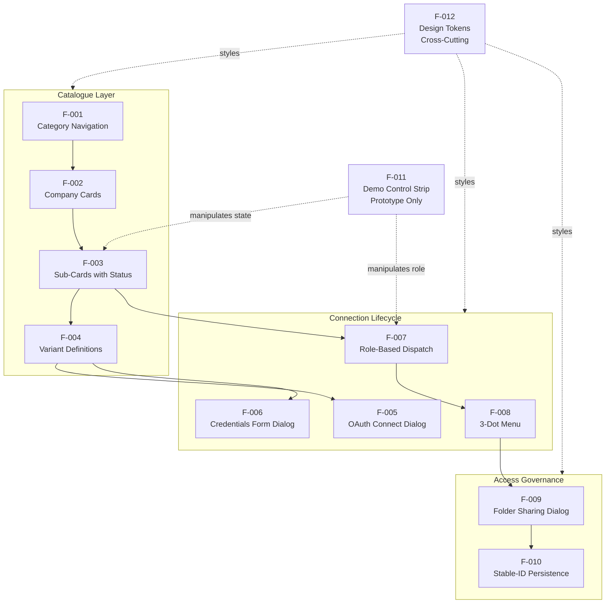

### 2.3.2 Integration Points (Downstream Production Codebase)

The following integration points are named in the feature prompt and Section 1.2.1 as targets in the downstream production Blitzy codebase. **None of these artifacts exist in this prototype repository**; they are documented here to clarify what the prototype's behavior is specifying.

| Integration Point | Touchpoint Features | Role |
|---|---|---|
| `src/panel/workspace/settings/integrations.tsx` | F-001, F-002, F-003 | Page being restructured at route `/workspace/settings/integrations` |
| `SvcType` enum | F-004 | Extended to add `GITHUB_ENTERPRISE_SERVER`-equivalent and Bitbucket Data Center variants |
| Existing provider adapters → `TreeNode` | F-009, F-010 | Reused unchanged for the folder picker; respects `MAX_GITLAB_DEPTH = 20` |
| `IntegrationTeamShareRequest`, `bulkUpdateIntegrationTeamAccess` | F-009, F-010 | Extended or paralleled by a folder-aware sharing contract referencing stable folder/node ID |
| Existing Disconnect lifecycle (`ABK-939`, `ABK-2730`) | F-008 | Augmented with a distinct Revoke access action |

### 2.3.3 Shared Components Matrix

These UI components are reused across multiple features and must be implemented once in a shared module.

| Shared Component | Consumed By | Purpose |
|---|---|---|
| Modal scrim + dialog container | F-005, F-006, F-008 (confirmations), F-009 | Common modal infrastructure |
| Badge styles (success, error, neutral, run) | F-003, F-007, F-008 | Status indication and role-aware read-only labels |
| Button styles (primary, outline, ghost, danger) | F-005, F-006, F-007, F-008, F-009 | Consistent action surfaces with role-correct styling |
| Brand-mark library (Tabler `ti-brand-*` + Azure `AZ` text mark) | F-002, F-005, F-006, F-008, F-009 | Consistent provider identity across surfaces |
| Form field component | F-006 | Reusable input + label + help text |

### 2.3.4 Common Services

| Service | Consumed By | Responsibility |
|---|---|---|
| Connection state store | F-003, F-005, F-006, F-007, F-008 | Holds per-sub-card status keyed by sub-card ID |
| Role resolver | F-007, F-008, F-009 | Returns current user's role from session |
| Grant resolver (with inheritance) | F-009, F-010 | Computes effective access for a team on a folder by walking ancestors |
| Live tree fetcher (existing adapter `TreeNode`) | F-009, F-010 | Returns the provider's normalized folder tree; not modified by this feature |
| Team directory lookup | F-009 | Provides the searchable team pool for grant assignment |

---

## 2.4 IMPLEMENTATION CONSIDERATIONS

### 2.4.1 Technical Constraints

| Feature | Constraint |
|---|---|
| F-001, F-002 | Categories and providers must render from data only — no hard-coded markup |
| F-003 | Status must be persisted and resolved per-sub-card ID, never aggregated |
| F-004 | New variants must follow the existing adapter pattern used for `GITLAB_SELF_HOSTED` (no new adapter pattern invented) |
| F-005 | OAuth flows must reuse existing Blitzy OAuth client registration plumbing |
| F-006 | Self-hosted instance URLs must be validated and reachable; unreachable URLs surface form-level errors |
| F-008 | Disconnect and Revoke must invoke distinct downstream operations; conflating them re-introduces ticket `ABK-939` confusion |
| F-009, F-010 | Grantable scope is **top-level folders only** — repos and branches are non-grantable (Section 1.3.1 + 1.3.2) |
| F-010 | `MAX_GITLAB_DEPTH = 20` traversal limit must be respected by the folder picker |
| F-012 | Token values must match the existing Blitzy design system 1:1 |

### 2.4.2 Performance Requirements

The feature is a settings-page UI and a sharing-contract extension; it is not on a hot read or write path. The following performance characteristics apply:

| Feature | Performance Expectation |
|---|---|
| F-001, F-002, F-003 | Category switch and card render within one render frame (sub-16 ms target) |
| F-005, F-006 | OAuth dialog open in under 100 ms; form dialog open in under 100 ms |
| F-008 | Refresh action visible feedback within 800 ms of click (prototype value) |
| F-009 | Folder list, team list, and search filter respond interactively (no perceptible lag) |
| F-010 | Inheritance resolution at read time must not noticeably impact project picker render |

### 2.4.3 Scalability Considerations

| Dimension | Consideration |
|---|---|
| Catalogue growth | F-001/F-002/F-004 are intentionally data-driven; adding a category or provider variant is a pure data change |
| Provider variant count | The `DATA` and `FORMS` structures scale by addition; no quadratic UI cost |
| Team count | F-009 search must remain interactive for large team pools (case-insensitive substring filter) |
| Folder count per connection | F-009 folder list is bounded by the top-level-only grantable scope; deep trees are not enumerated in the sharing UI |
| Grant count | F-010 grant resolution is per-folder, per-team; inheritance walks ancestors (bounded by tree depth ≤ 20 for GitLab) |
| Future categories (CI, analytics) | Supported by the data-driven catalogue; no rework anticipated (Section 1.3.2 future-phase considerations) |

### 2.4.4 Security Implications

| Feature | Security Consideration |
|---|---|
| F-006 | Self-hosted credentials (Client ID, Secret) must be transmitted over HTTPS and stored using existing Blitzy secret-store conventions |
| F-007 | Role gating must be defense-in-depth: UI hides actions, server contract rejects non-admin callers (Section 1.2.3 critical success factor 4) |
| F-008 | Revoke access is destructive and irreversible without re-approval; confirmation copy must clearly communicate this; consider audit logging in production |
| F-009 | Sharing contract must reject grants requested by non-admin users; cross-connection grants are forbidden (Section 1.3.2) |
| F-010 | Folder-scoped read filtering must be enforced server-side; client-side filtering is defense in depth only |
| F-010 | Grants on deleted folders must fail closed (no access) rather than fail open |

### 2.4.5 Maintenance Requirements

| Feature | Maintenance Note |
|---|---|
| F-001 to F-004 | Data-driven design minimizes maintenance — new categories/providers/variants are catalogue entries |
| F-005, F-006 | Per-provider configuration is co-located in `DATA` and `FORMS`; provider changes (e.g., field name updates) are localized |
| F-008 | Disconnect and Revoke implementations must remain coupled with the provider lifecycle tickets `ABK-939` (ADO uninstall) and `ABK-2730` (silent token expiry) |
| F-010 | Migration of legacy `IntegrationTeamShareRequest` whole-integration shares to folder-aware grants is an explicit open question; chosen strategy (auto-map to root vs. grandfather) determines maintenance burden |
| F-011 | Demo control strip must be removed from production builds; tooling-level gating recommended |
| F-012 | Token drift between this feature and the broader Blitzy design system must be monitored; any divergence is a visual-regression risk |

---

## 2.5 TRACEABILITY MATRIX

### 2.5.1 Acceptance Criteria to Feature Mapping

The following table traces each acceptance criterion from Section 1.2.3 (Measurable Objectives) and the user-context Section 8 (Acceptance Criteria) to the specific features that satisfy it.

| Acceptance Criterion | Source | Satisfying Features |
|---|---|---|
| Categories render from data; adding one requires no layout change | §1.2.3 + User Ctx §8 | F-001 |
| Each sub-card shows its own independent status | §1.2.3 + User Ctx §8 | F-003 |
| Connect dialog content differs by provider variant | User Ctx §8 | F-004, F-005, F-006 |
| Self-hosted requires instance URL + credentials | User Ctx §8 | F-006 |
| 3-dot menu shows Refresh, Share, Disconnect, Revoke with correct confirmations | User Ctx §8 | F-008 |
| Distinct Disconnect vs Revoke behavior | §1.2.3 + User Ctx §8 | F-008 |
| Team granted parent folder can use any folder inside as source and destination | User Ctx §8 | F-009, F-010 |
| Member cannot see ungranted folders | User Ctx §8 | F-007, F-010 |
| Rename and move do not break access; only delete surfaces an error | §1.2.3 + User Ctx §8 | F-010 |
| Per-variant lifecycle independence (failed GHE alongside connected GitHub Cloud) | §1.2.3 | F-003, F-011 |
| Management actions hidden for team members | §1.1.4 + User Ctx §4 | F-007 |

### 2.5.2 Feature to Source Artifact Mapping

| Feature | Primary Source Artifact | Specific Lines / Section |
|---|---|---|
| F-001 | `blitzy-integrations-page.html` | Lines 121–129 (markup), 147–161 (`DATA`), 282 (wiring) |
| F-002 | `blitzy-integrations-page.html` | Lines 40–47 (CSS), 189–195 (rendering loop) |
| F-003 | `blitzy-integrations-page.html` | Lines 48–56 (CSS), 162 (`PRESETS`), 165–186 (state/badge/actions) |
| F-004 | `blitzy-integrations-page.html` | Lines 147–161 (`DATA`), 203–204 (dispatch) |
| F-005 | `blitzy-integrations-page.html` | Lines 205–210 (`oauthModal`) |
| F-006 | `blitzy-integrations-page.html` | Lines 133–146 (`FORMS`), 211–222 (`formModal`) |
| F-007 | `blitzy-integrations-page.html` | Lines 108–110 (role HTML), 179–186 (`actions`), 281 (wiring) |
| F-008 | `blitzy-integrations-page.html` | Lines 68–71 (CSS), 226–247 (`openMenu` + `onMenu`) |
| F-009 | `blitzy-integrations-page.html` | Lines 87–99 (CSS), 163 (`TEAMS`), 250–271 (`shareModal`) |
| F-010 | Tech Spec §1.2.2 + user context §3 | Conceptual; `folder-sharing-prototype-v2.html` `FM` (lines 110–118) shows shape |
| F-011 | `blitzy-integrations-page.html` | Lines 20–24 (CSS), 103–112 (HTML), 280–283 (wiring) |
| F-012 | `blitzy-integrations-page.html` | Lines 12–17 (`:root` CSS variables) |

### 2.5.3 Process Flow References

The connect, manage, and share user flows referenced by these features are documented in §1.2.2 Major System Components (Mermaid system diagram), §4 User Experience & Flows of the feature prompt, and will be elaborated in Section 4 (Process Flowcharts) of this Technical Specification.

---

## 2.6 ASSUMPTIONS AND CONSTRAINTS

### 2.6.1 Assumptions

1. **Downstream production codebase exists.** The named integration targets (`src/panel/workspace/settings/integrations.tsx`, `SvcType`, provider adapters, `IntegrationTeamShareRequest`, `bulkUpdateIntegrationTeamAccess`, `MAX_GITLAB_DEPTH`) are presumed to exist in a separate production repository. This prototype repository specifies their target behavior but does not contain them.
2. **Provider tree-fetching infrastructure is reused unchanged.** Section 1.3.2 explicitly excludes backend changes to SCM tree fetching; the existing `TreeNode` contract is sufficient to support folder grants.
3. **Stable folder/node IDs are available from all five SCM providers.** F-010 depends on the provider returning a permanent internal identifier per folder; this is assumed to be the case for GitHub, GitLab, Azure DevOps, and Bitbucket Data Center (Open Question 1 in user context §9 flags this for confirmation).
4. **Roles are resolved from the existing Blitzy session.** F-007 assumes Super Admin and Team Member roles are already modeled in the production codebase.
5. **Inter font is available via Google Fonts CDN.** F-012 assumes CDN availability and consistent rendering across supported browsers.

### 2.6.2 Constraints

| Constraint Type | Constraint |
|---|---|
| Scope | Only top-level folders are grantable; repos and branches are out of scope (§1.3.1, §1.3.2) |
| Scope | Cross-org and multi-org grants are out of scope (§1.3.2) |
| Scope | Carve-out / exception rules under an inherited parent are out of scope (§1.3.2) |
| Scope | The legacy "Just me / Share with team" connect-time prompt is replaced and out of scope (§1.3.2) |
| Scope | `view` vs. `edit` access-level dimension visible in `folder-sharing-prototype-v2.html` is **explicitly out of scope** (§1.3.2) |
| Scope | Repo-level and branch-level selection visible in `folder-sharing-prototype-v2.html` is **explicitly out of scope** (§1.3.2) |
| Tier | Free and Pro tier behavior is deferred; feature is gated to Team and Enterprise (§1.3.1, §1.3.2) |
| Lifecycle | Disconnect and Revoke must remain semantically distinct (§1.2.3) |
| Persistence | Grants must persist by stable folder/node ID; path is display-only (§1.2.2 core technical approach 4) |
| Inheritance | Inheritance is mandatory and computed; not user-configurable (§1.3.1) |
| Access Model | Push-only; no request/approval workflows (§1.3.2) |

### 2.6.3 Open Questions Carried Forward

These items from user context §9 and Tech Spec §1.2.3 are **not** product requirements; they are unresolved decisions that must be answered during implementation. They are documented here to ensure traceability.

| # | Open Question | Impact |
|---|---|---|
| 1 | Does existing code persist a share by stable folder ID or by name/path? | Determines whether F-010 rename/move semantics are immediately achievable |
| 2 | How is GitHub Enterprise Server represented today (separate type, host variant, or not yet built)? Same for Bitbucket Data Center | Determines whether F-004 is an extension or a new variant addition |
| 3 | Migration strategy for existing whole-integration `IntegrationTeamShareRequest` shares | Determines F-010 migration path (auto-map to root vs. grandfather) |
| 4 | On a deleted granted folder, who is notified (granting admin, consuming member, or both)? Is dependent broken project in scope? | Determines F-010 broken-grant notification model (deferred per §1.3.2) |
| 5 | Team-tier gating for the grant action, given team management is Enterprise-gated today | Determines F-007 / F-009 gating boundary |

### 2.6.4 Requirements Version Tracking

| Version | Date | Source | Notes |
|---|---|---|---|
| 1.0 | Initial draft | Feature prompt + Tech Spec §1.1–1.3 + prototype source | Baseline derived from `blitzy-integrations-page.html` and `folder-sharing-prototype-v2.html` |

Future requirement revisions must update this table and increment the version of each affected `F-XXX-RQ-YYY` requirement.

---

## 2.7 REFERENCES

#### Files Examined

- `blitzy-integrations-page.html` — Self-contained 287-line prototype establishing the redesigned Integrations page. Provided evidence for F-001 (category nav lines 121–129, `DATA` lines 147–161, switching line 282), F-002 (company-card CSS lines 40–47, rendering lines 189–195), F-003 (sub-card CSS lines 48–56, `PRESETS` line 162, state functions lines 165–186), F-004 (`DATA` provider definitions lines 147–161, dispatch lines 203–204), F-005 (`oauthModal` lines 205–210), F-006 (`FORMS` lines 133–146, `formModal` lines 211–222), F-007 (role HTML lines 108–110, `actions` lines 179–186, wiring line 281), F-008 (menu CSS lines 68–71, `openMenu`/`onMenu` lines 226–247), F-009 (sharing CSS lines 87–99, `TEAMS` line 163, `shareModal` lines 250–271), F-011 (demo strip CSS lines 20–24, HTML lines 103–112, wiring lines 280–283), and F-012 (design tokens `:root` lines 12–17).
- `folder-sharing-prototype-v2.html` — Self-contained 219-line dedicated prototype for Bitbucket Data Center folder sharing. Provided conceptual evidence for F-010 (folder metadata `FM` lines 110–118, `ORDER` line 119, `TM` lines 120–122, grant state lines 124–127). Per §1.3.2, several capabilities in this prototype — view/edit access-level pills, repo and branch-level selection, the "Just me / Share with team" mode toggle — are **explicitly out of scope** and are documented in Section 2.6.2 as constraints, not requirements.

#### Folders Explored

- Repository root (depth 0) — Verified to contain only the two HTML files and the `.git` directory. No subdirectories exist.

#### Technical Specification Sections Cross-Referenced

- **§1.1 EXECUTIVE SUMMARY** — Project framing (prototype-not-application nature), stakeholder roles, business problem statement, three-category value proposition (enterprise unblocking, self-service scalability, catalogue scalability).
- **§1.2 SYSTEM OVERVIEW** — Named integration points in the downstream production codebase, six top-level capabilities, system component diagram, four core technical approach choices, success criteria, critical success factors, and KPIs.
- **§1.3 SCOPE** — Authoritative in-scope/out-of-scope split, connect-flow inputs per variant class, 3-dot menu action table with confirmation severity, folder-level access capability table, implementation boundaries, and the unsupported-use-cases enumeration.

#### Specification Inputs

- Blitzy Feature Prompt: "Integrations Redesign & Folder-Level Team Access" (user context) — WHY / WHAT / HOW / Scope / Business Requirements / Edge Cases / Acceptance Criteria / Open Questions; defines named integration targets in the downstream Blitzy production codebase (`src/panel/workspace/settings/integrations.tsx`, `SvcType`, provider adapters → `TreeNode`, `IntegrationTeamShareRequest`, `bulkUpdateIntegrationTeamAccess`, `MAX_GITLAB_DEPTH = 20`, lifecycle tickets `ABK-939` and `ABK-2730`).

# 3. Technology Stack

## 3.1 TECHNOLOGY STACK OVERVIEW

### 3.1.1 Repository Technology Posture

This repository is a **design-and-behavior prototype repository**, not a runnable application. As established in §1.1.1 and confirmed in §1.3 References, the repository root contains exactly two self-contained HTML files (`blitzy-integrations-page.html` and `folder-sharing-prototype-v2.html`) plus the `.git` directory. There is no application source tree, no package manifest, no build configuration, no infrastructure-as-code, and no CI/CD pipeline in this repository.

Consequently, the **default Blitzy technology stack — AWS, Docker, Terraform, GitHub Actions, Python/Flask, MongoDB, Auth0, Langchain, React with TypeScript, TailwindCSS — is intentionally NOT used in this repository.** Those technologies belong to the downstream production codebase referenced in §1.2.1 (route `/workspace/settings/integrations`, file `src/panel/workspace/settings/integrations.tsx`), which is a separate repository entirely. The prototype repository's role is to specify the visual contract and behavioral acceptance criteria that the production implementation must honor; it deliberately carries zero runtime dependencies beyond what a modern browser provides.

### 3.1.2 Stack Composition at a Glance

The complete technology footprint of this repository is summarized below.

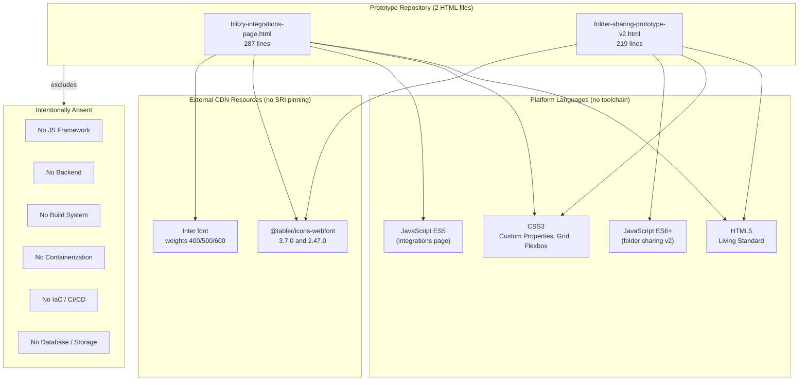

---

## 3.2 PROGRAMMING LANGUAGES

### 3.2.1 Languages by Component

The repository uses three browser-native languages — HTML5, CSS3, and JavaScript — directly embedded in two HTML documents. No transpilation, no compilation, and no runtime interpreter beyond the browser is involved.

#### HTML5 (Document Structure)

| File | Doctype Declaration | Language Attribute |
|---|---|---|
| `blitzy-integrations-page.html` | `<!DOCTYPE html>` (line 1) | `<html lang="en">` |
| `folder-sharing-prototype-v2.html` | `<!DOCTYPE html>` (line 1) | `<html lang="en">` |

HTML5 carries the complete UI through inline markup, inline `<style>` blocks, and inline `<script>` blocks. Both files include the modern viewport meta tag (`width=device-width, initial-scale=1`) and UTF-8 character set declaration.

#### CSS3 (Presentation)

Both files use inline `<style>` blocks for all styling; no external stylesheet files exist in the repository. The CSS feature set employed includes:

| CSS Feature | Usage |
|---|---|
| **CSS Custom Properties** | Declared in `:root` in `blitzy-integrations-page.html` (lines 12–17) to define the F-012 design-token manifest |
| **CSS Grid** | `grid-template-columns: 200px 1fr;` layout for the category-nav + content split (line 32 of integrations page) |
| **Flexbox** | `display:flex` used throughout both files for card, header, and action-row layouts |
| **CSS Animations** | `@keyframes sp` for the connecting-state spinner (line 66 of integrations page) |
| **Pseudo-classes** | `:hover`, `:focus`, `:disabled` for interactive states |
| **Universal reset** | `box-sizing:border-box` reset applied globally |

#### JavaScript (Vanilla, Two Different Dialects)

The two prototypes deliberately use different JavaScript dialects, reflecting independent authorship and serving different demonstration goals.

| Prototype | Dialect | Evidence |
|---|---|---|
| `blitzy-integrations-page.html` | **ES5-compatible** | `var` declarations only (lines 133, 147, 162–164); `function` declarations; no arrow functions; relies on `Array.prototype.slice.call`, `forEach`, `filter`, `map`, `indexOf`, `document.querySelectorAll`, `setTimeout`, `getBoundingClientRect` |
| `folder-sharing-prototype-v2.html` | **ES6+ (ES2015+)** | `const` and `let` (lines 110, 119–128); arrow functions (e.g., `RAW.forEach((r,i)=>{...})` line 122; arrow callbacks lines 132–212); template literals; `Set` object (line 128); spread operator (lines 173, 182); `Array.prototype.includes` |

All DOM manipulation in both files uses native browser APIs — `document.getElementById`, `document.querySelectorAll`, `element.innerHTML`, `element.addEventListener` — with no library abstraction.

### 3.2.2 Selection Criteria & Justification

| Criterion | Justification |
|---|---|
| **Zero build step** | Both files open directly in any modern browser via `file://` or any static HTTP server; reviewers and designers can iterate without a local Node.js or developer toolchain |
| **Maximum portability** | A self-contained HTML file is the most universally consumable artifact for a design-and-behavior contract; it can be opened, archived, attached to tickets, and embedded in design reviews trivially |
| **Reduced attack surface** | No framework dependency, no transitive packages, no runtime — the dependency graph is intentionally a single CDN webfont per file plus an optional Google Fonts link |
| **Simplified review** | Inline `<style>` and `<script>` make a complete design and interaction model auditable in a single file, which is the explicit purpose of an executable specification per §1.1.1 |
| **No runtime imposition** | Neither file imposes a runtime environment on the downstream production implementation; the production implementation is free to use TypeScript and React without any compatibility burden from the prototype |

### 3.2.3 Constraints and Dependencies

- **ES6+ features in `folder-sharing-prototype-v2.html`** (specifically `Set`, arrow functions, `const`/`let`, spread operator, template literals) require a modern evergreen browser. There is no transpilation step to provide compatibility shims; this is acceptable because the artifact is for design review on contemporary developer workstations.
- **The two prototypes are codebase-independent.** They share no JavaScript, no CSS variables, and no class names. State variables and patterns differ. This is intentional — each file is a self-contained executable specification for its own concern.

### 3.2.4 Production Target Languages (Referenced, Not Present)

Per §1.2.1, the downstream production target is `src/panel/workspace/settings/integrations.tsx`. The `.tsx` extension implies **TypeScript + React** in the production codebase. That file does not exist in this repository — it resides in a separate Blitzy production codebase. Per §2.6.1 Assumption 1, the production codebase is presumed to exist; this prototype repository specifies its target behavior but does not contain it.

---

## 3.3 FRAMEWORKS & LIBRARIES

### 3.3.1 Frontend Frameworks

**None.** A line-by-line examination of both files confirms that no JavaScript framework — React, Vue, Angular, Svelte, Preact, Solid, or otherwise — is loaded or used. There are no `<script src="...react...">` tags, no `<script type="module">` imports, and no inline framework bootstrapping. All rendering is performed by direct DOM manipulation against the browser's native APIs.

This is consistent with the prototype-repository posture: the production implementation in `integrations.tsx` will use React, but the prototype expresses the same behavior without binding the prototype to any specific React version or React component-library version that might drift between authoring and production landing.

### 3.3.2 Backend Frameworks

**None.** The repository contains zero server-side code, zero API endpoints, zero route handlers, and zero runtime dependencies beyond a static file server (or direct `file://` access). The default Blitzy backend stack (Python/Flask, MongoDB, Auth0, Langchain) does not appear in any form in this repository.

### 3.3.3 CSS Frameworks

**None.** Both files use inline CSS exclusively. No TailwindCSS, Bootstrap, MUI, Bulma, Foundation, or similar CSS framework is loaded. Per §2.4.1 F-012, the prototype's CSS Custom Properties are intended to match the existing Blitzy design system tokens 1:1, so a CSS framework would only obscure the token contract that the production implementation must honor.

### 3.3.4 Icon Library

**Tabler Icons (webfont distribution)** is the only icon system used in either file. It is loaded as a CDN stylesheet — there is no local font installation or icon SVG sprite in the repository.

| File | Tabler Icons Version | CDN Load Statement Location |
|---|---|---|
| `blitzy-integrations-page.html` | **3.7.0** | Line 10 |
| `folder-sharing-prototype-v2.html` | **2.47.0** | Line 7 |

Tabler Icons is consumed via CSS class names. Icons in active use include the brand glyphs `ti-brand-github`, `ti-brand-gitlab`, `ti-brand-bitbucket`, `ti-brand-figma`, `ti-brand-azure`; action glyphs `ti-refresh`, `ti-unlink`, `ti-shield-x`, `ti-dots`; structural glyphs `ti-folder`, `ti-users`, `ti-git-branch`, `ti-git-fork`, `ti-building`; status glyphs `ti-circle-check`, `ti-circle-check-filled`, `ti-alert-circle`; and form glyphs `ti-square-check-filled`, `ti-square`, `ti-checkbox`, `ti-chevron-down`, `ti-x`, `ti-check`, `ti-plus`, `ti-external-link`, `ti-code`, `ti-palette`, `ti-arrow-left`, `ti-user`.

**The version skew between the two prototypes (3.7.0 vs. 2.47.0) is documented here as a divergence to be reconciled in the production implementation** — the production codebase should pin a single version of the icon library to avoid visual inconsistency across the integrations page and its folder-sharing dialog.

### 3.3.5 Typography

| File | Typography Source | Specifics |
|---|---|---|
| `blitzy-integrations-page.html` | **Google Fonts CDN** | Loads **Inter** with weights 400, 500, and 600 (line 9); preconnect hints to `https://fonts.googleapis.com` and `https://fonts.gstatic.com` are present on lines 7–8 |
| `folder-sharing-prototype-v2.html` | **System font stack** | `-apple-system,BlinkMacSystemFont,"Segoe UI",Roboto,Helvetica,Arial,sans-serif` (line 10) — no Google Fonts dependency |

Inter is the canonical Blitzy design-system typeface per F-012 and is enumerated in the CSS-token block of `blitzy-integrations-page.html`. The folder-sharing prototype uses the system stack, presumably for faster local rendering during isolated design review of that specific workflow.

### 3.3.6 Compatibility Requirements

| Requirement | Source / Reason |
|---|---|
| Modern evergreen browser (Chrome / Edge / Firefox / Safari current) | ES6+ features in `folder-sharing-prototype-v2.html` require native support |
| Internet connectivity at first paint | Inter font and Tabler Icons CSS load from CDN; offline review degrades to system font and missing icons |
| HTTPS-capable browser | All CDN URLs are `https://` only |
| No legacy IE11 support implied | No transpilation step and no polyfills; the prototype targets modern browsers exclusively |

### 3.3.7 Justification for Major Choices

- **Vanilla JavaScript over React.** The prototype is a behavioral specification for a React component; embedding it in React would introduce React's own version constraints and component-library contract into the prototype, defeating the goal of producing a portable, dependency-free reference.
- **Tabler Icons over an inline SVG sprite.** Tabler Icons provides a comprehensive, semantically-named glyph set covering brand marks for all five SCM providers (`ti-brand-github`, `ti-brand-gitlab`, `ti-brand-bitbucket`, `ti-brand-azure`, `ti-brand-figma`); an inline SVG sprite of equivalent breadth would balloon the file size.
- **Inter over system fonts (primary prototype).** Inter is the established Blitzy design-system typeface; using it in the primary prototype ensures the prototype's pixel output matches what the production implementation will render.
- **Inline CSS over an external stylesheet.** Keeps the prototype self-contained; reviewers receive a single file rather than a manifest of related artifacts.

---

## 3.4 OPEN SOURCE DEPENDENCIES

### 3.4.1 Package Manifest Status

**No package manifest exists in this repository.** A comprehensive scan confirms the absence of:

| Absent Manifest | Ecosystem It Would Indicate |
|---|---|
| `package.json` | npm / Node.js |
| `package-lock.json`, `yarn.lock`, `pnpm-lock.yaml` | npm / Yarn / pnpm dependency-resolution lockfiles |
| `requirements.txt`, `Pipfile`, `pyproject.toml` | Python |
| `Gemfile` | Ruby |
| `go.mod` | Go |
| `Cargo.toml` | Rust |
| `composer.json` | PHP |

All third-party resources are loaded at HTML parse time via CDN URLs inlined into `<link>` elements. There is no installation step, no `node_modules` directory, no virtual environment.

### 3.4.2 CDN-Loaded Open Source Dependencies (Complete Inventory)

| Package | Version | Registry / CDN | Consumed By | Purpose |
|---|---|---|---|---|
| `@tabler/icons-webfont` | **3.7.0** | jsDelivr (`cdn.jsdelivr.net/npm/@tabler/icons-webfont@3.7.0/dist/tabler-icons.min.css`) — backed by npm registry | `blitzy-integrations-page.html` (line 10) | Brand icons (`ti-brand-github`, `ti-brand-gitlab`, `ti-brand-bitbucket`, `ti-brand-figma`, `ti-brand-azure`), action glyphs (`ti-refresh`, `ti-users`, `ti-unlink`, `ti-shield-x`, `ti-dots`, `ti-folder`, `ti-circle-check`, `ti-alert-circle`, `ti-external-link`, `ti-code`, `ti-palette`, `ti-plus`) |
| `@tabler/icons-webfont` | **2.47.0** | jsDelivr (`cdn.jsdelivr.net/npm/@tabler/icons-webfont@2.47.0/dist/tabler-icons.min.css`) — backed by npm registry | `folder-sharing-prototype-v2.html` (line 7) | Folder/branch/team icons (`ti-brand-bitbucket`, `ti-building`, `ti-folder`, `ti-git-fork`, `ti-git-branch`, `ti-user`, `ti-users`, `ti-arrow-left`, `ti-circle-check-filled`, `ti-square-check-filled`, `ti-square`, `ti-checkbox`, `ti-chevron-down`, `ti-x`, `ti-check`) |
| **Inter** (Google Fonts) | Latest available at Google Fonts (no version pin) — weights **400, 500, 600** | Google Fonts CDN (`fonts.googleapis.com` for CSS, `fonts.gstatic.com` for binaries) | `blitzy-integrations-page.html` (lines 7–9) | Primary typeface; mandated by F-012 to match Blitzy design system |

That is the complete inventory. No other third-party libraries — JavaScript, CSS, font, or otherwise — are loaded.

### 3.4.3 Version Pinning and Supply-Chain Observations

| Observation | Detail | Production Impact |
|---|---|---|
| **Version skew on Tabler Icons** | 3.7.0 in the integrations prototype; 2.47.0 in the folder-sharing prototype | Production must consolidate on a single version; visual inconsistency risk if both prototypes are used as pixel reference |
| **No version pin on Inter** | Google Fonts CSS API returns whatever release Google currently serves for the requested weights | Acceptable for design review; production may prefer self-hosting the font to remove the CDN dependency and version drift |
| **No SRI (Subresource Integrity) hashes** | Neither the Tabler Icons `<link>` nor the Google Fonts `<link>` carries an `integrity="sha384-…"` attribute | The prototype's posture is acceptable; the production implementation should add SRI for any CDN-loaded resources (security hardening opportunity flagged in §3.8.3 below) |
| **No `crossorigin` attribute on icon link** | Tabler Icons link omits `crossorigin`; Google Fonts link sets `crossorigin` on the preconnect | Cosmetic; not a security defect in the prototype |

---

## 3.5 THIRD-PARTY SERVICES

### 3.5.1 CDN Services Actually Used in This Repository

The complete external-service footprint of the repository is two CDN endpoints:

| Service | Endpoint | Purpose | Consumed By |
|---|---|---|---|
| **Google Fonts CDN** | `https://fonts.googleapis.com` (CSS) and `https://fonts.gstatic.com` (font binaries) | Serves the Inter typeface at weights 400/500/600 | `blitzy-integrations-page.html` lines 7–9 |
| **jsDelivr CDN** | `https://cdn.jsdelivr.net/npm/@tabler/icons-webfont@{version}/dist/tabler-icons.min.css` | Serves the Tabler Icons webfont stylesheet (which in turn references font binaries on the same CDN) | Both files |

These are the only network calls either file initiates at load time. No analytics endpoint, no telemetry endpoint, no API call, and no SCM provider call is made — the entire integration with GitHub/GitLab/Azure DevOps/Bitbucket/Figma is **simulated**, not actually performed.

### 3.5.2 Referenced External Provider Integrations (Not Implemented in This Repository)

Per §2.1.6 and the `DATA` provider catalogue in `blitzy-integrations-page.html` (lines 147–161), the production implementation must integrate with the following provider surfaces. **These integrations are described here for traceability; they are simulated by the prototype rather than implemented.**

| Provider Category | Provider | Variant | Connection Method | Sub-Card ID |
|---|---|---|---|---|
| SCM | GitHub | Cloud (github.com) | OAuth 2.0 authorize redirect | `gh` |
| SCM | GitHub Enterprise Server | Self-hosted | Credentials form (Server URL, Client ID, Client secret) | `ghe` |
| SCM | GitLab | Cloud (gitlab.com) | OAuth 2.0 authorize redirect | `gl` |
| SCM | GitLab Self-Managed | Self-hosted | Credentials form (GitLab URL, Application ID, Secret) | `gls` |
| SCM | Azure DevOps | Cloud (dev.azure.com) | OAuth 2.0 authorize redirect | `ado` |
| SCM | Bitbucket Data Center | Self-hosted | Credentials form (Bitbucket URL, Application ID, Secret) | `bb` |
| Design | Figma | Coming-soon placeholder | None (`soon: true` flag in catalogue) | `fig` |

### 3.5.3 Authentication Services

**The prototype loads no authentication library.** OAuth 2.0 flows for the three cloud SCMs are referenced in the `oauthModal()` function (`blitzy-integrations-page.html` lines 205–210), but the prototype only **simulates** the redirect-and-return user experience with a 1100 ms `setTimeout` — there is no real provider redirect, no real callback, and no real token handling.

The default Blitzy authentication choice (Auth0) does not appear in either file. Per §2.4.1 F-005, the production implementation "Must reuse the existing Blitzy OAuth client registration plumbing in the production codebase" — that plumbing is not in this repository.

### 3.5.4 Monitoring, Telemetry, and Cloud Services

**None present.** A scan of both files confirms no:

| Absent Service Category | Examples Scanned For |
|---|---|
| Analytics SDK | Google Analytics, Segment, Mixpanel, Amplitude, Heap, Plausible |
| Error tracking / APM | Sentry, Datadog, New Relic, Bugsnag, Rollbar, LogRocket |
| Cloud SDK | AWS SDK, Azure SDK, GCP SDK, Firebase |
| Feature flags | LaunchDarkly, Split, Statsig, Unleash |
| Customer support widget | Intercom, Zendesk Chat, Drift, Crisp |

The default Blitzy cloud platform (AWS) is not referenced anywhere in the repository. The prototype is deployment-platform-agnostic — it runs on any static-file delivery mechanism, including `file://`.

---

## 3.6 DATABASES & STORAGE

### 3.6.1 Persistent Storage

**None in this repository.** Per §1.1.1, the prototypes are an "executable specification" — they have zero persistence layer. The default Blitzy database choice (MongoDB) does not appear in any form, and no other database driver, ORM, or persistence abstraction is present.

### 3.6.2 Client-Side State Management (In-Memory, Per-Page-Load)

Each prototype maintains its UI state in plain JavaScript variables declared at module scope. State resets on every page reload.

## `blitzy-integrations-page.html` (lines 162–164)

| Variable | Declared As | Purpose |
|---|---|---|
| `PRESETS` | `var` (line 162) | Static demo scenarios `zero`, `mixed`, `ideal` — preset connection statuses for reviewer demo control |
| `TEAMS` | `var` | Static team pool (7 team names) used by the folder-share dialog's team search |
| `cstate` | `var` (line 163) | Per-sub-card status map; key is the sub-card ID (e.g., `gh`, `ghe`, `gl`, `gls`, `ado`, `bb`, `fig`); value is a status string |
| `cat` | `var` | Currently active category (`scm` or `design`) |
| `role` | `var` | Currently active role (`admin` or `member`) — driven by the demo control strip |
| `grants` | `var` (line 164) | Per-connection folder-grant map (e.g., `{ platform: ['Frontend Guild'], design: [] }`) |

## `folder-sharing-prototype-v2.html` (lines 110–128)

| Variable | Declared As | Purpose |
|---|---|---|
| `FM` | `const` | Folder metadata: label, type, display path, icon, inclusion description |
| `ORDER` | `const` | Hierarchical folder display order |
| `PAL` | `const` | Avatar color palette (cycled per team) |
| `RAW` | `const` | Team raw data: initials, display name, member count |
| `TM` | `const` (line 119) | Team metadata map, derived from `RAW` |
| `S` | `let` | Current sharing state: `{ mode: 'team', grants: [...] }` |
| `D` | `let` (line 128) | Picker draft state: `{ folder, teams: new Set(), level: 'edit', sub: true }` |

### 3.6.3 Browser Persistence APIs

**None used.** A scan of both files confirms no invocation of `localStorage`, `sessionStorage`, `IndexedDB`, the Cache API, or the Cookie Store API. There is no service worker registered, and no offline persistence is configured. All state resets when the page reloads (line 214 of `folder-sharing-prototype-v2.html` calls `location.reload()` explicitly on a reset action).

### 3.6.4 Caching Solutions

**None.** No service worker, no in-memory caching layer, no HTTP cache directives beyond browser defaults. The default `Cache-Control` behavior provided by whatever static HTTP server hosts the file (or the browser's `file://` handler) is the only caching layer at play.

### 3.6.5 Referenced Production Persistence Model (Not Implemented Here)

Per §2.1.12 F-010, the production implementation must persist folder grants with the following tuple shape:

```
{ connectionId, folderStableId, folderPathSnapshot, teamId }
```

Where:

- `connectionId` — opaque identifier for the connection/sub-card
- `folderStableId` — the provider's permanent internal identifier (never changes on rename/move); the grant's true anchor
- `folderPathSnapshot` — display-only; refreshed from the live tree on each render
- `teamId` — the grantee team's identifier

Grant resolution at read time always reads the live provider tree by `folderStableId` (not by name or path), so that:

- **Rename** of the folder in the SCM: no break (same ID, updated display path)
- **Move** of the folder in the SCM: no break (same ID, updated display path)
- **Delete** of the folder in the SCM: ID resolves to nothing → grant flagged broken (the only error case)

**The specific datastore — MongoDB, PostgreSQL, DynamoDB, or otherwise — is not specified in any retrieved tech-spec section and does not exist in this repository.** Per §2.6.1 Assumption 2, the existing Blitzy persistence infrastructure is reused unchanged.

---

## 3.7 DEVELOPMENT & DEPLOYMENT

### 3.7.1 Build System

**None.** A complete enumeration of the absent build infrastructure:

| Build Tool Category | Absent Artifacts |
|---|---|
| Package manager scripts | No `package.json` → no npm scripts |
| JavaScript bundler | No `webpack.config.js`, `vite.config.js`, `rollup.config.js`, `esbuild.config.js`, `parcel.config.js`, `turbopack.config.js` |
| TypeScript compiler | No `tsconfig.json` |
| Transpiler | No `.babelrc`, `babel.config.js` |
| CSS toolchain | No `postcss.config.js`, no Tailwind config (`tailwind.config.js`), no Sass / Less config |
| Task runner | No `Makefile`, no `Gulpfile`, no `gruntfile.js` |
| Monorepo orchestrator | No `nx.json`, `turbo.json`, `lerna.json`, `pnpm-workspace.yaml` |

The build process for this repository is a no-op: the two HTML files are the deliverable.

### 3.7.2 Containerization

**None.** No `Dockerfile`, no `docker-compose.yml`, no `.dockerignore`, no Kubernetes manifests (`*.yaml` deployment, service, ingress, configmap), no Helm chart, no `Tiltfile`, no `Skaffold` configuration. The default Blitzy containerization choice (Docker) is not used.

### 3.7.3 Infrastructure as Code

**None.** No Terraform (`.tf`, `.tfvars`), no AWS CloudFormation (`*.cfn.yaml`), no Pulumi (`Pulumi.yaml`), no AWS CDK (`cdk.json`), no Ansible (`playbook.yml`, `inventory`), no Chef, no Puppet. The default Blitzy IaC choice (Terraform) is not used.

### 3.7.4 CI/CD

**None.** No `.github/workflows/` directory, no `.gitlab-ci.yml`, no `Jenkinsfile`, no CircleCI configuration (`.circleci/config.yml`), no Travis CI (`.travis.yml`), no Bitbucket Pipelines (`bitbucket-pipelines.yml`), no Buildkite, no Drone CI. The default Blitzy CI/CD choice (GitHub Actions) is not used.

### 3.7.5 Development Tools (Effectively Required)

The following minimal tooling is sufficient to develop, review, and deploy this repository:

| Tool | Purpose |
|---|---|
| **Git** | Version control; the `.git` directory is the only non-HTML entry in the repository root |
| **Any modern web browser** | Chrome, Firefox, Safari, or Edge — required to render the prototypes; ES6+ support needed by `folder-sharing-prototype-v2.html` |
| **Any text editor / IDE** | VS Code, Sublime Text, Vim, Emacs, JetBrains IDEs — no project-specific configuration required |
| **Any static file server (optional)** | Python's `http.server`, `npx serve`, `caddy`, `nginx`, or simply `file://` — for previewing the prototypes |

### 3.7.6 Deployment Model

Per the design intent of `blitzy-integrations-page.html` ("intended for design review, interaction prototyping, and feature demonstration in a local or static hosting environment"), the deployment model is:

| Deployment Concern | Approach |
|---|---|
| Artifact | The two HTML files, served unmodified |
| Build artifact generation | None |
| Server runtime | Any static HTTP server; `file://` access also works |
| Environment variables | None |
| Runtime configuration | None |
| Secrets management | None (no secrets exist; OAuth and credentials are simulated) |
| Health check / liveness | Not applicable (static content) |
| Rollback strategy | Replace files via Git revert |

### 3.7.7 Linting, Formatting, and Testing

**No tooling configuration present in the repository.** Specifically absent:

| Tool Category | Absent Artifacts |
|---|---|
| JavaScript linting | No `.eslintrc.*`, no `eslint.config.js` |
| Code formatting | No `.prettierrc.*`, no `prettier.config.js` |
| CSS linting | No `.stylelintrc.*` |
| HTML linting | No `.htmlhintrc`, no `htmlvalidator` config |
| Unit testing | No Jest, Vitest, Mocha, Jasmine, or AVA configuration |
| End-to-end testing | No Playwright, Cypress, Selenium, WebdriverIO, Puppeteer, or TestCafé configuration |
| Coverage | No `.nycrc`, no `c8` / `nyc` config |

The Tech Spec §7 user-context excerpt calls for unit, integration, and E2E testing in the **production** implementation; this prototype repository contains no testing infrastructure because the testing target (the React component in `integrations.tsx`) does not live in this repository.

### 3.7.8 Production Deployment Targets (Referenced, Not Present)

Per §1.2.1, the production target is the route `/workspace/settings/integrations` inside the Blitzy workspace application. The production deployment toolchain is not described in any retrieved tech-spec section and is not present in this repository — it is presumed to live in the same downstream production codebase that hosts `integrations.tsx`.

---

## 3.8 CROSS-CUTTING TECHNICAL CONCERNS

### 3.8.1 Design Tokens (CSS Custom Properties)

Per §2.4.1 F-012 and the F-012 token manifest captured in §2.2, the following CSS Custom Properties are declared in the `:root` block of `blitzy-integrations-page.html` (lines 12–17). These tokens are intended to match the existing Blitzy design system 1:1.

| Token Family | Variable | Value | Role |
|---|---|---|---|
| Brand | `--brand` | `#5b39f3` | Primary brand color (active state, primary button background) |
| Brand | `--brand-hover` | `#4f30d6` | Hover state for primary brand surfaces |
| Brand | `--brand-soft` | `#d4cbfc` | Soft brand tint (e.g., team chip background) |
| Brand | `--brand-tint` | `#f3f0ff` | Brand-tinted neutral background |
| Text | `--ink` | `#000` | Primary text |
| Text | `--sec` | `#666` | Secondary text |
| Text | `--ter` | `#999` | Tertiary / placeholder text |
| Surface | `--border` | `#d9d9d9` | Neutral card/input border |
| Surface | `--neutral50` | `#f5f5f5` | Neutral 50 background (subtle separators) |
| Status | `--succ-bg` | `#c9fcea` | Success badge background |
| Status | `--succ-tx` | `#005335` | Success badge foreground |
| Status | `--err-bg` | `#ffdfdf` | Error badge background |
| Status | `--err-tx` | `#991010` | Error badge foreground |
| Geometry | `--r` | `12px` | Card corner radius |
| Geometry | `--r-sm` | `8px` | Button / input corner radius |
| Shadow | `--shadow` | `0 15px 33px rgba(130,130,130,.10), 0 2px 6px rgba(0,0,0,.05)` | Card elevation shadow |
| Font Stack | `font-family` | `"Inter", system-ui, sans-serif` | Document font fallback chain |

The folder-sharing prototype uses hard-coded color literals matching these tokens but does not declare them as custom properties, reflecting that the two prototypes are independent codebases (see §3.2.3).

### 3.8.2 Browser Compatibility

| Requirement | Source / Justification |
|---|---|
| `<meta charset="utf-8">` | Both files declare UTF-8 on line 4 |
| `<meta name="viewport" content="width=device-width, initial-scale=1">` | Both files set the viewport for responsive rendering |
| HTML5 Living Standard support | Modern doctype and semantic elements used throughout |
| CSS Custom Properties support | Universal in evergreen browsers |
| ES6+ runtime support | Required only by `folder-sharing-prototype-v2.html`; no transpilation step provided |
| HTTPS-capable browser | Required for CDN resource loading |

### 3.8.3 Security Implications

| Concern | Observation in Prototype | Production Recommendation |
|---|---|---|
| **Resource transport** | All CDN links use `https://` (no mixed-content risk) | Maintain HTTPS-only |
| **Subresource Integrity (SRI)** | No SRI hashes on either Tabler Icons `<link>` or the Google Fonts `<link>` | Production should add `integrity="sha384-…"` and `crossorigin="anonymous"` to every CDN resource |
| **Content Security Policy (CSP)** | Cannot be set by static HTML alone | Production deployment should ship a CSP header restricting `script-src`, `style-src`, `font-src`, `connect-src` |
| **Client-side credential storage** | No credentials are stored client-side; the credentials form data is simulated in memory only | Per §2.4.4 F-006, real credentials must traverse HTTPS and be stored via Blitzy's existing secret-store conventions |
| **Defense-in-depth gating** | UI hides management actions for team members, but only the UI half is observable | Per §2.4.4 F-007, the production server contract must reject non-admin callers — UI gating alone is insufficient |
| **OAuth handling** | Simulated via `setTimeout`; no real token leaves the browser | Per §2.4.1 F-005, OAuth flows must reuse existing Blitzy OAuth client registration plumbing |
| **Server-side enforcement** | Out of scope for the prototype | Per §2.4.4 F-009 and F-010, the sharing contract must reject non-admin grants and folder-scoped read filtering must be enforced server-side; client-side filtering is defense in depth only |

### 3.8.4 Integration Requirements Between Components

The two HTML files in this repository have a deliberate, narrow relationship:

| Relationship | Detail |
|---|---|
| **Not linked** | Neither file navigates to or embeds the other |
| **Codebase-independent** | Different JavaScript dialects, different Tabler Icons versions, different state-variable conventions |
| **Both demonstrate the folder-sharing UX, but at different fidelities** | `blitzy-integrations-page.html` contains a simplified share dialog (`shareModal()` lines 250–271); `folder-sharing-prototype-v2.html` is a richer standalone alternative design |
| **In-scope vs. out-of-scope features differ** | The richer v2 prototype includes view/edit access pills, repo/branch selection, and a Just-me/Team mode toggle that are **explicitly out of scope per §1.3.2 and §2.6.2** |

The production implementation must reconcile the two designs: take the page restructure and connect flows from the integrations prototype, and take the folder-picker + team-multi-select interaction model from the v2 sharing prototype, while excluding the out-of-scope features visible in v2. The two files together form a composite executable specification — neither alone is sufficient.

---

## 3.9 CONSOLIDATED VERSION INVENTORY

| Component | Version | Source | Justification |
|---|---|---|---|
| HTML | 5 (Living Standard) | W3C / WHATWG | Required for `<!DOCTYPE html>` and modern semantic elements |
| CSS | 3 (with Custom Properties) | W3C | Required for `:root` token block (F-012) |
| JavaScript dialect (integrations page) | ES5-compatible | ECMA-262 | Maximum browser compatibility for the primary review artifact |
| JavaScript dialect (folder sharing v2) | ES6+ (ES2015 or later) | ECMA-262 | Uses `Set`, arrow functions, `const`/`let`, spread; modern-only |
| `@tabler/icons-webfont` (integrations page) | 3.7.0 | jsDelivr / npm | Icon coverage for redesigned page |
| `@tabler/icons-webfont` (folder sharing v2) | 2.47.0 | jsDelivr / npm | Icon coverage for sharing workflow |
| Inter font | Latest (Google Fonts API; unpinned) — weights 400, 500, 600 | Google Fonts CDN | Canonical Blitzy design-system typeface per F-012 |
| Git | Any | (.git directory present) | Version control |
| Static HTTP server (optional) | Any | N/A | Optional — `file://` access also works |

**Default Blitzy stack components NOT used in this repository (deliberately):** AWS, Docker, Terraform, GitHub Actions, Python, Flask, Auth0, MongoDB, Langchain, React, TypeScript, TailwindCSS, React-Native, Swift, Kotlin, Objective-C, ElectronJS.

---

## 3.10 References

### 3.10.1 Repository Files Examined

- `blitzy-integrations-page.html` (287 lines, lines 1–287 read in full) — Primary prototype. Established HTML5 document structure (line 1), Google Fonts preconnect and Inter font load (lines 7–9), Tabler Icons CDN load at version 3.7.0 (line 10), complete CSS Custom Properties token block (lines 12–17), CSS Grid layout (line 32), spinner keyframes (line 66), `FORMS` connect-form configuration, `DATA` provider catalogue (lines 147–161), `PRESETS` demo scenarios (line 162), in-memory state holders `cstate`, `cat`, `role`, `grants` (lines 162–164), `oauthModal()` OAuth simulator (lines 205–210), and `shareModal()` simplified sharing dialog (lines 250–271). Confirmed ES5-compatible JavaScript dialect throughout.
- `folder-sharing-prototype-v2.html` (219 lines, lines 1–219 read in full) — Secondary prototype. Established HTML5 document structure (line 1), Tabler Icons CDN load at version 2.47.0 (line 7), system-font stack with no Google Fonts dependency (line 10), inline CSS with hard-coded color literals, ES6+ JavaScript using `const`/`let`/arrow functions/`Set`/spread (lines 110–217), state holders `FM`, `ORDER`, `PAL`, `RAW`, `TM`, `S`, `D` (lines 110–128), and the `location.reload()` state reset (line 214). Confirmed codebase independence from the integrations prototype.
- Repository root directory — Confirmed via folder enumeration that the only entries are the two HTML files above plus the `.git` directory; no application source tree, no package manifest, no build configuration, no CI/CD configuration, no IaC, no containerization, no test infrastructure.

### 3.10.2 Technical Specification Cross-References

- §1.1.1 Project Overview — Established that the repository is a prototype, not a runnable application; both HTML artifacts are the executable specification.
- §1.2.1 Downstream Integration Points — Identified `src/panel/workspace/settings/integrations.tsx` as the production target (TypeScript + React), residing in a separate production codebase.
- §1.3.1 In-Scope Capabilities — Confirmed the provider catalogue (GitHub Cloud, GitHub Enterprise Server, GitLab Cloud, GitLab Self-Managed, Azure DevOps, Bitbucket Data Center, Figma placeholder) and the OAuth-vs-credentials-form connect distinction.
- §1.3.2 Out-of-Scope Capabilities — Confirmed exclusion of view/edit access dimension, repo/branch grants, multi-org, carve-outs, free/pro tier, and backend tree-fetcher changes.
- §1.3 References — Authoritative statement that repository root contains only the two HTML files plus `.git`.
- §2.1 Feature Catalog — F-001 through F-012 dependency notes (Tabler Icons, Google Fonts, OAuth endpoints).
- §2.2 Functional Requirements Tables — F-012-RQ-001 through F-012-RQ-006 design-token values.
- §2.4.1 Technical Constraints — F-005 OAuth client reuse, F-006 self-hosted URL validation, F-012 design-system token matching.
- §2.4.2 Performance Requirements — Sub-16 ms render frame target, sub-100 ms dialog open targets, 800 ms refresh-feedback target.
- §2.4.4 Security Implications — HTTPS credential transport, defense-in-depth role gating, server-side folder-scope enforcement.
- §2.4.5 Maintenance Requirements — Data-driven catalogue minimizes maintenance; per-provider configuration co-located in `DATA` and `FORMS`.
- §2.6.1 Assumptions — Inter font Google Fonts CDN availability (Assumption 5); production codebase existence (Assumption 1); provider tree-fetching reuse (Assumption 2); stable folder/node IDs from all providers (Assumption 3).
- §2.6.2 Constraints — Scope, tier, lifecycle, persistence, inheritance, and access-model constraints.

# 4. Process Flowchart

This section catalogs every observable workflow in the Integrations Redesign & Folder-Level Team Access feature, the decision points each workflow contains, the state transitions it triggers, the error states it may produce, and the integration boundaries it crosses. All flows are grounded in the two prototype HTML files in this repository — `blitzy-integrations-page.html` and `folder-sharing-prototype-v2.html` — and align with the feature catalog (Section 2.1), implementation considerations (Section 2.4), and the named integration points in the downstream Blitzy production codebase (Section 1.2.1).

The diagrams in this section are intentionally exhaustive: they include start and end points, decision diamonds, error branches, system boundaries, user touchpoints, and timing constraints. Where the prototype simulates an asynchronous operation with a `setTimeout`, the simulated duration is noted alongside the production performance target from Section 2.4.2.

---

## 4.1 SYSTEM WORKFLOWS OVERVIEW

### 4.1.1 Workflow Inventory

The feature surfaces twelve discrete user-facing workflows and three machine-side resolution workflows. The table below maps each workflow to its source evidence in the prototypes and to the feature(s) it implements.

| # | Workflow | Source Evidence | Implements | Primary Actor |
|---|---|---|---|---|
| W-01 | Page Load & Category Navigation | `blitzy-integrations-page.html` lines 121–129, 147–161, 282 | F-001, F-002 | All users |
| W-02 | OAuth Connect | Lines 203–210, 223–224 | F-004, F-005 | Super Admin |
| W-03 | Credentials Form Connect | Lines 133–146, 211–222 | F-004, F-006 | Super Admin |
| W-04 | 3-Dot Menu Open | Lines 226–238 | F-008 | Super Admin |
| W-05 | Refresh Connection | Line 240 | F-008 | Super Admin |
| W-06 | Disconnect Confirmation | Lines 242–244 | F-008 | Super Admin |
| W-07 | Revoke Access Confirmation | Lines 245–247 | F-008 | Super Admin |
| W-08 | Folder Sharing (Integrations page) | Lines 250–271 | F-009 | Super Admin |
| W-09 | Folder Sharing v2 Picker | `folder-sharing-prototype-v2.html` lines 110–128, 166–214 | F-009 | Super Admin |
| W-10 | Role-Based Action Dispatch | Lines 179–186, 281 | F-007 | All users |
| W-11 | Project Picker Filtering | Conceptual per F-010-RQ-007 | F-010 | Team Member |
| W-12 | Demo Scenario Switching | Lines 162, 280–283 | F-011 | Reviewer (prototype only) |
| M-01 | Stable-ID Tree Resolution | F-010 specification | F-010 | System |
| M-02 | Inheritance Resolution | F-009/F-010 specification | F-009, F-010 | System |
| M-03 | Form Validation | Line 212 `valid()` predicate | F-006 | System |

### 4.1.2 Actor and System Boundary Map

The feature involves two human actors, one prototype-only reviewer affordance, four logical client-side surfaces, one application server (downstream), and three classes of external provider endpoint.

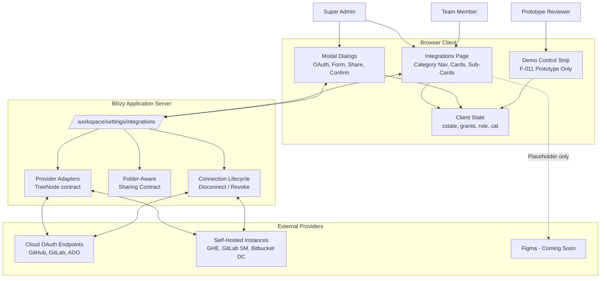

The dotted edge from the page to Figma denotes a non-interactive placeholder; no integration exists at first ship. The application server boundary marks the trust boundary across which role enforcement must be repeated (defense in depth per F-007 and Section 2.4.4).

### 4.1.3 High-Level End-to-End Workflow

The top-level workflow stitches together page entry, role gating, category navigation, sub-card status rendering, and the action surface available to each actor. It is the canonical reference for downstream subflows.

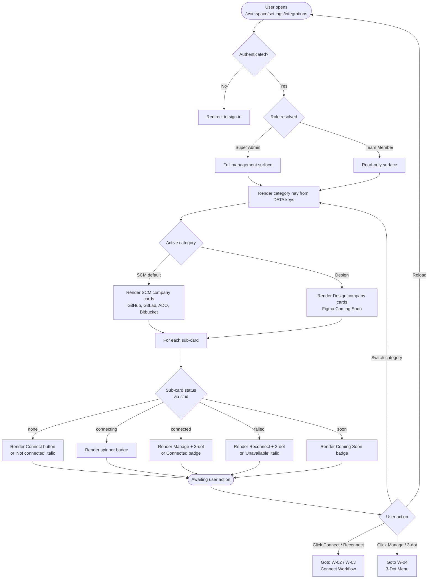

---

## 4.2 CORE BUSINESS PROCESSES

### 4.2.1 Page Load and Category Navigation Workflow (W-01)

On every render the page reads three pieces of client state (`cat`, `role`, `cstate`) and recomputes the entire view from the `DATA` catalogue. The category navigation is derived from `Object.keys(DATA)` — there is no hard-coded category list — directly satisfying F-001's catalogue-extensibility constraint.

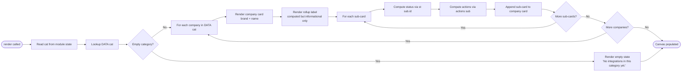

The rollup label produced at step H is one of `"{n} needs attention"`, `"All connected"`, `"{c} of {t} connected"`, or `"Not connected"`. Per F-002, this label is **informational only** and never authoritative — the per-sub-card status remains the system of record.

### 4.2.2 OAuth Connect Workflow (W-02)

Triggered when the active sub-card's `connect.kind === 'oauth'` (variants `gh`, `gl`, `ado`). Cancellation at any step returns the sub-card to its previous state with no persistence side effect, matching the edge case in user context §6: "OAuth cancelled/denied → sub-card returns to `not connected` with retry capability."

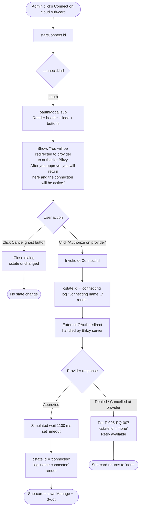

**Timing.** The 1100 ms `setTimeout` at line 224 is a prototype simulation; the production target per Section 2.4.2 is whatever the existing Blitzy OAuth client registration plumbing yields.

### 4.2.3 Credentials Form Connect Workflow (W-03)

Triggered when the active sub-card's `connect.kind === 'form'` (variants `ghe`, `gls`, `bb`). The form configuration is looked up from the per-provider `FORMS` registry. The Connect button stays disabled until `valid()` (line 212) returns true — every field marked `req: true` must be non-empty after trimming.

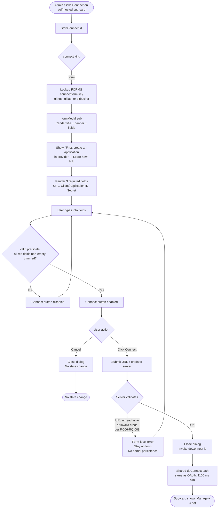

**Validation rule.** Per F-006 and Section 2.4.4, client-side validation via `valid()` is **not authoritative** — the server must validate again. A failed URL reachability check must not persist any partial state.

### 4.2.4 Combined Connect Decision Flow

The two connect workflows share a common dispatch and a common success path (`doConnect`). The combined view makes the decision diamond on `connect.kind` explicit and shows how cancellation, denial, and unreachable-URL errors converge.

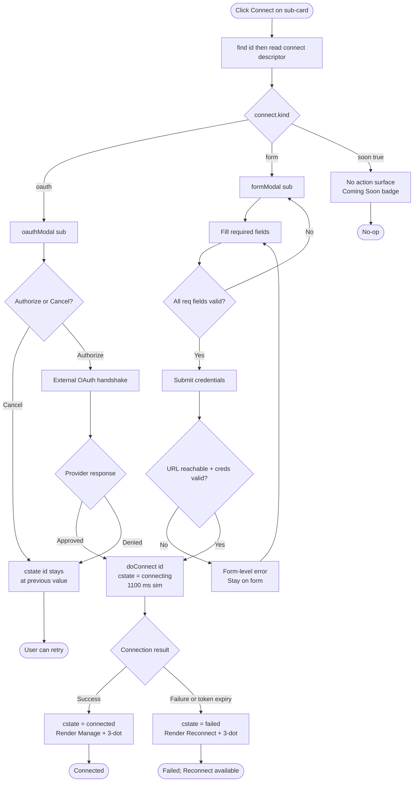

**Reconnect** (visible on a `failed` sub-card) uses exactly the same `data-connect` action as Connect (line 185), so the failed → connecting → connected transition reuses this same flow.

### 4.2.5 3-Dot Connection Management Workflow (W-04)

The 3-dot menu is the entry point for the entire post-connect lifecycle. Its four items are presented in a fixed order with a separator between the safe and destructive groups. Per F-007, the menu is rendered only when `role === 'admin'` and the sub-card status is `connected` or `failed`.

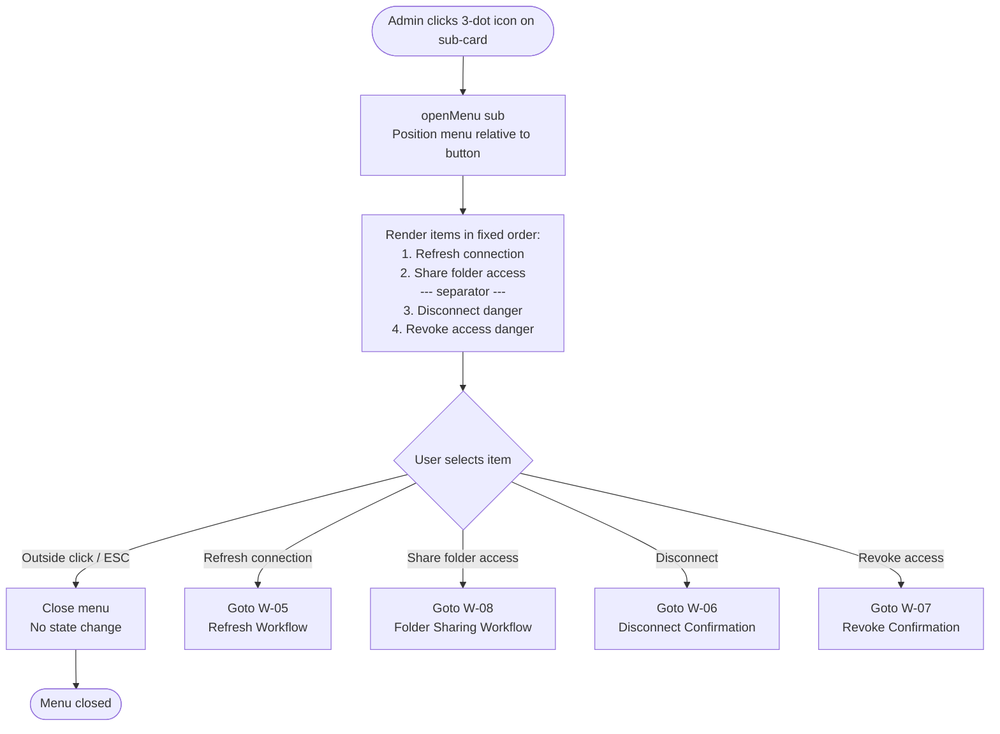

### 4.2.6 Refresh Connection Workflow (W-05)

A safe, non-destructive operation that re-validates the existing connection. Per the prototype (line 240) the sub-card transitions to `connecting`, waits 800 ms (simulated), and transitions back to `connected`. No confirmation dialog.

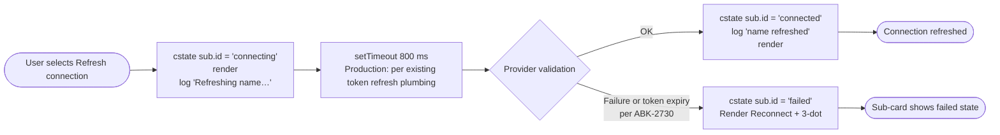

### 4.2.7 Disconnect vs Revoke Decision Workflow (W-06 + W-07)

The two destructive actions converge on the same UI state (`cstate = 'none'`) but invoke different downstream operations and present materially different confirmation copy. The distinction is the resolution of the long-standing user confusion described in Section 1.2.1 and tracked by tickets `ABK-939` and `ABK-2730`.

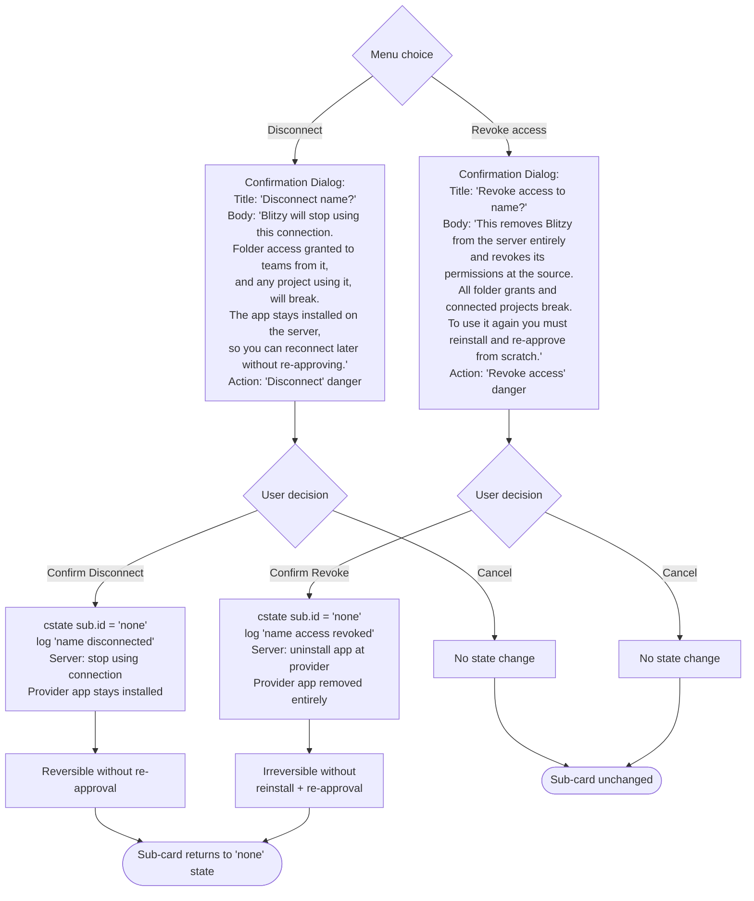

The confirmation copy explicitly warns that **folder grants and dependent projects break** — this is the F-008-RQ-004 / F-008-RQ-005 disruption-warning requirement and the upstream trigger of the broken-grant error state handled by M-01.

### 4.2.8 Folder-Level Sharing Workflow (W-08)

Opened from the 3-dot menu's Share folder access item. The two-pane layout (left: folder list 42%; right: teams + add-team 58%) is the primary surface for the feature's headline capability — folder-level team access.

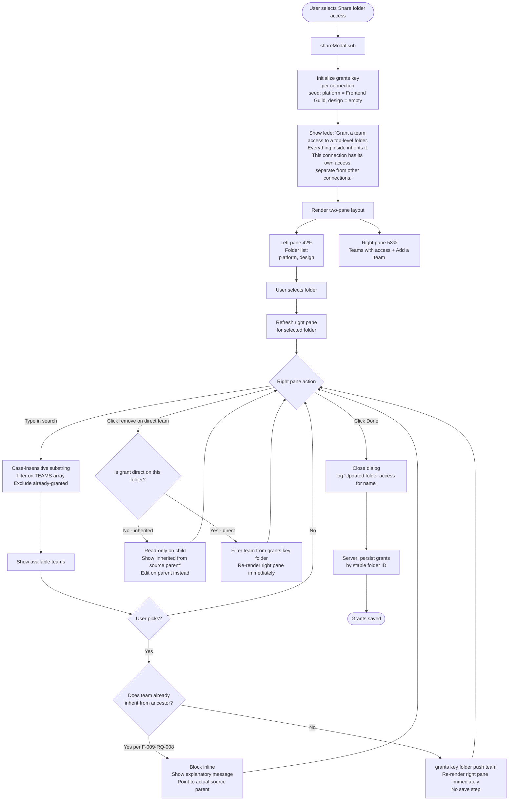

**Inheritance semantics (F-009 + F-010).** A team has access to folder *F* if it has a direct grant on *F* or a direct grant on any ancestor of *F*. Inheritance is computed at read time (not stored) and bounded by the GitLab tree-depth cap `MAX_GITLAB_DEPTH = 20` per Section 2.4.3.

### 4.2.9 Team Member Consumption Workflow (W-11)

The read-side workflow that consumes folder grants. The Integrations page itself surfaces only status to team members; the actual filtering occurs in the project source and destination pickers elsewhere in the Blitzy workspace, per F-010-RQ-007.

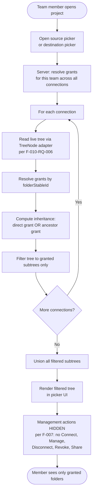

---

## 4.3 STATE MANAGEMENT

### 4.3.1 Sub-Card State Machine

Status is held per sub-card identifier in the module-scoped `cstate` map (line 164). The `st()` resolver (line 165) layers `PRESETS` defaults underneath in-memory overrides. Five canonical states are defined; transitions between them are the foundation of every connection-lifecycle workflow.

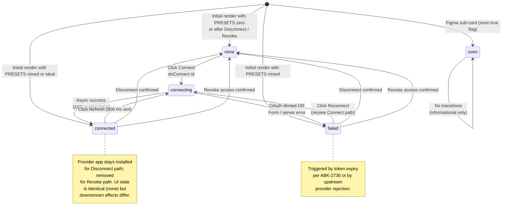

### 4.3.2 Per-Variant State Independence

Each sub-card's state is keyed by its own ID. The `mixed` preset in line 162 — `{gh:'connected', ghe:'failed', ado:'connected'}` — demonstrates that sibling variants of the same provider hold independent lifecycles. There is no aggregation or propagation between sub-cards of the same company card.

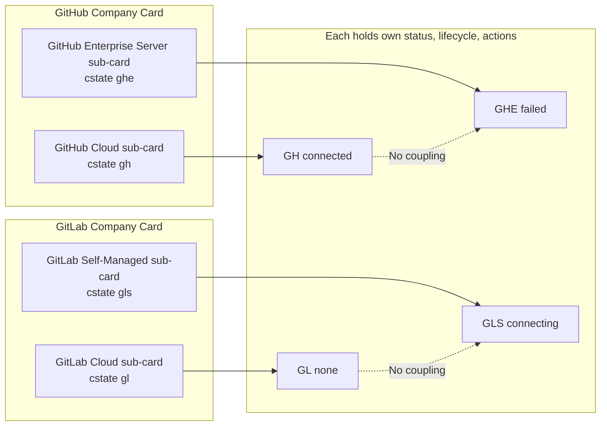

The rollup label on each company card (e.g., "1 of 2 connected", "1 needs attention") is computed from these independent states and is informational only — never used for authorization or as the system of record.

### 4.3.3 State Persistence Model

Two distinct state scopes coexist:

| Scope | Storage | Lifetime | Persistence |
|---|---|---|---|
| Prototype client state | Module-scoped vars: `cstate`, `cat`, `role`, `grants` (line 164) | Page reload resets all | None — purely in-memory |
| Folder sharing v2 draft | `S` (committed) and `D` (draft picker selection), lines 124–128 | Page reload resets | None |
| Production grant tuple | `{ connectionId, folderStableId, folderPathSnapshot, teamId }` per F-010-RQ-001 | Until explicitly revoked or folder deleted | Server-side persistent store |
| Production sub-card status | Derived from connection lifecycle in production codebase | Server-managed | Server-side |

**Production data flow on grant write:**

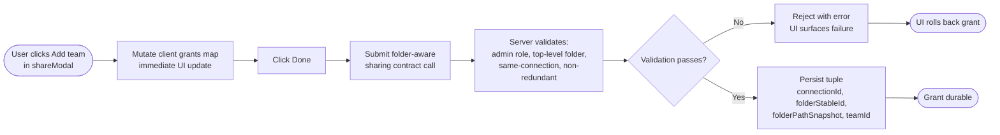

### 4.3.4 Transaction Boundaries

Each user-visible action constitutes its own logical transaction. There are no multi-step commit/rollback transactions in this feature.

| Action | Transaction Boundary | Rollback Semantics |
|---|---|---|
| OAuth Connect | One transaction across redirect + callback | OAuth denial returns sub-card to `none`; no partial state |
| Form Connect | One transaction at submit | Server validation failure leaves form open; no partial state |
| Refresh | One transaction | Failure transitions to `failed` |
| Disconnect | One transaction | No rollback path; UI immediately transitions to `none` |
| Revoke access | One transaction at server level | No rollback; reinstall + re-approve required |
| Add team to folder | One transaction per add | Server failure rolls back client `grants` mutation |
| Remove team from folder | One transaction per remove | Server failure rolls back client `grants` mutation |

---

## 4.4 INTEGRATION WORKFLOWS

### 4.4.1 OAuth Integration Sequence

The OAuth handshake for cloud variants follows standard OAuth 2.0 authorization-code semantics. The prototype simulates the entire round-trip with a single 1100 ms `setTimeout`; production implementation reuses existing Blitzy OAuth client registration plumbing per F-005.

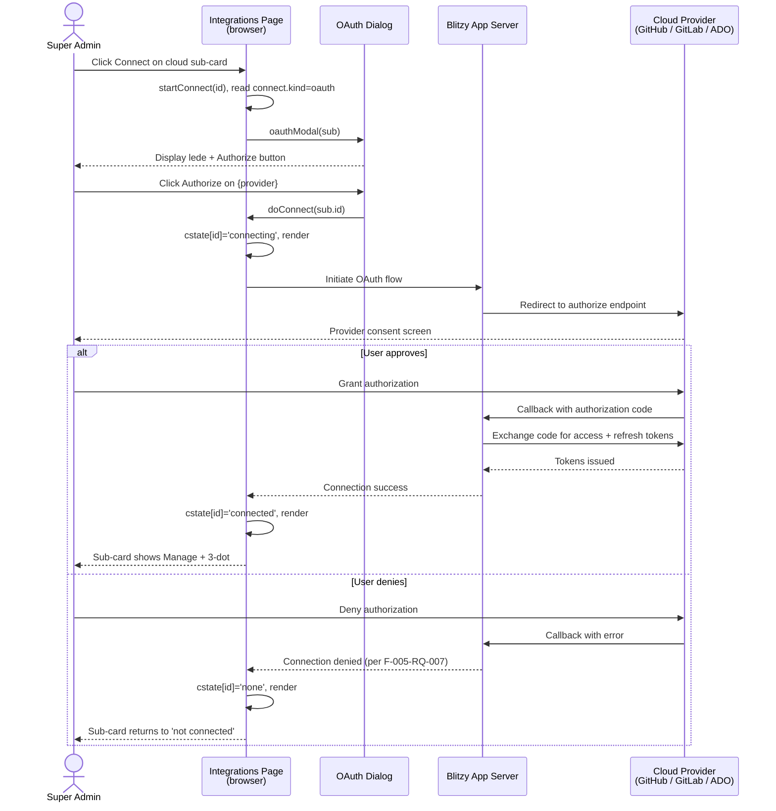

### 4.4.2 Credentials Form Integration Sequence

For self-hosted variants the credentials form collects an instance URL plus provider OAuth-app credentials, which the server uses to validate reachability and bootstrap the connection.

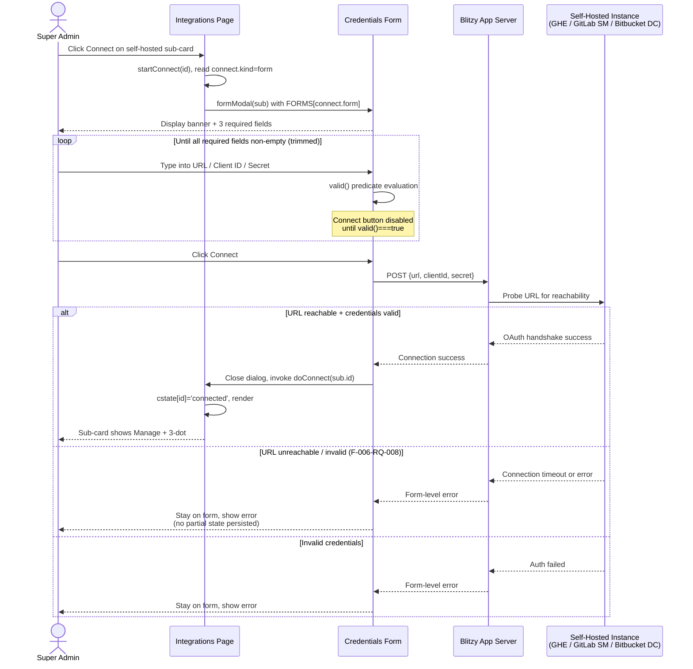

### 4.4.3 Folder Tree Resolution Sequence (M-01 + M-02)

When the sharing dialog loads, the project picker renders, or any grant-aware view is computed, the server reads the live provider tree by stable ID and recomputes inheritance. This is the F-010 behavior contract that makes rename and move transparent and isolates deletion as the only error case.

```mermaid
sequenceDiagram
    participant Cli as Client UI
    participant Srv as Blitzy App Server
    participant Store as Grant Store
    participant Adp as Provider Adapter<br/>(TreeNode contract)
    participant Prov as Provider API

    Cli->>Srv: Request: sharing dialog or picker for connection X
    Srv->>Store: Read grants for connection X
    Store-->>Srv: [{connectionId, folderStableId, folderPathSnapshot, teamId}, ...]
    Srv->>Adp: Read live tree for connection X
    Adp->>Prov: GET tree (bounded by MAX_GITLAB_DEPTH=20)
    Prov-->>Adp: Tree response
    Adp-->>Srv: Normalized TreeNode[]
    loop For each grant
        Srv->>Srv: Lookup folderStableId in tree
        alt Resolves to a node
            Srv->>Srv: Compare resolved path<br/>vs folderPathSnapshot
            alt Path differs (rename / move)
                Srv->>Store: Update folderPathSnapshot
                Note over Srv: No break; no error
            end
            Srv->>Srv: Mark grant healthy
        else Resolves to nothing (delete)
            Srv->>Srv: Mark grant broken<br/>(only error case per F-010-RQ-005)
        end
    end
    Srv->>Srv: Compute inheritance:<br/>team has access to F if direct grant<br/>on F OR ancestor of F
    Srv-->>Cli: Filtered tree + healthy + broken grants
    Cli->>Cli: Render folder list + inherited-access display<br/>+ broken-grant error indicators
```

### 4.4.4 Sharing Contract Integration

Per Section 1.2.1, the existing `IntegrationTeamShareRequest` / `bulkUpdateIntegrationTeamAccess` contract shares an entire integration with a team. F-010-RQ-001 requires extending (or paralleling) this contract with a folder-aware variant that references a stable folder/node ID.

```mermaid
flowchart TB
    Caller([Folder Sharing Dialog<br/>or Bulk Update]) --> Build[Build payload:<br/>connectionId, folderStableId,<br/>teamId, operation]
    Build --> Auth[Server: authorize caller<br/>per F-007]
    Auth --> RoleCheck{Caller is Super Admin?}
    RoleCheck -->|No| Reject[Reject 403<br/>Defense in depth]
    RoleCheck -->|Yes| Scope{Folder is top-level?}
    Scope -->|No - repo or branch| RejectScope[Reject<br/>per F-009 scope constraint]
    Scope -->|Yes| CrossOrg{Cross-connection grant?}
    CrossOrg -->|Yes| RejectCross[Reject<br/>per Section 1.3.2 OOS]
    CrossOrg -->|No| Redundant{Team already inherits?}
    Redundant -->|Yes| RejectRedundant[Reject with pointer<br/>per F-009-RQ-008]
    Redundant -->|No| Resolve[Resolve folderStableId<br/>in live tree]
    Resolve --> Exists{Folder still exists?}
    Exists -->|No| RejectMissing[Reject<br/>cannot grant on deleted folder]
    Exists -->|Yes| Persist[Persist grant tuple<br/>refresh folderPathSnapshot]
    Persist --> Success([200 OK])
    Reject --> Fail([Error surfaced in UI])
    RejectScope --> Fail
    RejectCross --> Fail
    RejectRedundant --> Fail
    RejectMissing --> Fail
```

---

## 4.5 ERROR HANDLING AND RECOVERY

### 4.5.1 Error Path Inventory

Per Section 6 of the user context and F-010-RQ-005, the feature defines exactly six error paths. Deletion of a granted folder is explicitly named as the only error state for the grant model itself.

| # | Error Condition | Source | Detection Point | Recovery |
|---|---|---|---|---|
| E-01 | Mixed status within a company | F-003 `mixed` preset | Render time | Each sub-card renders independently; no recovery needed (working as designed) |
| E-02 | Self-hosted URL unreachable or invalid | F-006-RQ-008 | Server validation on form submit | Form-level error; stay on form; user retries with corrected URL |
| E-03 | OAuth cancelled or denied | F-005-RQ-007 | OAuth callback | Sub-card returns to `none`; user retries Connect |
| E-04 | Redundant grant attempt | F-009-RQ-008 | Sharing dialog server submit | Block inline with pointer to actual source parent grant |
| E-05 | Granted folder deleted in SCM | F-010-RQ-005 | Stable-ID resolution at read time | Mark grant broken; surface error state; admin must re-issue against a different existing folder; **no automatic re-binding** per Section 1.3.2 |
| E-06 | Disconnect/Revoke on connection with active grants | F-008-RQ-004, F-008-RQ-005 | Confirmation dialog body | Warn user that folder grants and dependent projects will break; user proceeds or cancels |
| E-07 | Token expiry (silent) | Ticket `ABK-2730` | Background or next provider call | Sub-card transitions to `failed`; Reconnect action shown |

### 4.5.2 Master Error Handling Flowchart

```mermaid
flowchart TB
    Trigger([Error condition detected]) --> Classify{Error type}

    Classify -->|E-02: URL unreachable<br/>or invalid creds| URLPath[Server: validate URL]
    URLPath --> URLAction[Form-level error<br/>Stay on form<br/>No partial state persisted]
    URLAction --> URLRecover[User corrects URL or creds<br/>Resubmits form]
    URLRecover --> URLEnd([Retry path])

    Classify -->|E-03: OAuth denied| OAuthPath[OAuth callback handler]
    OAuthPath --> OAuthAction[cstate id = 'none'<br/>Sub-card returns to not connected]
    OAuthAction --> OAuthRecover[User retries Connect<br/>Same OAuth flow path]
    OAuthRecover --> OAuthEnd([Retry path])

    Classify -->|E-04: Redundant grant| RedundantPath[Server: detect inheritance match]
    RedundantPath --> RedundantAction[Block inline<br/>Show source parent name<br/>Suggest editing parent grant]
    RedundantAction --> RedundantEnd([User redirected to source])

    Classify -->|E-05: Folder deleted| DeletePath[Stable ID resolves to nothing]
    DeletePath --> DeleteAction[Mark grant broken<br/>Surface error state in UI<br/>Section 1.3.2: no auto re-bind]
    DeleteAction --> DeleteNotify{Notification policy<br/>per Open Question 4}
    DeleteNotify -->|Deferred| DeleteEnd([Admin must re-issue<br/>against existing folder])

    Classify -->|E-06: Disrupt warning| DisruptPath[Confirmation dialog]
    DisruptPath --> DisruptAction[Show body copy:<br/>'folder grants and dependent<br/>projects will break']
    DisruptAction --> DisruptChoice{User decision}
    DisruptChoice -->|Cancel| DisruptCancel([No state change])
    DisruptChoice -->|Confirm| DisruptApply([State transitions to none<br/>Server applies side effects])

    Classify -->|E-07: Token expiry per ABK-2730| TokenPath[Background detection<br/>or next provider call]
    TokenPath --> TokenAction[cstate id = 'failed'<br/>Render Reconnect + 3-dot]
    TokenAction --> TokenRecover[User clicks Reconnect<br/>Reuses Connect flow]
    TokenRecover --> TokenEnd([Retry path])
```

### 4.5.3 Retry and Fallback Mechanisms

The prototype models retry as user-initiated rather than automatic; this is the deliberate model carried into production.

| Failure | Retry Mode | Fallback |
|---|---|---|
| OAuth denied (E-03) | User-initiated: click Connect again | None — must complete OAuth to connect |
| URL unreachable (E-02) | User-initiated: correct URL, resubmit | None — must reach instance to connect |
| Token expiry (E-07) | User-initiated: click Reconnect | Sub-card remains in `failed` until user acts |
| Refresh failure | User-initiated: click Reconnect after `failed` state | Sub-card transitions to `failed` |
| Folder deleted (E-05) | Admin must re-issue grant against a different folder | **No automatic re-binding** — explicitly stated in Section 1.3.2 |
| Server contract rejection | User sees error, corrects input, resubmits | None — server is the system of record |

**No automatic retry loops, no exponential backoff, no circuit breakers** are modeled in the prototype or specified in the feature prompt. The model is "act, observe, retry on user command."

### 4.5.4 Notification Flow

The notification model for broken grants (E-05) is explicitly deferred. Per Section 2.6.3 Open Question 4: "On a deleted granted folder, who is notified (granting admin, consuming member, or both)" is **deferred to implementation**.

```mermaid
flowchart LR
    Trigger([Granted folder<br/>deleted at provider]) --> Detect[Next stable-ID resolution<br/>marks grant broken]
    Detect --> Surface[UI surfaces error state<br/>on the broken grant]
    Surface --> Question{Notification recipient?<br/>OPEN QUESTION 4}
    Question -.->|Option A| Admin[Notify granting admin]
    Question -.->|Option B| Member[Notify consuming team member]
    Question -.->|Option C| Both[Notify both]
    Question -->|First ship| Defer[Deferred to implementation]
    Admin -.-> End([Outside current scope])
    Member -.-> End
    Both -.-> End
    Defer --> End
```

Per the prototype itself, the only in-prototype notification mechanism is the single-line status log at line 167 (`log()`), which writes one of nine fixed message strings to `#log` for reviewer visibility — not a production notification surface.

---

## 4.6 VALIDATION RULES AND DECISION POINTS

### 4.6.1 Form Validation Rules

Per F-006-RQ-008 and the `valid()` predicate at line 212:

| Rule | Specification | Enforcement Point |
|---|---|---|
| Required field non-emptiness | Every `req: true` field must be non-empty after `.trim()` | Client (`valid()`) AND server (defense in depth) |
| Connect button gating | Disabled until `valid()` returns true | Client UI only |
| URL reachability | Instance URL must be reachable from server | Server only — client cannot probe cross-origin |
| Credentials validity | Provider OAuth app must accept the credentials | Server + Provider |
| Partial state on failure | None — failure must not persist any partial connection | Server contract |

```mermaid
flowchart LR
    Edit([User edits form field]) --> Trim[Trim whitespace]
    Trim --> Check{All req fields<br/>non-empty?}
    Check -->|No| Disable[Connect button disabled<br/>Form remains open]
    Disable --> Edit
    Check -->|Yes| Enable[Connect button enabled]
    Enable --> Submit{User submits?}
    Submit -->|Cancel| EndCancel([No state change])
    Submit -->|Connect| ServerSide[Server: validate URL + creds]
    ServerSide --> ServerResult{Valid?}
    ServerResult -->|No| Error[Form-level error<br/>Stay on form<br/>No partial persistence]
    Error --> Edit
    ServerResult -->|Yes| Proceed([Continue to doConnect])
```

### 4.6.2 Authorization Checkpoints

Per F-007 and Section 2.4.4, role enforcement is required at both the UI and server contract layers (defense in depth). The UI hides actions for team members; the server contract must independently reject non-admin callers.

| Action | UI Gate | Server Gate |
|---|---|---|
| Browse Integrations page | None — both roles can view | None |
| Click Connect / Reconnect | Hidden for team members | Reject non-admin |
| Open Manage / 3-dot menu | Hidden for team members | Reject non-admin |
| Refresh connection | Hidden for team members | Reject non-admin |
| Share folder access (open dialog) | Hidden for team members | Reject non-admin |
| Add team to folder | Hidden for team members | Reject non-admin |
| Remove team from folder | Hidden for team members | Reject non-admin |
| Disconnect | Hidden for team members | Reject non-admin |
| Revoke access | Hidden for team members | Reject non-admin |
| Consume granted folder in picker | Visible to both | Filter at read time per F-010-RQ-007 |

### 4.6.3 Business Rules at Each Workflow Step

The decision points across all workflows can be summarized as a single validation lattice:

```mermaid
flowchart TB
    Any([Any state-changing action]) --> R1{Role: Super Admin?}
    R1 -->|No| Reject1[Reject - F-007 / Sec 2.4.4]
    R1 -->|Yes| R2{Tier: Enterprise or Team?}
    R2 -->|No| Reject2[Reject - Section 1.3.1 tier coverage]
    R2 -->|Yes| Specific{Action type}

    Specific -->|Connect oauth| Cloud[Cloud OAuth redirect]
    Specific -->|Connect form| FormFlow[Validate URL + creds server-side]
    Specific -->|Refresh| RefreshFlow[No additional validation]
    Specific -->|Disconnect / Revoke| Confirm[Require user confirmation]
    Specific -->|Add team to folder| Grant[Validate grant]

    Grant --> G1{Folder is top-level?}
    G1 -->|No| RejectScope[Reject - F-009 grantable scope]
    G1 -->|Yes| G2{Same-connection grant?}
    G2 -->|No| RejectCross[Reject - Section 1.3.2 cross-org OOS]
    G2 -->|Yes| G3{Team already inherits?}
    G3 -->|Yes| RejectRedundant[Block inline - F-009-RQ-008]
    G3 -->|No| G4{Folder exists in live tree?}
    G4 -->|No| RejectMissing[Reject - cannot grant on deleted folder]
    G4 -->|Yes| Persist([Persist grant])
```

### 4.6.4 Scope Enforcement Rules

Per Section 1.3.1 and 1.3.2, the feature has strict scope boundaries that must be enforced at every entry point:

| Rule | Enforcement |
|---|---|
| Only top-level folders are grantable | UI: sharing dialog shows only top-level folders. Server: reject grants targeting repo or branch IDs. |
| One account per sub-card | UI: no multi-account affordance. Server: reject multi-org grant tuples. |
| No carve-outs under inherited parent | UI: inherited teams read-only on child. Server: reject revoke-on-inherited operations. |
| No cross-connection grants | UI: each sharing dialog scoped to one sub-card. Server: reject grant tuples spanning `connectionId` values. |
| No view/edit access-level | UI: omit access-level pills (visible in v2 prototype but out of scope). Server: reject any `level` parameter. |
| No connect-time sharing | UI: connect dialogs offer no share affordance. Server: ignore any share parameters sent at connect time. |
| No access request workflow | UI: team members have no "request access" affordance. Server: no request/approval endpoints. |

---

## 4.7 TIMING AND SLA CONSIDERATIONS

### 4.7.1 Prototype Simulated Timings

The prototype uses `setTimeout` to simulate asynchronous operations. These values are illustrative, not specifications.

| Operation | Simulated Duration | Source | Production Reference |
|---|---|---|---|
| OAuth connect (doConnect) | 1100 ms | Line 224 | Existing Blitzy OAuth plumbing |
| Form connect (doConnect) | 1100 ms (shared path) | Line 224 | Existing Blitzy OAuth plumbing |
| Refresh connection | 800 ms | Line 240 | Existing token refresh plumbing |
| Category switch render | Synchronous DOM update | Line 282 | Sub-16 ms (one render frame) |
| Dialog open (OAuth, Form, Share, Confirm) | Synchronous | All `modal()` calls | Under 100 ms per Section 2.4.2 |
| Folder/team search filter | Synchronous | Line 258 | Interactive, no perceptible lag |

### 4.7.2 Production Performance Targets

Per Section 2.4.2:

| Feature | Performance Target |
|---|---|
| F-001, F-002, F-003 (category switch, card render) | Within one render frame (sub-16 ms) |
| F-005, F-006 (dialog open) | Under 100 ms |
| F-008 (Refresh visible feedback) | Within 800 ms of click (prototype value as guidance) |
| F-009 (folder list, team list, search filter) | Interactive, no perceptible lag |
| F-010 (inheritance resolution at read time) | Must not noticeably impact project picker render |

### 4.7.3 Tree Traversal Bounds

Per Section 2.4.3 and F-010, every read-time inheritance computation is bounded by the GitLab tree depth cap.

```mermaid
flowchart LR
    Start([Inheritance resolution<br/>for team T on folder F]) --> Direct{Direct grant<br/>on F?}
    Direct -->|Yes| GrantedDirect([Access granted])
    Direct -->|No| Walk[Walk ancestors of F]
    Walk --> Check{Any ancestor has<br/>direct grant for T?}
    Check -->|Yes| GrantedInherited([Access granted via inheritance])
    Check -->|No| MoreAncestors{More ancestors<br/>and depth ≤ 20?}
    MoreAncestors -->|Yes| Walk
    MoreAncestors -->|No - root reached<br/>or MAX_GITLAB_DEPTH cap| NoAccess([No access])
```

The cap `MAX_GITLAB_DEPTH = 20` is named in Section 1.2.1 as the existing constant in the downstream codebase that the folder picker must respect.

---

## 4.8 CROSS-WORKFLOW DEPENDENCIES

The complete dependency graph between the user-facing workflows shows how the Connect flows feed into management, how management feeds into sharing, and how sharing produces the persisted grants that drive consumption.

```mermaid
flowchart TB
    W01[W-01 Page Load &<br/>Category Navigation] --> W10[W-10 Role-Based<br/>Action Dispatch]
    W10 --> W02[W-02 OAuth Connect]
    W10 --> W03[W-03 Credentials Form Connect]
    W02 --> W04[W-04 3-Dot Menu Open]
    W03 --> W04
    W04 --> W05[W-05 Refresh Connection]
    W04 --> W06[W-06 Disconnect Confirmation]
    W04 --> W07[W-07 Revoke Access Confirmation]
    W04 --> W08[W-08 Folder Sharing<br/>Integrations Page]
    W08 --> M01[M-01 Stable-ID<br/>Tree Resolution]
    M01 --> M02[M-02 Inheritance<br/>Resolution]
    M02 --> W11[W-11 Project Picker<br/>Filtering]
    W05 --> W04
    W06 --> W01
    W07 --> W01
    W08 --> W04
    W11 -.->|Read-side only| W01

    classDef admin fill:#d4cbfc,stroke:#5b39f3
    classDef member fill:#c9fcea,stroke:#005335
    classDef system fill:#f5f5f5,stroke:#666

    class W02,W03,W04,W05,W06,W07,W08 admin
    class W11 member
    class W01,W10,M01,M02 system
```

The color key (purple = Super Admin, green = Team Member, gray = System) makes the actor responsibility for each workflow visually explicit, matching the swim-lane intent of the section prompt while keeping the diagram compact.

---

## 4.9 References

### 4.9.1 Repository Files Examined

- `blitzy-integrations-page.html` — Complete prototype providing all workflow logic, specifically:
  - Lines 12–17: design tokens used in all dialog and badge rendering
  - Lines 20–24, 103–112: demo control strip (W-12)
  - Lines 88–99: two-pane shareModal CSS layout
  - Lines 121–129: category nav markup (W-01)
  - Lines 133–146: `FORMS` configuration registry (W-03)
  - Lines 147–161: `DATA` provider catalogue
  - Line 162: `PRESETS` demo scenarios driving state independence demonstration
  - Lines 164–167: client state holders (`cstate`, `cat`, `role`, `grants`) and `log()`
  - Lines 171–175: rollup label computation
  - Lines 179–186: `actions()` role-based dispatch (W-10)
  - Lines 199, 203–204: 3-dot menu wiring and `startConnect()`
  - Lines 205–210: `oauthModal()` (W-02)
  - Lines 211–222: `formModal()` and `valid()` predicate (W-03, M-03)
  - Lines 223–224: shared `doConnect()` path with 1100 ms simulation
  - Lines 226–247: `openMenu()` / `onMenu()` and Refresh / Disconnect / Revoke handlers (W-04 through W-07)
  - Lines 250–271: `shareModal()` folder-sharing workflow (W-08)
  - Lines 273–275: shared confirmation dialog helper
  - Lines 280–283: top-level event wiring including role and category switching

- `folder-sharing-prototype-v2.html` — Folder picker workflow source, specifically:
  - Lines 110–118: folder metadata model `FM` with stable IDs, path, icon, inclusion summary
  - Lines 120–122: team metadata
  - Lines 124–128: persistent state `S` (grants list) and draft state `D` (picker selection)
  - Lines 132–151: grant management functions (add, remove)
  - Lines 153–164: mode switching (out of scope per Section 1.3.2)
  - Lines 166–214: picker flow including `addGrant`, "Save & add another," and Done handling (W-09)

### 4.9.2 Technical Specification Sections Referenced

- Section 1.2 SYSTEM OVERVIEW — Major system components diagram (basis for 4.1.2), core technical approach, success criteria including stable-ID resilience and confirmation distinctness
- Section 1.3 SCOPE — Connect-flow inputs, 3-dot menu action table, folder access capability table, scope enforcement rules (basis for 4.6.4)
- Section 2.1 FEATURE CATALOG — Feature definitions F-001 through F-012 driving the workflow-to-feature mapping in 4.1.1
- Section 2.4 IMPLEMENTATION CONSIDERATIONS — Performance targets (basis for 4.7.2), scalability bounds (basis for 4.7.3), security implications driving the authorization checkpoint matrix in 4.6.2
- Section 2.6 ASSUMPTIONS AND CONSTRAINTS — Open Question 4 on broken-grant notification (basis for 4.5.4)

### 4.9.3 Downstream Integration Targets (Not in Repository)

The following identifiers are documented per Section 1.2.1 as named integration points in the downstream Blitzy production codebase that the workflows in this section reference:

- `src/panel/workspace/settings/integrations.tsx` — Target page being restructured (route `/workspace/settings/integrations`)
- `SvcType` enumeration — Extended with GitHub Enterprise Server and Bitbucket Data Center variants
- Provider adapter `TreeNode` contract — Read-only consumption by folder picker and inheritance resolution
- `IntegrationTeamShareRequest` / `bulkUpdateIntegrationTeamAccess` — Extended (or paralleled) by folder-aware sharing contract
- `MAX_GITLAB_DEPTH = 20` — Tree traversal cap enforced in inheritance resolution
- Tickets `ABK-939` (ADO uninstall) and `ABK-2730` (silent token expiry) — Existing engineering work coupled with Disconnect / Revoke distinction

# 5. System Architecture

## 5.1 HIGH-LEVEL ARCHITECTURE

### 5.1.1 System Overview

The repository hosts a dual-layer architecture that must be discussed at two distinct fidelities throughout this section. The **prototype layer** — the two HTML files actually present in the repository — is a self-contained, browser-only, build-free specification. The **production layer** — the React/TypeScript application at `src/panel/workspace/settings/integrations.tsx` and the Blitzy application server it talks to — is the implementation target that the prototype's behavior precisely describes but does not contain. Every architectural claim in this section is tagged to the appropriate layer; no production artifact (`integrations.tsx`, `SvcType`, `IntegrationTeamShareRequest`, `bulkUpdateIntegrationTeamAccess`, provider adapters, `MAX_GITLAB_DEPTH`) exists in this repository (per §1.2.1 Note on repository scope; §2.6.1 Assumption 1).

#### Prototype Architecture Style and Rationale

The prototype is a pair of **monolithic single-page static HTML documents** containing inline `<style>` and `<script>` blocks. There is no framework (no React, no Vue, no Angular), no build step (no Webpack, no Vite, no Babel, no TypeScript), no bundler, no transpiler, no test runner, no package manager, no CI pipeline, and no server-side component. The only network calls made at load time are two HTTPS GET requests to `cdn.jsdelivr.net` (for the Tabler Icons webfont) and `fonts.googleapis.com`/`fonts.gstatic.com` (for the Inter typeface) — there is no API endpoint, no analytics endpoint, no telemetry endpoint, and no SCM provider call (per §3.5.1; §3.5.4).

The rationale for this radical minimalism (per §3.2.2) is fivefold:

- **Zero build step.** Designers, product managers, and reviewers can open either file directly via `file://` or any static HTTP server and see the entire behavior immediately.
- **Self-contained single files.** Each prototype is independently archivable, embeddable, and attachable to tickets.
- **No imposed runtime constraints.** Because the prototype does not commit to React, TypeScript, or any specific framework version, the downstream production implementation is free to use the existing Blitzy stack without compatibility concerns.
- **Minimal attack surface.** With only two CDN dependencies and no API endpoints, the prototype has essentially no production-relevant security exposure.
- **Maximum portability.** The files run identically in any evergreen browser without configuration.

#### Production Architecture Style (Specified by the Prototype)

The production architecture that the prototype specifies is a **client-server SPA with provider adapters**:

- **Client tier:** React + TypeScript single-page component (`.tsx`) hosted on the route `/workspace/settings/integrations`. Data-driven catalogue rendering, config-driven dialogs, and per-sub-card state holders are reproduced from the prototype's `DATA`, `FORMS`, and `cstate` structures.
- **Server tier:** Blitzy application server that owns connection lifecycle, OAuth flows, credential validation, sharing-contract enforcement, and grant resolution.
- **Adapter tier:** Existing provider adapters that normalize GitHub, GitLab, Azure DevOps, and Bitbucket provider responses to the shared `TreeNode` contract; reused unchanged for folder-grant resolution (per §2.6.1 Assumption 2).
- **Persistence tier:** A grant store holding `{ connectionId, folderStableId, folderPathSnapshot, teamId }` tuples (per F-010-RQ-001); the specific datastore is unspecified in the feature prompt and assumed to reuse existing Blitzy persistence infrastructure.

### 5.1.2 Key Architectural Principles and Patterns

| Principle | Pattern | Prototype Evidence |
|---|---|---|
| **Data-driven catalogue** | Declarative rendering from a single source-of-truth structure | `DATA` object (`blitzy-integrations-page.html` lines 147–161) drives nav + cards; `Object.keys(DATA)` produces categories |
| **Per-variant state independence** | State keyed by leaf identifier, never aggregated | `cstate` map keyed by sub-card ID (line 164); `mixed` preset `{gh:'connected', ghe:'failed', ado:'connected'}` proves siblings hold independent lifecycles |
| **Config-driven dialogs** | Polymorphic dispatch on declarative descriptors | `FORMS` registry (lines 133–146) declares title, mark, banner, fields per provider; `oauthModal()` vs `formModal()` dispatched by `connect.kind` |
| **Push-only sharing with inheritance** | Direct grant, ancestor-walk resolution | `shareModal()` (lines 250–271); no request/approval queue; grant on parent flows to all descendants |
| **Stable-ID anchored persistence** | Identity by immutable internal ID, display by snapshot path | Grant tuple `{connectionId, folderStableId, folderPathSnapshot, teamId}` (per F-010-RQ-001) |
| **Defense in depth role gating** | Independent enforcement at UI and server contract layers | `actions()` (lines 179–186) branches on `role`; production server contract must also reject non-admin per §2.4.4 F-007 |
| **Distinct destructive operations** | Single-action-per-effect, no overloaded semantics | Disconnect (line 242) vs Revoke access (line 245) with different copy and downstream effects |
| **Reuse over invention** | Adapter pattern, design tokens, OAuth plumbing all reused | All five SCM providers normalize to existing `TreeNode`; CSS tokens in `:root` block match Blitzy 1:1 |

### 5.1.3 System Boundaries and Major Interfaces

#### Prototype Boundaries

The prototype's runtime boundary is the browser DOM. There are exactly two outbound integration points, both fired once at page load:

| Boundary Edge | Endpoint | Direction | Protocol |
|---|---|---|---|
| CSS stylesheet load | `cdn.jsdelivr.net/npm/@tabler/icons-webfont` | Outbound, page load | HTTPS GET |
| Font stylesheet + binary load | `fonts.googleapis.com` and `fonts.gstatic.com` | Outbound, page load | HTTPS GET |

No outbound calls of any kind are made after initial CDN load. All "asynchronous" behavior in the prototype is `setTimeout`-simulated (1100 ms for connect operations per line 224; 800 ms for refresh per line 240).

#### Production Boundaries (Specified, Not Present)

The production system spans five logical boundary layers, illustrated in the architecture overview diagram in §5.2.8:

| Boundary Edge | Counterparty | Direction | Protocol/Pattern |
|---|---|---|---|
| Browser ↔ Blitzy App Server | Authenticated workspace user session | Bidirectional | HTTPS, route `/workspace/settings/integrations` |
| Server ↔ Provider Adapters | Existing `TreeNode` contract | Server-side internal | In-process; respects `MAX_GITLAB_DEPTH = 20` |
| Adapters ↔ Cloud SCMs | GitHub, GitLab, Azure DevOps | Outbound | OAuth 2.0 + REST/GraphQL |
| Adapters ↔ Self-Hosted SCMs | GHE Server, GitLab Self-Managed, Bitbucket DC | Outbound | HTTPS with provider OAuth-app credentials |
| Server ↔ Grant Store | Persistent tuple storage | Server-side | Implementation-specific (reuse existing Blitzy persistence) |
| Server ↔ Folder-Aware Sharing Contract | Extension/parallel of `IntegrationTeamShareRequest` and `bulkUpdateIntegrationTeamAccess` | Server-side | New contract referencing stable folder/node ID |

### 5.1.4 Core Components

The end-to-end feature comprises nine logical components. Five live exclusively in the production target (rendered as React in `integrations.tsx`); two are prototype-only (Demo Control Strip, the simplified prototype sharing dialog); and two are cross-cutting (Design Token System, Grant Persistence Model).

| Component | Primary Responsibility | Key Dependencies | Integration Points |
|---|---|---|---|
| **Integrations Settings Page** | Renders category nav + company cards + sub-cards from `DATA`; dispatches user actions; role-aware action surface | `DATA` catalogue, `cstate`, `role`, `cat`; Tabler Icons; Inter font | Browser route `/workspace/settings/integrations`; production React `.tsx` component |
| **Connect Dialog (OAuth)** | Presents authorize-redirect UX for cloud variants | `connect.provider` from `DATA`; scrim/dialog container; Blitzy OAuth client registration plumbing | GitHub/GitLab/Azure DevOps OAuth authorize endpoints |
| **Connect Dialog (Form)** | Renders credentials form for self-hosted variants with config-driven fields and `valid()` predicate | `FORMS` registry (`github`, `gitlab`, `bitbucket`); per-field required-trim validation; server-side URL probe | Self-hosted GHE Server / GitLab Self-Managed / Bitbucket DC instances |
| **3-Dot Management Menu** | Hosts the four lifecycle actions in fixed order on a connected sub-card | Kebab button per sub-card; `confirmD()` helper; role gate | Provider OAuth app registry (Revoke); token store (Refresh); grant store (Disconnect/Revoke) |
| **Folder Sharing Dialog** | Two-pane folder + team picker with inheritance display and search-to-add | `TEAMS` array; per-connection `grants[key]` map; case-insensitive search; team directory lookup | Existing `TreeNode` adapter contract; folder-aware sharing contract |
| **Grant Persistence Model** | Stores `{connectionId, folderStableId, folderPathSnapshot, teamId}` per F-010 | Provider stable folder/node IDs; live tree resolver | Extension/parallel of `IntegrationTeamShareRequest`/`bulkUpdateIntegrationTeamAccess` |
| **Project Source & Destination Pickers** | Filter tree to granted subtrees for team members (consume-side, in downstream codebase) | Grant resolver with inheritance; `TreeNode` tree | Read-side only; per F-010-RQ-007 |
| **Demo Control Strip** (prototype only) | Switches state preset and role for reviewer demo | `PRESETS` (`zero`, `mixed`, `ideal`); `role` state | Must be excluded from production build per F-011 |
| **Design Token System** | CSS custom properties for brand, status, geometry (`:root` block, lines 12–17) | Inter from Google Fonts; neutral border palette | Must match Blitzy design system 1:1 per F-012 |

### 5.1.5 Data Flow Description

Four primary data flows characterize the system end-to-end. Each is described in prose here and depicted with sequence diagrams in §5.2.10.

#### Page Load and Initial Render Flow (W-01)

When the browser loads `blitzy-integrations-page.html`, it executes a deterministic boot sequence. The HTML head preconnects to Google Fonts and loads the Inter typeface plus the Tabler Icons CSS (lines 7–10). The inline `<script>` block declares the immutable configuration objects (`FORMS`, `DATA`, `PRESETS`, `TEAMS`) followed by the module-scoped state holders (`cstate`, `cat`, `role`, `grants` at line 164). The bootstrap call `setScenario('mixed')` at line 283 loads the mixed preset into `cstate` and triggers `render()`. The render loop reads the current `cat`, looks up `DATA[cat]`, iterates providers and sub-cards, computes each sub-card's status via `st()`, builds an HTML string for `#canvas`, and finally wires event handlers via `wire()`. In production the equivalent flow becomes a React component mount that subscribes to a server-side connection state store keyed by sub-card identifier.

#### Connect Flow (W-02 OAuth, W-03 Form)

When the admin clicks Connect on a sub-card, `startConnect(id)` (line 198) calls `find(id)` to retrieve the sub-card descriptor and branches on `connect.kind`. For the **OAuth path**, `oauthModal(sub)` opens a dialog with a lede and Authorize button. On confirm, `doConnect(sub.id)` transitions `cstate[id]` to `'connecting'`, the prototype's 1100 ms `setTimeout` simulates the round-trip, and `cstate[id]` resolves to `'connected'` before re-rendering. For the **Form path**, `formModal(sub)` loads the `FORMS[connect.form]` configuration, renders the three required fields (Server URL, Client ID, Client secret for GitHub-family; GitLab URL, Application ID, Secret for GitLab; Bitbucket URL, Application ID, Secret for Bitbucket), and uses the `valid()` predicate (line 212) to gate the Connect button. On submit the same `doConnect(sub.id)` path executes from there. Production replaces the `setTimeout` with the existing Blitzy OAuth client registration plumbing for cloud, and adds a server-side reachability probe and credentials validation for self-hosted.

#### Folder Sharing Flow (W-08)

When the admin opens the 3-dot menu and selects "Share folder access," `shareModal(sub)` (lines 250–271) initializes `grants[sub.id]` if absent (seeded with `{platform: ['Frontend Guild'], design: []}`). The left pane renders the top-level folder list with per-folder team count badges; the right pane shows direct grants on the selected folder and a case-insensitive search-to-add input that excludes already-granted teams. Adding a team mutates `grants[key][selected]` and re-renders immediately; removing a team filters it out and re-renders; there is no Save step — only a Done button to close. The lede copy underscores the model: "Grant a team access to a top-level folder. Everything inside inherits it. This connection has its own access, separate from other connections." In production, each add/remove translates to a folder-aware sharing contract call as detailed in §5.2.10.

#### Inheritance Resolution at Read Time (M-01, M-02)

The most consequential data flow is **server-side inheritance resolution**, which runs whenever the sharing dialog loads, a project picker renders, or any grant-aware view is computed. The server reads grants for the connection, fetches the live provider tree through the existing adapter (bounded by `MAX_GITLAB_DEPTH = 20`), and for each grant looks up `folderStableId` in the live tree. If the path differs from `folderPathSnapshot`, the server updates the snapshot and marks the grant healthy (transparently absorbing rename or move). If the stable ID resolves to nothing (the only error case per F-010-RQ-005), the grant is marked broken. Inheritance is then computed by walking ancestors: a team has access to folder F if it holds a direct grant on F or on any ancestor of F. Filtered tree plus healthy/broken-grant indicators return to the client.

### 5.1.6 External Integration Points

| System | Integration Type | Data Exchange Pattern | Protocol/Format |
|---|---|---|---|
| **GitHub Cloud** | SCM, OAuth | Authorize-redirect | OAuth 2.0 + REST/GraphQL |
| **GitHub Enterprise Server** | SCM, Self-hosted | Credentials form (Server URL, Client ID, Client secret) | HTTPS + OAuth app credentials |
| **GitLab Cloud** | SCM, OAuth | Authorize-redirect | OAuth 2.0 + REST/GraphQL |
| **GitLab Self-Managed** | SCM, Self-hosted | Credentials form (GitLab URL, Application ID, Secret) | HTTPS + OAuth app credentials |
| **Azure DevOps** | SCM, OAuth | Authorize-redirect | OAuth 2.0 |
| **Bitbucket Data Center** | SCM, Self-hosted | Credentials form (Bitbucket URL, Application ID, Secret) | HTTPS + OAuth app credentials |
| **Figma** | Design (Coming Soon) | Placeholder only; `soon:true` flag in `DATA` | None at first ship |
| **Google Fonts CDN** | Typography asset (prototype only) | CSS + font binary load | HTTPS GET |
| **jsDelivr CDN** | Icon webfont (prototype only) | CSS + font binary load | HTTPS GET |

**SLA observations.** No production SLA targets are declared in the feature prompt or any tech-spec section. The only quantitative timing values are the prototype's simulated values (1100 ms connect simulation per line 224, 800 ms refresh feedback per line 240) and the production-side performance guidance in §4.7.2 (sub-16 ms category switch; under 100 ms dialog open; within 800 ms refresh feedback; interactive search filter; inheritance resolution must not noticeably impact picker render). Per §4.5.3, "No automatic retry loops, no exponential backoff, no circuit breakers are modeled in the prototype or specified in the feature prompt. The model is 'act, observe, retry on user command.'"

---

## 5.2 COMPONENT DETAILS

### 5.2.1 Integrations Settings Page

| Aspect | Detail |
|---|---|
| **Purpose** | Top-level surface for browsing and managing integration connections at route `/workspace/settings/integrations` |
| **Technologies (prototype)** | HTML5, CSS3 with Custom Properties, ES5 JavaScript |
| **Technologies (production)** | React + TypeScript (`.tsx`); existing Blitzy design system tokens |
| **Key inputs** | `DATA` (catalogue), `cstate` (per-sub-card status), `role` (Super Admin vs Team Member), `cat` (current category) |
| **Render target** | `#canvas` element; HTML string composition followed by `wire()` event-handler attachment (line 198) |
| **Data persistence** | None in prototype; production reads from the connection lifecycle state in the Blitzy server |
| **Scaling considerations** | Pure data-change to add a category, provider, or variant (per F-001/F-002/F-004 constraints in §2.4.1); no quadratic UI cost in the `DATA` and `FORMS` structures |

The page renders a 200 px left navigation rail plus a 1fr canvas (CSS grid, lines 32–35) listing one **company card** per provider in the current category, with each company card containing one or more **sub-cards** (one per connection variant). Critically, status lives on the sub-card, not the company card: the `rollup()` helper at lines 171–175 produces a "1 of 2 connected" or "1 needs attention" label that is informational only and never used as the system of record (per §4.3.2).

### 5.2.2 Connect Dialog — OAuth Variant

The `oauthModal()` function (lines 205–210) opens for cloud variants `gh`, `gl`, and `ado`. The dialog is intentionally minimal: a provider-specific lede paragraph and two buttons — Authorize and Cancel (ghost style). It is the same dialog regardless of provider; the only differentiator is the provider name interpolated into the lede. On Authorize confirmation, the dialog closes and control passes to `doConnect(sub.id)`. In production, this hand-off triggers a redirect to the provider's OAuth authorize endpoint and listens for the callback per §4.4.1.

### 5.2.3 Connect Dialog — Form Variant

The `formModal()` function (lines 211–222) opens for self-hosted variants `ghe`, `gls`, and `bb`. The dialog loads the per-provider configuration from the `FORMS` registry (lines 133–146):

| Sub-card | FORMS Key | Banner | Fields |
|---|---|---|---|
| `ghe` | `github` | "First, register an OAuth app in GitHub Enterprise" | Server URL, Client ID, Client secret |
| `gls` | `gitlab` | "First, create an application in GitLab" | GitLab URL, Application ID, Secret |
| `bb` | `bitbucket` | "First, create an application in Bitbucket" | Bitbucket URL, Application ID, Secret |

All three fields are marked `req: true`. The `valid()` predicate at line 212 gates the Connect button: every required field must be non-empty after `.trim()`. The predicate is client-side only — the server independently validates URL reachability and credential validity per F-006-RQ-008 and §4.6.1. On submit, `doConnect(sub.id)` is invoked, the dialog closes, and the sub-card transitions through the same `connecting` → `connected` lifecycle as the OAuth path.

### 5.2.4 3-Dot Management Menu

The 3-dot menu (`openMenu()`/`onMenu()`, lines 226–247) renders only on sub-cards in the `connected` state and only when `role === 'admin'`. Items render in a fixed order:

1. **Refresh connection** — Sets `cstate` to `'connecting'`, runs an 800 ms `setTimeout`, returns to `'connected'`, logs "{provider} refreshed."
2. **Share folder access** — Opens the folder sharing dialog (`shareModal(sub)`, see §5.2.5).
3. *(visual separator)*
4. **Disconnect** (danger) — Confirmation copy emphasizes that "Blitzy will stop using this connection. Folder access granted to teams from it, and any project using it, will break. The app stays installed on the server, so you can reconnect later without re-approving."
5. **Revoke access** (danger) — Confirmation copy emphasizes that "This removes Blitzy from the server entirely and revokes its permissions at the source. All folder grants and connected projects break. To use it again you must reinstall and re-approve from scratch."

The critical architectural distinction: **both terminate the sub-card at `cstate='none'` in the UI, but downstream effects differ**. Disconnect leaves the provider-side app installed (admin can reconnect without re-approval); Revoke uninstalls it and revokes permissions at the source. This distinction directly resolves the historical conflation tracked under tickets `ABK-939` (ADO uninstall) and `ABK-2730` (silent token expiry) — per §1.2.1 and §2.4.5.

### 5.2.5 Folder Sharing Dialog

The `shareModal()` function (lines 250–271) implements the core folder-level access capability. The dialog uses a two-pane `.share` layout (CSS lines 87–99): the left pane occupies 42% width with a gray background and renders the top-level folder list with per-folder team count badges; the right pane occupies 58% and shows direct grants on the selected folder plus a search-to-add input.

| Aspect | Detail |
|---|---|
| **Folders in prototype** | Hard-coded `[{id:'platform',n:'platform'},{id:'design',n:'design'}]` — top-level folders only |
| **TEAMS array** | `['Galatea UI','Infra','QA Automation','Back-end','Frontend Guild','Security','Payments']` (line 163) |
| **Initial grants seed** | `{platform: ['Frontend Guild'], design: []}` per connection |
| **Lede copy** | "Grant a team access to a top-level folder. Everything inside inherits it. This connection has its own access, separate from other connections." |
| **Search semantics** | Case-insensitive substring filter; excludes already-granted teams |
| **No Save step** | Add/Remove mutate state immediately; only Done closes the dialog |

The production sharing dialog must reconcile two prototype sources. From `blitzy-integrations-page.html` it inherits the page restructure and connect flows; from `folder-sharing-prototype-v2.html` it inherits the richer folder-picker and team multi-select interaction model. Critically, several features visible in `folder-sharing-prototype-v2.html` are **explicitly out of scope** per §1.3.2 and §2.6.2: the "Just me / Share with team" mode toggle (lines 37–48), view/edit access-level pills (lines 90–94), repo and branch-level selection (lines 78–82), and the include-subfolders toggle (lines 96–99) — top-level grants always include subfolders by inheritance.

### 5.2.6 Grant Persistence Model

The grant tuple `{ connectionId, folderStableId, folderPathSnapshot, teamId }` is the central data structure of F-010. The two scalar fields carry different roles:

- **`folderStableId`** is the provider's permanent internal identifier and is the authoritative key. Rename and move operations preserve it; only deletion makes it resolve to nothing.
- **`folderPathSnapshot`** is display-only. It is refreshed on every read by the live tree lookup, so the UI always shows current paths without breaking on rename or move.

Inheritance is **computed at read time**, never cached. A team has access to folder F if and only if it holds a direct grant on F or on any ancestor of F, walked from F toward the root and bounded by `MAX_GITLAB_DEPTH = 20` (per §4.7.3). This computation runs on every sharing-dialog open, every project picker render, and every grant-aware view — and is required to not noticeably impact picker render performance (per §2.4.2 and §4.7.2).

### 5.2.7 Project Source and Destination Pickers (Consume Side)

Although the pickers themselves live in the downstream production codebase (not in either prototype), they are the read-side counterpart of the folder grant model. Per F-010-RQ-007, the pickers must filter the tree to subtrees granted to the requesting team member, applying the same inheritance rules. Management actions are hidden for team members at the UI layer and rejected at the server contract layer (defense in depth per §4.6.2); the picker is the only surface a team member sees.

### 5.2.8 Component Interaction Diagram

```mermaid
flowchart TB
    SA([Super Admin])
    TM([Team Member])

    subgraph BlitzyApp[Blitzy Workspace Application]
        IntegPage[Integrations Settings Page<br/>Category Nav + Company Cards + Sub-Cards]
        OAuthDlg[OAuth Connect Dialog]
        FormDlg[Form Connect Dialog]
        ManageMenu[3-Dot Management Menu<br/>Refresh / Share / Disconnect / Revoke]
        ShareDlg[Folder Sharing Dialog<br/>Two-Pane Folder + Team Picker]
        Pickers[Project Source &amp; Destination Pickers<br/>Filtered by Granted Folders]
    end

    subgraph ServerTier[Blitzy App Server]
        ConnLifecycle[Connection Lifecycle<br/>OAuth handler, form probe]
        ShareContract[Folder-Aware Sharing Contract<br/>extends IntegrationTeamShareRequest]
        Resolver[Grant Resolver with Inheritance<br/>MAX_GITLAB_DEPTH = 20]
        GrantStore[(Grant Store<br/>connectionId, folderStableId,<br/>folderPathSnapshot, teamId)]
    end

    subgraph Adapters[Provider Adapter Tier]
        AdapterTree[Existing TreeNode Contract]
    end

    subgraph Providers[External Providers]
        Cloud[Cloud SCM<br/>GitHub, GitLab, Azure DevOps]
        SelfHosted[Self-Hosted SCM<br/>GHE Server, GitLab SM, Bitbucket DC]
        Design[Design Tools<br/>Figma - Coming Soon]
    end

    SA -->|Browse, connect| IntegPage
    SA -->|Authorize| OAuthDlg
    SA -->|Submit credentials| FormDlg
    SA -->|Manage connection| ManageMenu
    SA -->|Grant team to folder| ShareDlg
    TM -->|Read-only status view| IntegPage
    TM -->|Consume granted folders| Pickers

    IntegPage --> OAuthDlg
    IntegPage --> FormDlg
    IntegPage --> ManageMenu
    ManageMenu --> ShareDlg

    OAuthDlg --> ConnLifecycle
    FormDlg --> ConnLifecycle
    ShareDlg --> ShareContract
    Pickers --> Resolver

    ShareContract --> Resolver
    Resolver --> GrantStore
    Resolver --> AdapterTree
    ConnLifecycle --> AdapterTree

    AdapterTree -->|OAuth| Cloud
    AdapterTree -->|HTTPS + creds| SelfHosted
    IntegPage -.->|Placeholder card| Design
```

### 5.2.9 Sub-Card State Transition Diagram

Sub-card status is held in the module-scoped `cstate` map at line 164 of `blitzy-integrations-page.html`, resolved through `st()` at line 165 (which layers `PRESETS` defaults underneath in-memory overrides). Five canonical states are defined per §4.3.1.

```mermaid
stateDiagram-v2
    [*] --> none: PRESETS zero OR<br/>after Disconnect / Revoke
    [*] --> connected: PRESETS mixed OR ideal
    [*] --> failed: PRESETS mixed
    [*] --> soon: Figma sub-card<br/>(soon true flag)

    none --> connecting: Click Connect<br/>doConnect(id)
    connecting --> connected: Async success<br/>1100 ms simulated
    connecting --> failed: OAuth denied OR<br/>Form/server error
    connected --> connecting: Click Refresh<br/>800 ms simulated
    connected --> none: Disconnect confirmed
    connected --> none: Revoke access confirmed
    failed --> connecting: Click Reconnect<br/>(reuses Connect path)
    failed --> none: Disconnect confirmed
    failed --> none: Revoke access confirmed
    soon --> soon: No transitions<br/>(informational only)
```

**Per-variant independence.** The state of `gh` does not constrain the state of `ghe`. The `mixed` preset `{gh:'connected', ghe:'failed', ado:'connected'}` is the explicit demonstration of this invariant. The "1 of 2 connected" company-level rollup is computed from per-sub-card states and is informational only — never used for authorization (per §4.3.2).

**Disconnect vs Revoke terminal equivalence in UI only.** Both actions land at `cstate='none'`, but Disconnect leaves the provider-side app installed (reconnect without re-approval) while Revoke uninstalls it (reinstall + re-approve required). The state machine itself is identical; the server-side side effects differ.

### 5.2.10 Sequence Diagrams for Key Flows

#### OAuth Connect Sequence (W-02)

```mermaid
sequenceDiagram
    actor Admin as Super Admin
    participant UI as Integrations Page
    participant Dlg as OAuth Dialog
    participant Srv as Blitzy App Server
    participant Prov as Cloud Provider

    Admin->>UI: Click Connect on cloud sub-card
    UI->>UI: startConnect(id), read connect.kind=oauth
    UI->>Dlg: oauthModal(sub)
    Dlg-->>Admin: Display lede + Authorize button
    Admin->>Dlg: Click Authorize
    Dlg->>UI: doConnect(sub.id)
    UI->>UI: cstate[id]='connecting', render
    UI->>Srv: Initiate OAuth flow
    Srv->>Prov: Redirect to authorize endpoint
    Prov-->>Admin: Provider consent screen
    alt User approves
        Admin->>Prov: Grant authorization
        Prov->>Srv: Callback with authorization code
        Srv->>Prov: Exchange code for access + refresh tokens
        Prov-->>Srv: Tokens issued
        Srv-->>UI: Connection success
        UI->>UI: cstate[id]='connected', render
        UI-->>Admin: Sub-card shows Manage + 3-dot
    else User denies (E-03)
        Admin->>Prov: Deny authorization
        Prov->>Srv: Callback with error
        Srv-->>UI: Connection denied
        UI->>UI: cstate[id]='none', render
        UI-->>Admin: Sub-card returns to 'not connected'
    end
```

#### Form Connect Sequence (W-03)

```mermaid
sequenceDiagram
    actor Admin as Super Admin
    participant UI as Integrations Page
    participant Form as Credentials Form
    participant Srv as Blitzy App Server
    participant Inst as Self-Hosted Instance

    Admin->>UI: Click Connect on self-hosted sub-card
    UI->>UI: startConnect(id), read connect.kind=form
    UI->>Form: formModal(sub) with FORMS[connect.form]
    Form-->>Admin: Display banner + 3 required fields
    loop Until all req fields non-empty (trimmed)
        Admin->>Form: Type into URL / Client ID / Secret
        Form->>Form: valid() predicate evaluation
        Note over Form: Connect button disabled<br/>until valid() === true
    end
    Admin->>Form: Click Connect
    Form->>Srv: POST {url, clientId, secret}
    Srv->>Inst: Probe URL for reachability
    alt URL reachable and credentials valid
        Inst-->>Srv: OAuth handshake success
        Srv-->>Form: Connection success
        Form->>UI: Close dialog, invoke doConnect(sub.id)
        UI->>UI: cstate[id]='connected', render
        UI-->>Admin: Sub-card shows Manage + 3-dot
    else URL unreachable or invalid (E-02)
        Inst-->>Srv: Connection timeout or error
        Srv-->>Form: Form-level error
        Form-->>Admin: Stay on form, show error<br/>(no partial state persisted)
    end
```

#### Folder Tree Resolution Sequence (M-01, M-02)

```mermaid
sequenceDiagram
    participant Cli as Client UI
    participant Srv as Blitzy App Server
    participant Store as Grant Store
    participant Adp as Provider Adapter
    participant Prov as Provider API

    Cli->>Srv: Request: sharing dialog or picker for connection X
    Srv->>Store: Read grants for connection X
    Store-->>Srv: Grant tuples (connectionId, folderStableId, folderPathSnapshot, teamId)
    Srv->>Adp: Read live tree for connection X
    Adp->>Prov: GET tree (bounded by MAX_GITLAB_DEPTH=20)
    Prov-->>Adp: Tree response
    Adp-->>Srv: Normalized TreeNode array
    loop For each grant
        Srv->>Srv: Lookup folderStableId in tree
        alt Resolves to a node
            Srv->>Srv: Compare resolved path<br/>vs folderPathSnapshot
            alt Path differs (rename / move)
                Srv->>Store: Update folderPathSnapshot
                Note over Srv: No break; no error
            end
            Srv->>Srv: Mark grant healthy
        else Resolves to nothing (delete, E-05)
            Srv->>Srv: Mark grant broken<br/>(only error case per F-010-RQ-005)
        end
    end
    Srv->>Srv: Compute inheritance:<br/>team has access to F if direct grant<br/>on F OR any ancestor of F
    Srv-->>Cli: Filtered tree + healthy + broken grants
    Cli->>Cli: Render folder list + inheritance display<br/>+ broken-grant indicators
```

---

## 5.3 TECHNICAL DECISIONS

### 5.3.1 Architecture Style Decisions

| Decision | Choice | Rationale | Tradeoff |
|---|---|---|---|
| Prototype runtime | Pure static HTML, no framework | Zero build step; reviewer-friendly; portable; archivable; doesn't constrain production | No type safety; ES5/ES6 dialect skew between the two files |
| Prototype dialect — page | Vanilla ES5 JavaScript | Maximum browser compatibility for review; no transpilation needed | Verbose vs ES6+; no module system |
| Prototype dialect — folder v2 | ES6+ JavaScript | Demonstrates richer interactions; closer to production target | Requires evergreen browser; no transpilation step provided |
| Catalogue rendering | Data-driven from `DATA` object | Adding category/provider/variant is pure data change; no markup edit | Implicit schema discipline required |
| Per-sub-card status | Independent state per sub-card ID | Cloud and self-hosted variants must be independently operable | Slight rendering complexity vs single status per company |
| Sharing model | Push-only, admin-driven | No approval queue; no engineering escalation; faster onboarding | Admin must know which teams to grant; no team self-service |
| Inheritance model | All-or-nothing under parent | Predictable security boundary | No carve-outs (explicitly out of scope per §1.3.2) |
| Grant identity | Stable folder/node ID, not path | Rename and move don't break access; only delete is an error | Provider must return permanent IDs (Open Question 1) |
| Role gating | Defense in depth (UI + server) | UI alone insufficient; server alone permits bad UX | Two enforcement points to maintain |
| Lifecycle actions | Distinct Disconnect vs Revoke | Resolves "stop using" vs "uninstall" semantic confusion (tickets `ABK-939`, `ABK-2730`) | Two destructive actions to explain; copy must be clear |
| Connect-time sharing | None (sharing only from 3-dot menu) | Decouples connect from share; replaces legacy "Just me / Share with team" prompt | Two clicks to share after connect (acceptable) |

### 5.3.2 Communication Pattern Choices

In the prototype, all "communication" is direct DOM manipulation. The only asynchrony is `setTimeout`-simulated. In production, three communication patterns are specified:

| Pattern | Used For | Rationale |
|---|---|---|
| **OAuth 2.0 Authorization Code** | Cloud connect (GitHub, GitLab, Azure DevOps) | Industry standard; reuses existing Blitzy OAuth client registration plumbing per F-005 |
| **HTTPS POST + server-side reachability probe** | Self-hosted connect (GHE Server, GitLab SM, Bitbucket DC) | Client cannot probe cross-origin from browser; server validates URL + credentials |
| **Request/Response over the folder-aware sharing contract** | Grant add/remove, sharing dialog reads | Extends or parallels existing `IntegrationTeamShareRequest` and `bulkUpdateIntegrationTeamAccess` per §1.2.1 |

No streaming, no pub/sub, no WebSocket, no Server-Sent Events, no GraphQL subscriptions are required by this feature.

### 5.3.3 Data Storage Solution Rationale

| Layer | Choice | Rationale |
|---|---|---|
| Prototype | In-memory module-scoped variables (`cstate`, `cat`, `role`, `grants` at line 164) | Resets on reload; uses no `localStorage`, `sessionStorage`, `IndexedDB`, Cache API, or Cookie Store API; appropriate for prototype scope |
| Production grant store | Persistent tuple store keyed by `{connectionId, folderStableId, folderPathSnapshot, teamId}` | Specific datastore unspecified in any retrieved tech-spec section; assumption is reuse of existing Blitzy persistence infrastructure (per §2.6.1 Assumption 1; §3.6.1) |
| Production path snapshot | Display-only field, refreshed on every read | Live tree resolution by stable ID is authoritative; snapshot avoids re-fetching for every UI render |
| Production sub-card status | Server-managed per-connection lifecycle | Server is system of record; UI reflects server state |

The default Blitzy database choice (MongoDB) does not appear in any form in the repository, and no other database driver, ORM, or persistence abstraction is present (per §3.6.1).

### 5.3.4 Caching Strategy

| Layer | Strategy |
|---|---|
| Prototype | None — no service worker, no `Cache API`, no in-memory caching layer beyond browser HTTP defaults for the two CDN resources |
| Production | Not addressed in any retrieved tech-spec section. Inheritance is resolved at read time, not cached. Tree responses come from existing adapter infrastructure whose caching policy is outside the scope of this feature |

The architectural principle is **resolve fresh**: the live provider tree is the source of truth for what folders exist, and the grant store is the source of truth for who has access. No precomputed inheritance index is specified.

### 5.3.5 Security Mechanism Selection

| Mechanism | Choice | Source / Justification |
|---|---|---|
| Resource transport | HTTPS-only for both CDN resources | Maintains no mixed-content risk; observed in both files (per §3.8.3) |
| Subresource Integrity | **Absent in prototype**; production should add `integrity="sha384-…"` and `crossorigin="anonymous"` | §3.8.3 production recommendation |
| Content Security Policy | Cannot be set in static HTML; production deployment should ship CSP restricting `script-src`, `style-src`, `font-src`, `connect-src` | §3.8.3 production recommendation |
| Credential storage | Prototype simulates only; production uses existing Blitzy secret-store conventions | §2.4.4 F-006 |
| OAuth handling | Prototype simulates via 1100 ms `setTimeout`; production reuses existing Blitzy OAuth client registration plumbing | §2.4.1 F-005 |
| Role enforcement | Defense in depth: UI hides actions + server contract rejects non-admin callers | §2.4.4 F-007; §4.6.2 |
| Server-side read filtering | Authoritative; client-side filter is defense in depth only | §2.4.4 F-010; §4.6.2 |
| Fail-closed on broken grants | Deleted folders fail closed (no access), not fail open | §2.4.4 F-010 |
| Audit logging | Recommended for destructive actions (Disconnect/Revoke) | §2.4.4 F-008 |

### 5.3.6 Architecture Decision Records

The following ADRs capture the most consequential architectural decisions in a compact format. Each is keyed back to the source feature requirement.

```mermaid
flowchart TB
    subgraph ADR1[ADR-001: Per-Sub-Card Status]
        D1[Decision: Status keyed by sub-card ID,<br/>never aggregated to company]
        R1[Rationale: Cloud and self-hosted variants must<br/>be independently operable F-003]
        C1[Consequence: Slight rendering complexity;<br/>rollup label informational only]
    end

    subgraph ADR2[ADR-002: Stable-ID Anchored Grants]
        D2[Decision: Persist grant tuple with<br/>folderStableId + folderPathSnapshot]
        R2[Rationale: Rename and move must not break access;<br/>only delete is an error F-010]
        C2[Consequence: Provider must return permanent IDs;<br/>Open Question 1 carried forward]
    end

    subgraph ADR3[ADR-003: Push-Only Sharing Model]
        D3[Decision: Admin grants directly;<br/>no request/approval queue]
        R3[Rationale: Reduce engineering escalations;<br/>self-service Enterprise UX F-009]
        C3[Consequence: No team self-service;<br/>admin must know which teams to grant]
    end

    subgraph ADR4[ADR-004: Defense-in-Depth Role Gating]
        D4[Decision: UI hides + server contract rejects<br/>non-admin callers]
        R4[Rationale: Either alone insufficient;<br/>UI for UX, server for authority F-007]
        C4[Consequence: Two enforcement points to maintain]
    end

    subgraph ADR5[ADR-005: Disconnect vs Revoke Distinction]
        D5[Decision: Two destructive actions with<br/>different downstream effects]
        R5[Rationale: Resolve historical conflation per<br/>tickets ABK-939, ABK-2730 F-008]
        C5[Consequence: Two confirmation copies;<br/>clear copy required]
    end

    D1 --> R1 --> C1
    D2 --> R2 --> C2
    D3 --> R3 --> C3
    D4 --> R4 --> C4
    D5 --> R5 --> C5
```

**Decision tree — choice of connect dialog per provider variant:**

```mermaid
flowchart TB
    Start([Sub-card Connect clicked]) --> Lookup[find id, read connect.kind]
    Lookup --> Kind{connect.kind}
    Kind -->|oauth| OAuthBranch[oauthModal sub]
    Kind -->|form| FormBranch[formModal sub, FORMS connect.form]
    Kind -->|soon| SoonBranch[No connect dialog;<br/>Figma placeholder per F-002]
    OAuthBranch --> OAuthRender[Render lede + Authorize button]
    FormBranch --> FormConfig{Which FORMS key?}
    FormConfig -->|github| GHE[Server URL, Client ID, Client secret]
    FormConfig -->|gitlab| GLS[GitLab URL, Application ID, Secret]
    FormConfig -->|bitbucket| BB[Bitbucket URL, Application ID, Secret]
    GHE --> FormRender[Render banner + 3 required fields]
    GLS --> FormRender
    BB --> FormRender
    FormRender --> Valid[valid predicate gates Connect button]
    OAuthRender --> Confirm([User Authorize -> doConnect])
    Valid --> Submit([Valid -> Submit -> doConnect])
    SoonBranch --> End([Coming soon - no action])
```

---

## 5.4 CROSS-CUTTING CONCERNS

### 5.4.1 Monitoring and Observability

**Prototype.** The only observability surface is the single-line status log written to the `#log` element by the `log()` function (line 167). Messages are fixed strings keyed to user actions:

| Trigger | Log Message |
|---|---|
| Initial load | "Ready" |
| State preset switch | "Loaded 'mixed' state" (or `zero`, `ideal`) |
| Connect attempt | "Connecting GitHub…" |
| Connect success | "GitHub connected" |
| Refresh | "Refreshing GitHub…" → "GitHub refreshed" |
| Disconnect | "GitHub disconnected" |
| Revoke | "GitHub access revoked" |
| Share | "Updated folder access for GitHub" |
| Role toggle | "Role: Super Admin" / "Role: Team Member" |

This is a reviewer affordance, not a production observability surface.

**Production.** No production observability approach is specified in any retrieved tech-spec section. The default Blitzy monitoring stack is not referenced in either file. Per §3.5.4, no analytics SDK, APM, or telemetry library is present in the prototype (Google Analytics, Segment, Mixpanel, Sentry, Datadog, New Relic, Bugsnag, LogRocket — all absent).

### 5.4.2 Logging and Tracing Strategy

| Layer | Strategy |
|---|---|
| Prototype | The `log()` function only; no logging library; no APM SDK; no analytics SDK |
| Production | Not addressed in any retrieved tech-spec section. **§2.4.4 F-008 explicitly recommends audit logging for destructive actions** (Disconnect/Revoke) to provide traceability for irreversible operations |

### 5.4.3 Error Handling Patterns

Seven error paths are defined across the feature, per §4.5.1:

| ID | Condition | Detection Point | Recovery |
|---|---|---|---|
| **E-01** | Mixed status within a company | Render time | No recovery — working as designed (per F-003) |
| **E-02** | Self-hosted URL unreachable or invalid | Server validates form submit | Form-level error; stay on form; user retries with corrected URL/creds |
| **E-03** | OAuth cancelled or denied | OAuth callback | Sub-card returns to `none`; user retries Connect |
| **E-04** | Redundant grant attempt | Sharing dialog server submit | Block inline with pointer to actual source parent grant |
| **E-05** | Granted folder deleted in SCM | Stable-ID resolution at read time | Mark grant broken; admin must re-issue against a different existing folder; **no automatic re-binding** per §1.3.2 |
| **E-06** | Disconnect/Revoke on connection with active grants | Confirmation dialog body | Warn user that folder grants and dependent projects will break; user proceeds or cancels |
| **E-07** | Token expiry (silent, per ticket `ABK-2730`) | Background or next provider call | Sub-card transitions to `failed`; Reconnect action shown |

**Master error handling flowchart:**

```mermaid
flowchart TB
    Trigger([Error condition detected]) --> Classify{Error type}

    Classify -->|E-02: URL unreachable<br/>or invalid creds| URLPath[Server validates URL]
    URLPath --> URLAction[Form-level error<br/>Stay on form<br/>No partial state persisted]
    URLAction --> URLRecover[User corrects URL or creds<br/>Resubmits form]
    URLRecover --> URLEnd([Retry path])

    Classify -->|E-03: OAuth denied| OAuthPath[OAuth callback handler]
    OAuthPath --> OAuthAction[cstate id = none<br/>Sub-card returns to not connected]
    OAuthAction --> OAuthRecover[User retries Connect]
    OAuthRecover --> OAuthEnd([Retry path])

    Classify -->|E-04: Redundant grant| RedundantPath[Server detects inheritance match]
    RedundantPath --> RedundantAction[Block inline<br/>Show source parent name<br/>Suggest editing parent grant]
    RedundantAction --> RedundantEnd([User redirected to source])

    Classify -->|E-05: Folder deleted| DeletePath[Stable ID resolves to nothing]
    DeletePath --> DeleteAction[Mark grant broken<br/>Surface error state in UI<br/>No auto re-bind]
    DeleteAction --> DeleteNotify{Notification policy<br/>per Open Question 4}
    DeleteNotify -->|Deferred to implementation| DeleteEnd([Admin must re-issue<br/>against existing folder])

    Classify -->|E-06: Disrupt warning| DisruptPath[Confirmation dialog]
    DisruptPath --> DisruptAction[Show body copy:<br/>folder grants and dependent<br/>projects will break]
    DisruptAction --> DisruptChoice{User decision}
    DisruptChoice -->|Cancel| DisruptCancel([No state change])
    DisruptChoice -->|Confirm| DisruptApply([State transitions to none<br/>Server applies side effects])

    Classify -->|E-07: Token expiry per ABK-2730| TokenPath[Background detection<br/>or next provider call]
    TokenPath --> TokenAction[cstate id = failed<br/>Render Reconnect plus 3-dot]
    TokenAction --> TokenRecover[User clicks Reconnect]
    TokenRecover --> TokenEnd([Retry path])
```

**Retry and fallback principle.** Per §4.5.3, the system uses **user-initiated retry only**. No automatic retry loops, no exponential backoff, no circuit breakers are modeled in the prototype or specified in the feature prompt. The model is "act, observe, retry on user command." This applies equally to OAuth denial, URL unreachability, token expiry, refresh failure, and folder-deletion broken grants.

### 5.4.4 Authentication and Authorization Framework

#### Authentication

Authentication is **not implemented in the prototype**. The default Blitzy authentication choice (Auth0) does not appear in either file (per §3.5.3). OAuth 2.0 flows for the three cloud SCMs are referenced in `oauthModal()` but only simulated with `setTimeout`. Production reuses existing Blitzy OAuth client registration plumbing (per §2.4.1 F-005); that plumbing is not in this repository.

#### Authorization

Two roles are defined per F-007 and §4.6.2:

| Role | Read Access | Write Access |
|---|---|---|
| **Super Admin** | All integrations and folders | All management actions (Connect, Refresh, Share, Disconnect, Revoke, Add/Remove team) |
| **Team Member** | Granted folders only (via picker filter) | None on this page |

Defense-in-depth role gating is enforced at two layers:

| Layer | Mechanism |
|---|---|
| **UI gate** | The `actions()` function (lines 179–186) branches on `role` and hides all management actions for team members. The `role` toggle in the demo control strip switches between Super Admin and Team Member for review |
| **Server gate** | The folder-aware sharing contract and connection lifecycle endpoints must independently reject non-admin callers; UI gating alone is insufficient per §2.4.4 F-007 |

**Tier gating.** The feature is gated to **Enterprise + Team tiers**; Free and Pro are deferred. Team management is currently Enterprise-gated in the broader product, and team-tier gating for the grant action specifically is **Open Question 5** carried forward to implementation (per §2.6.3).

### 5.4.5 Performance Requirements and SLAs

| Surface | Target | Source |
|---|---|---|
| Category switch, card render | Sub-16 ms (one render frame) | §2.4.2; §4.7.2 |
| Dialog open (OAuth, Form, Share, Confirm) | Under 100 ms | §2.4.2; §4.7.2 |
| Refresh visible feedback | Within 800 ms of click | §2.4.2 (prototype value as guidance) |
| Folder/team search filter | Interactive, no perceptible lag | §2.4.2 |
| Inheritance resolution at read time | Must not noticeably impact project picker render | §2.4.2; §4.7.2 |
| Tree traversal cap | `MAX_GITLAB_DEPTH = 20` ancestors max | §1.2.1; §2.4.3; §4.7.3 |

**Prototype simulated timings** (illustrative, not specifications): OAuth connect 1100 ms (line 224), form connect 1100 ms (line 224), refresh 800 ms (line 240).

**Explicit principle (§4.5.3):** "No automatic retry loops, no exponential backoff, no circuit breakers are modeled in the prototype or specified in the feature prompt."

**Tree traversal performance flow:**

```mermaid
flowchart LR
    Start([Inheritance resolution<br/>for team T on folder F]) --> Direct{Direct grant<br/>on F?}
    Direct -->|Yes| GrantedDirect([Access granted])
    Direct -->|No| Walk[Walk ancestors of F]
    Walk --> Check{Any ancestor has<br/>direct grant for T?}
    Check -->|Yes| GrantedInherited([Access granted via inheritance])
    Check -->|No| MoreAncestors{More ancestors<br/>and depth at most 20?}
    MoreAncestors -->|Yes| Walk
    MoreAncestors -->|No - root reached<br/>or MAX_GITLAB_DEPTH cap| NoAccess([No access])
```

### 5.4.6 Disaster Recovery Procedures

| Layer | Procedure |
|---|---|
| Prototype | Not applicable. The repository contains static content only; rollback is `git revert`. There is no database, no message queue, no cache to recover |
| Production | Not addressed in any retrieved tech-spec section. The folder grant store presumably falls under existing Blitzy persistence DR procedures (per §2.6.1 Assumption 1) |

The architectural principle that simplifies DR for this feature: **grants are recomputable from the persistent tuple store plus the live provider tree**. There is no derived state that requires reconstruction beyond what reading the tuples produces. Broken grants (folder deleted) are an explicit, observable state — not an inconsistency that needs DR.

### 5.4.7 Architectural Assumptions

The following assumptions are explicit per §2.6.1 and must be validated during implementation:

1. The downstream production codebase contains `src/panel/workspace/settings/integrations.tsx`, `SvcType`, provider adapters with the `TreeNode` contract, `IntegrationTeamShareRequest`, `bulkUpdateIntegrationTeamAccess`, and `MAX_GITLAB_DEPTH = 20`. None exist in this prototype repository.
2. Provider tree-fetching infrastructure is reused unchanged; backend changes to SCM tree fetching are explicitly out of scope per §1.3.2.
3. Stable folder/node IDs are available from all five SCM providers. Open Question 1 (per §2.6.3) flags this for confirmation — if the existing code persists shares by name/path rather than stable ID, F-010 rename/move semantics are not immediately achievable.
4. Super Admin and Team Member roles are already modeled in the production Blitzy session layer.
5. The Inter font is reliably available via Google Fonts CDN for consistent rendering across supported browsers.

---

## 5.5 References

### 5.5.1 Files Examined

- `blitzy-integrations-page.html` — Primary architectural evidence (287 lines). Sections referenced: lines 7–10 (CDN preconnect/load), 12–17 (`:root` design tokens), 32–35 (layout grid), 87–99 (share modal CSS), 121–129 (layout markup), 133–146 (`FORMS` registry), 147–161 (`DATA` catalogue), 162 (`PRESETS`), 163 (`TEAMS`), 164 (state holders `cstate`, `cat`, `role`, `grants`), 165–167 (`st()`, `setScenario()`, `log()`), 171–175 (`rollup()`), 176–178 (`badge()`), 179–186 (`actions()` role-based dispatch), 187–196 (`render()`), 197–200 (`wire()`), 203–204 (`startConnect()`), 205–210 (`oauthModal()`), 211–222 (`formModal()` + `valid()`), 223–224 (`doConnect()` with 1100 ms simulation), 226–238 (`openMenu()`), 239–247 (`onMenu()`), 250–271 (`shareModal()`), 273–275 (`confirmD()`), 280–283 (top-level event wiring and bootstrap).
- `folder-sharing-prototype-v2.html` — Folder picker reference model (219 lines). Sections referenced: line 7 (Tabler Icons 2.47.0 CDN — version skew with integrations page), line 10 (system font stack), 30–63 (main view), 65–107 (picker view), 110–118 (`FM` folder metadata), 119 (`ORDER` hierarchy), 120–122 (`PAL`, `RAW`, `TM` team metadata), 124–127 (`S` committed state), 128 (`D` draft state), 132–151 (grant rendering), 153–164 (mode switching — out of scope), 166–214 (picker workflow). Out-of-scope items observed: mode toggle lines 37–48, access-level pills lines 90–94, repo/branch selection lines 78–82, include-subfolders toggle lines 96–99.
- Repository root — Verified to contain only the two HTML files plus `.git`; no subdirectories, no application source tree, no package manifest, no build configuration.

### 5.5.2 Technical Specification Sections Cross-Referenced

- §1.2 SYSTEM OVERVIEW — Project context, named integration points, six top-level capabilities, system component diagram, core technical approach.
- §2.3 FEATURE RELATIONSHIPS — Feature dependency map, integration points, shared components matrix, common services.
- §2.4 IMPLEMENTATION CONSIDERATIONS — Technical constraints, performance requirements, scalability, security implications, maintenance requirements.
- §2.6 ASSUMPTIONS AND CONSTRAINTS — Assumptions, constraints, open questions carried forward.
- §3.5 THIRD-PARTY SERVICES — CDN services in use; referenced provider integrations; absence of auth/monitoring/cloud SDKs.
- §3.6 DATABASES & STORAGE — Confirmation of zero persistence in the repository.
- §3.8 CROSS-CUTTING TECHNICAL CONCERNS — Design tokens, browser compatibility, security implications, integration between the two prototypes.
- §4.3 STATE MANAGEMENT — Sub-card state machine, per-variant independence, persistence model, transaction boundaries.
- §4.4 INTEGRATION WORKFLOWS — OAuth sequence, credentials form sequence, folder tree resolution, sharing contract.
- §4.5 ERROR HANDLING AND RECOVERY — Seven error paths, master error flowchart, retry/fallback model, notification flow.
- §4.6 VALIDATION RULES AND DECISION POINTS — Form validation, authorization checkpoints, business rules, scope enforcement.
- §4.7 TIMING AND SLA CONSIDERATIONS — Prototype simulated timings, production performance targets, tree traversal bounds.

# 6. SYSTEM COMPONENTS DESIGN

## 6.1 Core Services Architecture

### 6.1.1 Applicability Assessment

#### 6.1.1.1 Determination

**Core Services Architecture is not applicable for this system.**

Neither layer of the system documented in this technical specification embodies a microservices or distributed services architecture. The **prototype layer** physically present in the repository consists of two static HTML files with no runtime services at all. The **production layer** that the prototype specifies is — per §5.1.1 — "a client-server SPA with provider adapters," composed of a single React/TypeScript SPA talking to a single Blitzy application server, with provider adapters running in-process server-side. There is no service decomposition, no service registry, no inter-service communication, no service mesh, and no distributed-resilience surface area to document.

This determination is not the absence of evidence; it is the presence of explicit, repeated evidence that the standard microservices patterns are not modeled in either layer.

#### 6.1.1.2 Evidence Summary

The determination is anchored in the following architectural facts, each cross-referenced to the section of this specification that documents it:

| Microservices Indicator | Status | Source Reference |
|---|---|---|
| Independently deployable services | Absent | §5.1.1; §3.7 |
| Service discovery mechanism | Absent | §5.1.3 |
| Load balancers / API gateways | Not specified | §5.1.3; §3.7 |
| Message queues / event bus | Absent | §5.3.2 |
| Circuit breakers | **Explicitly absent** | §4.5.3; §5.4.5 |
| Automatic retries / exponential backoff | **Explicitly absent** | §4.5.3; §5.4.5 |
| Streaming / pub-sub / WebSocket / SSE | **Explicitly absent** | §5.3.2 |
| Container orchestration / service mesh | Absent | §3.7 |
| Distributed tracing / APM | Absent | §5.4.1; §5.4.2 |
| Multi-service auto-scaling | Absent | §5.4.5 |

Per §5.3.2: *"No streaming, no pub/sub, no WebSocket, no Server-Sent Events, no GraphQL subscriptions are required by this feature."* Per §4.5.3 (re-cited in §5.4.5): *"No automatic retry loops, no exponential backoff, no circuit breakers are modeled in the prototype or specified in the feature prompt. The model is 'act, observe, retry on user command.'"*

---

### 6.1.2 Actual Architectural Style

To make this section authoritative as a reference, this subsection documents what the system **is**, so that any reader looking up "service architecture" understands the actual deployment topology.

#### 6.1.2.1 Prototype Layer

Per §5.1.1, the prototype layer consists of monolithic single-page static HTML documents containing inline `<style>` and `<script>` blocks. There is no framework (no React, no Vue, no Angular), no build step (no Webpack, no Vite, no Babel, no TypeScript), no bundler, no transpiler, no test runner, no package manager, no CI pipeline, and no server-side component.

The runtime outbound surface is exhausted by exactly two HTTPS GET requests issued once at page load:
- `cdn.jsdelivr.net` for the Tabler Icons webfont
- `fonts.googleapis.com` and `fonts.gstatic.com` for the Inter typeface

Per §5.1.3, after initial CDN load no further outbound calls of any kind occur. All apparent asynchrony is `setTimeout`-simulated (1100 ms for connect operations per line 224 of `blitzy-integrations-page.html`; 800 ms for refresh per line 240). There are no API endpoints, no analytics endpoints, no telemetry endpoints, and no SCM provider calls in the prototype layer.

#### 6.1.2.2 Production Layer

Per §5.1.1, the production architecture that the prototype specifies decomposes into four logical tiers, all collapsed into non-distributed deployment units that **reuse the existing Blitzy application** rather than introducing new services:

| Tier | Implementation | Deployment Form |
|---|---|---|
| Client | React + TypeScript SPA at route `/workspace/settings/integrations` | Bundled static assets in the existing Blitzy frontend |
| Server | Blitzy application server (existing) | **Single** application server — no new service introduced |
| Adapter | Provider adapters normalizing to `TreeNode` contract | **In-process, server-side** (per §5.1.3) |
| Persistence | Grant store keyed by `{connectionId, folderStableId, folderPathSnapshot, teamId}` | Reuses existing Blitzy persistence infrastructure (per §2.6.1) |

The "Adapter tier" is explicitly characterized in §5.1.3 as "Server-side internal; in-process; respects `MAX_GITLAB_DEPTH = 20`." Adapters are modules linked into the Blitzy server process, not separate addressable services.

#### 6.1.2.3 Actual System Topology

The following diagram depicts the actual client-server SPA topology — included to make explicit that no microservice, service-mesh, or distributed-messaging element exists in either layer of the system.

```mermaid
flowchart TB
    User([Workspace User<br/>Evergreen Browser])

    subgraph Prototype["Prototype Layer (This Repository)"]
        HTML1[blitzy-integrations-page.html<br/>Static HTML + inline JS/CSS]
        HTML2[folder-sharing-prototype-v2.html<br/>Static HTML + inline JS/CSS]
        Fonts[Google Fonts CDN<br/>fonts.googleapis.com]
        Icons[jsDelivr CDN<br/>cdn.jsdelivr.net]
    end

    subgraph Production["Production Layer (Specified, Not Present in Repo)"]
        SPA[React + TypeScript SPA<br/>integrations.tsx<br/>Single Bundle]

        subgraph Server["Blitzy Application Server (SINGLE)"]
            Lifecycle[Connection Lifecycle Module]
            Contract[Folder-Aware Sharing Contract Module]
            Resolver[Grant Resolver with Inheritance Module]
            Adapters[Provider Adapters<br/>IN-PROCESS Modules<br/>NOT separate services]
        end

        Store[(Grant Store<br/>Reuses existing<br/>Blitzy persistence)]
    end

    subgraph External["External SCM Providers"]
        Cloud[Cloud Providers<br/>GitHub / GitLab / Azure DevOps]
        SelfHost[Self-Hosted Providers<br/>GHE Server / GitLab SM / Bitbucket DC]
    end

    User -->|file:// or static host| HTML1
    User -->|file:// or static host| HTML2
    HTML1 -.->|page load HTTPS GET| Fonts
    HTML1 -.->|page load HTTPS GET| Icons
    HTML2 -.->|page load HTTPS GET| Icons

    User -->|HTTPS<br/>route /workspace/settings/integrations| SPA
    SPA -->|HTTPS Request/Response<br/>browser-to-server| Lifecycle
    SPA -->|HTTPS Request/Response<br/>browser-to-server| Contract
    Lifecycle -->|in-process call| Adapters
    Contract -->|in-process call| Resolver
    Resolver -->|in-process call| Adapters
    Resolver --> Store
    Adapters -->|OAuth 2.0| Cloud
    Adapters -->|HTTPS + OAuth app creds| SelfHost
```

---

### 6.1.3 Why the Standard Microservices Patterns Do Not Apply

This subsection walks through each element of the section-prompt template and documents, with citations, why the pattern is either absent or replaced by a non-service-oriented mechanism.

#### 6.1.3.1 Service Boundaries and Responsibilities

There are no service boundaries because there are no independently deployable services. Per §5.1.4, the system decomposes into nine logical **components**, all of which run within either the single React SPA (client-side) or the single Blitzy application server (server-side):

| Component | Tier | Hosting Container |
|---|---|---|
| Integrations Settings Page | Client | React SPA |
| Connect Dialog (OAuth) | Client | React SPA |
| Connect Dialog (Form) | Client | React SPA |
| 3-Dot Management Menu | Client | React SPA |
| Folder Sharing Dialog | Client | React SPA |
| Grant Persistence Model | Server | Blitzy App Server (same process) |
| Source/Destination Pickers | Client | React SPA (downstream codebase) |
| Demo Control Strip | Prototype only | N/A in production |
| Design Token System | Cross-cutting | CSS Custom Properties |

These are **module-level** components within a monolithic deployment unit, not service-level components with independent artifacts, contracts, or release cadences. There is no service contract, no service-registry entry, and no per-service ownership boundary. The component interaction diagram is documented in §5.2.8 and is not duplicated here.

#### 6.1.3.2 Inter-Service Communication Patterns

Per §5.3.2, the production system uses exactly three communication patterns, and **none are service-to-service**:

| Pattern | Used For | Endpoints |
|---|---|---|
| OAuth 2.0 Authorization Code | Cloud connect (GitHub, GitLab, ADO) | Browser/Server ↔ External SCM |
| HTTPS POST + reachability probe | Self-hosted connect | Server ↔ External SCM instance |
| Request/Response over sharing contract | Grant add/remove, sharing dialog reads | Browser ↔ same Blitzy server |

The first two patterns are **client/server-to-third-party** communications across the public internet, not internal service-to-service traffic. The third is **browser-to-server** request/response over the existing Blitzy contract — also not service-to-service. Per §5.3.2: "No streaming, no pub/sub, no WebSocket, no Server-Sent Events, no GraphQL subscriptions are required by this feature."

#### 6.1.3.3 Service Discovery Mechanisms

Service discovery is not applicable. There is one server endpoint (the Blitzy application server) reached at the static workspace route `/workspace/settings/integrations` (per §5.1.3). The client knows the server URL at build time as part of the existing Blitzy application bundle. No service registry (Consul, etcd, Eureka, ZooKeeper, AWS Cloud Map), no DNS-based service discovery (Kubernetes ClusterIP, Service objects), and no client-side service-discovery library is required, specified, or present.

#### 6.1.3.4 Load Balancing Strategy

Load balancing at the **service tier** is not applicable for the same reason — there is only one server endpoint, not a fleet of microservices. Per §3.7, no containerization (no Dockerfile), no Kubernetes manifests, no Helm charts, no service mesh, no ingress controller, and no load-balancer configuration is specified or present in either layer of the system. Any load distribution that exists at the deployment edge for the Blitzy application server as a whole is inherited from the existing Blitzy infrastructure and is outside the scope of this feature (per §2.6.1 Assumption 1).

#### 6.1.3.5 Circuit Breaker Patterns

Circuit breakers are **explicitly absent by design**. The principle is stated verbatim in §4.5.3 and re-stated in §5.4.5:

> "No automatic retry loops, no exponential backoff, no circuit breakers are modeled in the prototype or specified in the feature prompt. The model is 'act, observe, retry on user command.'"

This is an architectural choice rooted in the action surface itself: the user-driven operations (Connect, Refresh, Share, Disconnect, Revoke) are **infrequent, deliberate, and inherently user-initiated**. A circuit breaker is appropriate for high-frequency automated traffic between services where degraded downstream conditions risk cascading failure. Here, every action originates from a human click, every failure mode is observable to the user, and the appropriate response is human judgment — not automated tripping.

#### 6.1.3.6 Retry and Fallback Mechanisms

Retry is limited to **user-initiated retry only**. Per §5.4.3, all seven defined error paths resolve through explicit user action:

| Error ID | Condition | User-Initiated Recovery |
|---|---|---|
| E-01 | Mixed status within a company | Working as designed; no recovery needed |
| E-02 | Self-hosted URL unreachable | User corrects URL/creds and resubmits |
| E-03 | OAuth cancelled or denied | Sub-card returns to `none`; user retries Connect |
| E-04 | Redundant grant attempt | Inline block with pointer; user edits parent grant |
| E-05 | Granted folder deleted in SCM | Mark broken; admin re-issues against existing folder |
| E-06 | Disconnect/Revoke on active grants | Confirmation warns; user proceeds or cancels |
| E-07 | Token expiry (silent, per `ABK-2730`) | Sub-card → `failed`; user clicks Reconnect |

No fallback path is specified for any error condition; per §5.4.3, the explicit principle is "act, observe, retry on user command." Per §2.4.4 F-010 (and §5.3.5), broken grants on deleted folders **fail closed** — there is no automatic re-binding to an alternate folder.

---

### 6.1.4 Scalability Design — What Is Documented Instead

The technical specification does document scalability **considerations**, but at the rendering and data-volume level rather than at the service tier. There are no horizontal/vertical service-scaling rules, no auto-scaling triggers, no resource allocation strategy, and no capacity planning beyond what already governs the existing Blitzy application server (per §2.6.1 Assumption 1).

#### 6.1.4.1 Documented Scaling Dimensions

Per §2.4.3 and §5.2.1, the scalability concerns that the feature actively manages are catalogue growth and data-volume scaling, not service replication:

| Dimension | Documented Consideration |
|---|---|
| Catalogue growth | F-001/F-002/F-004 are intentionally data-driven; adding a category or provider variant is a pure data change |
| Provider variant count | The `DATA` and `FORMS` structures scale by addition; no quadratic UI cost |
| Team count | F-009 search must remain interactive for large team pools (case-insensitive substring filter) |
| Folder count per connection | F-009 folder list is bounded by the top-level-only grantable scope; deep trees are not enumerated in the sharing UI |
| Grant count | F-010 grant resolution is per-folder, per-team; inheritance walks ancestors (bounded by tree depth ≤ 20 for GitLab) |
| Future categories | Supported by the data-driven catalogue; no rework anticipated |

#### 6.1.4.2 Performance Targets

Per §5.4.5, the documented performance targets are all **UI rendering or interaction targets** — not service-level SLAs, not throughput metrics, and not distributed-system latency budgets:

| Surface | Target |
|---|---|
| Category switch, card render | Sub-16 ms (one render frame) |
| Dialog open (OAuth, Form, Share, Confirm) | Under 100 ms |
| Refresh visible feedback | Within 800 ms of click |
| Folder/team search filter | Interactive, no perceptible lag |
| Inheritance resolution at read time | Must not noticeably impact picker render |
| Tree traversal cap | `MAX_GITLAB_DEPTH = 20` ancestors max |

#### 6.1.4.3 Capacity Bounds

The only hard quantitative bound the feature imposes is the tree-traversal cap `MAX_GITLAB_DEPTH = 20`, per §1.2.1, §2.4.3, and §4.7.3. This bounds the depth of ancestor walks during inheritance resolution, providing a guaranteed-finite upper bound on per-grant resolution work. There are no other capacity bounds (no maximum grants per connection, no maximum teams per folder, no maximum connections per workspace) declared in any retrieved tech-spec section.

#### 6.1.4.4 Resource Allocation and Auto-Scaling

Neither resource allocation strategy nor auto-scaling triggers/rules are specified. The feature targets an existing Blitzy application server whose resource model is outside the scope of this feature (per §2.6.1 Assumption 1). No new compute, memory, or storage allocation is introduced by the feature; the grant store is presumed to reuse existing Blitzy persistence infrastructure.

#### 6.1.4.5 Scalability Architecture Diagram

The scalability model is **data-driven additive**, not service-replicative. The diagram below depicts how the system scales: by adding entries to in-process registries rather than by replicating services.

```mermaid
flowchart LR
    subgraph Current["Current State"]
        D1[DATA registry<br/>Categories: SCM, Design<br/>Providers: GitHub, GitLab,<br/>Azure DevOps, Bitbucket, Figma]
        F1[FORMS registry<br/>github, gitlab, bitbucket]
    end

    subgraph Future["Adding a Variant or Category"]
        D2[DATA registry<br/>plus new entry]
        F2[FORMS registry<br/>plus new descriptor optional]
    end

    subgraph PerformanceEnvelope["Performance Envelope - per Section 5.4.5"]
        P1[Render frame: sub-16 ms]
        P2[Dialog open: under 100 ms]
        P3[Search filter: interactive]
        P4[Inheritance walk: capped at depth 20]
    end

    subgraph NotRequired["NOT Required for Scaling"]
        N1[New service deployment]
        N2[Auto-scaling rule change]
        N3[Load-balancer reconfiguration]
        N4[Service-discovery registration]
        N5[Container orchestration change]
    end

    Current ==>|Pure data change<br/>no code rework| Future
    Future -.->|Must continue to meet| PerformanceEnvelope
    Future -.->|NONE of these required| NotRequired
```

---

### 6.1.5 Resilience Patterns — What Is Documented Instead

The technical specification does not document fault tolerance via service redundancy, distributed failover, or service-degradation policies. The resilience patterns it does document operate at the **layer**, **principle**, and **state-machine** level — not at the service level.

#### 6.1.5.1 Fault Tolerance: Fail-Closed Authorization

Per §5.3.5 and §2.4.4 F-010, **broken grants fail closed**: when a granted folder is deleted in the SCM, the stable ID resolves to nothing, the grant is marked broken, and access is denied. The system never falls back to an alternate ancestor, never silently re-binds, and never widens access as a degradation policy. Per §5.3.5, "Deleted folders fail closed (no access), not fail open."

#### 6.1.5.2 Defense-in-Depth Authorization Layering

Per §5.3.5 and §5.4.4, role enforcement is layered across the client and server:

| Layer | Mechanism |
|---|---|
| Client (UI) | The `actions()` function (lines 179–186 of `blitzy-integrations-page.html`) branches on `role` and hides all management actions when `role !== 'admin'` |
| Server (contract) | The folder-aware sharing contract and connection lifecycle endpoints must independently reject non-admin callers; UI gating alone is insufficient per §2.4.4 F-007 |

This is a **layered authorization pattern** for correctness under partial layer compromise — not a high-availability or service-failover mechanism.

#### 6.1.5.3 Disaster Recovery Procedures

Per §5.4.6:

| Layer | Procedure |
|---|---|
| Prototype | **Not applicable.** The repository contains static content only; rollback is `git revert`. There is no database, no message queue, no cache to recover |
| Production | Not addressed in any retrieved tech-spec section. The folder grant store presumably falls under existing Blitzy persistence DR procedures (per §2.6.1 Assumption 1) |

The architectural principle that simplifies DR for this feature, per §5.4.6: **grants are recomputable from the persistent tuple store plus the live provider tree**. There is no derived state that requires reconstruction beyond what reading the tuples produces. Broken grants (folder deleted) are an explicit, observable state — not an inconsistency requiring DR action.

#### 6.1.5.4 Data Redundancy Approach

Per §5.3.3, the only persistent data introduced by this feature is the grant tuple `{connectionId, folderStableId, folderPathSnapshot, teamId}`. Replication, geo-distribution, multi-region failover, and backup retention policy are **inherited from the existing Blitzy persistence layer** (per §2.6.1 Assumption 1) and are not redefined by this feature. The feature itself defines no replication or redundancy mechanism.

The display-only `folderPathSnapshot` field, per §5.3.3 and §5.2.6, is **refreshed on every read by live-tree lookup** — meaning it is intrinsically self-healing against drift and does not require redundancy or reconciliation. This is documented in §5.3.4 as the "resolve fresh" principle: the live provider tree is the source of truth for what folders exist, and the grant store is the source of truth for who has access. No precomputed inheritance index is specified.

#### 6.1.5.5 Failover Configurations

No failover configuration is specified at any level. There is no active/passive pairing, no leader election, no quorum protocol, no replica promotion. The feature relies on whatever availability properties the existing Blitzy application server already provides (per §2.6.1 Assumption 1).

#### 6.1.5.6 Service Degradation Policies

No service-degradation policy is specified because there are no services to degrade. The closest behavioral analog is the **broken-grant state** per §5.4.3 (E-05): when a folder is deleted in the SCM, the grant tuple continues to exist in the grant store but is surfaced in the UI as broken, and access is denied. Per §5.2.4, the **Disconnect vs Revoke** distinction is a user-facing lifecycle distinction, not a service degradation mode:

| Action | Provider-Side Effect | Reversibility |
|---|---|---|
| Disconnect | Blitzy stops using the connection; provider-side app stays installed | Reconnect without re-approval |
| Revoke access | Removes Blitzy from provider entirely; revokes permissions at source | Requires reinstall + re-approve |

#### 6.1.5.7 Resilience Pattern Diagram

The diagram below summarizes the actual resilience model: user-initiated retry on every error path, fail-closed on deleted folders, defense-in-depth on authorization, and the explicit absence of distributed-service resilience patterns.

```mermaid
flowchart TB
    subgraph ErrorPaths["Error Paths (all user-initiated recovery)"]
        E2[E-02 URL unreachable]
        E3[E-03 OAuth denied]
        E5[E-05 Folder deleted in SCM]
        E7[E-07 Token expiry ABK-2730]
        R2[Form-level error<br/>User corrects + resubmits]
        R3[cstate to none<br/>User retries Connect]
        R5[Mark grant broken<br/>FAIL-CLOSED<br/>No automatic re-bind]
        R7[cstate to failed<br/>User clicks Reconnect]
        E2 --> R2
        E3 --> R3
        E5 --> R5
        E7 --> R7
    end

    subgraph DefenseInDepth["Defense-in-Depth Authorization"]
        UI[Layer 1 UI<br/>actions hidden for Team Members]
        SRV[Layer 2 Server<br/>contract rejects non-admin]
        UI -.->|both must pass| SRV
    end

    subgraph DRPosture["Disaster Recovery Posture"]
        Recompute[Grants recomputable from<br/>tuple store plus live tree]
        ResolveFresh[Resolve-fresh principle<br/>no precomputed inheritance cache]
        SelfHeal[folderPathSnapshot self-heals<br/>via live-tree lookup]
    end

    subgraph ExplicitlyAbsent["Explicitly Absent (per Sections 4.5.3, 5.3.2, 5.4.5)"]
        A1[Circuit breakers]
        A2[Automatic retry loops]
        A3[Exponential backoff]
        A4[Streaming / pub-sub / WebSocket / SSE]
        A5[Service failover / leader election]
        A6[Service degradation modes]
    end

    Principle{{Principle: act, observe,<br/>retry on user command}}
    Principle --> ErrorPaths
    Principle -.->|implies| ExplicitlyAbsent
```

---

### 6.1.6 Future Architecture Evolution Considerations

If the system were ever evolved into a microservices architecture in the future, the following capabilities would need to be introduced. None are present or specified today; all are flagged here so that any reader looking up "core services" understands the gap between the current architecture and a notional future services architecture.

| Capability | Current State | Future-State Requirement |
|---|---|---|
| Service decomposition | All components in single SPA + single server | Identify bounded contexts; define service boundaries |
| Service registry/discovery | None | Adopt a registry (Consul, etcd, K8s DNS, Cloud Map) |
| Inter-service contracts | Browser↔server only | Define service-to-service contracts (gRPC, REST, async) |
| Circuit breakers | Explicitly out per §4.5.3 | Introduce per service boundary |
| Distributed tracing | None per §5.4.2 | Adopt OpenTelemetry or equivalent |
| Service mesh | None per §3.7 | Adopt Istio/Linkerd or equivalent |
| Auto-scaling | None per §5.4.5 | Define triggers, rules, and resource budgets per service |
| Multi-region failover | None per §5.4.6 | Define replication topology and RTO/RPO |

These are **out of scope** for the feature documented here. The feature targets the existing Blitzy monolithic application server and extends it; it does not propose architectural decomposition. Section 6 of this document focuses exclusively on the actual architectural patterns the system uses; for the full deployment topology and infrastructure posture, see §3.7 and §5.1.

---

### 6.1.7 References

#### Technical Specification Sections Consulted

- **§1.1 Executive Summary** — Established prototype-only nature of the repository.
- **§1.2 System Overview** — Confirmed dual-layer (prototype + production) architecture; named integration points; `MAX_GITLAB_DEPTH = 20` reference.
- **§1.3 Scope** — Confirmed backend SCM tree fetching is explicitly out of scope.
- **§2.4 Implementation Considerations** — Performance targets and scalability dimensions (UI/data, not service).
- **§2.6 Assumptions and Constraints** — Confirmed downstream production codebase is presumed but separate from this repo; reuse-of-existing-infrastructure assumption.
- **§3.7 Development & Deployment** — No build, no containerization, no IaC, no CI/CD; confirms absence of service-orchestration tooling.
- **§4.5 Error Handling and Recovery** — Seven error paths; user-initiated retry model; explicit absence of automatic retries, backoff, and circuit breakers.
- **§4.7 Timing and SLA Considerations** — Production UI-render targets (not service SLAs); tree-traversal cap.
- **§5.1 High-Level Architecture** — Confirmed client-server SPA, **not** microservices; named single Blitzy app server; boundary table; communication patterns.
- **§5.2 Component Details** — Nine logical components, all hosted in a single React app + single server; component interaction diagram in §5.2.8.
- **§5.3 Technical Decisions** — Communication pattern choices (no streaming/pub-sub/WebSocket/SSE/GraphQL subscriptions); caching strategy ("resolve fresh"); data storage rationale.
- **§5.4 Cross-Cutting Concerns** — Monitoring (none in prototype, not specified for production), error handling, performance targets, **disaster recovery (N/A for prototype, not addressed for production)**, retry/fallback principle.

#### Repository Artifacts Examined

- `blitzy-integrations-page.html` — Static HTML prototype with inline JS/CSS; module-scoped state (line 164); `setTimeout`-simulated asynchrony (lines 224, 240); two CDN dependencies only (lines 7–10); `actions()` UI role gate (lines 179–186); no server-side component.
- `folder-sharing-prototype-v2.html` — Static HTML prototype with inline JS/CSS; in-memory state only; single CDN dependency (Tabler Icons); no backend.
- `/` (repository root) — Contains only the two HTML prototype files plus `.git` directory; no application source tree, no package manifests, no infrastructure definitions, no service descriptors.

## 6.2 Database Design

### 6.2.1 Applicability Assessment

#### 6.2.1.1 Determination

**Database Design is not applicable to this system.**

The repository under specification contains no database, no persistence layer, no object-relational mapper, no database driver, no data access layer, and no abstraction that intermediates between the application and any persistent store. Per §3.6.1, persistent storage is summarized verbatim as **"None in this repository,"** and the section is explicit that "the prototypes are an 'executable specification' — they have zero persistence layer." There is no schema to document, no index to specify, no partition strategy to define, no replication topology to map, and no backup architecture to plan because there is nothing to be schematized, indexed, partitioned, replicated, or backed up.

This determination follows the same architectural pattern established in §6.1 (Core Services Architecture is not applicable) and is anchored in the same root cause: the repository is a **design-and-behavior prototype repository, not a runnable application**, per §1.1.1.

#### 6.2.1.2 Evidence Summary

The determination is anchored in the following architectural facts, each cross-referenced to the section of this specification that documents it:

| Database/Storage Indicator | Status | Source Reference |
|---|---|---|
| Database server (any kind) | **Absent** | §3.6.1 |
| Database driver or client library | **Absent** | §3.6.1 |
| ORM or query builder | **Absent** | §3.6.1 |
| Persistence abstraction layer | **Absent** | §3.6.1 |
| MongoDB (default Blitzy choice) | **Explicitly absent** | §3.1.1; §3.6.1; §5.3.3 |
| `localStorage` API usage | **Absent** | §3.6, §5.3.3 |
| `sessionStorage` API usage | **Absent** | §3.6, §5.3.3 |
| `IndexedDB` usage | **Absent** | §3.6, §5.3.3 |
| Cache API usage | **Absent** | §3.6, §5.3.4 |
| Cookie Store API usage | **Absent** | §3.6 |
| Service Worker | **Absent** | §3.6, §5.3.4 |
| Database migration scripts | **Absent** | §3.7 |
| Schema definition files | **Absent** | §3.7 |
| Database configuration files | **Absent** | §3.7 |

#### 6.2.1.3 Repository Composition Evidence

The complete contents of the repository root, exhaustively enumerated, are:

| Artifact | Type | Persistence Role |
|---|---|---|
| `blitzy-integrations-page.html` | Static HTML prototype (286 lines) | None — module-scoped in-memory state only |
| `folder-sharing-prototype-v2.html` | Static HTML prototype (219 lines) | None — module-scoped in-memory state only |
| `.git/` | Version control metadata | Not application data |

There is no `package.json`, `tsconfig.json`, `Dockerfile`, `docker-compose.yml`, Terraform manifest, Pulumi file, Helm chart, Kubernetes manifest, migration directory, schema file, ORM configuration, `.env` template, or any other artifact associated with a persistence layer. Per §3.1.1, **"the default Blitzy technology stack — AWS, Docker, Terraform, GitHub Actions, Python/Flask, MongoDB, Auth0, Langchain, React with TypeScript, TailwindCSS — is intentionally NOT used in this repository."**

---

### 6.2.2 Why Standard Database Design Patterns Do Not Apply

This subsection walks through each element of the section-prompt template and documents, with citations, why the pattern is either inapplicable or replaced by a non-persistence mechanism.

#### 6.2.2.1 Schema Design Patterns

| Schema Concern | Status in Repository | Source |
|---|---|---|
| Entity relationships | No entities; no relationships to model | §3.6.1 |
| Data models and structures | No data models; only in-memory UI state | §3.6.2; §4.3.3 |
| Indexing strategy | No indexes possible — no storage to index | §3.6.1 |
| Partitioning approach | No partitions possible — no storage to partition | §3.6.1 |
| Replication configuration | No replicas possible — no primary to replicate | §5.4.6 |
| Backup architecture | No backups required — `git revert` is the only recovery surface | §5.4.6 |

Per §5.4.6, the disaster-recovery posture for the prototype layer is **"Not applicable. The repository contains static content only; rollback is `git revert`. There is no database, no message queue, no cache to recover."**

#### 6.2.2.2 Data Management Patterns

| Data Management Concern | Status in Repository | Source |
|---|---|---|
| Migration procedures | No schema to migrate from or to | §3.7 |
| Versioning strategy | No data versioning; only git versioning of HTML | §3.7 |
| Archival policies | No data to archive | §3.6.1 |
| Data storage and retrieval mechanisms | None — page-reload resets all state | §3.6.2; §4.3.3 |
| Caching policies | None — no service worker, no Cache API, no in-memory cache beyond browser HTTP defaults | §5.3.4 |

Per §5.3.4 caching strategy table, the prototype layer caching strategy is **"None — no service worker, no `Cache API`, no in-memory caching layer beyond browser HTTP defaults for the two CDN resources."** The architectural principle for the entire feature is documented as **"resolve fresh"**: the live provider tree is the source of truth for what folders exist, and the grant store is the source of truth for who has access. No precomputed inheritance index is specified at any layer.

#### 6.2.2.3 Compliance Considerations

| Compliance Concern | Status in Repository | Source |
|---|---|---|
| Data retention rules | No data retained beyond page lifetime | §3.6.2; §4.3.3 |
| Backup and fault tolerance policies | Not applicable in prototype; production inherits from existing Blitzy persistence | §5.4.6; §2.6.1 |
| Privacy controls | No PII stored; no credentials persisted in prototype | §3.8.3; §5.3.5 |
| Audit mechanisms | None in prototype; production recommendation is audit logging for destructive actions per F-008 | §5.4.2 |
| Access controls | UI-layer role gating via `actions()` function; not data-tier access control | §5.3.5; §5.4.4 |

The role-gating mechanism described in §5.4.4 operates at the **UI layer and server contract layer** (defense in depth), not at a database access-control layer — because no database exists in the repository. Per §5.3.5, fail-closed authorization on broken grants is an architectural principle specified for the production layer, not a property of any storage in this repository.

#### 6.2.2.4 Performance Optimization

| Performance Concern | Status in Repository | Source |
|---|---|---|
| Query optimization patterns | No queries; no query optimizer; no plan cache | §3.6.1 |
| Caching strategy | None at prototype layer; "resolve fresh" principle at production layer | §5.3.4 |
| Connection pooling | No database connections to pool | §3.6.1 |
| Read/write splitting | No primary/replica topology to split across | §5.4.6 |
| Batch processing approach | No batch jobs; user-action-driven only | §5.4.3 |

Per §5.4.5, all documented performance targets are **UI rendering or interaction targets** — not query latency, throughput, or storage IOPS targets. The only quantitative bound carried in the specification is the tree-traversal cap `MAX_GITLAB_DEPTH = 20`, which bounds ancestor walks during inheritance resolution and is unrelated to any storage system.

---

### 6.2.3 State Management in Lieu of Persistence (What Is Documented Instead)

To make this section authoritative as a reference, this subsection documents what the system actually does with state, so that any reader looking up "data design" understands the actual mechanism.

#### 6.2.3.1 Prototype State Variables

Per §3.6.2 and §4.3.3, each prototype maintains UI state in plain JavaScript variables declared at module scope. State resets on every page reload. The complete inventory of in-memory state variables across both prototypes is:

**`blitzy-integrations-page.html` (line 164):**

| Variable | Purpose | Reset Trigger |
|---|---|---|
| `cstate` | Per-sub-card status map keyed by sub-card ID (`gh`, `ghe`, `gl`, `gls`, `ado`, `bb`, `figma`) | Page reload or preset switch |
| `cat` | Current category — `'scm'` or `'design'` | Page reload |
| `role` | Current role — `'admin'` or `'member'` | Page reload |
| `grants` | Per-connection map of folder → teams array | Page reload |

**`folder-sharing-prototype-v2.html` (lines 124–128):**

| Variable | Purpose | Reset Trigger |
|---|---|---|
| `S` | Committed sharing state `{ mode: 'team', grants: [...] }` | Page reload |
| `D` | Draft picker selection `{ folder, teams: Set, level: 'edit', sub: true }` | Page reload |
| `FM` | Folder metadata lookup (in-memory only) | Page reload |
| `TM` | Team metadata lookup (in-memory only) | Page reload |

#### 6.2.3.2 State Lifecycle and Reset Semantics

Per §4.3.3, the state-persistence model documents two distinct state scopes that coexist:

| Scope | Storage | Persistence |
|---|---|---|
| Prototype client state | Module-scoped vars at line 164 | None — purely in-memory |
| Folder sharing v2 draft | `S` (committed) and `D` (draft picker), lines 124–128 | None |
| Production grant tuple | `{ connectionId, folderStableId, folderPathSnapshot, teamId }` per F-010-RQ-001 | Server-side persistent store (in downstream codebase) |
| Production sub-card status | Derived from connection lifecycle in production codebase | Server-managed (in downstream codebase) |

The first two rows are the **only state scopes present in this repository**. The third and fourth rows are specified for the downstream production codebase and are documented in §6.2.4 below as reference material only.

#### 6.2.3.3 Prototype In-Memory Data Flow

The diagram below depicts the actual data flow within the prototype layer — entirely client-side, entirely in-memory, with zero persistence boundary crossed.

```mermaid
flowchart TB
    User([User Action])

    subgraph BrowserMemory["Browser Page Memory (Single Tab, Single Load)"]
        ModuleScope["Module-Scoped Variables<br/>cstate, cat, role, grants<br/>S, D, FM, TM"]
        Resolver["State Resolvers<br/>st() at line 165<br/>rollup() at lines 171-175<br/>actions() at lines 179-186"]
        DOM["DOM Render Target<br/>#canvas element"]
        Log["Status Log<br/>#log element"]
    end

    subgraph Reset["State Reset Triggers"]
        Reload["Page Reload"]
        PresetSwitch["Preset Switch<br/>zero / mixed / ideal"]
        RoleSwitch["Role Toggle<br/>admin / member"]
    end

    subgraph ExplicitlyAbsent["Explicitly Absent (per Sections 3.6, 5.3.3)"]
        NoLocalStorage["No localStorage"]
        NoSessionStorage["No sessionStorage"]
        NoIndexedDB["No IndexedDB"]
        NoCacheAPI["No Cache API"]
        NoServiceWorker["No Service Worker"]
        NoServer["No Backend Endpoint"]
    end

    User --> ModuleScope
    ModuleScope --> Resolver
    Resolver --> DOM
    Resolver --> Log
    Reload -.->|wipes| ModuleScope
    PresetSwitch -.->|overwrites cstate| ModuleScope
    RoleSwitch -.->|toggles role| ModuleScope
    ModuleScope -.->|NEVER writes to| ExplicitlyAbsent
```

---

### 6.2.4 Conceptual Production Grant Model (Reference Only — Not Present in This Repository)

This subsection documents the conceptual data model that the prototypes **specify for** the downstream production codebase. It is included so that any reader looking up "data model" in this technical specification understands what the feature requires of the production layer. Every element in this subsection is a **specification target**, not an artifact present in this repository.

Per §5.3.3, the specific datastore choice is **unspecified in any retrieved tech-spec section** and the working assumption is **reuse of existing Blitzy persistence infrastructure** (per §2.6.1 Assumption 1).

#### 6.2.4.1 Grant Tuple Specification

Per §5.2.6 and F-010-RQ-001, the central data structure is a four-field tuple:

| Field | Role | Specification Source |
|---|---|---|
| `connectionId` | Foreign reference to the connected SCM integration | §5.2.6; F-010 |
| `folderStableId` | Provider's permanent internal identifier — the authoritative key | §5.2.6; F-010 |
| `folderPathSnapshot` | Display-only path; refreshed on every read | §5.2.6; F-010 |
| `teamId` | Foreign reference to a team in Blitzy | §5.2.6; F-010 |

The two scalar fields carry different roles per §5.2.6: **`folderStableId`** is the provider's permanent internal identifier and is the authoritative key — rename and move operations preserve it; only deletion makes it resolve to nothing. **`folderPathSnapshot`** is display-only and is refreshed on every read by the live tree lookup, so the UI always shows current paths without breaking on rename or move.

#### 6.2.4.2 Conceptual Entity Relationship Diagram

The following ERD documents the conceptual relationships **as specified for the production layer**. It is not implemented in this repository. The constraints noted are behavioral specifications, not database constraints in any extant schema.

```mermaid
erDiagram
    CONNECTION ||--o{ GRANT : "owns"
    TEAM ||--o{ GRANT : "receives"
    FOLDER_STABLE_ID ||--o{ GRANT : "identifies via provider"
    CONNECTION {
        string connectionId PK "Stable connection identifier"
        string svcType "GITHUB | GITLAB | GITLAB_SELF_HOSTED | AZURE_DEVOPS | (GHE Server, Bitbucket DC to be added)"
        string variantKind "cloud | self-hosted"
    }
    GRANT {
        string connectionId FK "References Connection"
        string folderStableId "Provider's permanent ID (authoritative)"
        string folderPathSnapshot "Display-only, refreshed on read"
        string teamId FK "References Team"
        boolean broken "True iff folderStableId resolves to nothing"
    }
    TEAM {
        string teamId PK "Stable team identifier"
        string teamName "Display name (out of scope here)"
    }
    FOLDER_STABLE_ID {
        string id PK "Provider-issued permanent identifier"
        string currentPath "Resolved at read time from live tree"
        boolean exists "False iff deleted in provider"
    }
```

**Logical key:** The combination `(connectionId, folderStableId, teamId)` uniquely identifies a direct grant. No specific physical primary-key implementation (composite, surrogate, or hash) is mandated by any retrieved tech-spec section; the choice is left to the downstream codebase. Per §6.2.4.6, the migration strategy for existing whole-integration shares is an explicit open question.

#### 6.2.4.3 Inheritance Semantics — Computed at Read Time, Never Stored

Per §5.2.6 and §5.4.5, the inheritance relationship is **not a stored entity**. A team has access to folder F if and only if it holds a direct grant on F **or** a direct grant on any ancestor of F. This is computed on every sharing-dialog open, every project picker render, and every grant-aware view — never materialized, never cached, never indexed.

```mermaid
flowchart LR
    Start(["Inheritance check<br/>for team T on folder F"]) --> Direct{"Direct grant<br/>on F?"}
    Direct -->|Yes| GrantedDirect(["Access granted (direct)"])
    Direct -->|No| Walk["Walk ancestors of F<br/>using live provider tree"]
    Walk --> Check{"Any ancestor<br/>has direct grant<br/>for T?"}
    Check -->|Yes| GrantedInherited(["Access granted (inherited)"])
    Check -->|No| Bound{"More ancestors<br/>and depth ≤ 20?"}
    Bound -->|Yes| Walk
    Bound -->|No: root reached or<br/>MAX_GITLAB_DEPTH cap| NoAccess(["No access"])
```

This is a **deliberate architectural choice**: by computing inheritance on every read rather than materializing it, the system avoids cache-invalidation work whenever the provider tree changes (rename, move, delete, restructure) and inherits self-healing semantics from the "resolve fresh" principle documented in §5.3.4.

#### 6.2.4.4 Tree-Change Behavior Specification

Per F-010-RQ-005 and §5.2.6, grant resolution by stable ID specifies the following responses to provider-side tree mutations. None of this behavior is implemented in this repository; it is specified for the downstream codebase to implement.

| Provider Operation | Effect on Grant | Error Surface |
|---|---|---|
| Rename | Stable ID still resolves; `folderPathSnapshot` is updated on read | No error |
| Move | Stable ID still resolves; `folderPathSnapshot` is updated on read | No error |
| Delete | Stable ID resolves to nothing; grant marked broken | E-05 surfaced — the **only** error case |

#### 6.2.4.5 Architectural Principles (Persistence-Relevant)

The following principles are specified across §5.3.3, §5.3.4, §5.3.5, and §5.4.6 and govern the production grant model wherever it is implemented:

| Principle | Specification |
|---|---|
| Resolve fresh | Live provider tree is source of truth for what folders exist; grant store is source of truth for who has access |
| Stable-ID anchoring | All grants persist by provider's permanent internal ID, not by name or path |
| Computed inheritance | No precomputed inheritance index; ancestor walk on every read, bounded by `MAX_GITLAB_DEPTH = 20` |
| Fail closed on break | Broken grants (deleted folders) deny access; never fall back to ancestor; never widen access as a degradation policy |
| Recomputable state | Grants are recomputable from the tuple store plus the live tree; no derived state to reconstruct in DR |
| Defense-in-depth authorization | UI hides actions for non-admins; server contract independently rejects non-admin callers |

#### 6.2.4.6 Replication, Backup, and DR Posture — Inherited from Existing Blitzy

Per §5.4.6, the disaster-recovery posture for the production layer is **"Not addressed in any retrieved tech-spec section. The folder grant store presumably falls under existing Blitzy persistence DR procedures (per §2.6.1 Assumption 1)."** Per §5.3.3, replication, geo-distribution, multi-region failover, and backup retention policy are **inherited from the existing Blitzy persistence layer** (per §2.6.1 Assumption 1) and are not redefined by this feature.

The diagram below depicts this inheritance posture explicitly: the feature introduces grant tuples into a presumed-existing persistence boundary whose replication topology is governed by infrastructure outside the scope of this technical specification.

```mermaid
flowchart TB
    subgraph FeatureScope["This Feature's Scope"]
        Tuples["Grant Tuples<br/>{connectionId, folderStableId,<br/>folderPathSnapshot, teamId}"]
        Resolver["Grant Resolver with Inheritance<br/>MAX_GITLAB_DEPTH = 20<br/>Computed at read time"]
    end

    subgraph InheritedBoundary["Existing Blitzy Persistence (Per §2.6.1 Assumption 1)"]
        ExistingStore[("Existing Blitzy Persistence<br/>Specific datastore: unspecified<br/>Reuses existing infrastructure")]
        ExistingDR["Existing DR Procedures<br/>Inherited, not redefined"]
        ExistingReplication["Existing Replication Topology<br/>Inherited, not redefined"]
        ExistingBackup["Existing Backup Policy<br/>Inherited, not redefined"]
    end

    subgraph LiveTree["Live Provider Tree (External Source of Truth)"]
        Cloud["Cloud SCM Providers<br/>GitHub, GitLab, Azure DevOps"]
        SelfHost["Self-Hosted Providers<br/>GHE Server, GitLab SM, Bitbucket DC"]
    end

    Tuples --> ExistingStore
    Resolver -->|reads tuples| ExistingStore
    Resolver -->|reads live tree| Cloud
    Resolver -->|reads live tree| SelfHost
    ExistingStore -.->|governed by| ExistingDR
    ExistingStore -.->|governed by| ExistingReplication
    ExistingStore -.->|governed by| ExistingBackup
    Cloud -.->|self-healing<br/>refreshes folderPathSnapshot| Resolver
    SelfHost -.->|self-healing<br/>refreshes folderPathSnapshot| Resolver
```

#### 6.2.4.7 Production Grant-Write Data Flow

For completeness, the diagram below depicts the data flow that the prototype specifies for a grant-write operation in the production codebase. This flow is not implemented in this repository; it is documented here so that the in-memory `grants` mutation observable in `blitzy-integrations-page.html` (line 164) has a documented target for downstream implementation.

```mermaid
flowchart LR
    A([User clicks Add team<br/>in shareModal]) --> B[Mutate client grants map<br/>immediate optimistic UI update]
    B --> C[User clicks Done]
    C --> D[Submit folder-aware<br/>sharing contract call]
    D --> E[Server validates:<br/>admin role,<br/>top-level folder only,<br/>same connection,<br/>non-redundant grant]
    E --> F{Validation passes?}
    F -->|No| G[Reject with error<br/>UI surfaces failure]
    F -->|Yes| H[Persist tuple<br/>connectionId, folderStableId,<br/>folderPathSnapshot, teamId]
    H --> I([Grant durable in existing<br/>Blitzy persistence])
    G --> J([UI rolls back grant mutation])
```

#### 6.2.4.8 Outstanding Design Decisions

Per §2.6.3, the following persistence-relevant questions are **explicit unresolved decisions** that must be answered during downstream implementation. None can be specified by this technical specification because the necessary code does not exist in this repository.

| # | Open Question | Persistence Impact |
|---|---|---|
| 1 | Does existing code persist a share by stable folder ID or by name/path? | Determines whether F-010 rename/move semantics are immediately achievable or require schema change |
| 3 | Migration strategy for existing whole-integration `IntegrationTeamShareRequest` shares | Auto-map to connection root vs. grandfather — affects every existing share at cutover |
| 4 | On a deleted granted folder, who is notified (granting admin, consuming member, or both)? | Determines whether broken-grant state requires a notification persistence model |

---

### 6.2.5 Summary

| Question | Answer |
|---|---|
| Does this repository contain a database? | No. |
| Does this repository contain any persistence layer? | No — no database, no ORM, no driver, no abstraction, no browser storage API usage. |
| Does this repository contain client-side storage usage (`localStorage`, `IndexedDB`, etc.)? | No — explicitly absent per §3.6 and §5.3.3. |
| Where does the conceptual production grant model live? | In a separate downstream production codebase (per §2.6.1 Assumption 1); specified but not present. |
| What datastore does the production layer use? | Unspecified in any retrieved tech-spec section; assumption is reuse of existing Blitzy persistence infrastructure. |
| What is the prototype DR posture? | Not applicable — static content; rollback is `git revert` (per §5.4.6). |
| What is the production DR posture? | Not addressed; presumed inherited from existing Blitzy persistence (per §5.4.6 and §2.6.1). |
| Are there any indexes, partitions, replicas, or backups to document? | No — there is nothing in this repository to index, partition, replicate, or back up. |

The "Database Design is not applicable" determination matches the precedent set in §6.1 ("Core Services Architecture is not applicable") with the same root cause: the repository is a design-and-behavior prototype consisting of two static HTML files, and the downstream production implementation reuses existing Blitzy infrastructure rather than introducing new persistence components defined by this feature.

---

### 6.2.6 References

#### Technical Specification Sections Consulted

- **§1.1 Executive Summary** — Established the prototype-only nature of the repository; enumerated the two HTML artifacts; clarified the "executable specification" relationship to the downstream production codebase.
- **§1.2 System Overview** — Confirmed the dual-layer (prototype + production) architecture and the `MAX_GITLAB_DEPTH = 20` traversal bound.
- **§1.3 Scope** — Confirmed backend changes to SCM tree fetching and persistence infrastructure are explicitly out of scope for this feature.
- **§2.1 Feature Catalog** — F-010 grant persistence model and tuple structure.
- **§2.4 Implementation Considerations** — Performance targets framed as UI/data-volume concerns, not service-tier concerns.
- **§2.6 Assumptions and Constraints** — Assumption 1 (existing Blitzy persistence reused); Open Questions 1, 3, and 4 carried forward as unresolved persistence decisions.
- **§3.1 Technology Stack Overview** — Confirmed that the default Blitzy stack (including MongoDB) is intentionally NOT used in this repository.
- **§3.6 Databases & Storage** — **Primary evidence:** "None in this repository"; client-side state management documented as in-memory, per-page-load only.
- **§3.7 Development & Deployment** — Confirmed absence of build, IaC, CI/CD, and database tooling.
- **§3.8 Cross-Cutting Technical Concerns** — Confirmed no client-side credential storage in the prototype.
- **§4.3 State Management** — Detailed in-memory state model; sub-card state machine; per-variant state independence; grant-tuple write flow specification.
- **§5.1 High-Level Architecture** — Persistence tier described as "unspecified... assumed to reuse existing Blitzy persistence."
- **§5.2 Component Details** — Grant Persistence Model component (§5.2.6); folder tree resolution sequence (M-01, M-02); inheritance computation specification.
- **§5.3 Technical Decisions** — Data storage solution rationale (§5.3.3); caching strategy (§5.3.4) with "resolve fresh" principle; security mechanism selection (§5.3.5).
- **§5.4 Cross-Cutting Concerns** — Disaster recovery procedures ("Not applicable" for prototype; "Not addressed" for production); fail-closed authorization on broken grants.
- **§6.1 Core Services Architecture** — Precedent for the "not applicable" determination pattern with identical root-cause reasoning.

#### Repository Artifacts Examined

- `blitzy-integrations-page.html` (line 164) — Verified the four module-scoped in-memory state variables `cstate`, `cat`, `role`, `grants`; confirmed no persistence calls anywhere in the file.
- `folder-sharing-prototype-v2.html` (lines 124–128) — Verified the `S` (committed state) and `D` (draft state) variables; confirmed folder metadata `FM` and team metadata `TM` are in-memory only.
- `/` (repository root) — Confirmed the repository contains exactly two HTML files plus the `.git/` directory; no source tree, no manifests, no database files, no migration scripts, no schema definitions.

#### Repository Artifacts Confirmed Absent

- `package.json`, `tsconfig.json`, `webpack.config.js`, or any other build configuration.
- `Dockerfile`, `docker-compose.yml`, or any container configuration.
- `.tf`, `*.cfn.yaml`, `Pulumi.yaml`, or any infrastructure-as-code definition.
- `.github/workflows/`, `.gitlab-ci.yml`, or any CI/CD pipeline configuration.
- Any database migration directory, schema definition file, ORM configuration, or data model module.

## 6.3 Integration Architecture

### 6.3.1 Applicability Assessment

#### 6.3.1.1 Determination

**Integration Architecture is applicable for this system and is documented in full below.**

Unlike Core Services Architecture (§6.1, determined not applicable) and Database Design (§6.2, determined not applicable) — both of which rest on the absence of corresponding artifacts in the repository — Integration Architecture is the **central architectural concern** of this feature. The feature exists specifically to restructure how Blitzy integrates with multiple external Source Code Management (SCM) systems and to extend an existing internal sharing contract with folder-level granularity.

The integration surface area documented in this section comprises:

| Integration Layer | Count | Source Reference |
|---|---|---|
| External SCM providers (cloud + self-hosted) | 6 | §3.5.2; §5.1.6 |
| External design providers (placeholder) | 1 (Figma) | §3.5.2; §5.1.6 |
| External CDN services (prototype-only) | 2 | §3.5.1; §5.1.3 |
| Internal API contracts to extend or parallel | 2 | §1.2.1; §2.3.2 |
| Production communication patterns | 3 | §5.3.2 |

#### 6.3.1.2 Scope of This Section

This section documents the **production integration architecture** that the prototypes specify, with reference to the simulated behaviors observable in the prototype layer. As established in §5.1.1, the prototype layer is an "executable specification" — it does not itself perform any integration, but it defines the precise behaviors that the downstream production codebase at `src/panel/workspace/settings/integrations.tsx` and the Blitzy application server must implement.

Per §3.5.3 and §5.1.3, the only **actual** integrations performed by the repository content itself are two HTTPS GET requests to `cdn.jsdelivr.net` (Tabler Icons) and `fonts.googleapis.com`/`fonts.gstatic.com` (Inter typeface) issued at page load. Every SCM provider integration described below is simulated by the prototype via `setTimeout` and specified for production implementation.

---

### 6.3.2 API Design

#### 6.3.2.1 Protocol Specifications

Per §5.3.2, the production system uses exactly three communication patterns. No streaming, no pub/sub, no WebSocket, no Server-Sent Events, and no GraphQL subscriptions are required by this feature.

| Pattern | Used For | Direction |
|---|---|---|
| OAuth 2.0 Authorization Code | Cloud connect — GitHub, GitLab, Azure DevOps | Browser/Server ↔ External SCM |
| HTTPS POST + server-side reachability probe | Self-hosted connect — GHE Server, GitLab SM, Bitbucket DC | Server ↔ External SCM instance |
| Request/Response over the folder-aware sharing contract | Grant add/remove, sharing dialog reads | Browser ↔ same Blitzy server |

#### OAuth 2.0 Authorization Code Flow

For the three cloud SCM variants (`gh`, `gl`, `ado`), the prototype's `oauthModal()` function at lines 205–210 of `blitzy-integrations-page.html` opens a dialog with an Authorize button. On confirm, the prototype simulates the entire OAuth round-trip with an 1100 ms `setTimeout` at line 224. In production, per F-005, this dispatches to the existing Blitzy OAuth client registration plumbing — that plumbing is not in this repository.

#### HTTPS POST with Server-Side Probe

For the three self-hosted variants (`ghe`, `gls`, `bb`), the prototype's `formModal()` function at lines 211–222 renders a credentials form from the `FORMS` registry (lines 133–146). The Connect button is gated by the `valid()` predicate at line 212, which requires all three fields (Server URL / Application URL, Client ID / Application ID, Client secret / Secret) to be non-empty after trim. On submit, the server is required to probe the URL for reachability and validate the credentials before transitioning the sub-card to `connected`. Per §4.4.2, the client cannot probe cross-origin from the browser; the server must perform this validation.

#### Internal Folder-Aware Sharing Contract

Per §1.2.1 and F-010-RQ-001, the third communication pattern is browser-to-Blitzy-server request/response over the folder-aware sharing contract — an extension or parallel of the existing `IntegrationTeamShareRequest` / `bulkUpdateIntegrationTeamAccess` API surface. This contract carries grant tuples of the form `{ connectionId, folderStableId, folderPathSnapshot, teamId }`.

#### API Architecture Diagram

```mermaid
flowchart TB
    Browser([Authenticated Workspace User<br/>Evergreen Browser])

    subgraph BlitzyServer[Blitzy Application Server]
        Route[/workspace/settings/integrations route/]
        ConnLifecycle[Connection Lifecycle<br/>OAuth + Form handlers]
        ShareContract[Folder-Aware Sharing Contract<br/>Extension/parallel of existing API]
        Resolver[Grant Resolver<br/>with Inheritance]
        AdapterTier[Provider Adapters<br/>TreeNode contract<br/>IN-PROCESS modules]
        GrantStore[(Grant Store<br/>Reuses existing<br/>Blitzy persistence)]
    end

    subgraph Cloud[Cloud SCM APIs]
        GH[GitHub Cloud API<br/>github.com]
        GL[GitLab Cloud API<br/>gitlab.com]
        ADO[Azure DevOps API<br/>dev.azure.com]
    end

    subgraph SelfHosted[Self-Hosted SCM Instances]
        GHE[GitHub Enterprise<br/>Server]
        GLS[GitLab<br/>Self-Managed]
        BB[Bitbucket<br/>Data Center]
    end

    Browser -->|HTTPS<br/>Pattern 1: OAuth init| Route
    Browser -->|HTTPS POST<br/>Pattern 2: Form submit| Route
    Browser -->|HTTPS Request/Response<br/>Pattern 3: Grant CRUD| Route
    Route --> ConnLifecycle
    Route --> ShareContract
    ConnLifecycle --> AdapterTier
    ShareContract --> Resolver
    Resolver --> GrantStore
    Resolver --> AdapterTier
    AdapterTier -->|OAuth 2.0 Authorization Code| GH
    AdapterTier -->|OAuth 2.0 Authorization Code| GL
    AdapterTier -->|OAuth 2.0 Authorization Code| ADO
    AdapterTier -->|HTTPS + OAuth app credentials| GHE
    AdapterTier -->|HTTPS + OAuth app credentials| GLS
    AdapterTier -->|HTTPS + OAuth app credentials| BB
```

#### 6.3.2.2 Authentication Methods

| Layer | Authentication Mechanism | Source |
|---|---|---|
| Prototype | None — no authentication library loaded | §3.5.3 |
| Production: workspace session | Existing Blitzy session authentication (reused) | §2.6.1; §5.1.3 |
| Production: cloud SCM | OAuth 2.0 Authorization Code with refresh tokens | §3.5.2; §5.3.2 |
| Production: self-hosted SCM | Provider OAuth-app credentials over HTTPS | §3.5.2; F-006 |

Per §3.5.3, the prototype loads no authentication library; OAuth flows in `oauthModal()` (lines 205–210) are simulated via 1100 ms `setTimeout`. The default Blitzy authentication choice (Auth0) does not appear in either file. Per F-005, the production implementation "must reuse the existing Blitzy OAuth client registration plumbing in the production codebase."

For self-hosted variants, credentials (Server URL, Client ID / Application ID, Client secret / Secret) are transmitted over HTTPS and stored using the existing Blitzy secret-store conventions per §5.3.5. The prototype simulates the form interaction only — no real credential transmission or storage occurs in this repository.

Per §6.1.3.2, OAuth flows for cloud variants and HTTPS-with-credentials flows for self-hosted variants are **client/server-to-third-party** communications across the public internet, not internal service-to-service traffic.

#### 6.3.2.3 Authorization Framework

Per §5.4.4, the feature defines a two-role authorization model with defense-in-depth enforcement at two layers.

#### Roles

| Role | Read Access | Write Access |
|---|---|---|
| Super Admin | All integrations and folders | All management actions (Connect, Manage, Disconnect, Revoke, Share folder access) |
| Team Member | Granted folders only (filtered via picker) | None — read-only on the Integrations page |

#### Defense-in-Depth Enforcement

Per §5.3.5 and §5.4.4, role enforcement is layered across two independent checkpoints. Either layer alone is insufficient: the UI layer provides correct UX, and the server contract provides authority.

| Layer | Mechanism | Reference |
|---|---|---|
| UI gate | The `actions()` function (lines 179–186 of `blitzy-integrations-page.html`) branches on `role` and hides all management actions when `role !== 'admin'` | §5.1.2; §6.1.5.2 |
| Server gate | The folder-aware sharing contract and connection lifecycle endpoints must independently reject non-admin callers | F-007; §4.6.2 |

#### Tier Gating

Per §5.4.4, the feature targets Enterprise and Team tiers; Free and Pro tier behavior is deferred. Open Question 5 (§2.6.3) — Team-tier gating for the grant action — is explicitly carried forward as unresolved, because team management is currently Enterprise-gated and the gating boundary for the grant action on Team tier must be confirmed before enforcement.

#### Scope Enforcement Rules

Per §4.4.4, the folder-aware sharing contract must enforce the following server-side validation before persisting a grant:

| Validation | Source | Rejection Mode |
|---|---|---|
| Caller is Super Admin | F-007 | 403 — defense in depth |
| Folder is top-level (not repo or branch) | F-009 scope | Reject per scope constraint |
| Same connection (no cross-org grants) | §1.3.2 OOS | Reject per scope constraint |
| Team does not already inherit access | F-009-RQ-008 | Reject with pointer to actual source parent |
| Folder `stableId` resolves in live tree | F-010-RQ-005 | Reject — cannot grant on deleted folder |

#### 6.3.2.4 Rate Limiting Strategy

**Rate limiting is explicitly absent by design at the feature level.** Per §4.5.3 and re-stated in §5.4.5:

> "No automatic retry loops, no exponential backoff, no circuit breakers are modeled in the prototype or specified in the feature prompt. The model is 'act, observe, retry on user command.'"

Per §6.1.3.5, this is a deliberate architectural choice rooted in the action surface itself: the user-driven operations (Connect, Refresh, Share, Disconnect, Revoke) are infrequent, deliberate, and inherently user-initiated. Every action originates from a human click, every failure mode is observable to the user, and the appropriate response is human judgment — not automated tripping.

| Concern | Position |
|---|---|
| Per-user request throttling | Not specified at the feature level; inherited from existing Blitzy infrastructure |
| Provider-side rate limits (GitHub, GitLab, ADO) | Governed by provider APIs; not redefined by this feature |
| Internal sharing contract throttling | Not specified; inherits from existing Blitzy contract |
| Burst protection on credentials form | Not specified; form validation is per-submission |

Provider-side rate limits imposed by external SCM APIs (such as GitHub's hourly REST API quotas) are governed by the provider and managed in the existing adapter tier — outside the scope of this feature per §2.6.1 Assumption 2 ("Provider tree-fetching infrastructure is reused unchanged").

#### 6.3.2.5 Versioning Approach

Per §1.2.1 and F-010-RQ-001, the folder-aware sharing contract is positioned as an **extension or parallel** of the existing `IntegrationTeamShareRequest` and `bulkUpdateIntegrationTeamAccess` contract. Per §2.3.2, the `SvcType` enum — existing values `GITHUB`, `AZURE_DEVOPS`, `GITLAB`, `GITLAB_SELF_HOSTED` — must be extended to add GitHub Enterprise Server and Bitbucket Data Center variants, following the same adapter pattern used for `GITLAB_SELF_HOSTED`.

| Versioning Surface | Approach | Source |
|---|---|---|
| Sharing contract | Extend in place OR add a folder-aware parallel contract; choice deferred | §1.2.1; F-010-RQ-001 |
| `SvcType` enum | Extend with new self-hosted variants following `GITLAB_SELF_HOSTED` pattern | §1.2.1; §2.3.2 |
| Provider adapters | Existing GitHub/GitLab/ADO adapters reused unchanged; new GHE and Bitbucket DC follow established pattern | §2.6.1 Assumption 2; §5.1.4 |
| Legacy whole-integration shares migration | Auto-map to connection root vs. grandfather — Open Question 3 | §2.6.3 |

No semantic-version scheme, no URL-versioned API path (`/v1/`, `/v2/`), and no media-type versioning is specified by this feature. The existing Blitzy contract conventions govern; extending them is the documented direction. Open Question 3 (§2.6.3) — migration of legacy `IntegrationTeamShareRequest` shares when folder-level grants ship — is explicitly carried forward as unresolved.

#### 6.3.2.6 Documentation Standards

The prototype itself is the **executable specification** for the feature, per §1.1.1 and §5.1.1. The two static HTML files document behavior by being directly openable and inspectable in any browser (including via `file://`), without a build step, server, or framework.

| Documentation Surface | Approach | Source |
|---|---|---|
| Feature behavior | Two HTML prototypes operate as executable specification | §1.1.1; §5.1.1 |
| Provider catalogue | `DATA` object in `blitzy-integrations-page.html` lines 147–161 — single source of truth for categories, providers, variants | §5.1.2 |
| Connect-form descriptors | `FORMS` registry in `blitzy-integrations-page.html` lines 133–146 — declarative field definitions per provider variant | §5.1.4 |
| Internal API documentation conventions | Not specified at the feature level; inherits existing Blitzy conventions | (Not in any retrieved section) |
| External provider APIs | Provider-managed documentation (GitHub REST/GraphQL, GitLab REST/GraphQL, ADO REST) | §3.5.2 |

No OpenAPI specification, Swagger UI, GraphQL SDL, or AsyncAPI document is present in or specified by this repository. The "first, create an application in {provider} / Learn how" helper link in the credentials form (per F-006) points to provider-managed setup documentation.

---

### 6.3.3 Message Processing

#### 6.3.3.1 Event Processing Patterns

**Asynchronous event processing is not present in this feature.** Per §5.3.2, all production communication is synchronous request/response over the three patterns documented in §6.3.2.1. There is no event bus, no event sourcing, no CQRS, no eventual-consistency model.

| Event Processing Concern | Status | Source |
|---|---|---|
| Domain events | Absent | §5.3.2 |
| Event sourcing | Absent | §5.3.2 |
| Event-driven choreography | Absent | §5.3.2 |
| Event store | Absent | §6.2.1 |
| Webhook receivers | Not specified at the feature level | (Not in any retrieved section) |

The only "event" surface internal to the prototype is the DOM event handlers wired by the `wire()` function — entirely client-side, entirely within a single browser page, and entirely synchronous to user clicks. Per §6.1.1.2, message queues / event bus are listed as **Absent**.

#### 6.3.3.2 Message Queue Architecture

**Message queues are absent from this feature.** Per §6.1.1.2 (cross-referenced to §5.3.2):

| Queue Indicator | Status | Source |
|---|---|---|
| Message broker (RabbitMQ, Kafka, SQS, etc.) | Absent | §6.1.1.2 |
| Dead letter queue | Absent | §6.1.1.2 |
| Topic/queue subscriptions | Absent | §5.3.2 |
| At-least-once / exactly-once semantics | Not applicable — no async messaging | §5.3.2 |

Every interaction between the browser, the Blitzy application server, the provider adapters, the grant store, and the external SCM providers is a direct request/response. Per §6.1.3.2, the three production communication patterns documented in §5.3.2 are exhaustive.

#### 6.3.3.3 Stream Processing Design

**Stream processing is explicitly absent.** Per §5.3.2 and re-listed in §6.1.1.2:

> "No streaming, no pub/sub, no WebSocket, no Server-Sent Events, no GraphQL subscriptions are required by this feature."

| Streaming Indicator | Status | Source |
|---|---|---|
| WebSocket | Explicitly absent | §5.3.2; §6.1.1.2 |
| Server-Sent Events (SSE) | Explicitly absent | §5.3.2; §6.1.1.2 |
| GraphQL subscriptions | Explicitly absent | §5.3.2; §6.1.1.2 |
| Pub/Sub | Explicitly absent | §5.3.2; §6.1.1.2 |
| Kafka Streams / Flink / etc. | Explicitly absent | §5.3.2; §6.1.1.2 |

The UI updates documented in §5.1.5 (e.g., sub-card status transitioning from `connecting` to `connected` after the OAuth callback) are achieved via synchronous request/response over the existing browser-to-server channel, not via push streams.

#### 6.3.3.4 Batch Processing Flows

The existing `bulkUpdateIntegrationTeamAccess` contract is referenced in §1.2.1 and §2.3.2 as the existing API surface to be extended or paralleled for folder-aware grants. This existing contract supports bulk updates of share access at the whole-integration level. Per F-010-RQ-001, the folder-aware variant must support an analogous bulk operation — submitting multiple grant tuples in a single request.

| Batch Surface | Approach |
|---|---|
| Bulk grant updates | Extension or parallel of existing `bulkUpdateIntegrationTeamAccess` |
| Background batch jobs (scheduled) | None specified |
| Migration of legacy whole-integration shares | Open Question 3 (§2.6.3) — strategy unresolved |
| Periodic grant revalidation | Not specified; inheritance is **resolved fresh** on every read per §5.3.4 |

No scheduled or cron-driven batch processing is specified by this feature. Per §5.3.4 the architectural principle is **resolve fresh**: inheritance is recomputed on every sharing-dialog open, every project picker render, and every grant-aware view — not pre-materialized in a periodic batch.

#### 6.3.3.5 Error Handling Strategy

Per §4.5.1, the feature defines seven explicit error paths. The recovery model for every path is user-initiated retry per §4.5.3.

| ID | Condition | Detection Point | Recovery |
|---|---|---|---|
| E-01 | Mixed status within a company | Render time | None — working as designed |
| E-02 | Self-hosted URL unreachable / invalid | Server form-submit validation | Form-level error; user retries |
| E-03 | OAuth cancelled or denied | OAuth callback | Sub-card → `none`; user retries Connect |
| E-04 | Redundant grant attempt | Server submit | Block inline with pointer to actual source |
| E-05 | Granted folder deleted in SCM | Stable-ID resolution at read time | Mark grant broken; **no automatic re-bind** |
| E-06 | Disconnect / Revoke on active grants | Confirmation dialog body | Warns user; proceeds or cancels |
| E-07 | Token expiry (silent, ticket `ABK-2730`) | Background or next provider call | Sub-card → `failed`; user clicks Reconnect |

Two principles govern integration-error handling:

| Principle | Specification | Source |
|---|---|---|
| Fail-closed on broken grants | Deleted folders deny access; never re-bind to ancestor; never widen access | §5.3.5; F-010 |
| User-initiated retry only | No automatic retry, no backoff, no circuit breakers | §4.5.3; §5.4.5 |

The complete error-handling flowchart is documented in §4.5.2 and is not duplicated here. The notification flow for broken grants (E-05) is deferred per Open Question 4 (§2.6.3).

---

### 6.3.4 External Systems

#### 6.3.4.1 Third-Party Integration Patterns

Per §3.5.2 and §5.1.6, the feature integrates with seven external provider surfaces and two CDN services.

#### Provider Integration Manifest

| Provider Category | Provider | Variant | Connection Method |
|---|---|---|---|
| SCM | GitHub | Cloud (github.com) | OAuth 2.0 authorize redirect |
| SCM | GitHub Enterprise Server | Self-hosted | Credentials form (Server URL, Client ID, Client secret) |
| SCM | GitLab | Cloud (gitlab.com) | OAuth 2.0 authorize redirect |
| SCM | GitLab Self-Managed | Self-hosted | Credentials form (GitLab URL, Application ID, Secret) |
| SCM | Azure DevOps | Cloud (dev.azure.com) | OAuth 2.0 authorize redirect |
| SCM | Bitbucket Data Center | Self-hosted | Credentials form (Bitbucket URL, Application ID, Secret) |
| Design | Figma | Coming-soon placeholder | None (`soon: true` flag) |

#### Adapter Pattern

Per §5.1.4 and §2.6.1 Assumption 2, all five SCM providers normalize to a shared `TreeNode` contract via existing provider adapters:

| Adapter Concern | Specification |
|---|---|
| Existing adapters reused unchanged | GitHub, Azure DevOps, GitLab |
| New adapters following established pattern | GitHub Enterprise Server (extends `GITHUB`-family), Bitbucket Data Center |
| Established pattern reference | `GITLAB_SELF_HOSTED` adapter |
| Tree traversal depth bound | `MAX_GITLAB_DEPTH = 20` |
| Normalization target | Shared `TreeNode` contract |

Per §2.6.1 Assumption 2, "Provider tree-fetching infrastructure is reused unchanged" — the feature does not modify how the SCM tree is fetched; it only extends the catalogue of supported providers and consumes the existing normalized tree for the folder picker and grant resolver.

#### 6.3.4.2 Legacy System Interfaces

The feature interacts with three existing legacy interfaces in the downstream Blitzy production codebase. None of these interfaces are present in this repository; they are documented here for traceability per §1.2.1 and §2.3.2.

| Legacy Interface | Existing State | Required Change |
|---|---|---|
| `SvcType` enum | Values `GITHUB`, `AZURE_DEVOPS`, `GITLAB`, `GITLAB_SELF_HOSTED` | Extend with GitHub Enterprise Server and Bitbucket Data Center variants |
| `IntegrationTeamShareRequest` | Whole-integration share contract | Extend or add folder-aware parallel referencing stable folder/node ID |
| `bulkUpdateIntegrationTeamAccess` | Bulk variant of whole-integration share | Extend or add folder-aware parallel for bulk grant updates |
| Existing Disconnect lifecycle | Single `Disconnect` action | Augment with distinct `Revoke access` action (tickets `ABK-939` ADO uninstall, `ABK-2730` silent token expiry) |

Per Open Question 2 (§2.6.3), how GitHub Enterprise Server is represented today (separate connection type, host variant of `GITHUB`, or not yet built) is unresolved; the same question applies to Bitbucket Data Center. The downstream implementation must answer this before extending `SvcType`.

#### Distinct Disconnect vs. Revoke Lifecycle

Per §5.3.6 ADR-005, the feature introduces a distinct `Revoke access` action separate from the existing `Disconnect`. Per §6.1.5.6:

| Action | Provider-Side Effect | Reversibility |
|---|---|---|
| Disconnect | Blitzy stops using the connection; provider-side app stays installed | Reconnect without re-approval |
| Revoke access | Removes Blitzy from provider entirely; revokes permissions at source | Requires reinstall + re-approve |

The 3-dot management menu in the prototype (lines 229–233 of `blitzy-integrations-page.html`) presents four items: `Refresh connection`, `Share folder access`, `Disconnect` (danger), and `Revoke access` (danger).

#### 6.3.4.3 API Gateway Configuration

**API gateway configuration is not specified at the feature level.** Per §6.1.3.4:

> "No containerization (no Dockerfile), no Kubernetes manifests, no Helm charts, no service mesh, no ingress controller, and no load-balancer configuration is specified or present in either layer of the system."

Any load distribution, TLS termination, request routing, or rate limiting that exists at the deployment edge for the Blitzy application server is **inherited from the existing Blitzy infrastructure** and is outside the scope of this feature per §2.6.1 Assumption 1.

| Gateway Concern | Position |
|---|---|
| Ingress controller | Inherited from existing Blitzy infrastructure |
| TLS termination | Inherited from existing Blitzy infrastructure |
| Per-route rate limiting | Inherited from existing Blitzy infrastructure |
| Request routing / path-based dispatch | Single application server; route `/workspace/settings/integrations` |
| Service mesh | None — single application server (per §6.1.2.2) |
| API gateway product (Kong, Apigee, AWS API Gateway, etc.) | Not specified |

The route `/workspace/settings/integrations` is the sole entry point introduced by this feature, and it is hosted by the existing Blitzy application server. No new gateway, proxy, or ingress configuration is introduced.

#### 6.3.4.4 External Service Contracts

#### CDN Service Contracts (Prototype Layer)

Per §3.5.1, the prototype layer's complete external-service footprint is two CDN endpoints:

| Service | Purpose | Versions In Use |
|---|---|---|
| Google Fonts CDN | Serves the Inter typeface at weights 400/500/600 via `fonts.googleapis.com` (CSS) and `fonts.gstatic.com` (binaries) | Inter (live) |
| jsDelivr CDN | Serves the Tabler Icons webfont stylesheet via `cdn.jsdelivr.net/npm/@tabler/icons-webfont@{version}` | 3.7.0 in `blitzy-integrations-page.html` line 10; 2.47.0 in `folder-sharing-prototype-v2.html` line 7 |

Per §3.3.4, the two prototypes use **different pinned versions** of Tabler Icons (3.7.0 vs. 2.47.0). Production should reconcile this version skew. Per §3.8.3:

| Security Concern | Prototype Observation | Production Recommendation |
|---|---|---|
| Resource transport | All CDN links use HTTPS (no mixed-content risk) | Maintain HTTPS-only |
| Subresource Integrity | No SRI hashes on CDN `<link>` tags | Add `integrity="sha384-…"` and `crossorigin="anonymous"` |
| Content Security Policy | Cannot be set in static HTML | Ship CSP restricting `script-src`, `style-src`, `font-src`, `connect-src` |

Per §3.5.4, no analytics SDK, no error-tracking SDK, no cloud SDK, no feature-flag service, and no customer-support widget is present. The default Blitzy cloud platform (AWS) is not referenced anywhere in the repository.

#### External Provider Service Contracts (Production Layer)

Per §5.1.6, the production layer's external service contract with each SCM provider is governed by that provider's published API contract. The feature does not redefine or wrap any of these contracts beyond what existing Blitzy adapters already do.

| Provider | Outbound Protocol | Contract Owner |
|---|---|---|
| GitHub Cloud | OAuth 2.0 + REST/GraphQL | GitHub |
| GitHub Enterprise Server | HTTPS + OAuth app credentials | GitHub (on-premises deployment) |
| GitLab Cloud | OAuth 2.0 + REST/GraphQL | GitLab |
| GitLab Self-Managed | HTTPS + OAuth app credentials | GitLab (self-managed deployment) |
| Azure DevOps | OAuth 2.0 | Microsoft |
| Bitbucket Data Center | HTTPS + OAuth app credentials | Atlassian (on-premises deployment) |
| Figma | None at first ship | Atlassian (Figma) — placeholder only |

---

### 6.3.5 Integration Architecture Diagrams

#### 6.3.5.1 OAuth Connect Sequence (W-02)

Per §4.4.1, the OAuth handshake for cloud variants follows standard OAuth 2.0 authorization-code semantics. The prototype simulates the entire round-trip with a single 1100 ms `setTimeout` (line 224 of `blitzy-integrations-page.html`); production reuses existing Blitzy OAuth client registration plumbing per F-005.

```mermaid
sequenceDiagram
    actor Admin as Super Admin
    participant UI as Integrations Page<br/>(browser)
    participant Dlg as OAuth Dialog
    participant Srv as Blitzy App Server
    participant Prov as Cloud Provider<br/>(GitHub / GitLab / ADO)

    Admin->>UI: Click Connect on cloud sub-card
    UI->>UI: startConnect(id), read connect.kind=oauth
    UI->>Dlg: oauthModal(sub)
    Dlg-->>Admin: Display lede + Authorize button
    Admin->>Dlg: Click Authorize on provider
    Dlg->>UI: doConnect(sub.id)
    UI->>UI: cstate[id]='connecting', render
    UI->>Srv: Initiate OAuth flow
    Srv->>Prov: Redirect to authorize endpoint
    Prov-->>Admin: Provider consent screen
    alt User approves
        Admin->>Prov: Grant authorization
        Prov->>Srv: Callback with authorization code
        Srv->>Prov: Exchange code for access + refresh tokens
        Prov-->>Srv: Tokens issued
        Srv-->>UI: Connection success
        UI->>UI: cstate[id]='connected', render
        UI-->>Admin: Sub-card shows Manage + 3-dot
    else User denies (per F-005-RQ-007)
        Admin->>Prov: Deny authorization
        Prov->>Srv: Callback with error
        Srv-->>UI: Connection denied
        UI->>UI: cstate[id]='none', render
        UI-->>Admin: Sub-card returns to 'not connected'
    end
```

#### 6.3.5.2 Self-Hosted Credentials Form Connect Sequence (W-03)

Per §4.4.2, for self-hosted variants the credentials form collects an instance URL plus provider OAuth-app credentials, which the server uses to validate reachability and bootstrap the connection.

```mermaid
sequenceDiagram
    actor Admin as Super Admin
    participant UI as Integrations Page
    participant Form as Credentials Form
    participant Srv as Blitzy App Server
    participant Inst as Self-Hosted Instance<br/>(GHE / GitLab SM / Bitbucket DC)

    Admin->>UI: Click Connect on self-hosted sub-card
    UI->>UI: startConnect(id), read connect.kind=form
    UI->>Form: formModal(sub) with FORMS[connect.form]
    Form-->>Admin: Display banner + 3 required fields
    loop Until all required fields non-empty (trimmed)
        Admin->>Form: Type into URL / Client ID / Secret
        Form->>Form: valid() predicate evaluation
        Note over Form: Connect button disabled<br/>until valid()===true
    end
    Admin->>Form: Click Connect
    Form->>Srv: POST {url, clientId, secret}
    Srv->>Inst: Probe URL for reachability
    alt URL reachable + credentials valid
        Inst-->>Srv: OAuth handshake success
        Srv-->>Form: Connection success
        Form->>UI: Close dialog, invoke doConnect(sub.id)
        UI->>UI: cstate[id]='connected', render
        UI-->>Admin: Sub-card shows Manage + 3-dot
    else URL unreachable / invalid (E-02 per F-006-RQ-008)
        Inst-->>Srv: Connection timeout or error
        Srv-->>Form: Form-level error
        Form-->>Admin: Stay on form, show error<br/>(no partial state persisted)
    else Invalid credentials
        Inst-->>Srv: Auth failed
        Srv-->>Form: Form-level error
        Form-->>Admin: Stay on form, show error
    end
```

#### 6.3.5.3 Folder Tree Resolution Sequence (M-01 + M-02)

Per §4.4.3, when the sharing dialog loads, the project picker renders, or any grant-aware view is computed, the server reads the live provider tree by stable ID and recomputes inheritance. This is the F-010 behavior contract that makes rename and move transparent and isolates deletion as the only error case.

```mermaid
sequenceDiagram
    participant Cli as Client UI
    participant Srv as Blitzy App Server
    participant Store as Grant Store
    participant Adp as Provider Adapter<br/>(TreeNode contract)
    participant Prov as Provider API

    Cli->>Srv: Request: sharing dialog or picker for connection X
    Srv->>Store: Read grants for connection X
    Store-->>Srv: [{connectionId, folderStableId, folderPathSnapshot, teamId}, ...]
    Srv->>Adp: Read live tree for connection X
    Adp->>Prov: GET tree (bounded by MAX_GITLAB_DEPTH=20)
    Prov-->>Adp: Tree response
    Adp-->>Srv: Normalized TreeNode[]
    loop For each grant
        Srv->>Srv: Lookup folderStableId in tree
        alt Resolves to a node
            Srv->>Srv: Compare resolved path<br/>vs folderPathSnapshot
            alt Path differs (rename / move)
                Srv->>Store: Update folderPathSnapshot
                Note over Srv: No break; no error
            end
            Srv->>Srv: Mark grant healthy
        else Resolves to nothing (delete, E-05)
            Srv->>Srv: Mark grant broken<br/>(only error case per F-010-RQ-005)
        end
    end
    Srv->>Srv: Compute inheritance:<br/>team has access to F if direct grant<br/>on F OR ancestor of F
    Srv-->>Cli: Filtered tree + healthy + broken grants
    Cli->>Cli: Render folder list + inherited-access display<br/>+ broken-grant error indicators
```

#### 6.3.5.4 Sharing Contract Integration Flow

Per §4.4.4, every grant add/remove flows through the folder-aware sharing contract, which enforces role, scope, cross-org, and redundancy validation before persisting.

```mermaid
flowchart TB
    Caller([Folder Sharing Dialog<br/>or Bulk Update]) --> Build[Build payload:<br/>connectionId, folderStableId,<br/>teamId, operation]
    Build --> Auth[Server: authorize caller<br/>per F-007]
    Auth --> RoleCheck{Caller is Super Admin?}
    RoleCheck -->|No| Reject[Reject 403<br/>Defense in depth]
    RoleCheck -->|Yes| Scope{Folder is top-level?}
    Scope -->|No - repo or branch| RejectScope[Reject<br/>per F-009 scope constraint]
    Scope -->|Yes| CrossOrg{Cross-connection grant?}
    CrossOrg -->|Yes| RejectCross[Reject<br/>per Section 1.3.2 OOS]
    CrossOrg -->|No| Redundant{Team already inherits?}
    Redundant -->|Yes| RejectRedundant[Reject with pointer<br/>per F-009-RQ-008]
    Redundant -->|No| Resolve[Resolve folderStableId<br/>in live tree]
    Resolve --> Exists{Folder still exists?}
    Exists -->|No| RejectMissing[Reject<br/>cannot grant on deleted folder]
    Exists -->|Yes| Persist[Persist grant tuple<br/>refresh folderPathSnapshot]
    Persist --> Success([200 OK])
    Reject --> Fail([Error surfaced in UI])
    RejectScope --> Fail
    RejectCross --> Fail
    RejectRedundant --> Fail
    RejectMissing --> Fail
```

#### 6.3.5.5 Production Integration Topology

The diagram below depicts the complete integration topology for the production layer specified by the prototypes. The two CDN integrations are scoped to the prototype layer only; the production layer integrates exclusively with SCM providers and the internal Blitzy persistence.

```mermaid
flowchart TB
    SA([Super Admin])
    TM([Team Member])

    subgraph BlitzyApp[Blitzy Workspace SPA - integrations.tsx]
        IntegPage[Integrations Settings Page]
        OAuthDlg[OAuth Connect Dialog]
        FormDlg[Form Connect Dialog]
        ManageMenu[3-Dot Management Menu]
        ShareDlg[Folder Sharing Dialog]
        Pickers[Project Source and<br/>Destination Pickers]
    end

    subgraph ServerTier[Blitzy Application Server]
        ConnLifecycle[Connection Lifecycle<br/>Connect / Disconnect /<br/>Revoke / Refresh]
        ShareContract[Folder-Aware<br/>Sharing Contract]
        Resolver[Grant Resolver<br/>with Inheritance<br/>MAX_GITLAB_DEPTH = 20]
        GrantStore[(Grant Store<br/>existing Blitzy persistence)]
        Adapters[Provider Adapters<br/>TreeNode contract<br/>IN-PROCESS modules]
    end

    subgraph Providers[External Providers]
        Cloud[Cloud SCM<br/>GitHub / GitLab / ADO]
        SelfHosted[Self-Hosted SCM<br/>GHE / GitLab SM / Bitbucket DC]
        Design[Figma<br/>Coming Soon placeholder]
    end

    SA -->|Browse, connect| IntegPage
    SA -->|Manage actions| ManageMenu
    SA -->|Grant team folder access| ShareDlg
    TM -->|Read-only status view| IntegPage
    TM -->|Consume granted folders| Pickers

    IntegPage --> OAuthDlg
    IntegPage --> FormDlg
    IntegPage --> ManageMenu
    ManageMenu --> ShareDlg

    OAuthDlg -->|Initiate OAuth| ConnLifecycle
    FormDlg -->|POST credentials| ConnLifecycle
    ShareDlg -->|Grant CRUD| ShareContract
    Pickers -->|Filter to granted| Resolver

    ShareContract --> Resolver
    Resolver --> GrantStore
    Resolver --> Adapters
    ConnLifecycle --> Adapters

    Adapters -->|OAuth 2.0| Cloud
    Adapters -->|HTTPS + creds| SelfHosted
    Adapters -.->|No call at first ship| Design
```

#### 6.3.5.6 Message Flow — Grant Lifecycle End-to-End

The diagram below depicts the end-to-end message flow for a single grant from admin click through persistence and through team-member consumption.

```mermaid
flowchart LR
    subgraph AdminFlow[Admin Grant Write Flow]
        A1([Admin opens 3-dot menu<br/>and selects Share folder access])
        A2[shareModal opens<br/>folder list left, team picker right]
        A3[Admin selects top-level folder<br/>and searches team]
        A4[Admin clicks Add team<br/>optimistic UI mutation]
        A5[Submit folder-aware<br/>sharing contract call]
        A6[Server validates:<br/>role, scope, cross-org,<br/>redundancy, exists]
        A7[(Persist tuple to grant store)]
    end

    subgraph MemberFlow[Team Member Read Flow]
        M1([Team member opens<br/>project source picker])
        M2[Picker requests filtered tree<br/>for member's teams]
        M3[Resolver reads grants<br/>and live tree by stable ID]
        M4[Compute inheritance:<br/>direct or ancestor grant]
        M5[Return filtered tree<br/>only granted subtrees visible]
        M6([Member sees only<br/>granted folders])
    end

    A1 --> A2 --> A3 --> A4 --> A5 --> A6 --> A7
    A7 -.->|Available to next read| M3
    M1 --> M2 --> M3 --> M4 --> M5 --> M6
```

---

### 6.3.6 Performance and Timing Targets for Integration Surfaces

Per §5.4.5 and §4.7.2, the documented performance targets at integration surfaces are UI-rendering and interaction targets. There are no documented service-level latency SLAs at the provider boundary.

| Integration Surface | Target | Source |
|---|---|---|
| Category switch, card render | Sub-16 ms (one render frame) | §2.4.2; §5.4.5 |
| Dialog open (OAuth, Form, Share, Confirm) | Under 100 ms | §2.4.2; §5.4.5 |
| Refresh visible feedback | Within 800 ms of click | §2.4.2; §5.4.5 |
| Folder/team search filter | Interactive, no perceptible lag | §2.4.2; §5.4.5 |
| Inheritance resolution at read time | Must not noticeably impact picker render | §2.4.2; §5.4.5 |
| Provider tree traversal cap | `MAX_GITLAB_DEPTH = 20` ancestors max | §1.2.1; §4.7.3 |

Prototype-only simulated timings (illustrative values, not production SLAs): OAuth/Form connect 1100 ms (line 224); refresh 800 ms (line 240). Production performance for provider calls (GitHub/GitLab/ADO tree fetch latency) is inherited from existing adapter infrastructure per §2.6.1 Assumption 2.

---

### 6.3.7 Security Considerations for Integration Surfaces

Per §5.3.5, the security mechanisms layered across the integration surfaces are summarized below.

| Concern | Mechanism | Layer |
|---|---|---|
| Resource transport | HTTPS-only for both CDN resources | Prototype (observed); production maintained |
| Subresource Integrity | Absent in prototype; production should add `integrity="sha384-…"` and `crossorigin="anonymous"` | Production recommendation (§3.8.3) |
| Content Security Policy | Cannot be set in static HTML; production should ship CSP restricting `script-src`, `style-src`, `font-src`, `connect-src` | Production recommendation (§3.8.3) |
| Credential storage (self-hosted) | Prototype simulates only; production uses existing Blitzy secret-store conventions | Production (§5.3.5) |
| OAuth handling | Prototype simulates via 1100 ms `setTimeout`; production reuses existing Blitzy OAuth plumbing | Production (F-005) |
| Role enforcement | UI hides actions for non-admins + server contract rejects non-admin callers | Defense in depth (UI + server) |
| Server-side read filtering | Authoritative; client-side filter is defense in depth only | Production (F-010; §4.6.2) |
| Fail-closed on broken grants | Deleted folders fail closed (no access), never fail open | Production (F-010; §5.3.5) |
| Audit logging for destructive actions | Recommended for Disconnect/Revoke | Production recommendation (F-008) |

---

### 6.3.8 Open Integration Decisions

Per §2.6.3, the following integration-relevant decisions are explicitly carried forward as unresolved and must be answered during downstream implementation:

| # | Open Question | Integration Architecture Impact |
|---|---|---|
| 1 | Does existing code persist a share by stable folder ID or by name/path? | Determines whether F-010 rename/move semantics work without schema change to the sharing contract |
| 2 | How is GitHub Enterprise Server represented today? Same for Bitbucket Data Center | Determines whether F-004 is a `SvcType` enum extension or new variant type |
| 3 | Migration strategy for existing whole-integration `IntegrationTeamShareRequest` shares | Auto-map to connection root vs. grandfather — affects every existing share at cutover |
| 4 | On a deleted granted folder, who is notified (admin, member, both)? | Determines whether broken-grant state (E-05) requires a notification persistence model |
| 5 | Team-tier gating for the grant action | Determines the role × tier matrix the server contract must enforce |

---

### 6.3.9 References

#### Technical Specification Sections Consulted

- **§1.1 Executive Summary** — Established prototype-only nature of the repository and the "executable specification" relationship to the downstream production codebase.
- **§1.2 System Overview** — Confirmed the dual-layer architecture; named integration points (`integrations.tsx`, `SvcType`, `IntegrationTeamShareRequest`, `bulkUpdateIntegrationTeamAccess`, `MAX_GITLAB_DEPTH = 20`).
- **§1.3 Scope** — Confirmed in-scope integration capabilities and out-of-scope items (multi-org, cross-org, carve-outs, legacy share prompt, backend SCM tree fetch).
- **§2.1 Feature Catalog** — F-004 self-hosted variants, F-005 OAuth connect, F-006 credentials form, F-007 role gating, F-008 3-dot menu, F-009 sharing dialog, F-010 stable-ID anchored persistence.
- **§2.3 Feature Relationships** — Integration points to downstream codebase; legacy interface extension targets.
- **§2.4 Implementation Considerations** — Performance targets at UI/interaction boundary.
- **§2.6 Assumptions and Constraints** — Assumption 1 (existing Blitzy infrastructure reuse); Assumption 2 (provider tree-fetching infrastructure reused unchanged); Open Questions 1–5.
- **§3.5 Third-Party Services** — CDN service contracts (Google Fonts, jsDelivr); referenced provider integration manifest (6 SCMs + Figma); authentication services (no library in prototype).
- **§3.8 Cross-Cutting Technical Concerns** — Security implications, SRI/CSP recommendations.
- **§4.4 Integration Workflows** — OAuth integration sequence (4.4.1); credentials form sequence (4.4.2); folder tree resolution sequence M-01+M-02 (4.4.3); sharing contract integration flow (4.4.4).
- **§4.5 Error Handling and Recovery** — Seven error paths (E-01 to E-07); master flowchart; user-initiated retry principle; notification deferral.
- **§4.6 Validation Rules and Decision Points** — Form validation; authorization checkpoints; scope enforcement rules.
- **§4.7 Timing and SLA Considerations** — Production performance targets; tree traversal bound.
- **§5.1 High-Level Architecture** — System boundaries; external integration points; six production boundary edges.
- **§5.2 Component Details** — Nine components; integration component responsibilities and dependencies.
- **§5.3 Technical Decisions** — Three communication patterns (5.3.2); fresh-resolve principle (5.3.4); security mechanism selection (5.3.5); ADRs (5.3.6).
- **§5.4 Cross-Cutting Concerns** — Authorization layering; error handling principle; performance targets; integration-relevant security.
- **§6.1 Core Services Architecture** — Cross-reference for the "explicitly absent" determinations on messaging/streaming/circuit breakers; precedent for documenting absent patterns.
- **§6.2 Database Design** — Grant tuple specification; inheritance computation specification.

#### Repository Artifacts Examined

- `blitzy-integrations-page.html` (286 lines) — Static HTML prototype with inline JS/CSS. Specific lines referenced: CDN dependencies (lines 7–10), `FORMS` registry (lines 133–146), `DATA` catalogue (lines 147–161), module-scoped state (line 164), `actions()` role gate (lines 179–186), `startConnect` dispatch (line 198), `oauthModal` (lines 205–210), `formModal` and `valid()` predicate (lines 211–222), `doConnect` 1100 ms `setTimeout` (lines 223–224), 3-dot menu items (lines 229–233), refresh 800 ms `setTimeout` (line 240), Disconnect/Revoke confirmation copy (lines 242–247), `shareModal` (lines 250–271).
- `folder-sharing-prototype-v2.html` (219 lines) — Static HTML prototype with inline JS/CSS. Specific lines referenced: Tabler Icons 2.47.0 CDN link (line 7), FM/TM/ORDER metadata (lines 110–122), `S` and `D` state objects (lines 124–128).
- `/` (repository root) — Confirmed the repository contains only the two HTML files plus the `.git/` directory; no `package.json`, no `Dockerfile`, no `.env`, no migrations, no infrastructure manifests.

#### Repository Artifacts Confirmed Absent

- `src/panel/workspace/settings/integrations.tsx` — Production React/TypeScript component; specified but not present per §5.1.1.
- `SvcType` enum definition — Production type; specified but not present per §1.2.1.
- `IntegrationTeamShareRequest` and `bulkUpdateIntegrationTeamAccess` — Existing contracts; specified but not present per §1.2.1.
- Provider adapter implementations — Specified but not present per §5.1.4.
- `MAX_GITLAB_DEPTH` constant — Referenced but not present per §1.2.1.
- Any OpenAPI / Swagger / GraphQL SDL / AsyncAPI specification — Not present and not specified at the feature level.
- Any API gateway / ingress / service mesh configuration — Not present and not specified per §6.1.3.4.

## 6.4 Security Architecture

### 6.4.1 Applicability and Architectural Posture

#### 6.4.1.1 Determination

**A full Security Architecture is applicable for this system and is documented below.**

Unlike Core Services Architecture (§6.1) and Database Design (§6.2) — both determined not applicable because the prototype layer contains no corresponding artifacts — security architecture **must** be specified here because the feature directly extends the trust boundary between a Blitzy workspace and six external Source Code Management (SCM) provider surfaces, introduces a new privileged data structure (folder grants) that controls cross-team access to source code, and reshapes a destructive lifecycle operation (Revoke access) with permanent provider-side consequences.

The repository physically contains only two static HTML prototypes (`blitzy-integrations-page.html` and `folder-sharing-prototype-v2.html`); neither file performs real authentication, real authorization, or real credential handling. This section documents the **production security architecture** that those prototypes specify and that the downstream Blitzy codebase must implement. Where the prototype layer is relevant — for example, as a specification artifact or a known gap — that is called out explicitly.

#### 6.4.1.2 Security Layering Overview

The feature does not introduce a new identity provider, a new session model, or a new secret-storage backend. Instead, it composes three security dimensions on top of existing Blitzy infrastructure:

| Dimension | Source of Authority | Feature-Specific Layer |
|---|---|---|
| Authentication | Existing Blitzy session + provider OAuth | Per-provider connect dialog (OAuth vs. credentials form) |
| Authorization | Two-role RBAC (Super Admin / Team Member) | Defense-in-depth gating (UI + server contract) |
| Data Protection | Existing Blitzy secret store + HTTPS-only transport | Stable-ID anchored grants, fail-closed semantics |

#### 6.4.1.3 Security Zone Topology

The diagram below depicts the trust zones that interact through this feature. Every cross-zone edge is HTTPS; no cross-zone communication uses any other protocol.

```mermaid
flowchart TB
    subgraph PublicZone["Public / Untrusted Zone"]
        Browser([Browser - Authenticated Workspace User])
        CDN1[Google Fonts CDN<br/>fonts.googleapis.com / fonts.gstatic.com]
        CDN2[jsDelivr CDN<br/>cdn.jsdelivr.net - Tabler Icons]
    end

    subgraph BlitzyTrustZone["Blitzy Trust Zone - Workspace Session Required"]
        SPA[Integrations Settings SPA<br/>route /workspace/settings/integrations]
        AppServer[Blitzy Application Server<br/>Single Process]
        Adapters[Provider Adapters<br/>In-Process Modules]
        SecretStore[(Existing Blitzy<br/>Secret Store)]
        GrantStore[(Grant Store<br/>Existing Blitzy Persistence)]
        SessionLayer[Existing Blitzy<br/>Session Layer]
    end

    subgraph CloudSCMZone["Cloud SCM Provider Zone"]
        GH[GitHub Cloud<br/>github.com]
        GL[GitLab Cloud<br/>gitlab.com]
        ADO[Azure DevOps<br/>dev.azure.com]
    end

    subgraph SelfHostedSCMZone["Customer-Managed Self-Hosted SCM Zone"]
        GHE[GitHub Enterprise Server]
        GLS[GitLab Self-Managed]
        BB[Bitbucket Data Center]
    end

    Browser -->|HTTPS| SPA
    Browser -.->|HTTPS GET at page load only| CDN1
    Browser -.->|HTTPS GET at page load only| CDN2
    SPA -->|HTTPS Request/Response| AppServer
    AppServer --> SessionLayer
    AppServer --> Adapters
    AppServer --> GrantStore
    AppServer --> SecretStore
    Adapters -->|OAuth 2.0 Authorization Code over HTTPS| GH
    Adapters -->|OAuth 2.0 Authorization Code over HTTPS| GL
    Adapters -->|OAuth 2.0 Authorization Code over HTTPS| ADO
    Adapters -->|HTTPS + OAuth App Credentials| GHE
    Adapters -->|HTTPS + OAuth App Credentials| GLS
    Adapters -->|HTTPS + OAuth App Credentials| BB
```

---

### 6.4.2 Authentication Framework

#### 6.4.2.1 Identity Management

The feature does not implement a primary identity provider. Two distinct identities are composed at every authenticated action:

| Identity Layer | Source | Lifecycle Owner |
|---|---|---|
| Workspace user identity | Existing Blitzy session (reused) | Existing Blitzy auth infrastructure |
| Provider identity (per connection) | OAuth handshake or credentials form | The external SCM provider |

**Prototype observation.** The prototype loads no authentication library; OAuth flows in `oauthModal()` (lines 205–210 of `blitzy-integrations-page.html`) are simulated with an 1100 ms `setTimeout` at line 224. The default Blitzy authentication choice (Auth0) does not appear in either file. The demo role switch (lines 109–110) is a reviewer affordance, not a real authentication mechanism.

**Production specification.** Role resolution and workspace session authentication are **reused from existing Blitzy infrastructure**. Per the Architectural Assumptions (§5.4.7), Super Admin and Team Member roles are already modeled in the production Blitzy session layer; the feature consumes this rather than redefining it. Per F-005, OAuth flows must reuse existing Blitzy OAuth client registration plumbing — that plumbing is not in this repository.

#### 6.4.2.2 Provider Authentication Methods

The feature catalogue defines two distinct connection methods, dispatched by the `connect.kind` field on each sub-card descriptor in the `DATA` registry (`blitzy-integrations-page.html` lines 147–161):

| Provider | Variant | Authentication Method |
|---|---|---|
| GitHub | Cloud (github.com) | OAuth 2.0 Authorization Code |
| GitHub Enterprise Server | Self-hosted | Credentials form: Server URL + Client ID + Client secret |
| GitLab | Cloud (gitlab.com) | OAuth 2.0 Authorization Code |
| GitLab Self-Managed | Self-hosted | Credentials form: GitLab URL + Application ID + Secret |
| Azure DevOps | dev.azure.com | OAuth 2.0 Authorization Code |
| Bitbucket Data Center | Self-hosted | Credentials form: Bitbucket URL + Application ID + Secret |

The field declarations live in the `FORMS` registry (lines 133–146) and are surfaced through `formModal()` (lines 211–222). All three self-hosted variants require exactly three fields, each declared with `req: true` so the `valid()` predicate at line 212 keeps the Connect button disabled until every required field is non-empty after `.trim()`.

#### 6.4.2.3 OAuth 2.0 Authorization Code Flow

For the three cloud variants (`gh`, `gl`, `ado`), the production OAuth handshake follows standard authorization-code semantics. The prototype simulates the entire round-trip with the 1100 ms `setTimeout` at line 224; production reuses existing Blitzy OAuth client registration plumbing.

```mermaid
sequenceDiagram
    actor Admin as Super Admin
    participant UI as Integrations Page<br/>(browser)
    participant Dlg as OAuth Dialog
    participant Srv as Blitzy App Server
    participant Prov as Cloud Provider<br/>(GitHub / GitLab / ADO)

    Admin->>UI: Click Connect on cloud sub-card
    UI->>UI: startConnect(id), read connect.kind=oauth
    UI->>Dlg: oauthModal(sub)
    Dlg-->>Admin: Display lede + Authorize button
    Admin->>Dlg: Click Authorize
    Dlg->>UI: doConnect(sub.id)
    UI->>UI: cstate[id]='connecting', render
    UI->>Srv: Initiate OAuth flow
    Srv->>Prov: Redirect to authorize endpoint
    Prov-->>Admin: Provider consent screen
    alt User approves
        Admin->>Prov: Grant authorization
        Prov->>Srv: Callback with authorization code
        Srv->>Prov: Exchange code for access + refresh tokens
        Prov-->>Srv: Tokens issued
        Srv-->>UI: Connection success
        UI->>UI: cstate[id]='connected', render
        UI-->>Admin: Sub-card shows Manage + 3-dot
    else User denies (E-03)
        Admin->>Prov: Deny authorization
        Prov->>Srv: Callback with error
        Srv-->>UI: Connection denied
        UI->>UI: cstate[id]='none', render
        UI-->>Admin: Sub-card returns to 'not connected'
    end
```

#### 6.4.2.4 Self-Hosted Credentials Form Flow

For the three self-hosted variants (`ghe`, `gls`, `bb`), the production handshake collects the instance URL plus provider OAuth-app credentials and requires the server to validate URL reachability before transitioning the sub-card to `connected`. The client cannot probe cross-origin from the browser; server-side reachability validation is mandatory.

```mermaid
sequenceDiagram
    actor Admin as Super Admin
    participant UI as Integrations Page
    participant Form as Credentials Form
    participant Srv as Blitzy App Server
    participant Inst as Self-Hosted Instance<br/>(GHE / GitLab SM / Bitbucket DC)

    Admin->>UI: Click Connect on self-hosted sub-card
    UI->>UI: startConnect(id), read connect.kind=form
    UI->>Form: formModal(sub) with FORMS[connect.form]
    Form-->>Admin: Display banner + 3 required fields
    loop Until all required fields non-empty (trimmed)
        Admin->>Form: Type into URL / Client ID / Secret
        Form->>Form: valid() predicate evaluation
        Note over Form: Connect button disabled<br/>until valid()===true
    end
    Admin->>Form: Click Connect
    Form->>Srv: POST {url, clientId, secret}
    Srv->>Inst: Probe URL for reachability<br/>server-side only
    alt URL reachable + credentials valid
        Inst-->>Srv: OAuth handshake success
        Srv->>Srv: Store credentials via existing<br/>Blitzy secret-store conventions
        Srv-->>Form: Connection success
        Form->>UI: Close dialog
        UI->>UI: cstate[id]='connected', render
        UI-->>Admin: Sub-card shows Manage + 3-dot
    else URL unreachable / invalid (E-02)
        Inst-->>Srv: Timeout or auth error
        Srv-->>Form: Form-level error
        Form-->>Admin: Stay on form, show error<br/>NO partial state persisted
    end
```

#### 6.4.2.5 Multi-Factor Authentication

**MFA is not implemented or specified at the feature level.** Multi-factor authentication, where applicable, is delegated to two upstream layers:

| Layer | MFA Responsibility |
|---|---|
| Provider side | The user's identity provider enforces MFA during the OAuth consent screen (GitHub, GitLab, Azure DevOps each manage their own MFA policies) |
| Workspace side | The existing Blitzy session layer enforces any workspace-level MFA policy at session establishment, before the user reaches the integrations page |

No MFA flow is depicted in any sequence diagram in §4.4 and no MFA-specific validation rule appears in §4.6. The feature is MFA-agnostic by design — it inherits whatever MFA posture both upstream layers already enforce.

#### 6.4.2.6 Session Management

Workspace session authentication is reused from the existing Blitzy session layer (per §2.6.1 Assumption 4 and §6.3.2.2). The feature itself introduces:

| Session Concern | Status |
|---|---|
| Session token format | Not redefined — uses existing Blitzy session token |
| Session timeout policy | Not redefined — inherits from existing Blitzy session layer |
| Session storage location | Not redefined — inherits from existing Blitzy session layer |
| Session invalidation | Not redefined — inherits from existing Blitzy session layer |
| Concurrent session limits | Not specified at the feature level |

The prototype itself uses in-memory module-scoped state (`cstate`, `cat`, `role`, `grants` declared at line 164 of `blitzy-integrations-page.html`) and no `localStorage`, `sessionStorage`, `IndexedDB`, Cache API, or Cookie Store API — resetting completely on every page reload (per §5.3.3).

#### 6.4.2.7 Token Handling

Token lifecycle is split between provider-issued OAuth tokens and the workspace session token described above.

| Token Aspect | Prototype Behavior | Production Specification |
|---|---|---|
| OAuth tokens | Simulated via 1100 ms `setTimeout` at line 224; no real token ever leaves the browser | Exchanged at OAuth callback by the Blitzy server; reuses existing Blitzy OAuth client registration plumbing per F-005 |
| Token storage | No real token storage | OAuth tokens stored per existing Blitzy token-store conventions per F-005-RQ-006 |
| Refresh tokens | Not modeled | Issued and exchanged at OAuth callback; managed by existing Blitzy token-store conventions |
| Token expiry detection | Not modeled | Detected on background check or next provider call (per ticket `ABK-2730`); sub-card transitions to `failed`, Reconnect action shown (E-07) |

Per F-005-RQ-007 validation rule, **token handling must follow the existing OAuth security model** — this feature does not redefine token formats, lifetimes, or refresh semantics; it consumes the existing Blitzy OAuth security model unchanged.

The silent token expiry path (E-07, ticket `ABK-2730`) is one of the seven explicit error paths defined in §4.5.1. Detection occurs either through a background validation pass or at the next provider call; the user experience is that the sub-card transitions from `connected` to `failed` and the `actions()` function (lines 179–186) renders a Reconnect button as the primary action.

#### 6.4.2.8 Password Policies

**Password policies do not apply to this feature.** No password authentication mechanism is implemented or specified:

| Surface | Authentication Mechanism |
|---|---|
| Workspace user authentication | Delegated to existing Blitzy session layer (no password handling in this feature) |
| Cloud SCM connection | OAuth 2.0 authorization code (no passwords) |
| Self-hosted SCM connection | Provider OAuth app credentials — Client ID + Client secret OR Application ID + Secret (machine credentials, not user passwords) |

The credentials collected in `formModal()` for self-hosted variants are OAuth application credentials registered out-of-band at the provider, not user account passwords. They are treated as secrets (see §6.4.4.2) but no password-policy concerns (rotation period, complexity rules, history retention, account lockout) apply.

---

### 6.4.3 Authorization System

#### 6.4.3.1 Role-Based Access Control

The feature defines exactly two roles per F-007 and §5.4.4:

| Role | Read Access | Write Access |
|---|---|---|
| Super Admin | All integrations and all folders within their workspace | All management actions (Connect, Manage, Refresh, Disconnect, Revoke, Share folder access, Add/Remove team) |
| Team Member | Granted folders only (filtered via picker at read time) | None — read-only on the Integrations page |

The Team Member is fundamentally a **consumer** of grants; the Super Admin is the **issuer** of grants. No intermediate role (e.g., team lead, folder owner) is defined or specified. Per the user context, "Team-tier admin grant capability" is carried as Open Question 5 in §2.6.3 and must be resolved before enforcement.

#### 6.4.3.2 Role × Sub-Card State Rendering Matrix

The `actions()` function (lines 179–186 of `blitzy-integrations-page.html`) implements the role-aware rendering matrix. Per F-007, the visible affordances per role per sub-card state are:

| Sub-Card State | Super Admin Renders | Team Member Renders |
|---|---|---|
| `none` | Connect button (primary) | "Not connected" italic read-only label |
| `connecting` | Spinner badge only | Spinner badge only |
| `connected` | Manage button (outline) + 3-dot menu | "Connected" badge only |
| `failed` | Reconnect button (primary) + 3-dot menu | "Unavailable" italic read-only label |
| `soon` | "Coming soon" badge | "Coming soon" badge |

This matrix is the UI half of defense-in-depth role gating; the server half is described in §6.4.3.4.

#### 6.4.3.3 Tier Gating

Per §5.4.4, the feature is gated to **Enterprise and Team tiers**; Free and Pro tier behavior is deferred. Team management is currently Enterprise-gated in the broader product, and team-tier gating for the grant action specifically is **Open Question 5** (§2.6.3) — carried forward to implementation as unresolved.

| Tier | Feature Status |
|---|---|
| Enterprise | In scope |
| Team | In scope, subject to Open Question 5 |
| Pro | Deferred |
| Free | Deferred |

#### 6.4.3.4 Defense-in-Depth Enforcement (ADR-004)

Per ADR-004 in §5.3.6, role enforcement is layered across **two independent checkpoints**. Either layer alone is insufficient: the UI layer provides correct UX, and the server contract provides authority.

| Layer | Mechanism | Purpose |
|---|---|---|
| UI gate | The `actions()` function (lines 179–186 of `blitzy-integrations-page.html`) branches on `role` and hides all management actions when `role !== 'admin'` | Correct UX — non-admins do not see options they cannot use |
| Server gate | The folder-aware sharing contract and connection lifecycle endpoints must independently reject non-admin callers | Authority — UI gating alone is observable but bypassable; the server is the system of record |

```mermaid
flowchart TB
    Request([Action Request from Browser]) --> UIGate{UI Gate:<br/>actions function<br/>role check}
    UIGate -->|role is admin| ShowButton[Render management action<br/>button visible]
    UIGate -->|role is member| HideAction[Action hidden in UI<br/>terminate at client]
    ShowButton --> UserClicks[User clicks action]
    UserClicks --> ServerCall[Server contract call]
    ServerCall --> ServerGate{Server Gate:<br/>caller role re-checked<br/>from session}
    ServerGate -->|Super Admin| Proceed[Proceed with action]
    ServerGate -->|Team Member| Reject[Reject 403 - defense in depth]
    HideAction --> NoAction([No request issued])
    Reject --> AuditLog[Per F-008 audit logging<br/>recommended for destructive actions]
    Proceed --> Apply([Apply server-side effect])
```

#### 6.4.3.5 Authorization Checkpoints

Per §4.6.2, every action surface enforces role at both layers:

| Action | UI Gate | Server Gate |
|---|---|---|
| Browse Integrations page | None — both roles can view | None |
| Click Connect / Reconnect | Hidden for team members | Reject non-admin |
| Open Manage / 3-dot menu | Hidden for team members | Reject non-admin |
| Refresh connection | Hidden for team members | Reject non-admin |
| Share folder access (open dialog) | Hidden for team members | Reject non-admin |
| Add team to folder | Hidden for team members | Reject non-admin |
| Remove team from folder | Hidden for team members | Reject non-admin |
| Disconnect | Hidden for team members | Reject non-admin |
| Revoke access | Hidden for team members | Reject non-admin |
| Consume granted folder in picker | Visible to both | Filter at read time per F-010-RQ-007 |

#### 6.4.3.6 Resource Authorization — Folder Grant Model

Per F-010 and ADR-002 in §5.3.6, every grant is a tuple of the form:

```
{ connectionId, folderStableId, folderPathSnapshot, teamId }
```

| Field | Role | Semantics |
|---|---|---|
| `connectionId` | Authoritative | Scopes the grant to one sub-card; cross-connection grants are forbidden |
| `folderStableId` | Authoritative | Provider's permanent internal ID; never changes on rename/move |
| `folderPathSnapshot` | Display-only | Refreshed from the live tree on every read; intrinsically self-healing |
| `teamId` | Authoritative | The team granted access |

**Inheritance computation** is performed at read time, never cached (per the resolve-fresh principle of §5.3.4): a team has access to folder F if it has a direct grant on F **or** on any ancestor of F. Ancestor walks are bounded by `MAX_GITLAB_DEPTH = 20` per §2.4.3.

```mermaid
flowchart LR
    Start([Inheritance resolution<br/>for team T on folder F]) --> Direct{Direct grant<br/>on F?}
    Direct -->|Yes| GrantedDirect([Access granted])
    Direct -->|No| Walk[Walk ancestors of F]
    Walk --> Check{Any ancestor has<br/>direct grant for T?}
    Check -->|Yes| GrantedInherited([Access granted<br/>via inheritance])
    Check -->|No| MoreAncestors{More ancestors<br/>and depth at most 20?}
    MoreAncestors -->|Yes| Walk
    MoreAncestors -->|No - root reached<br/>or MAX_GITLAB_DEPTH cap| NoAccess([No access -<br/>FAIL CLOSED])
```

#### 6.4.3.7 Policy Enforcement Points

Per §4.6.4 and §6.3.2.3, the folder-aware sharing contract must enforce the following validation server-side **before** persisting a grant. Client-side equivalents (where they exist) are defense in depth only.

| Validation Rule | Source Requirement | Rejection Mode |
|---|---|---|
| Caller is Super Admin | F-007 | 403 — defense in depth |
| Folder is top-level (not repo, not branch) | F-009 scope | Reject per scope constraint |
| Same connection (no cross-org grants) | §1.3.2 OOS | Reject per scope constraint |
| Team does not already inherit access | F-009-RQ-008 | Reject with pointer to actual source parent |
| Folder `stableId` resolves in live tree | F-010-RQ-005 | Reject — cannot grant on deleted folder |
| No carve-outs under inherited parent | §1.3.2 OOS | Reject revoke-on-inherited operations |
| No `level` parameter (view/edit out of scope) | §1.3.2 OOS | Reject any access-level parameter |
| No share parameters at connect time | §1.3.2 OOS | Server must ignore any share parameter sent during connect |
| No access-request workflow | §1.3.2 OOS | No request/approval endpoints exist; reject calls to such routes |

The complete validation lattice at the grant write path:

```mermaid
flowchart TB
    Caller([Folder Sharing Dialog<br/>or Bulk Update]) --> Build[Build payload:<br/>connectionId, folderStableId,<br/>teamId, operation]
    Build --> RoleCheck{Caller is<br/>Super Admin?}
    RoleCheck -->|No| Reject403[Reject 403<br/>Defense in depth]
    RoleCheck -->|Yes| TierCheck{Tier: Enterprise<br/>or Team?}
    TierCheck -->|No| RejectTier[Reject - tier coverage]
    TierCheck -->|Yes| Scope{Folder is<br/>top-level?}
    Scope -->|No - repo or branch| RejectScope[Reject -<br/>F-009 scope constraint]
    Scope -->|Yes| CrossOrg{Cross-connection<br/>grant?}
    CrossOrg -->|Yes| RejectCross[Reject -<br/>OOS per Section 1.3.2]
    CrossOrg -->|No| Redundant{Team already<br/>inherits?}
    Redundant -->|Yes| RejectRedundant[Reject with pointer<br/>per F-009-RQ-008]
    Redundant -->|No| Resolve[Resolve folderStableId<br/>in live tree]
    Resolve --> Exists{Folder still<br/>exists?}
    Exists -->|No| RejectMissing[Reject - cannot grant<br/>on deleted folder]
    Exists -->|Yes| Persist[Persist grant tuple<br/>refresh folderPathSnapshot]
    Persist --> Success([200 OK])
```

#### 6.4.3.8 Server-Side Read Filtering

Per F-010-RQ-007 and §5.3.5, **server-side read filtering is authoritative** for team-member consumption. When a Team Member opens a project source or destination picker:

1. The server reads the team's grants from the grant store.
2. The server reads the live provider tree by stable ID.
3. The server computes inheritance and returns only granted subtrees.
4. The client renders what the server returned; any client-side filtering is defense in depth only.

This ensures that a Team Member cannot enumerate, request, or otherwise access folders for which their team holds no grant — even by tampering with the client.

#### 6.4.3.9 Audit Logging

Per §2.4.4 F-008-RQ-006 and §5.3.5, audit logging is **recommended for destructive actions** — specifically Disconnect and Revoke. The rationale documented in §2.4.4 is: "Revoke access is destructive and irreversible without re-approval; confirmation copy must clearly communicate this; consider audit logging in production."

| Action | Audit Logging Recommendation | Rationale |
|---|---|---|
| Connect (OAuth or Form) | Recommended | Provides traceability for who introduced each connection |
| Refresh connection | Optional | Non-destructive; lower auditability priority |
| Share folder access (add team grant) | Recommended | Grants access to source code at a folder boundary |
| Remove team grant | Recommended | Revokes access at a folder boundary |
| Disconnect | Recommended | Disrupts team grants and dependent projects |
| Revoke access | Strongly recommended | Permanent provider-side revocation; irreversible without re-approval |

**Prototype layer.** The only logging surface in the prototype is the `log()` function (line 167 of `blitzy-integrations-page.html`) writing fixed strings to the `#log` DOM element. This is a reviewer affordance, not a production audit log. Per §3.5.4, no analytics SDK, error-tracking SDK, APM SDK, or telemetry library is present in the prototype.

**Production layer.** Production audit log infrastructure is not addressed in any retrieved tech-spec section beyond the audit recommendation; it inherits from existing Blitzy logging conventions.

---

### 6.4.4 Data Protection

#### 6.4.4.1 Encryption Standards

The feature relies exclusively on **HTTPS** for all data in transit. There are exactly three production communication patterns per §5.3.2, **all over HTTPS**:

| Pattern | Used For | Transport |
|---|---|---|
| OAuth 2.0 Authorization Code | Cloud connect — GitHub, GitLab, Azure DevOps | HTTPS |
| HTTPS POST + server-side reachability probe | Self-hosted connect — GHE Server, GitLab SM, Bitbucket DC | HTTPS |
| Request/Response over the folder-aware sharing contract | Grant CRUD, sharing dialog reads | HTTPS |

No streaming, no pub/sub, no WebSocket, no Server-Sent Events, and no GraphQL subscriptions are used by this feature — eliminating those classes of channel from the protection scope.

**Prototype observation:** Both CDN dependencies (Google Fonts and jsDelivr Tabler Icons) load over `https://`. There is no mixed-content risk in either prototype file.

**Encryption at rest** is **not redefined** by this feature; it is inherited from the existing Blitzy persistence and secret-store conventions referenced below.

#### 6.4.4.2 Key and Credential Management

The feature handles two distinct classes of secret material:

| Secret Class | Examples | Storage Authority |
|---|---|---|
| Provider OAuth app credentials | Client ID, Client secret (GitHub Enterprise Server); Application ID, Secret (GitLab SM, Bitbucket DC) | Existing Blitzy secret-store conventions per F-006 |
| Provider OAuth tokens | Access tokens, refresh tokens from cloud OAuth flows | Existing Blitzy token-store conventions per F-005-RQ-006 |

**Prototype observation:** No credentials are stored client-side; credentials-form data is simulated in memory only and resets on page reload (per §5.3.3). The `formModal()` function (lines 211–222) collects form values into local JavaScript variables; no `localStorage`, `sessionStorage`, `IndexedDB`, Cache API, or Cookie Store API is used.

**Production specification:** Per F-006, real credentials must traverse HTTPS and be stored using existing Blitzy secret-store conventions. The "first, create an application in {provider} / Learn how" helper link in each credentials form (per F-006) reflects the fact that the secret material is established **at the provider** before being entered into Blitzy — Blitzy does not generate these secrets; it only stores them.

**Key rotation** is not specified at the feature level; it inherits from the existing Blitzy secret-store policies. Provider OAuth tokens have their refresh semantics governed by the existing Blitzy OAuth security model per F-005-RQ-007.

#### 6.4.4.3 Data Masking

Data masking is not explicitly specified in any retrieved tech-spec section. Two implicit considerations apply:

| Consideration | Observation | Production Implication |
|---|---|---|
| Provider secrets are write-once at the source | The `FORMS` registry help text declares Client secret / Secret fields as "Shown once when registering the app" / "Shown once when creating the application" (lines 137, 141, 145 of `blitzy-integrations-page.html`) | Production credentials form should render Secret fields as masked inputs (`type="password"` or equivalent); this is a known prototype-only gap |
| `folderPathSnapshot` is display-only | Refreshed from the live tree on every read per §5.3.3 | Display-only; not sensitive; no masking applicable |

The prototype renders all form fields as plain `<input>` elements. This is acceptable for a prototype demonstrating UX and field shape, but production must mask secret fields to prevent shoulder-surfing and screen-capture exposure.

#### 6.4.4.4 Secure Communication Matrix

| Channel | Direction | Protocol | Authentication |
|---|---|---|---|
| Browser ↔ Blitzy App Server | Bidirectional | HTTPS | Existing Blitzy session |
| Blitzy App Server ↔ Cloud SCM (GitHub, GitLab, ADO) | Outbound + OAuth callback | HTTPS | OAuth 2.0 Authorization Code |
| Blitzy App Server ↔ Self-Hosted SCM (GHE, GitLab SM, Bitbucket DC) | Outbound + OAuth callback | HTTPS | OAuth app credentials |
| Browser ↔ CDN (prototype only, page load) | Outbound GET | HTTPS | None (public assets) |

**Server-side reachability probe.** For self-hosted variants, the server (never the browser) probes the instance URL for reachability. Per §4.4.2, "the client cannot probe cross-origin from the browser." This isolates customer-network reachability concerns to the server tier where corporate-firewall traversal, certificate-trust configuration, and DNS resolution are centrally managed.

#### 6.4.4.5 Compliance Controls

| Control | Prototype Status | Production Recommendation | Source |
|---|---|---|---|
| Resource transport | All CDN links use `https://` — no mixed-content risk | Maintain HTTPS-only | §3.8.3 |
| Subresource Integrity (SRI) | No SRI hashes on either Tabler Icons `<link>` or Google Fonts `<link>` | Production should add `integrity="sha384-…"` and `crossorigin="anonymous"` to every CDN resource | §3.8.3 |
| Content Security Policy (CSP) | Cannot be set by static HTML alone | Production deployment should ship a CSP header restricting `script-src`, `style-src`, `font-src`, and `connect-src` | §3.8.3 |
| Client-side credential storage | No credentials stored client-side; form data simulated in memory only | Real credentials must traverse HTTPS and be stored via existing Blitzy secret-store conventions | §2.4.4 F-006 |
| Defense-in-depth gating | UI hides management actions for team members | Production server contract must reject non-admin callers — UI gating alone is insufficient | §2.4.4 F-007 |
| OAuth handling | Simulated via `setTimeout`; no real token leaves the browser | OAuth flows must reuse existing Blitzy OAuth client registration plumbing | §2.4.1 F-005 |
| Server-side read filtering | Out of scope for prototype | Sharing contract must reject non-admin grants; folder-scoped read filtering enforced server-side | §2.4.4 F-009, F-010 |
| Fail-closed on broken grants | Out of scope for prototype | Deleted folders fail closed (no access), not fail open | §2.4.4 F-010 |
| Audit logging for destructive actions | Single `log()` line in prototype | Recommended for Disconnect and Revoke in production | §2.4.4 F-008 |

**No specific compliance frameworks (SOC 2, ISO 27001, GDPR, HIPAA, PCI-DSS) are referenced in any retrieved tech-spec section.** The feature targets Enterprise and Team tiers, implying enterprise-grade compliance posture; however, no specific compliance regimens are named at the feature level. The audit logging recommendation in F-008 is the closest explicit nod to a common compliance requirement.

#### 6.4.4.6 Fail-Closed Semantics on Broken Grants (ADR-002)

Per ADR-002 (§5.3.6), F-010, and the fail-closed principle articulated in §5.3.5 and §6.1.5.1:

- When a granted folder is deleted in the SCM, the stable ID resolves to nothing.
- The grant is marked broken; the broken state is surfaced explicitly in the UI.
- **Access is denied.**
- The system never falls back to an alternate ancestor, never silently re-binds, and never widens access as a degradation policy.

This is the **only error case** for the grant model itself (E-05 in the error taxonomy). All other tree changes — rename, move — are transparent because the stable ID is unchanged.

| Tree Change | Behavior | Security Posture |
|---|---|---|
| Rename | Same `folderStableId`; `folderPathSnapshot` refreshed on next read | No break; no error; access unchanged |
| Move | Same `folderStableId`; `folderPathSnapshot` refreshed on next read | No break; no error; access unchanged |
| Delete | `folderStableId` resolves to nothing | **Fail closed** — access denied; grant marked broken; admin must re-issue against existing folder |

---

### 6.4.5 Connection Lifecycle Security

#### 6.4.5.1 Disconnect vs. Revoke (ADR-005)

Per ADR-005 (§5.3.6) and F-008, the 3-dot management menu (lines 229–233 of `blitzy-integrations-page.html`) presents two destructive actions with fundamentally different security semantics:

| Action | Provider-Side Effect | Reversibility | Confirmation Copy |
|---|---|---|---|
| Disconnect | Blitzy stops using the connection; provider-side app/install stays in place | Reversible — Reconnect without provider re-approval | Warns folder grants and dependent projects will break |
| Revoke access | Removes Blitzy from the provider entirely; revokes permissions at source | Irreversible — requires reinstall + re-approval at provider | Per F-008-RQ-005: "This removes Blitzy from the server entirely and revokes its permissions at the source. All folder grants and connected projects break. To use it again you must reinstall and re-approve from scratch." |

This distinction resolves the historical conflation of "stop using" with "uninstall," documented in tickets `ABK-939` (ADO uninstall) and `ABK-2730` (silent token expiry). The clear separation prevents an admin from accidentally performing an irreversible provider-side revocation when they only intended to pause usage.

#### 6.4.5.2 Confirmation Requirements

Per F-008 and E-06 in §4.5.1, both destructive actions require a confirmation dialog:

| Action | Confirmation Element |
|---|---|
| Disconnect | Body copy warns that folder grants and dependent projects will break |
| Revoke access | Heavier confirmation; body explicitly states permissions are revoked at the provider and reinstall + re-approval is required |
| Add team grant | Standard sharing UI; no confirmation dialog (non-destructive add) |
| Remove team grant | Lightweight confirmation; non-destructive at provider level (only Blitzy-side access is removed) |

---

### 6.4.6 Error Handling Security Posture

Per §4.5.1, seven explicit error paths are defined; the security-relevant subset is documented below. All paths use **user-initiated retry only** — no automatic retry, no exponential backoff, no circuit breakers (per §4.5.3 and §6.1.3.5).

| ID | Condition | Security-Relevant Behavior |
|---|---|---|
| E-02 | Self-hosted URL unreachable or invalid credentials | Form-level error; stay on form; **no partial state persisted** — failure must not result in a partially-configured connection that could leak access |
| E-03 | OAuth cancelled or denied | Sub-card returns to `none`; **no tokens are issued** by the provider; clean state |
| E-04 | Redundant grant attempt | Server-side detection; block inline with pointer to actual source parent — prevents UI from misleading admin about the access topology |
| E-05 | Granted folder deleted in SCM | **Fail closed** — access denied; grant marked broken; no automatic re-bind to ancestor; no silent access widening |
| E-06 | Disconnect / Revoke on connection with active grants | Confirmation warns user before destructive action — supports informed consent for destructive operations |
| E-07 | Token expiry (silent, per ticket `ABK-2730`) | Sub-card transitions to `failed`; user must explicitly click Reconnect — prevents silent token reuse after expiry |

---

### 6.4.7 Security Control Matrix

The following matrix maps each security control to its enforcement layer, its source requirement, and its applicability state:

| Control | Enforcement Layer | Source Requirement |
|---|---|---|
| Workspace session authentication | Existing Blitzy session layer | §2.6.1 Assumption 4 |
| Provider OAuth (cloud variants) | Existing Blitzy OAuth plumbing | F-005 |
| Provider OAuth app credentials (self-hosted) | Credentials form + existing Blitzy secret store | F-006 |
| Role gate (UI) | `actions()` function lines 179–186 of `blitzy-integrations-page.html` | F-007; ADR-004 |
| Role gate (server) | Folder-aware sharing contract + lifecycle endpoints | F-007; ADR-004 |
| Top-level-only grantable scope | Server contract scope enforcement | F-009; §4.6.4 |
| Same-connection scope (no cross-org) | Server contract scope enforcement | §1.3.2; §4.6.4 |
| Redundant grant blocking | Server contract validation | F-009-RQ-008 |
| Stable-ID resolution | Server contract validation | F-010-RQ-005; ADR-002 |
| Fail-closed on deleted folder | Grant resolver inheritance computation | F-010; §6.1.5.1 |
| Server-side read filtering | Folder-aware sharing contract read path | F-010-RQ-007 |
| HTTPS-only transport | Both CDN links (prototype); all production communication patterns | §3.8.3; §5.3.2 |
| SRI on CDN resources | **Not implemented in prototype** — production recommendation | §3.8.3 |
| CSP header | **Not settable in static HTML** — production recommendation | §3.8.3 |
| Audit logging for destructive actions | Production logging — not specified in detail | F-008-RQ-006; §2.4.4 |
| Confirmation dialog for Disconnect | UI dialog (lines 242–247 of `blitzy-integrations-page.html`) | F-008; E-06 |
| Confirmation dialog for Revoke | UI dialog with heavier copy (lines 242–247) | F-008-RQ-005; E-06 |
| User-initiated retry only | Architectural principle — no automated retry mechanisms | §4.5.3; §5.4.5 |

---

### 6.4.8 Explicitly Absent Security Patterns

The following patterns are **explicitly absent** from this feature, either by deliberate architectural choice or by inheritance from existing Blitzy infrastructure. Documenting their absence prevents reviewers from looking for them and prevents implementers from assuming they exist.

| Pattern | Status | Source / Reason |
|---|---|---|
| Circuit breakers | Explicitly absent | §4.5.3; §6.1.3.5 — user-driven actions; failure surfaces are human-observable |
| Automatic retries / exponential backoff | Explicitly absent | §4.5.3 — user-initiated retry only |
| Rate limiting (feature-level) | Not specified | §6.3.2.4 — inherited from existing Blitzy infrastructure |
| API gateway configuration | Not specified | §6.3.4.3 — inherited from existing Blitzy infrastructure |
| WebSocket / SSE / GraphQL subscriptions | Explicitly absent | §5.3.2 — no streaming surfaces |
| Message queue / event bus | Absent | §6.3.3.2 — no asynchronous messaging |
| Distributed tracing / APM | Absent | §5.4.1 — no APM SDK present (Sentry, Datadog, New Relic, Bugsnag, LogRocket all absent per §3.5.4) |
| Analytics SDK | Absent | §3.5.4 — no Google Analytics, Segment, Mixpanel, etc. |
| Cloud SDK (AWS, GCP, Azure SDK) | Absent | §3.5.4 — default Blitzy cloud platform (AWS) is not referenced anywhere in the repository |
| Feature-flag service | Absent | §3.5.4 |
| Customer-support widget | Absent | §3.5.4 |
| MFA flow (feature-specific) | Absent | §6.4.2.5 — delegated to provider OAuth + Blitzy session |
| Service-failover / leader election | Absent | §6.1.5.5 — no distributed services |
| Multi-region replication policy | Inherited | §6.1.5.4 — inherits from existing Blitzy persistence |

The minimal attack surface principle is articulated in §5.1.1: "With only two CDN dependencies and no API endpoints, the prototype has essentially no production-relevant security exposure." Production exposure derives entirely from the existing Blitzy infrastructure that this feature extends, plus the new grant-write and grant-read paths that this section specifies.

---

### 6.4.9 Open Security-Related Questions

Per §2.6.3, the following questions are explicitly carried forward as unresolved and must be answered during downstream implementation. Each has a material security impact:

| # | Open Question | Security Impact |
|---|---|---|
| 1 | Does existing code persist a share by stable folder ID or by name/path? | If by name/path, F-010 rename/move semantics break — provider folder renames could cause silent reassignment or access leak |
| 4 | On a deleted granted folder, who is notified (admin, member, both)? | Determines security incident response and broken-grant handling visibility (whether broken grants are silent or surface as actionable alerts) |
| 5 | Team-tier gating for the grant action | Determines the role × tier matrix the server contract must enforce; affects who can issue cross-team access |

Questions 2 (provider type representation) and 3 (legacy share migration) are documented in §6.3.8 but have less direct security impact.

---

### 6.4.10 References

#### Repository Artifacts Examined

- `blitzy-integrations-page.html` (286 lines) — Static HTML prototype. Specific security-relevant lines: CDN preconnect + dependencies (lines 7–10, no SRI); demo role switch (lines 109–110); `FORMS` credentials-field registry (lines 133–146); `DATA` provider catalogue with `connect.kind` dispatch (lines 147–161); module-scoped in-memory state (line 164); `log()` function (line 167); `actions()` role-based UI gate (lines 179–186); `startConnect` dispatch (line 198); `oauthModal()` simulated OAuth (lines 205–210); `formModal()` and `valid()` predicate (lines 211–222); `doConnect()` 1100 ms simulated delay (line 224); 3-dot menu items (lines 229–233); refresh 800 ms simulated delay (line 240); Disconnect vs Revoke confirmation copy (lines 242–247); `shareModal()` folder-level sharing dialog (lines 250–271).
- `folder-sharing-prototype-v2.html` (219 lines) — Alternative folder-sharing prototype. Specific lines referenced: Tabler Icons 2.47.0 CDN link without SRI (line 7); FM/TM/ORDER metadata (lines 110–122); `S` and `D` in-memory state objects (lines 124–128); view/edit access pills (lines 90–94, explicitly out of scope per §1.3.2).
- `/` (repository root) — Confirmed the repository contains only the two HTML prototype files plus the `.git/` directory; no `package.json`, no `Dockerfile`, no `.env`, no application source tree, no authentication library, no infrastructure manifests.

#### Technical Specification Sections Consulted

- **§1.2 SYSTEM OVERVIEW** — Business context; current whole-connection sharing limitation; distinct Disconnect/Revoke semantics.
- **§1.3 SCOPE** — In-scope security boundaries (top-level folders only, no cross-org, no carve-outs); explicit out-of-scope items.
- **§2.1 FEATURE CATALOG** — F-005 (OAuth dialog), F-006 (credentials form), F-007 (role-based dispatch), F-008 (3-dot menu Disconnect/Revoke), F-009 (folder sharing dialog), F-010 (stable-ID grants).
- **§2.2 FUNCTIONAL REQUIREMENTS TABLES** — Detailed validation rules F-005-RQ-006/007, F-006-RQ-008, F-008-RQ-005/006, F-009-RQ-008, F-010-RQ-005/007.
- **§2.4 IMPLEMENTATION CONSIDERATIONS** — §2.4.4 Security Implications table — per-feature security considerations.
- **§2.6 ASSUMPTIONS AND CONSTRAINTS** — Assumption 1 (existing Blitzy infrastructure reuse), Assumption 4 (roles modeled in production session layer); Open Questions 1, 4, 5.
- **§3.5 THIRD-PARTY SERVICES** — §3.5.3 Authentication Services (no library in prototype); §3.5.4 (no analytics/APM/cloud SDK).
- **§3.8 CROSS-CUTTING TECHNICAL CONCERNS** — §3.8.3 Security Implications table (SRI, CSP, credential storage, defense-in-depth recommendations).
- **§4.4 INTEGRATION WORKFLOWS** — OAuth sequence (§4.4.1); credentials form sequence (§4.4.2); folder tree resolution (§4.4.3); sharing contract integration flow (§4.4.4).
- **§4.5 ERROR HANDLING AND RECOVERY** — Seven error paths; fail-closed semantics on deleted folders; user-initiated retry only.
- **§4.6 VALIDATION RULES AND DECISION POINTS** — §4.6.2 Authorization Checkpoints table; §4.6.4 Scope Enforcement Rules.
- **§5.1 HIGH-LEVEL ARCHITECTURE** — Minimal attack surface rationale; integration points.
- **§5.2 COMPONENT DETAILS** — Connect dialogs, 3-dot menu, sharing dialog, grant persistence model.
- **§5.3 TECHNICAL DECISIONS** — §5.3.2 Communication Patterns; §5.3.4 Resolve-Fresh principle; §5.3.5 Security Mechanism Selection; §5.3.6 ADRs (ADR-002 stable-ID anchored, ADR-004 defense-in-depth, ADR-005 Disconnect vs Revoke).
- **§5.4 CROSS-CUTTING CONCERNS** — §5.4.4 Authentication and Authorization Framework; §5.4.5 Performance + tree traversal cap; §5.4.7 Architectural Assumptions.
- **§6.1 Core Services Architecture** — §6.1.5.1 Fail-Closed Authorization; §6.1.5.2 Defense-in-Depth Authorization Layering; §6.1.5.6 Service Degradation Policies (Disconnect vs Revoke).
- **§6.3 INTEGRATION ARCHITECTURE** — §6.3.2.2 Authentication Methods; §6.3.2.3 Authorization Framework; §6.3.7 Security Considerations for Integration Surfaces; §6.3.8 Open Integration Decisions.

## 6.5 Monitoring and Observability

### 6.5.1 Applicability Assessment

#### 6.5.1.1 Determination

**Detailed Monitoring Architecture is not applicable for this system.**

The repository physically present in this technical specification consists of exactly two static HTML files (`blitzy-integrations-page.html` and `folder-sharing-prototype-v2.html`) and a `.git/` directory. There is no runtime service to instrument, no API to trace, no database to monitor, no message queue to drain, no scheduled job to alert on, and no distributed transaction to follow. Per §3.5.4, a deliberate enumeration of monitoring/telemetry SDKs confirms that **none are present**: no analytics SDK (Google Analytics, Segment, Mixpanel, Amplitude, Heap, Plausible), no APM or error-tracking library (Sentry, Datadog, New Relic, Bugsnag, Rollbar, LogRocket), no cloud SDK (AWS, Azure, GCP, Firebase), no feature-flag service, and no support widget. Per §3.7.6, health checks are explicitly marked **"Not applicable (static content)"** in the deployment model table.

This determination follows the same architectural pattern established in §6.1 ("Core Services Architecture is not applicable") and §6.2 ("Database Design is not applicable"), and is anchored in the same root cause documented in §1.1.1: the repository is a **design-and-behavior prototype, not a runnable application**. Standard monitoring concerns — metrics collection, log aggregation, distributed tracing, alert management, dashboards, SLA enforcement, incident response — have no instrumentation surface in this codebase.

The production-layer monitoring posture is also out of scope for this feature: per §2.6.1 Assumption 1, the production grant store and integration endpoints **reuse existing Blitzy infrastructure**, whose monitoring stack is inherited rather than redefined by this feature. Per §5.4.1, *"No production observability approach is specified in any retrieved tech-spec section."*

This section therefore documents (a) the basic observability practices that **are** followed in the prototype, (b) why each canonical monitoring pattern is absent or replaced, and (c) what is documented instead. It is written to serve as the authoritative reference for any future reader asking "how is this system monitored?"

#### 6.5.1.2 Evidence Summary

The determination is anchored in the following architectural facts, each cross-referenced to the section of this specification that documents it:

| Monitoring/Observability Indicator | Status | Source Reference |
|---|---|---|
| Application Performance Monitoring (APM) agent | **Explicitly absent** | §3.5.4; §5.4.1 |
| Distributed tracing (OpenTelemetry, Jaeger, Zipkin) | **Explicitly absent** | §5.4.1; §5.4.2 |
| Centralized log aggregation (ELK, Splunk, Datadog Logs) | **Absent** | §5.4.2 |
| Metrics collection (Prometheus, StatsD, CloudWatch) | **Absent** | §5.4.1 |
| Error-tracking service (Sentry, Bugsnag, Rollbar) | **Explicitly absent** | §3.5.4 |
| Analytics SDK (GA, Segment, Mixpanel) | **Explicitly absent** | §3.5.4 |
| Health check / liveness endpoint | **Not applicable (static content)** | §3.7.6 |
| Synthetic monitoring / uptime checks | **Absent** | §3.5.4; §3.7.6 |
| Real User Monitoring (RUM) | **Absent** | §3.5.4 |
| Alert routing / on-call rotation | **Not specified** | §4.5.4 |
| Runbooks | **Not specified** | §5.4.1; §5.4.2 |
| Post-mortem process | **Not specified** | §5.4.6 |
| Service SLA targets | **None declared** | §5.4.5 |
| Dashboard tooling (Grafana, Kibana, Datadog) | **Absent** | §3.5.4 |
| Feature flag observability | **Absent** | §3.5.4 |

#### 6.5.1.3 Repository Composition Evidence

The complete contents of the repository root, exhaustively enumerated:

| Artifact | Observability Role |
|---|---|
| `blitzy-integrations-page.html` (286 lines) | Contains the single-line `log()` reviewer affordance at line 167 |
| `folder-sharing-prototype-v2.html` (219 lines) | No log function; in-memory state only |
| `.git/` | Version control metadata — the only audit trail for changes |

There is no `package.json`, no telemetry configuration file, no monitoring agent installer, no `.github/workflows/` for synthetic checks, no Dockerfile with a `HEALTHCHECK` directive, and no infrastructure-as-code defining alarm thresholds. Per §3.1.1, the default Blitzy technology stack — including any monitoring tooling that ships with it — is **intentionally NOT used in this repository**.

---

### 6.5.2 Why Standard Monitoring and Observability Patterns Do Not Apply

This subsection walks through each element of the section-prompt template — Monitoring Infrastructure, Observability Patterns, and Incident Response — and documents, with citations, why the pattern is absent or replaced by a non-instrumentation mechanism.

#### 6.5.2.1 Monitoring Infrastructure Patterns

The following table maps each canonical infrastructure concern to its status in this system:

| Infrastructure Concern | Status in Repository | Source |
|---|---|---|
| Metrics collection | None — no metrics endpoint, no exporter, no scrape target | §3.5.4; §5.4.1 |
| Log aggregation | None — only the single-line `#log` DOM element written by `log()` | §5.4.1; §5.4.2 |
| Distributed tracing | None — no trace context, no span emitter, no APM agent | §5.4.1; §6.1.1.2 |
| Alert management | None — no alert manager, no notification channel | §4.5.4 |
| Dashboard design | None — no dashboard tool; reviewer "dashboard" is the demo control strip | §3.5.4 |

The absence is **architectural**, not accidental. There are no inter-service calls to trace (the production architecture is a single client-server SPA per §6.1.2.2, not microservices), no high-frequency automated traffic that would produce meaningful metrics histograms (per §6.1.3.5, every user action is a deliberate human click), and no autonomous background process whose silent failure would require external alarming (per §4.5.3, the operational model is "act, observe, retry on user command").

#### 6.5.2.2 Observability Patterns

The following table maps each canonical observability pattern to its status:

| Observability Pattern | Status in Repository | Source |
|---|---|---|
| Health checks (liveness/readiness) | Not applicable for static content | §3.7.6 |
| Performance metrics (latency, throughput) | None collected; only UI render targets documented | §4.7.2; §5.4.5 |
| Business metrics (KPIs, funnels, conversion) | None collected | §3.5.4 |
| SLA monitoring | No service SLAs declared; only UI render targets | §5.4.5 |
| Capacity tracking | One bound only — `MAX_GITLAB_DEPTH = 20` for tree traversal | §1.2.1; §4.7.3 |

Health checks are explicitly inapplicable because there is no process to probe — per §3.7.6, the deployment model is "Any static HTTP server; `file://` access also works", and the **Health check / liveness** row of that table reads "Not applicable (static content)". Performance metrics in the conventional sense (p50/p95/p99 latency, requests per second, error rate) have no data source because there is no server-emitted timing and no client telemetry beacon. Business metrics likewise have no collector.

The closest analog to capacity tracking is the **single quantitative bound** the feature imposes: `MAX_GITLAB_DEPTH = 20`, which bounds ancestor walks during inheritance resolution (per §1.2.1, §2.4.3, §4.7.3). This is a runtime safety bound, not a monitored capacity metric.

#### 6.5.2.3 Incident Response Patterns

The following table maps each canonical incident-response concern to its status:

| Incident Response Concern | Status in Repository | Source |
|---|---|---|
| Alert routing | None — no alerts emitted; no routing layer | §4.5.4 |
| Escalation procedures | None specified | §5.4.1; §5.4.6 |
| Runbooks | None present in repository | §5.4.1 |
| Post-mortem processes | None specified | §5.4.6 |
| Improvement tracking | None — only `git log` history of the two HTML files | §3.7.6 |

The one specified user-facing notification surface — who is notified when a granted folder is deleted in the SCM (error path E-05) — is **explicitly deferred** per §4.5.4 and Open Question 4 in §2.6.3: *"On a deleted granted folder, who is notified (granting admin, consuming member, or both), and is a dependent broken project in scope here or a separate fix?"* — deferred to implementation. No alert routing, escalation rules, or runbook content can be authored against a notification model that has not been chosen.

---

### 6.5.3 Basic Monitoring Practices Actually Followed

In place of the canonical monitoring infrastructure, the prototype layer relies on the following minimal practices. These are documented here exhaustively so that a reviewer can verify what observability the repository **does** provide.

#### 6.5.3.1 The Prototype `log()` Function — Reviewer Affordance

The sole runtime observability surface in the entire repository is the `log()` function defined at line 167 of `blitzy-integrations-page.html`. It writes a single fixed string to the `#log` DOM element. There is no logging library, no log level, no timestamp, no structured payload, no remote sink, and no log persistence — every new message overwrites the previous one in the DOM.

The complete inventory of `log()` triggers and messages, per §5.4.1, is:

| Trigger | Source Line | Log Message |
|---|---|---|
| Initial page load | (boot) | `Ready` |
| State preset switch | Line 166 | `Loaded "<scenario>" state` (zero / mixed / ideal) |
| Category switch | Line 282 | `Category: <CAT>` (SCM / DESIGN) |
| Role toggle | Line 281 | `Role: Super Admin` / `Role: Team Member` |
| Manage click | Line 199 | `Open manage for <provider>` |
| Connect attempt | Line 223 | `Connecting <provider>…` |
| Connect success | Line 224 | `<provider> connected` |
| Refresh start | Line 240 | `Refreshing <provider>…` |
| Refresh success | Line 240 | `<provider> refreshed` |
| Disconnect | Line 244 | `<provider> disconnected` |
| Revoke | Line 247 | `<provider> access revoked` |
| Share commit | Line 269 | `Updated folder access for <provider>` |

Per §5.4.1, *"This is a reviewer affordance, not a production observability surface."* Its purpose is to give a design reviewer a single-line trace of what the prototype just did, so the interaction model is auditable during walkthroughs.

#### 6.5.3.2 Git as Audit Trail for Prototype Changes

Per §3.7.6, the rollback strategy for the prototype is "Replace files via Git revert" and the development tooling table lists Git as the only required tool. The `.git/` directory is therefore the only durable change-history record for the repository — it provides commit-level "who/what/when" auditability for changes to either HTML file, and is the substitute for any deployment-tracking dashboard.

#### 6.5.3.3 Browser DevTools as the Inspection Mechanism

Because both prototypes are static HTML files that render directly in any evergreen browser, the inspection surface for runtime behavior is the browser's built-in Developer Tools:

| Inspection Need | DevTools Surface |
|---|---|
| Inspect in-memory state (`cstate`, `cat`, `role`, `grants`, `S`, `D`, `FM`, `TM`) | Console / Sources panel — variables are module-scoped per §3.6.2 and §4.3.3 |
| Inspect rendered DOM and computed styles | Elements panel |
| Inspect network calls | Network panel (will show only the two CDN GET requests per §3.5.1) |
| Inspect status log | Read the `#log` element directly in the DOM, or observe via the page's reserved log row |

No additional instrumentation is added by either prototype; everything observable is observable through the platform-native DevTools surface.

#### 6.5.3.4 Reviewer-Facing Demo Controls in Lieu of a Dashboard

The closest analog to a "dashboard" in the prototype is the **demo control strip** in `blitzy-integrations-page.html`, which exposes two switches that act as the reviewer's lever for changing what the prototype displays:

| Control | Purpose | Implementation Reference |
|---|---|---|
| State preset switch (zero / mixed / ideal) | Loads a canned per-sub-card status map into `cstate` | Line 166 |
| Role toggle (Super Admin / Team Member) | Sets `role` and re-renders to show/hide management actions | Line 281; gating via `actions()` lines 179–186 |

This is a **demo affordance**, not a production dashboard, and is explicitly absent from the production design per §5.2.1.

---

### 6.5.4 What Is Documented Instead of Monitoring

To make this section authoritative as a reference, this subsection enumerates the substantive concerns that the technical specification documents in lieu of a monitoring architecture. Each item replaces a canonical monitoring concern with a deliberate, non-instrumentation mechanism.

#### 6.5.4.1 UI Performance Targets (Not Service SLAs)

Per §4.7.2 and §5.4.5, the only "SLA-like" targets the specification commits to are **client-side UI rendering targets** — they are budgets the production frontend must meet, not service-level objectives that an SRE would monitor with synthetic probes or RUM:

| Surface | Target | Source |
|---|---|---|
| Category switch, card render | Sub-16 ms (one render frame) | §2.4.2; §4.7.2 |
| Dialog open (OAuth, Form, Share, Confirm) | Under 100 ms | §2.4.2; §4.7.2 |
| Refresh visible feedback | Within 800 ms of click | §2.4.2 (prototype value as guidance) |
| Folder/team search filter | Interactive, no perceptible lag | §2.4.2 |
| Inheritance resolution at read time | Must not noticeably impact project picker render | §2.4.2; §4.7.2 |
| Tree traversal cap | `MAX_GITLAB_DEPTH = 20` ancestors max | §1.2.1; §2.4.3; §4.7.3 |

Per §5.1.6, *"No production SLA targets are declared in the feature prompt or any tech-spec section."* The prototype's simulated timings (1100 ms for OAuth/form connect at line 224; 800 ms for refresh at line 240) are explicitly **illustrative, not specifications** per §4.7.1.

These targets are appropriate to **enforce during implementation review** (manual frame inspection in DevTools Performance panel), not to instrument with continuous metrics.

#### 6.5.4.2 User-Initiated Error Recovery (In Lieu of Alerting)

Per §4.5.3, the operational model for the entire feature is *"act, observe, retry on user command"* — no automatic retry loops, no exponential backoff, no circuit breakers, and consequently no alerting. The seven defined error paths each have a user-visible recovery surface rather than a backend alert flow:

| Error ID | Condition | User-Visible Recovery Mechanism |
|---|---|---|
| E-01 | Mixed status within a company | None — working as designed (per F-003) |
| E-02 | Self-hosted URL unreachable/invalid | Form-level error; user corrects URL and resubmits |
| E-03 | OAuth cancelled or denied | Sub-card returns to `none`; user retries Connect |
| E-04 | Redundant grant attempt | Inline block with pointer to actual source parent grant |
| E-05 | Granted folder deleted in SCM | Mark grant broken in UI; admin re-issues against a different folder |
| E-06 | Disconnect/Revoke on active grants | Confirmation dialog warns; user proceeds or cancels |
| E-07 | Token expiry (silent, per `ABK-2730`) | Sub-card transitions to `failed`; user clicks Reconnect |

Because every failure mode is **human-observable at the moment of the action**, the canonical pattern of "instrument the silent failure, page the on-call engineer" does not apply.

#### 6.5.4.3 Audit Logging Recommendation for Destructive Actions (Production-Only)

The single explicit observability *recommendation* in the entire technical specification is from §5.4.2 / F-008: **production should audit-log destructive actions** (Disconnect and Revoke) to provide traceability for irreversible operations. The recommended scope is:

| Action | Recommended Audit Field Set (Indicative) |
|---|---|
| Disconnect | Actor (admin), Connection (provider + variant), Timestamp, Reason for confirmation |
| Revoke access | Actor (admin), Connection (provider + variant), Timestamp, Reason for confirmation, Provider-side revocation outcome |

This recommendation targets the **downstream production codebase**, not this repository, and is the responsibility of the existing Blitzy audit-logging infrastructure (per §2.6.1 Assumption 1) — not a new monitoring component introduced by this feature.

#### 6.5.4.4 Capacity Bound — The Only Quantitative Limit

Per §1.2.1, §2.4.3, and §4.7.3, the only hard quantitative bound the feature imposes is the tree-traversal cap `MAX_GITLAB_DEPTH = 20`. This bounds the depth of ancestor walks during inheritance resolution and provides a guaranteed-finite upper bound on per-grant resolution work. It is enforced **in code**, not via monitoring — it is a hard-coded constant in the downstream codebase, not a Prometheus alert threshold.

| Bound | Value | Enforcement Mechanism |
|---|---|---|
| `MAX_GITLAB_DEPTH` | 20 ancestors | Hard-coded constant in production codebase; bounds ancestor walk in inheritance resolution |
| Maximum grants per connection | Not specified | Inherited from existing Blitzy persistence |
| Maximum teams per folder | Not specified | Inherited from existing Blitzy persistence |
| Maximum connections per workspace | Not specified | Inherited from existing Blitzy persistence |

---

### 6.5.5 Architecture Diagrams

The diagrams below depict the actual observability posture of this system: minimal in the prototype, inherited in production, and free of distributed monitoring patterns in either layer.

#### 6.5.5.1 Monitoring Architecture — Actual and Absent Components

```mermaid
flowchart TB
    User([Design Reviewer<br/>Evergreen Browser])

    subgraph Prototype["Prototype Layer (Present in This Repository)"]
        Action[User Action<br/>Connect / Refresh / Disconnect /<br/>Revoke / Share / Role Toggle]
        LogFn["log function at line 167<br/>document.getElementById('log').textContent = t"]
        LogDOM["#log DOM Element<br/>Single-line status string<br/>Overwritten on each call"]
        DevTools[Browser DevTools<br/>Console / Elements / Network]
        Git[(Git History<br/>.git directory<br/>Audit trail for HTML changes)]
    end

    subgraph ProductionInherited["Production Layer (Inherited from Existing Blitzy)"]
        BlitzyMon[Existing Blitzy<br/>Monitoring Stack<br/>Outside scope per Section 2.6.1]
        BlitzyAudit[Existing Blitzy<br/>Audit Logging<br/>Recommended target for F-008]
    end

    subgraph ExplicitlyAbsent["Explicitly Absent (per Sections 3.5.4, 5.4.1, 5.4.2)"]
        NoAPM[No APM Agent<br/>Sentry / Datadog / New Relic /<br/>Bugsnag / LogRocket]
        NoAnalytics[No Analytics SDK<br/>Google Analytics / Segment /<br/>Mixpanel / Amplitude / Heap]
        NoTracing[No Distributed Tracing<br/>OpenTelemetry / Jaeger / Zipkin]
        NoMetrics[No Metrics Pipeline<br/>Prometheus / StatsD / CloudWatch]
        NoLogAgg[No Log Aggregation<br/>ELK / Splunk / Datadog Logs]
        NoHealth[No Health Check Endpoint<br/>Static content per Section 3.7.6]
        NoAlerts[No Alert Manager<br/>PagerDuty / Opsgenie / VictorOps]
        NoDashboard[No Dashboard Tool<br/>Grafana / Kibana / Datadog]
    end

    User -->|interacts| Action
    Action -->|writes one fixed string| LogFn
    LogFn --> LogDOM
    User -.->|inspects| DevTools
    User -.->|inspects| LogDOM
    User -.->|reviews via git log| Git

    User -.->|production deployment<br/>inherits| BlitzyMon
    Action -.->|F-008 recommendation<br/>audit Disconnect / Revoke| BlitzyAudit

    Prototype -.->|NONE of these are<br/>present or specified| ExplicitlyAbsent
```

#### 6.5.5.2 Alert Flow Diagram — Notification Deferred, Recovery User-Initiated

This diagram depicts the only specified failure that could conceivably emit an alert (E-05, granted folder deleted in SCM) and shows how it is handled today: surfaced in the UI as a broken-grant state, with notification recipient deferred per Open Question 4 in §2.6.3 and §4.5.4. The other six error paths (E-01, E-02, E-03, E-04, E-06, E-07) have **synchronous, user-visible** recovery and require no alert routing at all.

```mermaid
flowchart TB
    Start([Granted folder deleted<br/>in SCM provider])
    Resolve[Next stable-ID resolution<br/>by Grant Resolver]
    Break[Mark grant broken<br/>folderStableId resolves to nothing]
    Surface[Surface error state<br/>in Integrations / Sharing UI<br/>Fail-closed per Section 5.3.5]

    Start --> Resolve
    Resolve --> Break
    Break --> Surface

    Surface --> Question{Notification recipient?<br/>OPEN QUESTION 4<br/>Section 2.6.3}

    subgraph Deferred["Deferred to Implementation"]
        OptA[Option A<br/>Notify granting admin]
        OptB[Option B<br/>Notify consuming team member]
        OptC[Option C<br/>Notify both]
        DeferNow[First-ship decision:<br/>Deferred to implementation]
    end

    Question -.->|candidate path| OptA
    Question -.->|candidate path| OptB
    Question -.->|candidate path| OptC
    Question -->|today| DeferNow

    Recovery[Admin re-issues grant<br/>against an existing folder]
    NoAutoRebind{{Per Section 1.3.2:<br/>NO automatic re-binding<br/>NO fallback to ancestor}}

    OptA -.-> Recovery
    OptB -.-> Recovery
    OptC -.-> Recovery
    DeferNow --> Recovery
    Recovery --> NoAutoRebind

    subgraph OtherErrors["Other Error Paths (E-01, E-02, E-03, E-04, E-06, E-07)"]
        Synchronous[Synchronous user-visible<br/>recovery at the action site]
        NoAlertNeeded[No alert routing needed<br/>per Section 4.5.3:<br/>act, observe, retry on user command]
        Synchronous --> NoAlertNeeded
    end
```

#### Alert Threshold Matrix (Reference — No Active Alerts in This Repository)

For documentation completeness, the table below records the conceptual thresholds that would apply if the production layer chose to alert on this feature's error paths. **None are wired up in this repository**; they are listed for downstream implementers.

| Conceptual Alert | Trigger Condition | Severity (Conceptual) | Routing (Conceptual) |
|---|---|---|---|
| Broken grant detected | Stable-ID resolves to nothing on read | Warning | Deferred per Open Question 4 |
| Token expiry (silent) | Per `ABK-2730` — background detection or next provider call | Informational (user-visible Reconnect) | None — user-initiated recovery |
| Self-hosted URL unreachable | Server validation rejects form submit | None — form-level error only | None — user re-enters URL |
| OAuth denied | OAuth callback returns denial | None — sub-card returns to `none` | None — user retries Connect |

#### 6.5.5.3 Dashboard Layout — Reviewer Control Strip in Lieu of a Dashboard

The closest analog to a "dashboard" in this prototype-only repository is the demo control strip, which lets a reviewer change the displayed prototype scenario. There is no production dashboard specified by this feature; any production dashboards are inherited from the existing Blitzy operations posture.

```mermaid
flowchart LR
    subgraph ReviewerView["Reviewer-Facing Surface (blitzy-integrations-page.html)"]
        direction TB
        Strip[Demo Control Strip]
        Preset[State Preset Switch<br/>zero / mixed / ideal<br/>Line 166]
        Role[Role Toggle<br/>Super Admin / Team Member<br/>Line 281]
        Status[Single-Line Status Log<br/>#log DOM element<br/>Updated via log function]
        Canvas[#canvas Render Target<br/>Category nav + Company cards +<br/>Sub-card status badges]

        Strip --> Preset
        Strip --> Role
        Strip --> Status
        Preset -->|loads cstate map| Canvas
        Role -->|gates actions function| Canvas
    end

    subgraph ProductionDashboard["Production Dashboards (Inherited, Not Defined Here)"]
        ExistingBlitzy[Existing Blitzy<br/>Operational Dashboards<br/>Per Section 2.6.1 Assumption 1]
    end

    subgraph NoFeatureDashboard["Not Introduced by This Feature"]
        NoGrafana[No Grafana panel]
        NoKibana[No Kibana view]
        NoCustom[No custom admin metrics view]
        NoUsage[No usage / adoption tile]
    end

    ReviewerView -.->|production deployment<br/>uses existing| ProductionDashboard
    ReviewerView -.->|none of these are<br/>introduced| NoFeatureDashboard
```

---

### 6.5.6 SLA Requirements

#### 6.5.6.1 Declared SLAs

Per §5.4.5 and §5.1.6, **no production service SLA targets are declared in the feature prompt or any tech-spec section**. The values documented as "performance targets" are UI render budgets, not availability or latency SLOs in the SRE sense.

| SLA Dimension | Status |
|---|---|
| Availability target (e.g. 99.9%) | None declared |
| Response-time SLO (server-side p50/p95/p99) | None declared |
| Error-rate budget | None declared |
| Recovery Time Objective (RTO) | Not addressed — inherited from existing Blitzy DR per §5.4.6 |
| Recovery Point Objective (RPO) | Not addressed — inherited from existing Blitzy DR per §5.4.6 |

#### 6.5.6.2 UI Render Targets (Documented but Not "SLAs")

The values below appear in §4.7.2 and §5.4.5. They are documented as **UI quality budgets to enforce during code review and manual testing**, not as continuously-monitored SLOs. The prototype simulates them with `setTimeout` (per §4.7.1), and the production implementation is expected to meet them by virtue of how it is built — not by virtue of an alarm firing when it doesn't.

| UI Render Target | Budget | Monitoring Approach |
|---|---|---|
| Category switch / card render | Sub-16 ms (one frame) | Manual DevTools Performance inspection |
| Dialog open (OAuth / Form / Share / Confirm) | Under 100 ms | Manual DevTools Performance inspection |
| Refresh visible feedback | Within 800 ms of click | Manual DevTools Performance inspection |
| Folder/team search filter | Interactive, no perceptible lag | Manual DevTools Performance inspection |

#### 6.5.6.3 Capacity Bound

| Capacity Concern | Bound | Enforcement |
|---|---|---|
| Ancestor walk depth in inheritance resolution | `MAX_GITLAB_DEPTH = 20` | Hard-coded constant in production codebase per §1.2.1 |

---

### 6.5.7 Production Layer Inheritance

Per §2.6.1 Assumption 1 and §5.4.6, the production deployment "presumably falls under existing Blitzy persistence DR procedures" — and by extension, all monitoring, logging, alerting, dashboarding, on-call rotation, and post-mortem processes for the production layer are **inherited from existing Blitzy infrastructure**, not redefined by this feature.

| Production Monitoring Concern | Posture |
|---|---|
| Application metrics collection | Inherited from existing Blitzy app-server monitoring |
| Centralized log aggregation | Inherited from existing Blitzy logging pipeline |
| Distributed tracing | Inherited from existing Blitzy tracing posture (if any) |
| Alert routing / on-call | Inherited from existing Blitzy SRE on-call rotation |
| Dashboards | Inherited from existing Blitzy operational dashboards |
| Audit logging | F-008 recommends audit logging Disconnect / Revoke — recommended target is the existing Blitzy audit infrastructure |
| Post-mortems | Inherited from existing Blitzy incident-response process |
| Improvement tracking | Inherited from existing Blitzy continuous-improvement process |

This inheritance posture is the **same** as the persistence inheritance documented in §6.2.4.6 and the DR inheritance documented in §5.4.6. The feature introduces grant tuples, lifecycle actions, and a sharing UI into an already-monitored host application — it does not introduce a new monitored boundary.

---

### 6.5.8 Future Architecture Evolution Considerations

If this feature were ever evolved into a separately-deployed service or were augmented with first-class observability instrumentation, the following capabilities would need to be introduced. **None are present or specified today**; they are flagged here so any future reader understands the gap between the current architecture and a fully-monitored future state.

| Capability | Current State | Future-State Requirement |
|---|---|---|
| Application metrics | None per §5.4.1 | Adopt Prometheus / StatsD / OTLP exporters at the Blitzy app-server boundary |
| Centralized log aggregation | None per §5.4.2 | Adopt ELK / Splunk / Datadog Logs with structured JSON log lines |
| Distributed tracing | Absent per §6.1.1.2 | Adopt OpenTelemetry SDK; instrument inheritance resolution and provider-adapter calls |
| Error tracking | Absent per §3.5.4 | Adopt Sentry / Bugsnag for client-side React errors in `integrations.tsx` |
| Real User Monitoring | Absent per §3.5.4 | Adopt RUM (Datadog RUM / New Relic Browser) for the UI render targets in §5.4.5 |
| Synthetic monitoring | Absent per §3.7.6 | Add an uptime check on `/workspace/settings/integrations` |
| Audit logging | Recommendation only per F-008 | Implement audit logging for Disconnect and Revoke actions; verify retention policy |
| Notification routing | Deferred per Open Question 4 | Resolve broken-grant notification recipient (admin / member / both); wire to existing notification channel |
| Alert thresholds | None per §4.5.4 | Define error-rate budgets for grant-write contract; alarm on threshold breach |
| Dashboards | None per §3.5.4 | Define adoption / grant-volume / broken-grant-rate dashboards if business KPIs are required |
| Runbooks | None per §5.4.1 | Author runbooks for: token-expiry storm (`ABK-2730`), broken-grant batch surfacing, redundant-grant rejection storms |
| Post-mortem template | None per §5.4.6 | Inherit Blitzy post-mortem template; add feature-specific failure-mode checklist |

These items are **out of scope** for the feature documented here. The feature targets the existing Blitzy monolithic application server (per §6.1.2.2) and extends it; it neither introduces a new monitored service boundary nor redefines existing monitoring contracts.

The two open questions with implicit monitoring impact are:

| Open Question (per §2.6.3) | Monitoring Implication |
|---|---|
| Q4 — Notification recipient for deleted granted folder | Determines whether broken-grant state requires a new notification persistence and routing surface |
| Q1 — Whether existing code persists shares by stable ID or by name/path | Determines whether grant resolution can rely on the rename/move self-healing property documented in §5.3.4, or whether monitoring for path-drift will be required |

---

### 6.5.9 Summary

| Question | Answer |
|---|---|
| Does this repository contain an APM agent, telemetry SDK, or metrics pipeline? | No. None — per §3.5.4 enumeration. |
| Does this repository emit logs to a centralized aggregator? | No. The only "log" is the single-line `#log` DOM element written by `log()` at line 167. |
| Does this repository perform distributed tracing? | No. There are no inter-service calls to trace. |
| Does this repository define alert routing or escalation? | No. The one specified user-facing notification (broken-grant E-05) is deferred per Open Question 4. |
| Does this repository declare service SLAs? | No. Only UI render targets are documented, and only as quality budgets — not as monitored SLOs. |
| Does this repository define health checks? | No. Explicitly "Not applicable (static content)" per §3.7.6. |
| Does the production layer get monitored? | Yes — by the existing Blitzy infrastructure, inherited per §2.6.1 Assumption 1. This feature does not redefine that monitoring stack. |
| What basic practices stand in for monitoring? | The `log()` reviewer affordance; Git history as audit trail; browser DevTools for runtime inspection; the demo control strip as reviewer "dashboard". |
| What is the operational model for failures? | "Act, observe, retry on user command" per §4.5.3 — no automatic retries, no backoff, no circuit breakers, no alerting. |

The "Detailed Monitoring Architecture is not applicable" determination matches the precedent set in §6.1 ("Core Services Architecture is not applicable") and §6.2 ("Database Design is not applicable"), with the same root cause: the repository is a design-and-behavior prototype consisting of two static HTML files, and the downstream production implementation reuses existing Blitzy infrastructure rather than introducing new monitoring components defined by this feature.

---

### 6.5.10 References

#### Technical Specification Sections Consulted

- **§1.1 Executive Summary** — Established the prototype-only nature of the repository; anchored the dual-layer architectural model used throughout this section.
- **§1.2 System Overview** — Confirmed `MAX_GITLAB_DEPTH = 20` as the sole quantitative capacity bound.
- **§1.3 Scope** — Confirmed backend infrastructure changes (including monitoring) are explicitly out of scope.
- **§2.4 Implementation Considerations** — UI render targets (sub-16 ms, under 100 ms, 800 ms) cited as performance budgets, not SLOs; F-008 audit-logging recommendation.
- **§2.6 Assumptions and Constraints** — Assumption 1 (production monitoring inherited from existing Blitzy); Open Question 4 (broken-grant notification recipient deferred to implementation).
- **§3.1 Technology Stack Overview** — Confirmed the default Blitzy monitoring tooling is intentionally NOT used in this repository.
- **§3.5 Third-Party Services** — **Primary evidence:** §3.5.4 explicitly enumerates absent monitoring/telemetry/analytics services.
- **§3.7 Development & Deployment** — §3.7.6 explicitly marks "Health check / liveness: Not applicable (static content)"; confirms no CI/CD, no IaC, no monitoring automation.
- **§4.5 Error Handling and Recovery** — Seven error paths with user-initiated recovery; §4.5.3 explicit principle "no automatic retry loops, no exponential backoff, no circuit breakers"; §4.5.4 notification deferred.
- **§4.7 Timing and SLA Considerations** — §4.7.1 prototype simulated timings (illustrative only); §4.7.2 production UI render targets; §4.7.3 tree-traversal bound.
- **§5.1 High-Level Architecture** — §5.1.6 "No production SLA targets are declared".
- **§5.3 Technical Decisions** — §5.3.5 fail-closed authorization; F-008 audit-logging recommendation.
- **§5.4 Cross-Cutting Concerns** — **Primary source for this section:** §5.4.1 prototype `log()` inventory; §5.4.2 logging/tracing strategy; §5.4.5 performance targets; §5.4.6 DR posture inherited from existing Blitzy.
- **§6.1 Core Services Architecture** — Precedent for the "not applicable" determination pattern; §6.1.1.2 lists distributed tracing/APM among explicitly absent indicators; §6.1.3.5 absence of circuit breakers; §6.1.3.6 user-initiated retry model.
- **§6.2 Database Design** — Second precedent for the "not applicable" determination pattern; §6.2.4.6 inheritance posture for replication/backup/DR.
- **§6.4 Security Architecture** — §6.4.8 lists distributed tracing/APM and analytics SDK among "Explicitly Absent Security Patterns"; audit-logging recommendations.

#### Repository Artifacts Examined

- `blitzy-integrations-page.html` (line 167) — `log()` function definition: `function log(t){document.getElementById('log').textContent=t;}`; the sole runtime observability surface in the entire repository.
- `blitzy-integrations-page.html` (lines 166, 199, 223–224, 240, 244, 247, 269, 281–282) — Call sites that invoke `log()` with the 12 fixed message strings inventoried in §6.5.3.1.
- `blitzy-integrations-page.html` (lines 179–186) — `actions()` role gate; the UI-layer half of the defense-in-depth pattern that substitutes for runtime authorization monitoring.
- `folder-sharing-prototype-v2.html` (entire file) — Confirmed no logging function, no telemetry, in-memory state only.
- `/` (repository root) — Confirmed exhaustively: only the two HTML files plus `.git/` directory; no monitoring configuration, no telemetry agent installer, no synthetic-check definition, no alert-manager configuration.

#### Repository Artifacts Confirmed Absent

- No APM SDK installer (Sentry, Datadog, New Relic, Bugsnag, LogRocket).
- No analytics SDK installer (Google Analytics, Segment, Mixpanel, Amplitude, Heap, Plausible).
- No metrics library (Prometheus client, StatsD client, OpenTelemetry SDK).
- No log aggregation configuration (Filebeat, Fluentd, Logstash, Vector).
- No alert-manager configuration (PagerDuty, Opsgenie, VictorOps).
- No dashboard definition (Grafana JSON, Kibana saved object, Datadog dashboard JSON).
- No `.github/workflows/` with synthetic uptime checks.
- No `Dockerfile` containing a `HEALTHCHECK` directive.
- No infrastructure-as-code defining CloudWatch alarms, Datadog monitors, or equivalent.

## 6.6 Testing Strategy

### 6.6.1 Applicability Assessment

#### 6.6.1.1 Determination

**Detailed Testing Strategy is not applicable for this system in the conventional sense.**

The repository physically present in this technical specification consists of exactly two static HTML prototype files (`blitzy-integrations-page.html` at 286 lines and `folder-sharing-prototype-v2.html` at 219 lines) plus a `.git/` directory. There is no testable application code, no testing framework configuration, no test runner, no test directory, no coverage tool, no CI pipeline, and no test environment to manage. Per §3.7.7, the absent testing tooling is enumerated exhaustively — no Jest, Vitest, Mocha, Jasmine, AVA, Playwright, Cypress, Selenium, WebdriverIO, Puppeteer, TestCafé, `c8`, or `nyc` configuration exists in the repository.

This determination follows the same architectural pattern established in §6.1 (Core Services Architecture is not applicable), §6.2 (Database Design is not applicable), and §6.5 (Detailed Monitoring Architecture is not applicable), with the identical root cause documented in §1.1.1: the repository is a **design-and-behavior prototype, not a runnable application**. The testing target that the prototypes specify — the React component at `src/panel/workspace/settings/integrations.tsx` plus its server-side counterparts — does not live in this repository.

Per §3.7.7 verbatim: *"The Tech Spec §7 user-context excerpt calls for unit, integration, and E2E testing in the production implementation; this prototype repository contains no testing infrastructure because the testing target (the React component in `integrations.tsx`) does not live in this repository."*

This section therefore documents three concerns in order:

1. **The basic testing practices that ARE followed in this repository** (manual reviewer testing via the demo control strip, browser DevTools inspection, Git as audit trail).
2. **Why each canonical testing pattern is absent or inapplicable** for the prototype layer.
3. **The complete testing strategy that the prototypes SPECIFY for the downstream production implementation** — drawn from the user-context Section 7 testing requirements and Section 8 acceptance criteria, expressed as testable concerns mapped to features F-001 through F-012 and error paths E-01 through E-07.

#### 6.6.1.2 Evidence Summary

The determination is anchored in the following architectural facts, each cross-referenced to its primary source:

| Testing Infrastructure Indicator | Status | Source Reference |
|---|---|---|
| Unit testing framework (Jest, Vitest, Mocha, Jasmine, AVA) | **Explicitly absent** | §3.7.7 |
| End-to-end testing framework (Playwright, Cypress, Selenium, WebdriverIO, Puppeteer, TestCafé) | **Explicitly absent** | §3.7.7 |
| Code coverage tool (`c8`, `nyc`, Istanbul) | **Explicitly absent** | §3.7.7 |
| Test directory / `__tests__` / `.test.*` / `.spec.*` files | **Absent** | §3.7.7 |
| JavaScript linting configuration | **Explicitly absent** | §3.7.7 |
| CSS/HTML linting configuration | **Explicitly absent** | §3.7.7 |
| Package manager scripts (npm test, yarn test) | **Absent** — no `package.json` exists | §3.7.1 |
| CI/CD pipeline (`.github/workflows/`, GitLab CI, Jenkins, CircleCI) | **Explicitly absent** | §3.7.4 |
| Test environment definition | **Absent** | §3.7.6 |
| Mocking/stubbing library | **Absent** | §3.7.7 |
| Visual regression tooling | **Absent** | §3.7.7 |
| Performance test harness | **Absent** | §3.7.7 |

#### 6.6.1.3 Repository Composition Evidence

The complete contents of the repository root, exhaustively enumerated, with their respective testing role:

| Artifact | Testing Role |
|---|---|
| `blitzy-integrations-page.html` (286 lines) | Contains F-011 Demo Control Strip — the sole manual-test affordance |
| `folder-sharing-prototype-v2.html` (219 lines) | Standalone behavioral specification; no test scaffolding |
| `.git/` | Version control; audit trail for prototype changes |

There is no `package.json`, `tsconfig.json`, `jest.config.js`, `vitest.config.ts`, `playwright.config.ts`, `cypress.config.js`, `.eslintrc.*`, `Dockerfile`, `docker-compose.test.yml`, `.github/workflows/`, or any other artifact associated with automated testing. Per §3.1.1, the default Blitzy testing tooling is **intentionally NOT used in this repository**.

---

### 6.6.2 Why Standard Testing Patterns Do Not Apply to the Prototype Layer

This subsection walks through each element of the section-prompt template and documents, with citations, why the pattern is either inapplicable or replaced by a non-automated mechanism.

#### 6.6.2.1 Unit Testing — Inapplicable to the Prototype Layer

| Unit Testing Concern | Status | Rationale |
|---|---|---|
| Testing framework | None | No framework loaded; no test runner; vanilla ES5/ES6 inline scripts |
| Test organization structure | None | No source tree; everything inlined in two HTML files |
| Mocking strategy | None | No external dependencies to mock; OAuth, providers, server simulated via `setTimeout` |
| Code coverage requirements | None | No coverage tool; no quantitative target meaningful for prototype |
| Test naming conventions | None | No tests exist |
| Test data management | Inline constants | `DATA`, `FORMS`, `PRESETS`, `TEAMS` hard-coded in the HTML files |

The prototype's testable units (renderers, role gates, validation predicates, simulated handlers) are all defined inline in the two HTML files. They are not modularized, not exported, and not addressable from a test runner. Adding unit-test scaffolding would change the prototype's deliverable form — from "static HTML files served unmodified" per §3.7.6 to a built application — defeating the prototype's purpose.

#### 6.6.2.2 Integration Testing — Inapplicable to the Prototype Layer

| Integration Testing Concern | Status | Rationale |
|---|---|---|
| Service integration test approach | None | No services exist in the prototype; per §6.1.2.1, "no runtime services at all" |
| API testing strategy | None | No API endpoints; per §6.1.2.1, "no API endpoints, no analytics endpoints, no telemetry endpoints, and no SCM provider calls in the prototype layer" |
| Database integration testing | None | No persistence layer per §6.2.1.1 — "None in this repository" |
| External service mocking | Inline simulation | OAuth and form connect are simulated by `setTimeout(1100ms)` at line 224; refresh by `setTimeout(800ms)` at line 240 |
| Test environment management | None | Any evergreen browser; `file://` or static HTTP server per §3.7.6 |

#### 6.6.2.3 End-to-End Testing — Inapplicable to the Prototype Layer

| E2E Testing Concern | Status | Rationale |
|---|---|---|
| E2E test scenarios | Demonstrated manually | The three F-011 PRESETS (`zero`, `mixed`, `ideal`) are reviewer-driven scenario simulators, not automated test fixtures |
| UI automation approach | None | No Playwright/Cypress/Selenium harness; prototype review is manual |
| Test data setup/teardown | Page reload | Module-scoped state per §6.2.3.1 resets on every reload; `PRESETS` overwrite `cstate` |
| Performance testing requirements | None | UI render budgets per §4.7.2 are enforced via manual DevTools inspection, not automated benchmarks |
| Cross-browser testing strategy | Implicit | Any evergreen browser per §3.7.5; manual verification only |

#### 6.6.2.4 Test Automation — Inapplicable to the Prototype Layer

| Automation Concern | Status | Rationale |
|---|---|---|
| CI/CD integration | None | Per §3.7.4, no `.github/workflows/`, no `.gitlab-ci.yml`, no `Jenkinsfile`, no CircleCI, no Travis, no Bitbucket Pipelines, no Buildkite, no Drone |
| Automated test triggers | None | No CI to trigger from |
| Parallel test execution | None | No tests; no runner |
| Test reporting requirements | None | No reports generated |
| Failed test handling | None | No tests to fail |
| Flaky test management | None | No tests to be flaky |

---

### 6.6.3 Basic Testing Practices Actually Followed

In place of automated testing infrastructure, the prototype layer relies on the following minimal practices. These are documented here exhaustively so that a reviewer can verify what testing the repository **does** provide.

#### 6.6.3.1 F-011 Demo Control Strip — The Sole Manual Test Affordance

The single most important testability surface in the entire repository is the **demo control strip** in `blitzy-integrations-page.html`, which exposes two switches that act as a reviewer's lever for exercising the prototype against canned scenarios:

| Control | Purpose | Implementation Location |
|---|---|---|
| State preset switch (`zero` / `mixed` / `ideal`) | Loads a canned per-sub-card status map into `cstate` | `PRESETS` at line 162; `setScenario()` at line 166; UI wiring at line 280 |
| Role toggle (Super Admin / Team Member) | Sets `role` and re-renders to show/hide management actions | Role buttons at lines 109–110; UI wiring at line 281 |
| Status log on right edge | Shows latest action via single-line `log()` write | `log()` function at line 167; `#log` DOM element |

The `PRESETS` registry at line 162 directly enumerates the three testable scenarios:

| Preset | Cstate Map | Test Coverage Purpose |
|---|---|---|
| `zero` | `{}` (empty) | Verifies first-time/empty-state rendering across all sub-cards |
| `mixed` | `{gh:'connected', ghe:'failed', ado:'connected'}` | Proves per-variant lifecycle independence (F-003); validates E-01 |
| `ideal` | All six SCM sub-cards `connected` | Happy-path verification for management UI affordances |

Per §6.5.3.4: *"This is a demo affordance, not a production dashboard, and is explicitly absent from the production design per §5.2.1."* The same characterization applies to its use as a test affordance: it is a reviewer-driven manual test surface, not an automated test fixture.

#### 6.6.3.2 Browser DevTools as Inspection Mechanism

Because both prototypes are static HTML files that render directly in any evergreen browser, the inspection surface for behavioral verification is the browser's built-in Developer Tools:

| Verification Need | DevTools Surface |
|---|---|
| Inspect in-memory state (`cstate`, `cat`, `role`, `grants`, `S`, `D`, `FM`, `TM`) | Console / Sources panel |
| Verify rendered DOM and computed styles match design tokens | Elements panel |
| Confirm network surface (exactly two HTTPS GETs to CDN at page load) | Network panel |
| Read the status log (`#log` element content) | Elements panel |
| Verify UI performance budgets (sub-16 ms render, under 100 ms dialog) | Performance panel |

No additional instrumentation is added by either prototype; verification is conducted through the platform-native DevTools surface exclusively.

#### 6.6.3.3 Git History as Change Audit Trail

Per §3.7.6 and §6.5.3.2, the `.git/` directory is the only durable change-history record for the repository. Commit-level "who/what/when" auditability for changes to either HTML file substitutes for any test result history dashboard. The rollback strategy in §3.7.6 — "Replace files via Git revert" — is the only failure-recovery mechanism at the prototype level.

#### 6.6.3.4 Required Tooling for Manual Testing

Per §3.7.5, the minimal tooling sufficient to develop, review, and **manually test** this repository is:

| Tool | Purpose |
|---|---|
| **Git** | Version control; review change history of test scenarios |
| **Any modern web browser** | Chrome, Firefox, Safari, or Edge — required to render and exercise the prototypes; ES6+ support needed by `folder-sharing-prototype-v2.html` |
| **Any text editor / IDE** | Modify `DATA`, `FORMS`, `PRESETS`, or `TEAMS` to add scenarios; no project-specific configuration required |
| **Any static file server (optional)** | Python's `http.server`, `npx serve`, `caddy`, `nginx`, or simply `file://` |

---

### 6.6.4 Production Layer Testing Requirements (Specification Only)

The user-context Section 7 explicitly specifies unit, integration, and end-to-end testing requirements for the downstream production implementation. **None of this testing infrastructure exists in this repository**; it is documented here so any reader looking up "testing strategy" understands what the feature requires of the production codebase that contains `integrations.tsx`.

Per §2.6.1 Assumption 1, the production layer reuses existing Blitzy infrastructure — including, by extension, the existing Blitzy testing infrastructure. No specific production test framework is named in any retrieved tech-spec section; framework selection is left to the downstream codebase.

#### 6.6.4.1 Unit Testing Requirements (Specified)

Per user-context Section 7, the unit testing concerns specified for the production codebase are:

| Test Concern | Source Requirement | Coverage Objective |
|---|---|---|
| Inheritance resolution (direct vs inherited) | F-010-RQ-002 | Resolver returns Boolean access decision plus source-parent identification when inherited |
| Redundant-grant blocking | F-009-RQ-008 | Block inline with pointer to actual source parent grant |
| Grant resolution by stable ID across rename/move | F-010-RQ-003, F-010-RQ-004 | Stable ID preserves access through rename and move operations |
| Grant resolution by stable ID across delete | F-010-RQ-005 | Stable ID resolves to nothing; E-05 surfaced as only error case |

#### 6.6.4.2 Integration Testing Requirements (Specified)

Per user-context Section 7, the integration testing concerns specified for the production codebase are:

| Test Concern | Source Requirement | Coverage Objective |
|---|---|---|
| Cloud OAuth connect flows | F-005 | GitHub Cloud, GitLab Cloud, Azure DevOps end-to-end OAuth handshake |
| Self-hosted credentials connect flows | F-006 | GHE Server, GitLab SM, Bitbucket DC URL + credentials submission |
| Folder-aware sharing contract | F-009, F-010 | Grant/revoke writing through extended `IntegrationTeamShareRequest` and `bulkUpdateIntegrationTeamAccess` |
| Disconnect vs Revoke distinct effects | F-008; ADR-005; tickets `ABK-939`, `ABK-2730` | Disconnect preserves provider-side install; Revoke removes Blitzy at source |

#### 6.6.4.3 End-to-End Testing Requirements (Specified)

Per user-context Section 7, the E2E testing concerns specified for the production codebase are:

| Test Scenario | Source Requirement | Coverage Objective |
|---|---|---|
| Super admin connects → grants folder → team member sees only granted folders | §1.2.3; F-007 + F-009 + F-010 | Cross-role end-to-end consume flow |
| Team member cannot see management actions | F-007; defense-in-depth | UI gating verified at team-member role |
| Per-variant lifecycle independence | F-003; F-011 `mixed` preset | Failed GHE Server alongside connected GitHub Cloud renders correctly |

#### 6.6.4.4 Section 8 Acceptance Criteria (Testable Requirements)

Per user-context Section 8, the following acceptance criteria are inherently testable and provide the basis for an acceptance test suite in the production codebase:

| Acceptance Criterion | Implementing Features | Test Type Suggested |
|---|---|---|
| Categories render from data; adding one requires no layout change | F-001 | Unit + Visual |
| Each sub-card shows its own independent status | F-003 | Unit + Visual |
| Connect dialog content differs by provider variant | F-004, F-005, F-006 | Integration |
| Self-hosted requires instance URL + credentials | F-006 | Integration |
| 3-dot menu shows Refresh, Share, Disconnect, Revoke with correct confirmations | F-008 | E2E |
| Distinct Disconnect vs Revoke behavior | F-008 | Integration |
| Team granted parent folder can use any folder inside as source and destination | F-009, F-010 | E2E |
| Rename and move do not break access; delete surfaces an error | F-010 | Unit + Integration |

---

### 6.6.5 Test Strategy Matrices (Production Layer Specification)

These matrices map every specified test concern to the feature catalogue (F-001 through F-012) and the error taxonomy (E-01 through E-07) defined in §4.5.1. **All entries refer to tests the production codebase must implement; none exist in this repository.**

#### 6.6.5.1 Test Type × Feature Coverage Matrix

| Feature | Unit Test Concern | Integration Test Concern |
|---|---|---|
| F-001 (Category Nav) | DATA-driven rendering | n/a |
| F-002 (Company Cards) | Brand-mark dispatch | n/a |
| F-003 (Sub-Card Status) | Per-sub-card state independence | Mixed preset rendering |
| F-004 (Variant Definitions) | Connect descriptor routing | n/a |
| F-005 (OAuth Connect) | `oauthModal()` rendering logic | OAuth callback flow |
| F-006 (Form Connect) | `valid()` predicate, field trimming | URL reachability probe |
| F-007 (Role Dispatch) | `actions()` role branching | Server contract rejects non-admin |
| F-008 (3-Dot Menu) | Menu rendering, confirmation copy | Disconnect vs Revoke server effects |
| F-009 (Sharing Dialog) | Two-pane rendering, search filter | Redundant grant blocked |
| F-010 (Stable-ID Grants) | Inheritance, blocking, rename/move/delete | Stable-ID resolution at read time |
| F-011 (Demo Strip) | Preset/role switching | Excluded from production |
| F-012 (Design Tokens) | Token values match design system 1:1 | n/a |

#### 6.6.5.2 Test Type × E2E Coverage Matrix

| Feature | E2E Test Scenario |
|---|---|
| F-003 (Sub-Card Status) | Failed variant alongside connected variant in same company card |
| F-005 (OAuth Connect) | Cloud connect happy path + OAuth denial (E-03) |
| F-006 (Form Connect) | Self-hosted connect happy path + URL unreachable (E-02) |
| F-007 (Role Dispatch) | Team Member sees read-only; Super Admin sees full management |
| F-008 (3-Dot Menu) | Both confirmation flows; distinct downstream effects per ADR-005 |
| F-009 (Sharing Dialog) | Super Admin grants folder → Team Member consumes in picker |
| F-010 (Stable-ID Grants) | Grant survives rename and move; breaks on delete |

#### 6.6.5.3 Test Type × Error Path Coverage Matrix

Per §4.5.1, the seven defined error paths each have specified test concerns:

| Error ID | Test Scenario | Test Type |
|---|---|---|
| E-01 | Mixed status renders independently per sub-card | Unit + Visual |
| E-02 | Unreachable self-hosted URL → form-level error, no partial persistence | Integration |
| E-03 | OAuth denial → sub-card returns to `none` | Integration |
| E-04 | Redundant grant blocked inline with pointer to source parent | Unit + Integration |
| E-05 | Granted folder deleted → grant marked broken; fail closed | Unit + Integration |
| E-06 | Disconnect/Revoke on active grants → warning shown | E2E |
| E-07 | Token expiry (silent per `ABK-2730`) → `failed` state; Reconnect shown | Integration |

#### 6.6.5.4 Test Type × Workflow Coverage Matrix

The 15 workflows enumerated in §4.1.1 constitute the testable scenario inventory:

| Workflow | Implements | Primary Test Type |
|---|---|---|
| W-01 Page Load & Category Navigation | F-001, F-002 | Unit + E2E |
| W-02 OAuth Connect | F-004, F-005 | Integration + E2E |
| W-03 Credentials Form Connect | F-004, F-006 | Integration + E2E |
| W-04 3-Dot Menu Open | F-008 | Unit |
| W-05 Refresh Connection | F-008 | Integration |
| W-06 Disconnect Confirmation | F-008 | E2E |
| W-07 Revoke Access Confirmation | F-008 | E2E |
| W-08 Folder Sharing (Integrations page) | F-009 | Integration |
| W-09 Folder Sharing v2 Picker | F-009 | Integration |
| W-10 Role-Based Action Dispatch | F-007 | Unit + E2E |
| W-11 Project Picker Filtering | F-010 | E2E |
| W-12 Demo Scenario Switching | F-011 | Excluded — prototype only |
| M-01 Stable-ID Tree Resolution | F-010 | Unit |
| M-02 Inheritance Resolution | F-009, F-010 | Unit |
| M-03 Form Validation | F-006 | Unit |

---

### 6.6.6 Security Testing Requirements

Per §6.4.7, the feature defines a security control matrix that must be testable. The following security-specific test concerns are derived from §6.4 and must be implemented in the production codebase:

#### 6.6.6.1 Defense-in-Depth Test Requirements

| Security Control | Test Concern |
|---|---|
| UI role gate (`actions()` function) | Test that Team Member never sees management buttons |
| Server role gate (sharing contract) | Test that direct API call by non-admin is rejected 403 |
| Both layers independently | Verify either layer alone is insufficient; both must enforce |

#### 6.6.6.2 Authorization Scope Test Requirements

| Scope Constraint | Test Concern |
|---|---|
| Top-level folders only | Server rejects grants on repo or branch identifiers |
| Same-connection only | Server rejects grant tuples spanning `connectionId` values |
| No carve-outs | Server rejects revoke-on-inherited operations |
| No access-level parameter | Server rejects payloads containing view/edit `level` field |
| No connect-time share parameter | Server ignores any share parameter sent during connect |

#### 6.6.6.3 Data Protection Test Requirements

| Control | Test Concern |
|---|---|
| HTTPS-only transport | All communication patterns over HTTPS (browser↔server, server↔SCM) |
| Server-side read filtering | Team Member picker request returns only granted subtrees, never full tree |
| Fail-closed on broken grant | Deleted folder denies access; no fallback to ancestor; no auto-rebind |
| Stable-ID resolution | Grant rename/move transparent; only delete surfaces error |
| Credential field masking | Production credentials form renders Secret fields as masked inputs (known prototype gap) |
| SRI on CDN resources | Production deployment adds `integrity` hashes to CDN `<link>` tags |
| CSP header | Production deployment serves a Content Security Policy restricting `script-src`, `style-src`, `font-src`, `connect-src` |

#### 6.6.6.4 Audit Trail Test Requirements

Per §6.4.3.9, audit logging is **recommended** (not required) for destructive actions. Where implemented, the following test concerns apply:

| Action | Audit Test Concern |
|---|---|
| Disconnect | Audit record includes actor, connection, timestamp, confirmation rationale |
| Revoke access | Audit record includes actor, connection, timestamp, confirmation rationale, provider-side revocation outcome |
| Add team grant | Audit record includes admin actor, folder stable ID, team ID |
| Remove team grant | Audit record includes admin actor, folder stable ID, team ID |

---

### 6.6.7 Quality Metrics and Quality Gates

#### 6.6.7.1 Code Coverage Targets

No specific code coverage percentage is declared in any retrieved tech-spec section for the production codebase. Coverage targets are inherited from existing Blitzy testing conventions per §2.6.1 Assumption 1.

| Coverage Dimension | Target | Source |
|---|---|---|
| Prototype layer | Not applicable | §3.7.7 — no tests exist |
| Production layer unit coverage | Not specified — inherits from existing Blitzy conventions | §2.6.1 |
| Production layer integration coverage | Not specified — inherits from existing Blitzy conventions | §2.6.1 |
| Production layer E2E coverage | Defined by user-context Section 7 scenarios | User context §7 |

#### 6.6.7.2 Performance Test Thresholds (UI Quality Budgets)

Per §4.7.2 and §5.4.5, the documented performance targets are **UI quality budgets to enforce during code review and manual testing**, NOT continuously-monitored SLOs. The prototype simulates them with `setTimeout`; production is expected to meet them by virtue of how it is built.

| Surface | Budget | Verification Method |
|---|---|---|
| Category switch, card render | Sub-16 ms (one render frame) | Manual DevTools Performance inspection |
| Dialog open (OAuth, Form, Share, Confirm) | Under 100 ms | Manual DevTools Performance inspection |
| Refresh visible feedback | Within 800 ms of click | Manual DevTools Performance inspection |
| Folder/team search filter | Interactive, no perceptible lag | Manual DevTools Performance inspection |
| Inheritance resolution at read time | Must not noticeably impact picker render | Manual + bounded by `MAX_GITLAB_DEPTH = 20` |

Per §4.7.1, the prototype simulated timings (1100 ms for `doConnect()` at line 224; 800 ms for refresh at line 240) are explicitly **illustrative, not specifications**. Per §6.5.6.1, *"no production service SLA targets are declared in the feature prompt or any tech-spec section."*

#### 6.6.7.3 Test Success Rate Requirements

| Requirement | Status |
|---|---|
| Test pass rate gate for merge | Not specified — inherits from existing Blitzy CI conventions |
| Flaky test tolerance | Not specified — inherits from existing Blitzy CI conventions |
| Build break policy | Not specified — inherits from existing Blitzy CI conventions |

#### 6.6.7.4 Quality Gates

No feature-specific quality gates are declared. The following gates are implicit from §5.4.5 and §6.4 and should be enforced during production code review:

| Gate | Verification Approach |
|---|---|
| UI render budgets met | Manual DevTools Performance inspection during PR review |
| Defense-in-depth role gating verified | Both UI gate AND server gate present for every management action |
| Server-side read filtering verified | Team Member picker test confirms filtered subtree, not whole tree |
| Fail-closed on broken grant verified | Deleted-folder unit test confirms access denial; no automatic re-bind |
| Stable-ID anchoring verified | Rename/move integration tests pass without access break |

#### 6.6.7.5 Documentation Requirements

Per §6.5.7, the production-layer testing documentation is **inherited from existing Blitzy infrastructure** rather than redefined by this feature. Specific documentation deliverables for the production codebase to implement:

| Documentation Artifact | Purpose |
|---|---|
| Test plan covering F-001 through F-012 | Authoritative source for what is tested |
| Acceptance criteria checklist from user-context §8 | PR-level verification before merge |
| Error-path test matrix (E-01 through E-07) | Negative-path coverage verification |
| Security control test matrix (per §6.4.7) | Security regression prevention |

---

### 6.6.8 Test Environment Architecture

#### 6.6.8.1 Prototype Layer Environment

For this repository (prototype layer), the test environment is minimal and entirely client-side:

| Concern | Approach |
|---|---|
| Environment | Any evergreen browser; `file://` access or any static HTTP server per §3.7.6 |
| Test data | Hard-coded in `DATA` (lines 147–161), `FORMS` (lines 133–146), `PRESETS` (line 162), `TEAMS` (line 163), and `grants` seed (line 251) |
| Resource requirements | Minimal — modern browser; no server resources, no database, no CI runners |
| Cross-browser support | ES6+ required for `folder-sharing-prototype-v2.html`; system font stack used in v2 |
| Network requirements | Two HTTPS GET requests at page load (`cdn.jsdelivr.net`, Google Fonts); no further outbound calls |

#### 6.6.8.2 Production Layer Environment (Specified, Not Present)

For the production layer the prototype specifies, the test environment is inherited from existing Blitzy infrastructure:

| Concern | Specification Source |
|---|---|
| Backend | Existing Blitzy application server (reused per §2.6.1 Assumption 1) |
| Persistence | Existing Blitzy persistence layer (reused per §2.6.1 Assumption 1) |
| Provider mocking | Simulate provider responses for OAuth flows and tree queries per §4.5.3 |
| Test data | Grant tuples `{connectionId, folderStableId, folderPathSnapshot, teamId}` per F-010 |
| Tree mocking | Mock the existing `TreeNode` contract; respect `MAX_GITLAB_DEPTH = 20` per §1.2.1 |
| CI runner | Inherited from existing Blitzy CI infrastructure |
| Test isolation | Inherited from existing Blitzy test conventions |

#### 6.6.8.3 Test Environment Architecture Diagram

The following diagram depicts the actual test environment topology — minimal in the prototype, inherited in production, free of feature-specific test infrastructure in either layer:

```mermaid
flowchart TB
    subgraph Reviewer["Reviewer Workstation"]
        Browser["Evergreen Browser<br/>Chrome / Firefox / Safari / Edge"]
        DevTools["Browser DevTools<br/>Console / Elements /<br/>Network / Performance"]
        Editor["Text Editor / IDE"]
        GitClient["Git Client"]
    end

    subgraph PrototypeLayer["Prototype Layer (Present in Repository)"]
        HTML1["blitzy-integrations-page.html<br/>286 lines"]
        HTML2["folder-sharing-prototype-v2.html<br/>219 lines"]
        Strip["F-011 Demo Control Strip<br/>PRESETS: zero / mixed / ideal<br/>Role: admin / member"]
        Data["Hard-coded test data:<br/>DATA, FORMS, PRESETS,<br/>TEAMS, grants seed"]
    end

    subgraph PublicCDN["Public CDN (Read-Only)"]
        Fonts["Google Fonts<br/>fonts.googleapis.com"]
        Icons["Tabler Icons<br/>cdn.jsdelivr.net"]
    end

    subgraph ProductionInherited["Production Test Environment (Inherited from Existing Blitzy)"]
        BlitzyCI["Existing Blitzy CI<br/>Per Section 2.6.1 Assumption 1"]
        BlitzyTest["Existing Blitzy Test Infrastructure<br/>Framework choice not specified here"]
        BlitzyMock["Existing Blitzy Provider Mocking<br/>For OAuth flows and TreeNode contract"]
    end

    subgraph ExplicitlyAbsent["Explicitly Absent (per Section 3.7.7)"]
        NoUnit["No Jest / Vitest / Mocha /<br/>Jasmine / AVA"]
        NoE2E["No Playwright / Cypress /<br/>Selenium / WebdriverIO /<br/>Puppeteer / TestCafe"]
        NoCov["No c8 / nyc / Istanbul"]
        NoLint["No ESLint / Prettier /<br/>Stylelint / HTMLHint"]
        NoCI["No GitHub Actions /<br/>GitLab CI / Jenkins"]
    end

    Reviewer -->|file:// or static HTTP| HTML1
    Reviewer -->|file:// or static HTTP| HTML2
    Browser --> Strip
    Strip -->|loads scenario| Data
    Browser -.->|page load only| Fonts
    Browser -.->|page load only| Icons
    DevTools -.->|inspects| HTML1
    DevTools -.->|inspects| HTML2
    Editor -.->|edits to add scenarios| Data
    GitClient -.->|audit trail| HTML1
    GitClient -.->|audit trail| HTML2

    Reviewer -.->|production deployment inherits| BlitzyCI
    BlitzyCI --> BlitzyTest
    BlitzyTest --> BlitzyMock

    PrototypeLayer -.->|NONE of these are<br/>present or specified| ExplicitlyAbsent
```

---

### 6.6.9 Required Diagrams

#### 6.6.9.1 Test Execution Flow Diagram

The test execution flow for the prototype layer is reviewer-driven and manual; the production layer flow is inherited from existing Blitzy CI infrastructure. The following diagram depicts both flows:

```mermaid
flowchart TB
    Start([Reviewer or Engineer<br/>begins verification])

    Start --> Layer{Which layer?}

    Layer -->|Prototype<br/>This Repository| ProtoStart[Open HTML in evergreen browser<br/>file:// or static HTTP server]
    Layer -->|Production<br/>Downstream Codebase| ProdStart[Production CI Pipeline<br/>Inherited from existing Blitzy]

    subgraph PrototypeFlow["Prototype Manual Test Execution"]
        ProtoStart --> SelectPreset["Select F-011 PRESET<br/>zero / mixed / ideal"]
        SelectPreset --> SelectRole["Toggle Role<br/>Super Admin / Team Member"]
        SelectRole --> ExerciseUI["Exercise UI affordances<br/>Connect / Manage /<br/>3-Dot Menu / Share"]
        ExerciseUI --> ObserveLog["Observe single-line log<br/>and rendered DOM"]
        ObserveLog --> InspectDevTools["Inspect via DevTools<br/>state, DOM, performance"]
        InspectDevTools --> VerifyExpected{Matches design intent?}
        VerifyExpected -->|Yes| ProtoPass([Manual verification passes])
        VerifyExpected -->|No| ProtoFail([File design issue<br/>Reviewer feedback])
    end

    subgraph ProductionFlow["Production Automated Test Execution (Specified)"]
        ProdStart --> UnitStage["Unit Test Stage<br/>Inheritance, redundant-grant,<br/>stable-ID per F-010"]
        UnitStage --> UnitPass{Unit tests pass?}
        UnitPass -->|No| UnitFail([Fail build<br/>Block merge])
        UnitPass -->|Yes| IntStage["Integration Test Stage<br/>OAuth flows, form flows,<br/>sharing contract, Disconnect vs Revoke"]
        IntStage --> IntPass{Integration tests pass?}
        IntPass -->|No| IntFail([Fail build<br/>Block merge])
        IntPass -->|Yes| E2EStage["E2E Test Stage<br/>Admin grants then Member consumes;<br/>role gating; per-variant independence"]
        E2EStage --> E2EPass{E2E tests pass?}
        E2EPass -->|No| E2EFail([Fail build<br/>Block merge])
        E2EPass -->|Yes| AcceptanceStage["Acceptance Criteria Check<br/>per User Context Section 8"]
        AcceptanceStage --> ProdPass([Build green<br/>Merge eligible])
    end

    ProtoPass --> End([Verification complete])
    ProtoFail --> End
    ProdPass --> End
    UnitFail --> End
    IntFail --> End
    E2EFail --> End
```

#### 6.6.9.2 Test Data Flow Diagram

The following diagram depicts how test data flows in both layers — from the hard-coded prototype constants to the conceptual production grant tuple:

```mermaid
flowchart LR
    subgraph PrototypeTestData["Prototype Test Data (In-Memory, Hard-Coded)"]
        DATA["DATA registry<br/>lines 147-161<br/>Categories + sub-cards"]
        FORMS["FORMS registry<br/>lines 133-146<br/>github / gitlab / bitbucket"]
        PRESETS["PRESETS<br/>line 162<br/>zero / mixed / ideal"]
        TEAMS["TEAMS array<br/>line 163<br/>7 teams"]
        GRANTS["Initial grants seed<br/>line 251<br/>{platform: ['Frontend Guild']}"]
    end

    subgraph PrototypeRender["Prototype Render Path"]
        Cstate["cstate map<br/>line 164"]
        Render["render() function"]
        DOM["#canvas DOM"]
    end

    subgraph ProductionTestData["Production Test Data (Specified, Not Present)"]
        GrantTuple["Grant Tuple<br/>{connectionId,<br/>folderStableId,<br/>folderPathSnapshot,<br/>teamId}"]
        MockTree["Mocked TreeNode<br/>respects MAX_GITLAB_DEPTH = 20"]
        MockProvider["Mocked Provider Responses<br/>OAuth flows, credentials probes"]
    end

    subgraph ProductionResolve["Production Resolution Path (Specified)"]
        Resolver["Grant Resolver<br/>Inheritance walk"]
        ServerFilter["Server-side read filter<br/>per F-010-RQ-007"]
        Picker["Source/Destination Picker<br/>filtered subtree"]
    end

    PRESETS -->|setScenario| Cstate
    DATA --> Render
    FORMS --> Render
    TEAMS --> Render
    GRANTS --> Render
    Cstate --> Render
    Render --> DOM

    GrantTuple --> Resolver
    MockTree --> Resolver
    MockProvider --> Resolver
    Resolver --> ServerFilter
    ServerFilter --> Picker

    PrototypeTestData -.->|specifies behavior for| ProductionTestData
    PrototypeRender -.->|specifies behavior for| ProductionResolve
```

#### 6.6.9.3 Test Environment Architecture Diagram

The diagram referenced in §6.6.8.3 depicts the test environment topology — see that subsection for the full diagram.

---

### 6.6.10 Example Test Patterns (Specification for Production Codebase)

The following test patterns illustrate the **shape** of tests the production codebase should implement against `integrations.tsx` and its server-side counterparts. They are reference patterns only; no test code exists in this repository.

#### 6.6.10.1 Unit Test Pattern — Inheritance Resolution

| Pattern Element | Specification |
|---|---|
| Test target | Grant resolver inheritance function |
| Setup | Grant tuple on ancestor folder; team T; descendant folder F |
| Action | Resolve access for (T, F) |
| Expected result | Access granted via inheritance with source-parent identification |
| Source requirement | F-010-RQ-002 |

#### 6.6.10.2 Unit Test Pattern — Redundant Grant Blocking

| Pattern Element | Specification |
|---|---|
| Test target | Sharing dialog server validation |
| Setup | Team T holds direct grant on ancestor A; admin attempts grant on descendant D |
| Action | Submit grant write for (T, D) |
| Expected result | Reject with inline message naming A as actual source parent |
| Source requirement | F-009-RQ-008; E-04 |

#### 6.6.10.3 Unit Test Pattern — Stable-ID Resolution Through Rename

| Pattern Element | Specification |
|---|---|
| Test target | Grant resolver stable-ID lookup |
| Setup | Grant tuple `{cid, sid, "old/path", tid}`; provider renames folder to `new/path` (same `sid`) |
| Action | Resolve grant by stable ID |
| Expected result | Access still granted; `folderPathSnapshot` refreshed to `new/path`; no error |
| Source requirement | F-010-RQ-003 |

#### 6.6.10.4 Integration Test Pattern — OAuth Denial (E-03)

| Pattern Element | Specification |
|---|---|
| Test target | Cloud connect flow end-to-end |
| Setup | Mocked OAuth callback returns denial |
| Action | Admin clicks Connect on cloud sub-card; denies at consent screen |
| Expected result | Sub-card returns to `none`; no token stored; retry available |
| Source requirement | F-005-RQ-007; E-03 |

#### 6.6.10.5 Integration Test Pattern — Disconnect vs Revoke Distinct Effects

| Pattern Element | Specification |
|---|---|
| Test target | Connection lifecycle endpoints |
| Setup | Connected sub-card with active grants |
| Action 1 | Invoke Disconnect; verify provider-side install preserved; Reconnect available without re-approval |
| Action 2 | Invoke Revoke access; verify provider-side install removed; reinstall + re-approval required |
| Expected result | Two operations have distinct provider-side and reversibility outcomes |
| Source requirement | F-008; ADR-005; tickets `ABK-939`, `ABK-2730` |

#### 6.6.10.6 E2E Test Pattern — Cross-Role Folder Access Consumption

| Pattern Element | Specification |
|---|---|
| Test target | Super Admin → Team Member end-to-end flow |
| Setup | Super Admin connected to GitHub Cloud; Team `Frontend Guild` exists |
| Action 1 | Super Admin grants `Frontend Guild` access to top-level folder `Platform` |
| Action 2 | Team Member of `Frontend Guild` opens project source picker |
| Action 3 | Same Team Member attempts to access non-granted folder |
| Expected result | Member sees `Platform` and descendants only; non-granted folders not visible; no management actions visible |
| Source requirement | User-context §7 E2E requirement; F-007 + F-009 + F-010 |

#### 6.6.10.7 E2E Test Pattern — Per-Variant Lifecycle Independence

| Pattern Element | Specification |
|---|---|
| Test target | F-003 sub-card independence |
| Setup | Apply `mixed` preset: GitHub Cloud `connected`, GitHub Enterprise Server `failed`, Azure DevOps `connected` |
| Action | Verify rendered state per sub-card |
| Expected result | Each sub-card renders its own badge and primary action independently; no aggregated company-level status |
| Source requirement | F-003; F-011 `mixed` preset; E-01 |

---

### 6.6.11 Resource Requirements for Test Execution

#### 6.6.11.1 Prototype Layer Resources

| Resource | Requirement |
|---|---|
| Compute | One reviewer workstation with modern browser |
| Network | Internet access for two CDN GETs at page load |
| Storage | Negligible — two HTML files total under 30 KB |
| Personnel | One reviewer per scenario walkthrough |
| Time | Minutes per scenario; no test suite to run |

#### 6.6.11.2 Production Layer Resources (Inherited)

| Resource | Specification |
|---|---|
| CI runners | Inherited from existing Blitzy CI infrastructure per §2.6.1 |
| Test database | Inherited from existing Blitzy persistence layer per §2.6.1 |
| Mock provider services | New mocks needed for OAuth callbacks and provider tree queries (per §4.5.3) |
| Test data isolation | Inherited from existing Blitzy test conventions |
| Personnel | Production engineers; not specified at feature level |

---

### 6.6.12 Future Architecture Evolution Considerations

If this repository were ever evolved beyond its prototype role — for example, if the production React component were colocated here — the following testing capabilities would need to be introduced. **None are present or specified today**; they are flagged for any future reader.

| Capability | Current State | Future-State Requirement |
|---|---|---|
| Unit test framework | None per §3.7.7 | Adopt Jest or Vitest with React Testing Library |
| E2E test framework | None per §3.7.7 | Adopt Playwright or Cypress |
| Coverage tooling | None per §3.7.7 | Adopt `c8` or Istanbul; define percentage targets |
| Linting | None per §3.7.7 | Adopt ESLint + Prettier; configure rules to existing Blitzy conventions |
| CI/CD | None per §3.7.4 | Adopt GitHub Actions (existing Blitzy default) |
| Visual regression | None per §3.7.7 | Adopt Percy, Chromatic, or equivalent for design-token-driven layouts |
| Performance benchmarks | None per §6.5.6.2 | Define automated benchmarks against UI render budgets |
| Mutation testing | None | Adopt Stryker or equivalent for high-confidence coverage |
| Accessibility testing | None | Adopt `axe-core` or equivalent; verify keyboard navigation and ARIA |
| Security testing | None | Adopt SAST (e.g., Semgrep), dependency scanning (e.g., Dependabot, Snyk) |

These items are **out of scope** for the feature documented here. The feature targets the downstream production codebase and inherits its testing infrastructure rather than introducing new test tooling at the prototype layer.

---

### 6.6.13 Summary

| Question | Answer |
|---|---|
| Does this repository contain automated tests? | No. Zero test files, zero test configuration per §3.7.7. |
| Does this repository contain a test framework? | No. No Jest, Vitest, Mocha, Playwright, Cypress, etc. — all explicitly absent per §3.7.7. |
| Does this repository contain CI/CD test automation? | No. No `.github/workflows/`, no GitLab CI, no Jenkins per §3.7.4. |
| What basic testing practices stand in for automated tests? | F-011 Demo Control Strip (PRESETS + role toggle); browser DevTools inspection; Git history as change audit. |
| Where does the testing target live? | In a separate downstream production codebase (`integrations.tsx`); specified but not present in this repository. |
| What testing does the production layer require? | Unit, integration, and E2E testing per user-context §7; acceptance criteria per user-context §8; security control regression per §6.4.7. |
| What is the production test environment? | Inherited from existing Blitzy infrastructure per §2.6.1 Assumption 1; no feature-specific environment defined. |
| Are there code coverage targets? | No feature-specific target; inherited from existing Blitzy conventions per §2.6.1. |
| Are there performance test thresholds? | UI render budgets per §4.7.2 — sub-16 ms render, under 100 ms dialog, 800 ms refresh feedback — enforced via manual DevTools inspection, not automated benchmarks. |
| Are there security tests? | Required per §6.4.7 control matrix — defense-in-depth role gating, server-side read filtering, fail-closed on broken grants, scope enforcement; all targets are server-side validations specified for the production codebase. |

The "Detailed Testing Strategy is not applicable" determination matches the precedent set in §6.1 (Core Services Architecture), §6.2 (Database Design), and §6.5 (Monitoring and Observability), with the same root cause: the repository is a design-and-behavior prototype consisting of two static HTML files, and the downstream production implementation reuses existing Blitzy infrastructure — including testing infrastructure — rather than introducing new test components defined by this feature.

What this section provides instead is a complete **specification of the testing strategy the production codebase must implement** — mapped to every feature (F-001 through F-012), every error path (E-01 through E-07), every workflow (W-01 through W-12, M-01 through M-03), and every security control (per §6.4.7). The production codebase implementing `integrations.tsx` and its server-side counterparts inherits this specification as its testing contract.

---

### 6.6.14 References

#### Technical Specification Sections Consulted

- **§1.1 Executive Summary** — Established the prototype-only nature of the repository; anchored the dual-layer architectural model.
- **§1.2 System Overview** — Confirmed dual-layer architecture; named integration points (`integrations.tsx`, `SvcType`, `IntegrationTeamShareRequest`, `bulkUpdateIntegrationTeamAccess`, `MAX_GITLAB_DEPTH = 20`).
- **§1.3 Scope** — Confirmed in-scope/out-of-scope boundaries that constrain testable assertions.
- **§2.1 Feature Catalog** — Twelve features F-001 through F-012 characterized as "discrete, independently testable features."
- **§2.2 Functional Requirements Tables** — F-XXX-RQ-YYY acceptance criteria, the primary source for testable requirements.
- **§2.4 Implementation Considerations** — Performance budgets cited as quality budgets, not SLAs; per-feature security considerations.
- **§2.6 Assumptions and Constraints** — Assumption 1 (existing Blitzy infrastructure reused, including testing); Open Questions 1, 3, 4, 5 carried forward as test-impacting unresolved decisions.
- **§3.1 Technology Stack Overview** — Confirmed default Blitzy testing tooling is intentionally NOT used in this repository.
- **§3.7 Development & Deployment** — **Primary evidence:** §3.7.7 explicitly enumerates absent unit/E2E/coverage tooling; §3.7.4 confirms no CI/CD; §3.7.5 documents required manual-testing tooling.
- **§4.1 System Workflows Overview** — Fifteen workflows that constitute the testable scenario inventory.
- **§4.3 State Management** — Sub-card state machine; per-variant independence; transaction boundaries — all testable concerns.
- **§4.5 Error Handling and Recovery** — **Primary source for negative-test scenarios:** seven explicit error paths E-01 through E-07; user-initiated retry model.
- **§4.6 Validation Rules and Decision Points** — Form validation rules; authorization checkpoints; scope enforcement rules — all testable validations.
- **§4.7 Timing and SLA Considerations** — UI render budgets to enforce during code review and manual performance inspection.
- **§5.2 Component Details** — Nine logical components, each with testability characterization.
- **§5.3 Technical Decisions** — ADRs (ADR-002 stable-ID anchoring, ADR-004 defense-in-depth, ADR-005 Disconnect vs Revoke); "resolve fresh" principle.
- **§5.4 Cross-Cutting Concerns** — §5.4.1 prototype `log()` inventory; §5.4.4 authentication/authorization framework; §5.4.5 performance budgets.
- **§6.1 Core Services Architecture** — **Precedent** for the "not applicable" determination pattern.
- **§6.2 Database Design** — **Precedent** for the "not applicable" determination pattern.
- **§6.4 Security Architecture** — **Primary source for security testing requirements:** §6.4.7 Security Control Matrix; §6.4.3 Authorization System.
- **§6.5 Monitoring and Observability** — **Precedent** for the "not applicable" determination pattern; user-initiated error recovery model.

#### Repository Artifacts Examined

- `blitzy-integrations-page.html` (entire file, 286 lines) — Primary source for prototype testability surfaces:
  - Line 109–110: Role toggle buttons (Super Admin / Team Member)
  - Lines 133–146: `FORMS` registry with required-field declarations for `valid()` predicate testing
  - Lines 147–161: `DATA` registry — source of truth for category/provider variant testing
  - Line 162: `PRESETS` map — three canned test scenarios (`zero`, `mixed`, `ideal`)
  - Line 163: `TEAMS` array — seven seed team identifiers
  - Line 164: Module-scoped state (`cstate`, `cat`, `role`, `grants`)
  - Line 166: `setScenario()` — preset application
  - Line 167: `log()` — reviewer affordance and only observability surface
  - Lines 179–186: `actions()` — role-based UI gate (test target)
  - Line 198: `startConnect()` — connect dispatch
  - Lines 205–210: `oauthModal()` — OAuth dialog rendering
  - Lines 211–222: `formModal()` and `valid()` — credentials form rendering and validation predicate
  - Line 224: `setTimeout(1100ms)` — connect simulation
  - Lines 229–233: 3-dot menu items
  - Line 240: `setTimeout(800ms)` — refresh simulation
  - Lines 242–247: Disconnect and Revoke confirmation copy
  - Line 251: Initial `grants` seed
  - Line 258: Search filter
  - Lines 269: Share commit log
  - Lines 280–283: Demo control strip wiring
- `folder-sharing-prototype-v2.html` (entire file, 219 lines) — Confirmed independent codebase; ES6+ dialect; in-memory state only; no logging function; no testing infrastructure.
- `/` (repository root) — Confirmed exhaustively: only the two HTML files plus `.git/` directory; no source tree, no `package.json`, no test directories, no CI/CD configuration, no lint/format configuration.

#### Repository Artifacts Confirmed Absent

- No `package.json`, `tsconfig.json`, or any build configuration.
- No `jest.config.js`, `vitest.config.ts`, `mocha.opts`, `jasmine.json`, or any unit test framework configuration.
- No `playwright.config.ts`, `cypress.config.js`, `wdio.conf.js`, or any E2E framework configuration.
- No `.eslintrc.*`, `eslint.config.js`, `.prettierrc.*`, `.stylelintrc.*`, or any linting configuration.
- No `.nycrc`, `c8` configuration, or any coverage tool configuration.
- No `.github/workflows/`, `.gitlab-ci.yml`, `Jenkinsfile`, `.circleci/`, `.travis.yml`, `bitbucket-pipelines.yml`, `buildkite.yml`, or `.drone.yml`.
- No `__tests__/`, `tests/`, `spec/`, `e2e/` directory anywhere in the repository.
- No `.test.*`, `.spec.*` file extensions anywhere in the repository.
- No mock library configuration (`msw`, `nock`, `sinon`, `jest.mock`).
- No visual regression configuration (Percy, Chromatic, BackstopJS).
- No accessibility testing configuration (`axe-core`, Pa11y).
- No performance benchmark configuration (Lighthouse CI, web-vitals).

# 7. User Interface Design

## 7.1 UI Scope and Applicability

A user interface is required for this feature. In fact, this repository **is** the user interface specification: it consists of two self-contained HTML prototype files that constitute the executable behavioral specification for the redesigned Integrations page and the folder-level team sharing dialog. The two prototypes together form the canonical visual and interaction reference that the downstream production implementation must reconcile and faithfully render at `src/panel/workspace/settings/integrations.tsx`.

### 7.1.1 The Prototype as Executable Specification

The repository contains two prototype artifacts that, together, fully describe the redesigned UI surface:

| File | Lines | Role |
|---|---|---|
| `blitzy-integrations-page.html` | 287 | Full Integrations Settings Page including category navigation, company cards, sub-cards, OAuth and credentials-form connect dialogs, 3-dot management menu, confirmation dialogs, and a simplified folder sharing dialog |
| `folder-sharing-prototype-v2.html` | 219 | Alternative, higher-fidelity folder sharing dialog presenting a richer folder-picker and team multi-select interaction model |

The production sharing dialog must inherit the page restructure and connect flows from `blitzy-integrations-page.html` and the richer folder-picker and team-multi-select interaction model from `folder-sharing-prototype-v2.html`, while explicitly excluding the out-of-scope features visible in the v2 prototype (Just-me/Share-with-team mode toggle, view/edit access-level pills, repo and branch selection, and the include-subfolders toggle).

### 7.1.2 Production Target

| Aspect | Specification |
|---|---|
| Production target file | `src/panel/workspace/settings/integrations.tsx` |
| Route | `/workspace/settings/integrations` |
| Visibility | Available to authenticated users; management actions gated by role |
| Stack | React + TypeScript (`.tsx`); existing Blitzy design system |

### 7.1.3 Scope Boundaries

| Surface | Location | Scope |
|---|---|---|
| Integrations Settings Page | This repository | In scope (specification) |
| OAuth Connect Dialog | This repository | In scope (specification) |
| Credentials Form Connect Dialog | This repository | In scope (specification) |
| 3-Dot Management Menu | This repository | In scope (specification) |
| Folder Sharing Dialog | This repository | In scope (specification) |
| Project Source/Destination Pickers | Downstream Blitzy production codebase | Out of scope here; consume folder grants |
| Demo Control Strip | This repository (prototype only) | Must be removed from production build |

---

## 7.2 Core UI Technologies

### 7.2.1 Languages

The prototypes are intentionally built on the most portable web technology stack — HTML5, CSS3, and vanilla JavaScript — with no transpilation, bundling, or runtime framework dependency. This ensures the prototype renders identically in any evergreen browser without infrastructure.

| Layer | Technology | Standard / Dialect |
|---|---|---|
| Markup | HTML5 | Living Standard; `<!DOCTYPE html>` declared on line 1 of both files; `<html lang="en">`; `<meta charset="utf-8">` |
| Presentation | CSS3 | Inline `<style>` blocks only (no external stylesheets); CSS Custom Properties, CSS Grid (`grid-template-columns: 200px 1fr`), Flexbox, `@keyframes`, pseudo-classes (`:hover`, `:focus`, `:disabled`) |
| Behavior (Page) | JavaScript ES5 | `var` declarations, `Array.prototype.slice.call`, no arrow functions — used in `blitzy-integrations-page.html` |
| Behavior (Sharing v2) | JavaScript ES6+ | `const`/`let`, arrow functions, template literals, `Set`, spread operator — used in `folder-sharing-prototype-v2.html` |

The dialect divergence between the two prototypes is intentional latitude for the prototype authors and is not a constraint on the production target, which uses TypeScript throughout.

### 7.2.2 Frameworks and Libraries

The prototype repository is deliberately framework-free. This is a non-negotiable design choice that maximizes portability and reviewer accessibility:

| Technology Category | Used in Prototype | Notes |
|---|---|---|
| Frontend framework (React, Vue, Angular, Svelte, Preact, Solid) | None | The production target uses React per the downstream `.tsx` route |
| CSS framework (TailwindCSS, Bootstrap, MUI) | None | All styling is inline within `<style>` blocks |
| Backend framework | None | Zero server-side code; no API endpoints exist in this repository |
| Build tooling (Webpack, Vite, Rollup, ESBuild) | None | Files render directly from disk; no compilation step |

### 7.2.3 External CDN Dependencies

The prototypes pull two external resources from public CDNs. These are the only network requests the prototypes make at load time.

| Resource | URL | Version | File |
|---|---|---|---|
| Tabler Icons (webfont) | `cdn.jsdelivr.net/npm/@tabler/icons-webfont` | 3.7.0 | `blitzy-integrations-page.html` line 10 |
| Tabler Icons (webfont) | `cdn.jsdelivr.net/npm/@tabler/icons-webfont` | 2.47.0 | `folder-sharing-prototype-v2.html` line 7 |
| Google Fonts (Inter) | `fonts.googleapis.com/css2?family=Inter:wght@400;500;600` | weights 400/500/600 | `blitzy-integrations-page.html` lines 7–9 |

The Tabler Icons version skew (3.7.0 vs 2.47.0) between the two prototypes is a documented divergence that must be reconciled in the production build by adopting a single icon set version consistent with the existing Blitzy design system.

### 7.2.4 Typography Stack

| File | Font Family Declaration | Source |
|---|---|---|
| `blitzy-integrations-page.html` | `"Inter", system-ui, sans-serif` (line 17) | Google Fonts, weights 400 / 500 / 600 |
| `folder-sharing-prototype-v2.html` | `-apple-system, BlinkMacSystemFont, "Segoe UI", Roboto, Helvetica, Arial, sans-serif` (line 10) | System font stack (no external load) |

The production build must standardize on Inter (the Blitzy design system primary face), with the system font stack as fallback.

### 7.2.5 Production-Target Technologies

While the prototypes themselves use no framework, the production implementation in `src/panel/workspace/settings/integrations.tsx` is required to use:

- **TypeScript** for type-safety across provider catalogue, form configuration, status enumeration, and grant tuple shapes
- **React** for component composition matching the prototype hierarchy
- **The existing Blitzy design system** for visual tokens, button primitives, badge primitives, and modal primitives — replacing all inline styles in the prototypes

---

## 7.3 UI Use Cases

The Integrations UI serves two user roles with materially different capability surfaces. Role determines what the user can do; status determines how the available actions render.

### 7.3.1 Super Admin Use Cases

A super admin is the only role with write access to integration management. Their capability surface includes:

| Use Case | Triggering Surface | Outcome |
|---|---|---|
| Browse the catalogue of integration categories and providers | Category nav rail; canvas | Sees all categories, companies, and per-variant sub-cards |
| Connect a cloud variant (GitHub, GitLab, Azure DevOps) | Sub-card Connect button → OAuth dialog | Provider authorize redirect; sub-card transitions `none` → `connecting` → `connected` |
| Connect a self-hosted variant (GHE Server, GitLab SM, Bitbucket DC) | Sub-card Connect button → Credentials form | Server probes URL and validates credentials; sub-card transitions to `connected` |
| Manage an active connection | Sub-card Manage button | Opens connection-detail surface (placeholder in prototype) |
| Refresh a connection | 3-dot menu → Refresh connection | Re-validates without confirmation; sub-card flickers through `connecting` and back |
| Share a connection's folder access with a team | 3-dot menu → Share folder access | Opens folder sharing dialog; admin picks folder, searches team, adds grant |
| Disconnect a connection (reversible) | 3-dot menu → Disconnect | Confirmation dialog; on confirm sub-card returns to `none`, provider app stays installed |
| Revoke access from a connection (destructive) | 3-dot menu → Revoke access | Heavier confirmation; on confirm sub-card returns to `none`, provider app uninstalled |
| Reconnect a failed connection | Sub-card Reconnect button | Reuses the Connect flow path |
| Switch demonstration scenarios | Demo Control Strip (prototype only) | Toggles state preset, role, or category — for reviewer evaluation only |

### 7.3.2 Team Member Use Cases

A team member is strictly read-only on the Integrations page. Their capability surface is intentionally minimal:

| Use Case | Surface | Outcome |
|---|---|---|
| View integration status across all categories | Category nav + sub-cards | Sees status labels only; no buttons |
| Consume granted folders as a project source | Downstream project source picker | Sees only folders the member's team has been granted (across all connections) |
| Consume granted folders as a destination for generated code | Downstream project destination picker | Same filtering as source picker |

A team member **never** sees Connect, Manage, Reconnect, the 3-dot kebab, or any management actions. The Integrations page provides status visibility only; folder consumption happens in pickers that live in the downstream production codebase, not in this repository.

### 7.3.3 Role-State Rendering Matrix

The complete matrix of role × status × rendering is implemented by the `actions()` function (lines 179–186 of `blitzy-integrations-page.html`):

| Status | Super Admin Rendering | Team Member Rendering |
|---|---|---|
| `none` | Connect button (primary) | "Not connected" (italic, read-only) |
| `connecting` | Spinner badge only | Spinner badge only |
| `connected` | Manage button (outline) + 3-dot menu | "Connected" badge |
| `failed` | Reconnect button (primary, with refresh icon) + 3-dot menu | "Unavailable" (italic, read-only) |
| `soon` | "Coming soon" badge | "Coming soon" badge |

---

## 7.4 UI / Backend Interaction Boundaries

### 7.4.1 Prototype Layer Boundary

The prototype has no real backend. All "asynchronous" behavior is simulated by `setTimeout`:

| Operation | Simulated Delay | Source |
|---|---|---|
| Connect (OAuth or form) | 1100 ms | `doConnect()` at line 224 |
| Refresh connection | 800 ms | Refresh handler at line 240 |

The only network calls the prototype actually makes are HTTPS GET requests to the two CDN endpoints during initial page load (Tabler Icons and Google Fonts). All UI state lives in module-scoped JavaScript variables: `cstate`, `cat`, `role`, and `grants` (declared at line 164 of `blitzy-integrations-page.html`).

### 7.4.2 Production Layer Boundary

The production implementation introduces three communication patterns at the UI/backend boundary. None of these exist in the prototype; they are specified for the production target.

| Pattern | Purpose | Triggering UI |
|---|---|---|
| OAuth 2.0 Authorization Code | Browser → Blitzy server → Cloud SCM (GitHub, GitLab, Azure DevOps) | Clicking Authorize in the OAuth dialog |
| HTTPS POST with server-side reachability probe | Browser → Blitzy server → Self-hosted SCM (GHE Server, GitLab SM, Bitbucket DC). Server validates URL because the browser cannot probe cross-origin | Submitting the credentials form |
| Request/Response over the folder-aware sharing contract | Browser ↔ Blitzy server for grant CRUD | Add/Remove team grants in the folder sharing dialog |

The folder-aware sharing contract extends the existing `IntegrationTeamShareRequest` and `bulkUpdateIntegrationTeamAccess` contracts by adding `folderStableId` granularity, allowing a grant to target a specific top-level folder rather than the entire integration.

### 7.4.3 Defense-in-Depth Role Gating

Role enforcement happens at two independent layers — this is a non-negotiable security requirement called out in the user context's "Critical Success Factors" section.

| Layer | Implementation | Purpose |
|---|---|---|
| UI Gate | `actions()` function (lines 179–186 of `blitzy-integrations-page.html`) branches on `role` and hides management actions for non-admins | Prevents accidental exposure; improves UX clarity |
| Server Gate | Folder-aware sharing contract and connection-lifecycle endpoints must independently reject non-admin callers | Prevents malicious bypass; UI gating alone is insufficient |

### 7.4.4 Communication Patterns

```mermaid
flowchart LR
    subgraph Browser[Browser - Production UI]
        Page[Integrations Page]
        OAuth[OAuth Dialog]
        Form[Credentials Form Dialog]
        Share[Folder Sharing Dialog]
    end

    subgraph Server[Blitzy App Server]
        OAuthHandler[OAuth Handler]
        Probe[URL Reachability Probe]
        ShareAPI[Folder-Aware Sharing Contract<br/>extends IntegrationTeamShareRequest]
        Resolver[Grant Resolver<br/>MAX_GITLAB_DEPTH = 20]
        Store[(Grant Store)]
    end

    subgraph External[External Providers]
        Cloud[Cloud SCM<br/>github.com, gitlab.com, dev.azure.com]
        SelfHosted[Self-Hosted SCM<br/>GHE Server, GitLab SM, Bitbucket DC]
    end

    Page --> OAuth
    Page --> Form
    Page --> Share

    OAuth -->|Authorize click| OAuthHandler
    OAuthHandler -->|Authorization Code flow| Cloud
    Cloud -->|Callback with code| OAuthHandler
    OAuthHandler -->|Tokens issued| Page

    Form -->|Submit credentials| Probe
    Probe -->|HTTPS probe + creds validate| SelfHosted
    SelfHosted -->|OAuth handshake| Probe
    Probe -->|Form-level error or success| Form

    Share -->|Grant CRUD| ShareAPI
    ShareAPI --> Resolver
    Resolver --> Store
```

---

## 7.5 UI Schemas (Data Structures)

The prototype declares all data structures inline. These shapes form the implicit schema contract that the production TypeScript implementation must mirror.

### 7.5.1 Provider Catalogue Schema (`FORMS`, `DATA`, `PRESETS`, `TEAMS`)

#### FORMS Registry (lines 133–146 of `blitzy-integrations-page.html`)

A registry of per-provider credentials-form configurations, keyed by form identifier:

| Form Key | Title | Top Banner | Brand Mark | Fields |
|---|---|---|---|---|
| `github` | GitHub Enterprise Server connection | "First, register an OAuth app in GitHub Enterprise" | `ti-brand-github` | Server URL, Client ID, Client secret |
| `gitlab` | GitLab Self-Managed connection | "First, create an application in GitLab" | `ti-brand-gitlab` | GitLab URL, Application ID, Secret |
| `bitbucket` | Bitbucket Data Center connection | "First, create an application in Bitbucket" | `ti-brand-bitbucket` | Bitbucket URL, Application ID, Secret |

Each field in the `fields` array has shape `{ l: label, ph: placeholder, h: helpText, req: boolean }`. All fields shown above carry `req: true`.

#### DATA Provider Catalogue (lines 147–161)

The single source of truth for all renderable providers and connection variants. Structure:

```
DATA: {
  scm: [
    { key: 'github',    name: 'GitHub',       mark: 'ti-brand-github',     subs: [...] },
    { key: 'gitlab',    name: 'GitLab',       mark: 'ti-brand-gitlab',     subs: [...] },
    { key: 'azure',     name: 'Azure DevOps', mark: 'az',                  subs: [...] },
    { key: 'bitbucket', name: 'Bitbucket',    mark: 'ti-brand-bitbucket',  subs: [...] }
  ],
  design: [
    { key: 'figma', name: 'Figma', mark: 'ti-brand-figma', subs: [...] }
  ]
}
```

Each sub-card declares a connect descriptor of shape `{ kind: 'oauth' | 'form', ... }`:
- `{ kind: 'oauth', provider: 'GitHub' | 'GitLab' | 'Azure DevOps' }` for cloud variants
- `{ kind: 'form', form: 'github' | 'gitlab' | 'bitbucket' }` for self-hosted variants
- `{ soon: true }` for placeholder providers (e.g., Figma)

Azure DevOps uses a special-case text mark (`AZ` rendered on `#0078d4` background) rather than a Tabler brand icon.

#### PRESETS State Demonstration Scenarios (line 162)

Three scenarios that demonstrate per-variant lifecycle independence:

| Preset | Composition | Demonstrates |
|---|---|---|
| `zero` | `{}` (all default to `none`) | Empty/onboarding state |
| `mixed` | `{ gh: 'connected', ghe: 'failed', ado: 'connected' }` | Per-variant independence (cloud connected while self-hosted failed) |
| `ideal` | All six SCM sub-cards `connected` | Fully connected state |

#### TEAMS Team Pool (line 163)

A hard-coded array of seven team names used in the folder sharing dialog: `['Galatea UI', 'Infra', 'QA Automation', 'Back-end', 'Frontend Guild', 'Security', 'Payments']`. The production target replaces this with a live team directory lookup.

### 7.5.2 State Schema (`cstate`, `cat`, `role`, `grants`)

Module-scoped state variables declared at line 164:

| Variable | Type | Purpose |
|---|---|---|
| `cstate` | `{ [subCardId: string]: 'none' \| 'connecting' \| 'connected' \| 'failed' \| 'soon' }` | Per-sub-card status keyed by sub-card identifier |
| `cat` | `'scm' \| 'design'` | Currently active category |
| `role` | `'admin' \| 'member'` | Currently active user role |
| `grants` | `{ [connectionKey: string]: { [folderId: string]: string[] } }` | Per-connection grant map; each connection has its own folder-to-teams map |

The `grants` map for a freshly opened sharing dialog seeds with `{ platform: ['Frontend Guild'], design: [] }` per connection.

### 7.5.3 Folder Sharing v2 Schemas (`FM`, `ORDER`, `PAL`, `TM`, `S`, `D`)

`folder-sharing-prototype-v2.html` declares a richer set of schemas at lines 110–128.

#### FM Folder Metadata

A flat map of folder records keyed by stable ID. Each record carries:

| Field | Purpose |
|---|---|
| `label` | Display label (e.g., `'blitzy-ai'`, `'acs-platform'`, `'main'`) |
| `type` | One of `'workspace'`, `'project'`, `'repo'`, or `'branch'` |
| `path` | Display path (e.g., `'acs-platform · project'`) |
| `icon` | Tabler icon class (`ti-building`, `ti-folder`, `ti-git-fork`, `ti-git-branch`) |
| `inc` | "Includes" summary string (e.g., `'every project, repo and branch inside'`) |

**Out-of-scope record types:** `repo` and `branch` types appear in `FM` but are explicitly out of scope per §1.3.2 / §2.6.2 — only top-level folders (workspace and project levels) are grantable.

#### Companion Constants

| Name | Purpose |
|---|---|
| `ORDER` | Hierarchical folder display order array |
| `PAL` | Avatar color palette pairs `[[backgroundColor, foregroundColor], ...]`, 8 pairs cycled across teams |
| `TM` | 12 team records: `{ initials, name, memberCount, chipColors }` (BE/Back-end, FE/Front-end, DS/Design, QA, PF/Platform, DA/Data, SE/Security, MB/Mobile, DO/DevOps, SR/SRE, GR/Growth, PY/Payments) |

#### State Objects

| Name | Shape | Purpose |
|---|---|---|
| `S` | `{ mode: 'team', grants: [{ team, folder, level, sub }, ...] }` | Committed sharing state (persisted view) |
| `D` | `{ folder: null, teams: Set, level: 'edit', sub: true }` | Picker draft state (mutated during add flow) |

### 7.5.4 Production Grant Persistence Tuple

The production grant persistence model defines a four-field tuple anchored on a stable identifier:

```
{ connectionId, folderStableId, folderPathSnapshot, teamId }
```

| Field | Role |
|---|---|
| `connectionId` | The connection (sub-card) the grant belongs to; each connection's grants are independent |
| `folderStableId` | The provider's permanent internal identifier; the authoritative key. Never changes on rename or move |
| `folderPathSnapshot` | Display-only path; refreshed from the live tree on every read |
| `teamId` | The granted team identifier |

This model gives folder renames and moves transparent semantics — only deletion produces the broken-grant error state (the only error case per F-010).

---

## 7.6 Screens Required

The prototype defines a small but complete inventory of screens. Each is identified below with its trigger surface and the source-file line range where its markup or rendering function lives.

### 7.6.1 Main Integrations Settings Page

The root surface and only "screen" in the strict sense — all other UI elements are modal overlays on top of it.

| Element | Specification | Source |
|---|---|---|
| Route | `/workspace/settings/integrations` | Per user context §3 |
| Layout | CSS Grid `200px 1fr` (left nav + canvas) | Line 32 |
| Top bar | Blitzy logo `B` in 30×30 box | Line 114 |
| Settings tabs | Plan & Usage, Team, **Integrations** (active), Environments, Rules, Artifacts, Notifications, Profile, Password | Lines 115–120 |
| Left nav rail | Header "Categories"; items SCM (`ti-code`, active by default), Design (`ti-palette`); footer hint "More to come" | Lines 122–127 |
| Canvas | `#canvas` `<div>` populated by the `render()` function | Line 128 |
| Demo Control Strip | Dark-themed strip exposing State (Zero / Connected mixed / Ideal all), Role (Super Admin / Team Member), and a live status log on the right edge | Lines 103–112 |

The Demo Control Strip is **prototype-only** and must be removed from the production build.

### 7.6.2 Company Card and Sub-Card

#### Company Card

Rendered by `render()` (lines 187–196). Each provider yields one company card containing:

| Element | Specification |
|---|---|
| Brand mark | 34×34 box with `--neutral50` background; for Azure DevOps, a special-case `.az` text mark (`AZ` on `#0078d4` background) |
| Company name | 18 px / 600 weight |
| Sub-count label | e.g., "2 connection types" |
| Optional rollup label | Computed by `rollup()` (lines 171–175): `"All connected"`, `"{c} of {t} connected"`, `"{n} needs attention"`, or `"Not connected"` — informational only |
| Sub-cards container | `.subs` flex container holding one or more sub-cards |

#### Sub-Card

Each connection variant. Rendered as `.sub` (line 49):

| Element | Specification |
|---|---|
| `.vmark` | 26×26 icon mark (variant-specific Tabler brand icon or Azure custom mark) |
| `.vname` | 15 px / 600 weight variant name (e.g., "GitHub", "GitHub Enterprise Server") |
| Inline status badge | Rendered by `badge()` (lines 176–178); shape depends on status |
| `.vdesc` | 12.5 px / `--ter` color description (e.g., "Cloud, github.com", "Self-hosted server") |
| `.actions` | Right-aligned action surface; contents driven by `actions()` (lines 179–186) per the role-state matrix in §7.3.3 |

Six SCM sub-cards plus one Design sub-card are declared in the `DATA` catalogue:

| Sub-Card ID | Display Name | Connection Kind |
|---|---|---|
| `gh` | GitHub (Cloud, github.com) | OAuth |
| `ghe` | GitHub Enterprise Server (Self-hosted server) | Form (`github`) |
| `gl` | GitLab (Cloud, gitlab.com) | OAuth |
| `gls` | GitLab Self-Managed (Self-hosted) | Form (`gitlab`) |
| `ado` | Azure DevOps (dev.azure.com) | OAuth |
| `bb` | Bitbucket Data Center (Self-hosted) | Form (`bitbucket`) |
| `fig` | Figma | Coming soon (no connect surface) |

### 7.6.3 OAuth Connect Dialog

Opened by `oauthModal(sub)` (lines 205–210) when the active sub-card's `connect.kind === 'oauth'`.

| Element | Specification |
|---|---|
| Dialog header `.dh` | Provider icon (`ti-brand-github`, `ti-brand-gitlab`, or `ti-brand-azure`) + `<h3>Connect {name}</h3>` |
| Lede paragraph | "You will be redirected to {provider} to authorize Blitzy. After you approve, you will return here and the connection will be active." |
| Actions row `.drow` | Cancel ghost button + "Authorize on {provider}" primary button with `ti-external-link` icon |
| Dismiss | Outside-click on scrim, Cancel button, or Authorize → success path |

### 7.6.4 Credentials Form Connect Dialog

Opened by `formModal(sub)` (lines 211–222) when the active sub-card's `connect.kind === 'form'`. Dialog contents are driven by `FORMS[sub.connect.form]`.

| Element | Specification |
|---|---|
| Dialog header `.dh` | Provider icon from `FORMS[key].mark` + title (e.g., "GitHub Enterprise Server connection") |
| Top help banner `.tophelp` | Brand-tint background; lede plus `learn:true` triggers "Learn how ↗" link |
| Three form fields | Per the form field manifest in §7.5.1; all `req: true` |
| Field structure | Label (13 px / 600), `<input>` (40 px height, 12 px padding, 8 px radius, focus state `box-shadow 0 0 0 3px var(--brand-tint)`), help text below in `--ter` color |
| Actions row | Cancel ghost button + Connect primary button — Connect disabled until `valid()` returns true |

### 7.6.5 3-Dot Kebab Menu

Opened by clicking the `.kebab` (34×34, 8 px radius) on a connected or failed sub-card. Implemented by `openMenu()` and `onMenu()` (lines 226–247).

| Element | Specification |
|---|---|
| Position | Absolute; computed by `getBoundingClientRect()` of the kebab button |
| Style | Background `#fff`, border `--border`, shadow `--shadow`, radius `--r-sm` (8 px), min-width 210 px |
| Item order | 1. Refresh connection (`ti-refresh`)  2. Share folder access (`ti-users`)  3. *(separator `.sep`, 1 px line)*  4. Disconnect (`ti-unlink`, danger)  5. Revoke access (`ti-shield-x`, danger) |
| Dismiss | Outside-click via `document.addEventListener('click', closeMenu)` (line 238); ESC; selecting any item |

### 7.6.6 Confirmation Dialog (Disconnect / Revoke)

A generic destructive-action confirmation dialog opened by `confirmD()` (lines 273–275). Used for both Disconnect and Revoke access; the two share structure but differ in copy and downstream effect.

| Variant | Title | Body | Action |
|---|---|---|---|
| Disconnect | "Disconnect {name}?" | "Blitzy will stop using this connection. Folder access granted to teams from it, and any project using it, will break. The app stays installed on the server, so you can reconnect later without re-approving." | "Disconnect" (danger) |
| Revoke access | "Revoke access to {name}?" | "This removes Blitzy from the server entirely and revokes its permissions at the source. All folder grants and connected projects break. To use it again you must reinstall and re-approve from scratch." | "Revoke access" (danger) |

Both dialogs converge on `cstate = 'none'` in the UI, but downstream effects differ: Disconnect leaves the provider-side app installed; Revoke uninstalls it and revokes permissions at the source. This distinction directly resolves the long-standing user confusion tracked under tickets `ABK-939` (ADO uninstall) and `ABK-2730` (silent token expiry).

### 7.6.7 Folder Sharing Dialog (In-Page Version)

Opened by `shareModal(sub)` (lines 250–271). The two-pane layout is the headline surface for folder-level access governance.

| Element | Specification |
|---|---|
| Dialog header | Provider icon + "{name} — folder access" |
| Lede | "Grant a team access to a top-level folder. Everything inside inherits it. This connection has its own access, separate from other connections." |
| Left pane `.fl` | 42% width, gray background; folder list with `.frow` rows (folder icon + name + team-count badge in `.c`); folders hard-coded as `platform` and `design` in prototype |
| Right pane `.fr` | 58% width; "Teams with access to {folder}" label + `.acc` rows (team name + Remove link); "Add a team" label + `.q` search input; `.res` result rows with `ti-plus` icon on hover |
| Search semantics | Case-insensitive substring; excludes already-granted teams |
| Footer | Done primary button only — no Cancel, no Save step (mutations are immediate) |
| Initial grants seed | `{ platform: ['Frontend Guild'], design: [] }` per connection |

### 7.6.8 Folder Sharing Dialog (v2 Alternative)

`folder-sharing-prototype-v2.html` offers a richer alternative design for the same workflow, using a centered card layout (480 px max-width) with two mutually exclusive views.

#### View 1: `view-list` (Main sharing summary)

| Element | Lines | Scope |
|---|---|---|
| Header (Bitbucket icon + "Bitbucket Data Center sharing") | 33–35 | In scope |
| "Just me" / "Share with team" mode toggle | 37–48 | **Out of scope per §1.3.2** |
| "Folder access" sub-section listing current grants | 50–52 | In scope |
| "Add folder access" button (dashed brand-colored border) | 53 | In scope |
| Revoke warning panel `#revoke` | 54 | In scope |
| Summary panel `#summary` (shown after Done) | 57 | In scope |
| Footer: Cancel + Done | 60–62 | In scope |

#### View 2: `view-picker` (Add folder access)

| Element | Lines | Scope |
|---|---|---|
| Back arrow + "Add folder access" header | 67–70 | In scope |
| Toast `#added-toast` | 72 | In scope |
| Hierarchical folder list (workspace, project, repo, branch) | 75–83 | **Top-level (workspace, project) in scope; repo and branch OUT OF SCOPE per §1.3.2** |
| "Share with" team chips `#team-chips` | 85 | In scope |
| Team search `#team-search` | 87 | In scope |
| Team list `#teamlist` (max-height 168 px, scrollable) | 88 | In scope |
| Access level pills ("Can view" / "Can edit") | 90–94 | **Out of scope per §1.3.2** |
| "Include everything inside this folder" toggle | 96–99 | **Out of scope** (top-level grants always include subfolders by inheritance) |
| Footer: Cancel / Save & add another / Add | 101–105 | In scope |

The production build must implement the workflow from this prototype while excluding the out-of-scope features above.

### 7.6.9 Screen Navigation Map

```mermaid
flowchart TB
    Page[Integrations Settings Page<br/>/workspace/settings/integrations]
    DemoStrip[Demo Control Strip<br/>prototype only]
    CompanyCard[Company Card]
    SubCard[Sub-Card]
    OAuthDlg[OAuth Connect Dialog]
    FormDlg[Credentials Form Dialog]
    KebabMenu[3-Dot Kebab Menu]
    ConfirmDisconnect[Disconnect Confirmation]
    ConfirmRevoke[Revoke Access Confirmation]
    ShareDlg[Folder Sharing Dialog]

    Page --> DemoStrip
    Page --> CompanyCard
    CompanyCard --> SubCard
    SubCard -->|Connect, kind=oauth| OAuthDlg
    SubCard -->|Connect, kind=form| FormDlg
    SubCard -->|Click kebab| KebabMenu
    KebabMenu -->|Refresh connection| SubCard
    KebabMenu -->|Share folder access| ShareDlg
    KebabMenu -->|Disconnect| ConfirmDisconnect
    KebabMenu -->|Revoke access| ConfirmRevoke
    ConfirmDisconnect --> SubCard
    ConfirmRevoke --> SubCard
    OAuthDlg --> SubCard
    FormDlg --> SubCard
    ShareDlg --> SubCard
```

---

## 7.7 User Interactions

### 7.7.1 Connect Flow Interactions

The Connect flow branches on the sub-card's `connect.kind` descriptor at the entry point `startConnect(id)` (line 198).

#### OAuth Variant (kind = 'oauth')

| Step | Interaction |
|---|---|
| 1 | User clicks Connect on a cloud sub-card (`gh`, `gl`, or `ado`) |
| 2 | `startConnect(id)` reads `connect.kind === 'oauth'` and dispatches to `oauthModal()` |
| 3 | Dialog displays redirect explanation with Cancel and Authorize buttons |
| 4 | User clicks Authorize → `doConnect(sub.id)` invoked; dialog closes |
| 5 | `cstate[id] = 'connecting'`; sub-card renders spinner badge |
| 6 | Simulated 1100 ms delay (production: real OAuth redirect to provider) |
| 7 | `cstate[id] = 'connected'`; sub-card renders Manage button + 3-dot kebab |

#### Form Variant (kind = 'form')

| Step | Interaction |
|---|---|
| 1 | User clicks Connect on a self-hosted sub-card (`ghe`, `gls`, or `bb`) |
| 2 | `startConnect(id)` reads `connect.kind === 'form'` and looks up `FORMS[connect.form]` |
| 3 | Dialog renders title, top help banner with "Learn how ↗" link, and 3 required input fields |
| 4 | User types into URL, Application/Client ID, and Secret fields |
| 5 | After every keystroke `valid()` re-evaluates — all `req: true` fields must be non-empty after `.trim()` |
| 6 | Connect button becomes enabled when `valid()` returns true |
| 7 | User clicks Connect → server probes URL reachability and credential validity |
| 8 | On success: dialog closes, same `doConnect()` path as OAuth |
| 9 | On URL-unreachable or invalid-creds: form-level error; user stays on form; no partial state persisted |

#### Soon Variant (soon = true)

For the Figma sub-card, clicking the card area is a no-op; only a "Coming soon" badge renders.

### 7.7.2 Manage and Refresh Interactions

| Action | Interaction |
|---|---|
| Manage | Click Manage button → `log('Open manage for ' + find(id).name)` in prototype; placeholder for production where it opens the connection-detail view |
| Refresh connection | Select Refresh from 3-dot menu → `cstate = 'connecting'` → 800 ms wait → `cstate = 'connected'` → log "{name} refreshed" |

### 7.7.3 3-Dot Menu Interactions

| Step | Interaction |
|---|---|
| 1 | User clicks the 34×34 kebab button on a connected or failed sub-card (admin only) |
| 2 | `openMenu()` builds the menu DOM and positions it relative to the kebab using `getBoundingClientRect()` |
| 3 | Menu items render in fixed order: Refresh connection, Share folder access, separator, Disconnect, Revoke access |
| 4 | User clicks a menu item → `onMenu()` routes to the appropriate handler |
| 5 | Outside click on the document closes the menu via `document.addEventListener('click', closeMenu)` |

### 7.7.4 Folder Sharing Interactions

| Step | Interaction |
|---|---|
| 1 | Open dialog via 3-dot menu → Share folder access |
| 2 | `shareModal(sub)` auto-seeds `grants[sub.id]` if absent: `{ platform: ['Frontend Guild'], design: [] }` |
| 3 | User clicks a folder in the left pane → `sel` updates; right pane re-renders for the newly selected folder |
| 4 | User types into the search input → case-insensitive substring filter on `TEAMS`, excluding teams already granted on the selected folder |
| 5 | User clicks an available team in results → `grants[key][selected].push(team)`; immediate re-render |
| 6 | User clicks Remove next to a granted team → team filtered out of `grants[key][selected]`; immediate re-render |
| 7 | User clicks Done → dialog closes, log "Updated folder access for {name}" |

The sharing dialog uses **no Save step** — all add and remove operations mutate state immediately. The production implementation must persist these mutations through the folder-aware sharing contract on each operation, not at dialog close.

#### Inheritance and Redundant-Grant Enforcement

When a team already inherits access to a folder via a parent grant, attempting to add the team to the child folder is blocked with an inline explanatory message pointing to the actual source parent. On a child folder, inherited teams are shown read-only with their source parent named.

### 7.7.5 Demo Control Strip Interactions (Prototype Only)

The Demo Control Strip provides three radio-style scenario groups for reviewer evaluation. **This affordance must not appear in the production build.**

| Group | Buttons | Effect |
|---|---|---|
| State (line 280) | Zero / Connected (mixed) / Ideal (all) | Sets `cstate` from the corresponding `PRESETS` entry, triggers `render()` |
| Role (line 281) | Super Admin / Team Member | Toggles `role` between `'admin'` and `'member'`, triggers `render()` |
| Category (line 282) | SCM / Design | Switches `cat`, triggers `render()` |

A status log on the right edge of the strip (`#log`) surfaces the most recent action message.

### 7.7.6 Modal Dismissal Patterns

| Dialog | Dismissal Methods |
|---|---|
| OAuth Dialog | Outside click on `#scrim`; Cancel ghost button; Authorize → success path |
| Credentials Form | Outside click on `#scrim`; Cancel ghost button; Connect → success path |
| 3-Dot Kebab Menu | Outside-click on document; selecting any item |
| Confirmation Dialog | Outside click on `#scrim`; Cancel ghost button; Confirm action button |
| Folder Sharing Dialog | Outside click on `#scrim`; Done primary button (no Cancel) |

The scrim element (`#scrim`, line 131) handles outside-click dismissal globally for all dialogs except the menu.

---

## 7.8 Visual Design Considerations

### 7.8.1 Design Token System

All visual elements consume a shared set of CSS Custom Properties declared in the `:root` block of `blitzy-integrations-page.html` (lines 12–17). These tokens must match the existing Blitzy design system 1:1 in the production build.

| Token Family | Variable | Value | Role |
|---|---|---|---|
| Brand | `--brand` | `#5b39f3` | Primary brand color (active state, primary button background) |
| Brand | `--brand-hover` | `#4f30d6` | Hover state for primary brand surfaces |
| Brand | `--brand-soft` | `#d4cbfc` | Soft brand tint (outline button border, team chip background) |
| Brand | `--brand-tint` | `#f3f0ff` | Brand-tinted neutral background (active nav row, focus rings) |
| Text | `--ink` | `#000` | Primary text |
| Text | `--sec` | `#666` | Secondary text |
| Text | `--ter` | `#999` | Tertiary / placeholder text |
| Surface | `--border` | `#d9d9d9` | Neutral card/input border |
| Surface | `--neutral50` | `#f5f5f5` | Neutral 50 background (subtle separators, brand-mark backplates) |
| Status | `--succ-bg` | `#c9fcea` | Success badge background |
| Status | `--succ-tx` | `#005335` | Success badge foreground |
| Status | `--err-bg` | `#ffdfdf` | Error badge background |
| Status | `--err-tx` | `#991010` | Error badge foreground (also danger button background) |
| Geometry | `--r` | `12px` | Card corner radius |
| Geometry | `--r-sm` | `8px` | Button / input / menu corner radius |
| Shadow | `--shadow` | `0 15px 33px rgba(130,130,130,.10), 0 2px 6px rgba(0,0,0,.05)` | Card elevation |

The folder-sharing v2 prototype uses an independent palette (`#5B4FE0` brand, `#C9C2F5` brand-soft, `#F2F0FE` brand-tint, `#4A3FC0` brand-deep, `#EDEDF2` body background) with hard-coded color literals rather than CSS custom properties. The production build must consolidate to the single canonical Blitzy token set.

### 7.8.2 Typography Scale

| Surface | Size / Weight | Notes |
|---|---|---|
| Page title / company name | 18 px / 600 | |
| Section labels (e.g., "Categories" header) | 11 px / 600, uppercase, 1 px letter-spacing | |
| Tab labels | 14 px / 500 (active 600) | |
| Sub-card name | 15 px / 600 | |
| Sub-card description | 12.5 px / `--ter` color | |
| Form field label | 13 px / 600 | |
| Form input text | 14 px / 400 | |
| Form help text | 12 px / `--ter` color | |
| Body baseline | Inter, with `letter-spacing: -0.1px` applied at the body level (line 19) | |

### 7.8.3 Spacing Scale

A 4 / 8 / 12 / 16 / 24 px spacing scale is used throughout per F-012. Card corner radius is 12 px (`--r`); button, input, and menu corner radius is 8 px (`--r-sm`).

### 7.8.4 Button Styles

Button base class `.btn` (lines 58–62): 14 px / 600 weight Inter; 9 px × 18 px padding; 8 px radius; `inline-flex` with 6 px gap (enables icon + label composition).

| Variant | Background | Text | Border | Use |
|---|---|---|---|---|
| `.primary` | `--brand` | `#fff` | none (hover: `--brand-hover`) | Connect, Reconnect, Authorize, Done |
| `.outline` | `#fff` | `--brand` | `--brand-soft` | Manage |
| `.ghost` | transparent | `--sec` | `--border` | Cancel |
| `.danger` | `--err-tx` (`#991010`) | `#fff` | none | Disconnect, Revoke access (confirmation actions) |
| `:disabled` | (any) at opacity 0.45 | (any) | (any) | `cursor: not-allowed` |

### 7.8.5 Badge Styles

Badge base class `.badge` (lines 54–56): 11 px / 600; 3 px × 9 px padding; 20 px radius (pill); `inline-flex` with 5 px gap.

| Variant | Palette | Use |
|---|---|---|
| `.ok` | Success palette (`--succ-bg` / `--succ-tx`) | "Connected" |
| `.err` | Error palette (`--err-bg` / `--err-tx`) | "Connection failed" |
| `.run` | Brand-tint background / `--brand` text | "Connecting" |
| `.soon` | `--neutral50` / `--ter` text | "Coming soon" |

### 7.8.6 Icon Glyph Inventory

Icons are drawn from the Tabler Icons webfont. The complete inventory used across both prototypes:

| Category | Glyphs |
|---|---|
| Provider brand marks | `ti-brand-github`, `ti-brand-gitlab`, `ti-brand-bitbucket`, `ti-brand-figma`, `ti-brand-azure` |
| Action icons | `ti-refresh`, `ti-unlink`, `ti-shield-x`, `ti-dots`, `ti-external-link`, `ti-plus`, `ti-x`, `ti-check`, `ti-arrow-left` |
| Structural icons | `ti-folder`, `ti-users`, `ti-git-branch`, `ti-git-fork`, `ti-building`, `ti-user` |
| Status icons | `ti-circle-check`, `ti-circle-check-filled`, `ti-alert-circle` |
| Form icons | `ti-square-check-filled`, `ti-square`, `ti-checkbox`, `ti-chevron-down` |
| Category nav icons | `ti-code` (SCM), `ti-palette` (Design) |

Azure DevOps uses a custom `AZ` text mark on `#0078d4` background instead of a Tabler brand icon — the only special case in the brand-mark system.

### 7.8.7 Layout and Dimensions

| Surface | Dimension |
|---|---|
| `.app` container | max-width 1180 px, centered, 28 px padding |
| Left nav rail | 200 px fixed width (Grid column 1) |
| Canvas | 1fr (Grid column 2, fluid) |
| `.dialog` | 520 px width, 94vw max-width, 24 px padding, 88vh max-height with `overflow: auto` |
| `.share` (two-pane) | min-height 240 px; left 42%, right 58% |
| `.kebab` | 34 × 34 px, 8 px radius |
| Form `.fld input` | 40 px height, 12 px padding |
| Sub-card brand mark | 26 × 26 px |
| Company brand mark | 34 × 34 px |

### 7.8.8 Loading and Animation

The `.spin` class (lines 65–66) provides the connecting-state spinner: 15 × 15 px box; 2 px border with `--brand-soft` color and `--brand` top-color; 50% border-radius for circular shape; `@keyframes sp` rotates 360 deg over 0.7 s linearly, infinite.

```mermaid
stateDiagram-v2
    [*] --> NotConnected: PRESETS zero<br/>or after Disconnect/Revoke
    [*] --> Connected: PRESETS mixed or ideal
    [*] --> Failed: PRESETS mixed
    [*] --> ComingSoon: Figma sub-card<br/>(soon: true)

    NotConnected --> Connecting: Click Connect
    Connecting --> Connected: 1100ms success
    Connecting --> Failed: OAuth denied OR<br/>form/server error
    Connected --> Connecting: Click Refresh<br/>(800ms)
    Connected --> NotConnected: Disconnect confirmed
    Connected --> NotConnected: Revoke confirmed
    Failed --> Connecting: Click Reconnect
    Failed --> NotConnected: Disconnect confirmed
    Failed --> NotConnected: Revoke confirmed
    ComingSoon --> ComingSoon: No transitions
```

Each state has a distinct visual treatment: `none` shows no badge (admin) or italic "Not connected" (member); `connecting` shows the spin animation; `connected` shows the green success pill; `failed` shows the red error pill; `soon` shows the neutral pill.

### 7.8.9 Responsive Considerations

Both prototype files declare `<meta name="viewport" content="width=device-width, initial-scale=1">` (line 5 in both files). Modal dialogs use `max-width: 94vw` and `max-height: 88vh` with `overflow: auto` to handle narrow viewports gracefully. The settings tabs (`.tabs`) use `flex-wrap: wrap` to flow onto multiple lines when horizontal space is constrained.

The two-pane folder sharing layout (42% / 58%) is not specifically optimized for mobile viewports — the production build should evaluate whether to stack vertically below a threshold breakpoint.

### 7.8.10 Security and Accessibility Recommendations

The prototypes omit several hardening measures appropriate to a production deployment. The following must be added in the production build:

| Concern | Prototype State | Production Requirement |
|---|---|---|
| Subresource Integrity | No `integrity` hashes on CDN `<link>` tags | Add `integrity="sha384-…"` and `crossorigin="anonymous"` to every CDN resource |
| Content Security Policy | Cannot be set by static HTML | Ship CSP header restricting `script-src`, `style-src`, `font-src`, `connect-src` |
| Secret input fields | Plain `<input>` for Client secret / Application secret | Use `type="password"` for credential inputs |
| Audit logging | None | Log Disconnect and Revoke access events server-side |
| HTTPS-only | All CDN URLs use `https://` in prototype | Maintain |
| Defense-in-depth | UI gating only in `actions()` | Server contract must independently reject non-admin callers |

For accessibility, the production build should ensure that the kebab menu, dialogs, and confirmation surfaces follow ARIA dialog patterns; that the spin animation respects `prefers-reduced-motion`; that all icon-only buttons carry accessible labels; and that focus is trapped within open dialogs and returned to the trigger element on close.

### 7.8.11 Performance Targets

| Surface | Target |
|---|---|
| Category switch / canvas re-render | Sub-16 ms (one render frame) |
| Dialog open | Under 100 ms |
| Refresh feedback | Within 800 ms of click |
| Folder/team search | Interactive, no perceptible lag |
| Inheritance resolution | Must not noticeably impact picker render |
| Tree traversal depth cap | `MAX_GITLAB_DEPTH = 20` |

---

## 7.9 References

### 7.9.1 Files Examined

- `blitzy-integrations-page.html` (287 lines) — Full Integrations Settings Page prototype. Provided design token block (lines 12–17), all CSS classes, demo control strip (lines 103–112), tabs (115–120), category nav (122–127), `FORMS` registry (133–146), `DATA` provider catalogue (147–161), `PRESETS` (162), `TEAMS` (163), state variables (164), rendering functions including `st()`, `setScenario()`, `find()`, `rollup()` (171–175), `badge()` (176–178), `actions()` role-gate (179–186), `render()` (187–196), `wire()` (197–200), `startConnect()` (203), `oauthModal()` (205–210), `formModal()` and `valid()` predicate (211–222), `doConnect()` (223–224), 3-dot menu (226–247), `shareModal()` (250–271), `confirmD()` (273–275), event wiring (280–283).
- `folder-sharing-prototype-v2.html` (219 lines) — Alternative folder sharing dialog prototype. Provided Tabler Icons 2.47.0 CDN link (line 7), inline CSS (9–26), `view-list` (30–63), `view-picker` (65–107) with folder hierarchy (76–83), team controls (85–88), access level pills (90–94, out of scope), include-subfolders toggle (96–99, out of scope), `FM` metadata (110–118), `ORDER` (119), `PAL` palette (120), `RAW`/`TM` team data (121–122), `S` committed state and `D` draft state (124–128), behavior functions for grant rendering, picker, team selection, and persistence.

### 7.9.2 Folders Explored

- `/` (repository root) — Confirmed the repository contains only the two HTML files plus `.git/`. No `package.json`, no `src/` tree, no build manifests.

### 7.9.3 Cross-Referenced Technical Specification Sections

- §1.1 Executive Summary — Established prototype-only nature and downstream production target.
- §1.2 System Overview — Capability inventory and integration points.
- §2.1 Feature Catalog — Twelve features (F-001 through F-012) including connection variant manifest, form field manifest, role-state rendering matrix, menu item definitions, and design token manifest.
- §2.4 Implementation Considerations — Performance, scalability, and security constraints.
- §3.1–3.3 Technology Stack — Confirmed language, framework, and library posture.
- §3.5 Third-Party Services — CDN dependencies (Tabler Icons, Google Fonts).
- §3.8 Cross-Cutting Technical Concerns — Design token table, browser compatibility, security implications, prototype-reconciliation requirements.
- §4.2 Core Business Processes — Workflows W-01 through W-11 mapped onto UI interactions.
- §4.3 State Management — Sub-card state machine and per-variant independence invariant.
- §4.6 Validation Rules — Form validation and authorization checkpoints.
- §5.2 Component Details — Nine logical components, component interaction diagram, state transition diagram, sequence diagrams for OAuth, Form, and Folder Tree Resolution.
- §5.3 Technical Decisions — Communication patterns, security mechanism selection.
- §6.3 Integration Architecture — Three communication patterns at the UI/backend boundary.
- §6.4 Security Architecture — Defense-in-depth role gating and explicitly absent security patterns.

# 8. Infrastructure

## 8.1 APPLICABILITY ASSESSMENT

### 8.1.1 Determination

**Detailed Infrastructure Architecture is not applicable for this system.**

The repository physically present in this technical specification consists of exactly two static HTML files (`blitzy-integrations-page.html` and `folder-sharing-prototype-v2.html`) plus a `.git/` directory. There is no server-side runtime to provision, no database to host, no container image to build, no orchestrator workload to schedule, no cloud account to attach, and no CI/CD pipeline to define. The repository is a **design-and-behavior prototype**, not a runnable application — it establishes the visual contract, interaction model, and behavioral acceptance criteria for the downstream production implementation, but contains zero infrastructure-bearing artifacts of its own.

This determination follows the same architectural pattern established earlier in this specification — §6.1 ("Core Services Architecture is not applicable"), §6.2 ("Database Design is not applicable"), §6.5 ("Detailed Monitoring Architecture is not applicable"), and §6.6 ("Detailed Testing Strategy is not applicable in the conventional sense") — all with the identical root cause documented in §1.1.1: the repository is a design-and-behavior prototype consisting of two self-contained, browser-renderable HTML documents, and the downstream production deployment is the responsibility of the existing Blitzy application server and its already-provisioned infrastructure (per §2.6.1 Assumption 1).

### 8.1.2 Evidence Summary

The determination is grounded in the following architectural facts, each cross-referenced to the section of this specification that documents it:

| Infrastructure Indicator | Status | Source Reference |
|---|---|---|
| Build system (bundler, transpiler, package manager) | **Explicitly absent** | §3.7.1 |
| Containerization (Dockerfile, Compose, K8s manifests) | **Explicitly absent** | §3.7.2 |
| Infrastructure as Code (Terraform, Pulumi, CDK) | **Explicitly absent** | §3.7.3 |
| CI/CD configuration (Actions, GitLab CI, Jenkins) | **Explicitly absent** | §3.7.4 |
| Cloud provider SDK (AWS, Azure, GCP) | **Explicitly absent** | §3.5.4 |
| Persistence layer (database, ORM, driver) | **Explicitly absent** | §3.6.1 |
| Server runtime (Node, Python, JVM) | **Not present** | §3.7.6 |
| Health check / liveness endpoint | **Not applicable (static content)** | §3.7.6 |
| Secrets management | **None — no secrets exist** | §3.7.6 |
| Environment variables | **None** | §3.7.6 |

### 8.1.3 Dual-Layer Distinction

A critical conceptual distinction must be preserved throughout this section: the repository hosts a **dual-layer architecture** that must be discussed at two distinct fidelities. The **prototype layer** — the two HTML files actually present in the repository — is a self-contained, browser-only, build-free specification. The **production layer** — the React/TypeScript application at `src/panel/workspace/settings/integrations.tsx` and the Blitzy application server it talks to — is the implementation target that the prototype's behavior precisely describes but does not contain.

| Layer | Infrastructure Posture | Scope of This Section |
|---|---|---|
| **Prototype layer** (this repository) | Two static HTML files; no build; any static HTTP server or `file://` access | Documented in detail in §8.3–§8.11 |
| **Production layer** (downstream Blitzy codebase) | Inherits existing Blitzy application-server hosting, persistence, monitoring, DR posture | Out of scope; inheritance posture documented in §8.7 |

Per §1.2.1, no production artifact (`integrations.tsx`, `SvcType`, `IntegrationTeamShareRequest`, `bulkUpdateIntegrationTeamAccess`, provider adapters, `MAX_GITLAB_DEPTH`) exists in this repository. The production layer's deployment toolchain is **not described in any retrieved tech-spec section** (per §3.7.8) and is presumed to live in the same downstream production codebase that hosts `integrations.tsx`.

---

## 8.2 WHY STANDARD INFRASTRUCTURE PATTERNS DO NOT APPLY

This subsection walks through each element of the standard infrastructure section-prompt template and documents, with citations, why each pattern is absent or replaced by a non-infrastructure mechanism.

### 8.2.1 Cloud Services — Not Applicable

The default Blitzy cloud platform (AWS) is not referenced anywhere in the repository. The prototype is **deployment-platform-agnostic**: it runs on any static-file delivery mechanism, including `file://`. Per §3.5.4, a deliberate enumeration of cloud SDKs confirms that **none are present** — no AWS SDK, no Azure SDK, no GCP SDK, no Firebase. There is no cloud account to select, no region to choose, no high-availability topology to design, and no cost optimization strategy to author against zero cloud spend.

The production layer may eventually run on Blitzy's existing cloud infrastructure, but that infrastructure is **inherited** rather than redefined by this feature (per §2.6.1 Assumption 1). Cloud-provider selection, region strategy, and HA design for the production application server are out of scope for this feature.

### 8.2.2 Containerization — Not Applicable

Per §3.7.2, no `Dockerfile`, no `docker-compose.yml`, no `.dockerignore`, no Kubernetes manifests, no Helm chart, no `Tiltfile`, and no `Skaffold` configuration is present. The default Blitzy containerization choice (Docker) is **intentionally not used in this repository**. There is no application process to containerize — only static HTML files that any browser can render directly. Adding container infrastructure would impose runtime constraints that contradict the prototype's "maximum portability" goal (per §5.1.1).

### 8.2.3 Orchestration — Not Applicable

There is no service to orchestrate, no replica count to manage, no auto-scaling policy to configure, and no resource allocation budget to enforce. Standard orchestration concerns (cluster architecture, service mesh, ingress controllers, horizontal pod autoscaling) have no surface in a two-file static prototype. Orchestration is therefore omitted entirely.

### 8.2.4 Infrastructure as Code — Not Applicable

Per §3.7.3, no Terraform (`.tf`, `.tfvars`), no AWS CloudFormation (`*.cfn.yaml`), no Pulumi (`Pulumi.yaml`), no AWS CDK (`cdk.json`), no Ansible (`playbook.yml`, `inventory`), no Chef, and no Puppet artifacts are present. The default Blitzy IaC choice (Terraform) is **intentionally not used in this repository**. Because there is no cloud account, no compute, no managed database, no network, no DNS record, and no load balancer to provision, there is no IaC corpus to author.

### 8.2.5 CI/CD Pipeline — Not Applicable in Conventional Form

Per §3.7.4, no `.github/workflows/` directory, no `.gitlab-ci.yml`, no `Jenkinsfile`, no CircleCI configuration, no Travis CI, no Bitbucket Pipelines, no Buildkite, and no Drone CI configuration is present. The default Blitzy CI/CD choice (GitHub Actions) is **intentionally not used in this repository**. The build step for this repository is a **no-op** (per §3.7.1): the two HTML files are themselves the deliverable. There is nothing to compile, nothing to bundle, nothing to test programmatically, and nothing to publish to an artifact registry.

The conceptual equivalent of "deployment" for this repository is detailed in §8.4 and consists of replacing the HTML files at whatever static hosting target the reviewer chooses; rollback is `git revert` per §3.7.6.

### 8.2.6 Infrastructure Monitoring — Not Applicable

Per §6.5 in its entirety, the system has no monitoring infrastructure: no metrics collection, no log aggregation, no distributed tracing, no alert manager, no dashboard tool, no synthetic uptime probe, and no Real User Monitoring. The sole runtime observability surface is the `log()` function at line 167 of `blitzy-integrations-page.html`, which writes a single-line status string to the `#log` DOM element. Standard infrastructure-monitoring concerns (resource utilization, performance metrics, cost monitoring, security monitoring, compliance auditing) are deferred to the existing Blitzy operations posture in production, and are out of scope for the prototype.

---

## 8.3 MINIMAL BUILD AND DISTRIBUTION REQUIREMENTS

This subsection documents the modest set of requirements that **are** present, sufficient to develop, review, and distribute the prototype. These replace the conventional sections (Deployment Environment, Cloud Services, Containerization, Orchestration, CI/CD Pipeline) that the section prompt would otherwise require.

### 8.3.1 Required Development Tools

Per §3.7.5, the following minimal tooling is sufficient to develop, review, and deploy this repository:

| Tool | Purpose | Notes |
|---|---|---|
| **Git** | Version control | The `.git/` directory is the only non-HTML entry in the repository root |
| **Modern web browser** | Render and review prototypes | Chrome, Firefox, Safari, or Edge — ES6+ support required by `folder-sharing-prototype-v2.html` |
| **Text editor / IDE** | Edit HTML files | VS Code, Sublime Text, Vim, Emacs, JetBrains IDEs — no project-specific configuration required |
| **Static file server (optional)** | Preview prototypes | Python's `http.server`, `npx serve`, `caddy`, `nginx`, or simply `file://` |

No tool in this list is project-specific — every entry is general-purpose developer equipment. There is no version pin on Node, npm, Python, Java, or any other interpreter; the prototype imposes zero language-runtime requirements on the development workstation.

### 8.3.2 Build System Posture

The build process for this repository is a **no-op**: the two HTML files are the deliverable. Per §3.7.1, the complete enumeration of absent build infrastructure is:

| Build Tool Category | Absent Artifacts |
|---|---|
| Package manager | No `package.json`, no npm/yarn/pnpm lockfile, no npm scripts |
| JavaScript bundler | No `webpack.config.js`, `vite.config.js`, `rollup.config.js`, `esbuild.config.js`, `parcel.config.js`, `turbopack.config.js` |
| TypeScript / transpiler | No `tsconfig.json`, no `.babelrc`, no `babel.config.js` |
| CSS toolchain | No `postcss.config.js`, no Tailwind config, no Sass / Less config |
| Task runner / monorepo | No `Makefile`, no `Gulpfile`, no `gruntfile.js`, no `nx.json`, no `turbo.json`, no `lerna.json` |
| Linting / formatting | No `.eslintrc.*`, no `.prettierrc.*`, no `.stylelintrc.*` (per §3.7.7) |
| Test runner | No Jest / Vitest / Mocha / Jasmine; no Playwright / Cypress / Selenium configuration (per §3.7.7) |

Each prototype file is **independently archivable, embeddable, and attachable to tickets** (per §5.1.1) — a property that depends on its single-file, self-contained form. Introducing a bundler or transpiler would defeat this property and is therefore deliberately omitted.

### 8.3.3 Browser Compatibility Requirements

Per §3.8.2, the runtime environment requirements observed in both HTML files are:

| Requirement | Source | Files |
|---|---|---|
| `<meta charset="utf-8">` | Both files declare UTF-8 on line 4 | Both |
| `<meta name="viewport" content="width=device-width, initial-scale=1">` | Set on line 5 of each file | Both |
| HTML5 Living Standard | Modern doctype and semantic elements | Both |
| CSS Custom Properties | Used via `:root` token block (lines 12–17) | `blitzy-integrations-page.html` |
| ES6+ runtime | Arrow functions, template literals, `const`/`let`, spread, destructuring | Required by `folder-sharing-prototype-v2.html`; no transpilation provided |
| HTTPS-capable browser | Required for CDN resource loading | Both |

No legacy browser support is provided — there is no polyfill bundle, no transpilation target, and no fallback path for browsers without ES6+ support.

### 8.3.4 Resource Sizing Guidelines

Resource requirements for prototype review and hosting are negligible. The following sizing guidelines apply:

| Resource | Requirement | Justification |
|---|---|---|
| Compute | One reviewer workstation with modern browser | No server-side rendering or computation |
| Network | Internet access for two CDN GET requests at page load | Subsequent interactions are entirely client-side |
| Storage | Under 30 KB combined for both HTML files | `blitzy-integrations-page.html` 286 lines; `folder-sharing-prototype-v2.html` 219 lines |
| Personnel | One reviewer per scenario walkthrough | No test suite to run; manual scenario inspection per §6.6.11 |

Hosting the prototype on any existing static-asset platform (such as a corporate intranet, GitHub Pages, or any Blitzy-internal review URL) adds zero perceptible load to that platform.

---

## 8.4 DEPLOYMENT MODEL

Per §3.7.6, the complete deployment model for the prototype repository is documented in the table below. Each entry replaces a canonical infrastructure concern with the minimal "static content" equivalent.

### 8.4.1 Deployment Model Summary

| Deployment Concern | Approach |
|---|---|
| Artifact | The two HTML files, served unmodified |
| Build artifact generation | None |
| Server runtime | Any static HTTP server; `file://` access also works |
| Environment variables | None |
| Runtime configuration | None |
| Secrets management | None (no secrets exist; OAuth and credentials are simulated) |
| Health check / liveness | Not applicable (static content) |
| Rollback strategy | Replace files via `git revert` |

### 8.4.2 Environment Promotion

There are no `dev`, `staging`, and `prod` environments to promote between. Because each prototype is a single self-contained HTML file with zero external state, the promotion concept collapses to "share the file" — a reviewer either has access to the latest commit on `main` (or whatever branch is current) or they do not. There is no environment-specific configuration, no environment-bound secret, and no per-environment data fixture to manage.

| Environment Concept | Prototype Equivalent |
|---|---|
| Development | Local checkout of the repository; edit and reload in browser |
| Staging | Same file served from any reviewer-accessible static URL; no behavioral difference from development |
| Production | Same file served from any reviewer-accessible static URL; no behavioral difference from staging |
| Configuration management | Not applicable — no configuration exists |
| Environment-specific secrets | Not applicable — no secrets exist |

### 8.4.3 Source Control Triggers

The repository uses Git for version control (per §3.7.5); the `.git/` directory is the only non-HTML entry in the repository root. There are no source-control triggers wired to automated build, test, or deployment pipelines because no such pipelines exist (per §3.7.4). Commits, branches, pull requests, and reviews are conducted manually using whatever Git hosting service holds the repository.

### 8.4.4 Quality Gates

Conventional CI quality gates (lint, unit test, type check, security scan, coverage threshold) are absent because the supporting tooling is absent (per §3.7.7). Quality gating for the prototype is **manual review**, executed against the acceptance criteria documented in §2.5 and the scenario walkthroughs documented in §6.6.11.

| Quality Gate Category | Conventional Mechanism | Prototype Mechanism |
|---|---|---|
| Lint / style | ESLint, Stylelint, Prettier | Manual code review |
| Type check | `tsc --noEmit` | Not applicable (no TypeScript) |
| Unit test | Jest / Vitest | Manual scenario walkthrough per §6.6 |
| E2E test | Playwright / Cypress | Manual scenario walkthrough per §6.6 |
| Security scan | Dependabot / Snyk / Trivy | Manual review of two pinned CDN URLs (per §8.5) |
| Coverage threshold | nyc / c8 / istanbul | Not applicable (no test suite) |

---

## 8.5 EXTERNAL DEPENDENCIES

This subsection documents the complete inventory of external dependencies the prototype loads at runtime. Both files initiate **only HTTP GET requests at page load** — there is no analytics endpoint, no telemetry endpoint, no API call, and no SCM provider call, because every integration with GitHub / GitLab / Azure DevOps / Bitbucket / Figma is **simulated client-side**, not actually performed.

### 8.5.1 CDN-Loaded Dependencies (Complete Inventory)

Per §3.4.2, the complete inventory of CDN dependencies is three load-time fetches:

| Package | Version | CDN | Consumed By |
|---|---|---|---|
| `@tabler/icons-webfont` | 3.7.0 | jsDelivr | `blitzy-integrations-page.html` (line 10) |
| `@tabler/icons-webfont` | 2.47.0 | jsDelivr | `folder-sharing-prototype-v2.html` (line 7) |
| Inter font (weights 400, 500, 600) | Unpinned | Google Fonts CDN | `blitzy-integrations-page.html` (lines 7–9) |

`folder-sharing-prototype-v2.html` does not load the Inter font; it falls back to the system font stack. These three fetches are the only network calls either file initiates at load time.

### 8.5.2 External Service Endpoints

Per §3.5.1, the two endpoints used are:

| Endpoint | Purpose | Files |
|---|---|---|
| `https://fonts.googleapis.com` + `https://fonts.gstatic.com` | Serves the Inter typeface at weights 400/500/600 (CSS + font binaries) | `blitzy-integrations-page.html` lines 7–9 |
| `https://cdn.jsdelivr.net/npm/@tabler/icons-webfont@{version}/dist/tabler-icons.min.css` | Serves the Tabler Icons webfont stylesheet (which in turn references font binaries on the same CDN) | Both files |

### 8.5.3 Version Pinning and Supply Chain Observations

Per §3.4.3, the following observations apply to the supply-chain posture:

| Observation | Detail |
|---|---|
| Version skew on Tabler Icons | 3.7.0 in integrations prototype; 2.47.0 in folder-sharing prototype |
| No version pin on Inter | Google Fonts CSS API returns whatever release Google currently serves for the requested weights |
| No Subresource Integrity (SRI) hashes | Neither the Tabler Icons `<link>` nor the Google Fonts `<link>` carries an `integrity="sha384-…"` attribute |
| `crossorigin` attribute | Tabler Icons `<link>` omits `crossorigin`; Google Fonts `<link>` sets `crossorigin` only on the preconnect |

These observations are **prototype-acceptable** because the prototype carries no credentials and persists nothing — a compromised CDN dependency could degrade visual fidelity but cannot exfiltrate user data. For the production layer's recommendations, see §8.8.

### 8.5.4 Licensing

| Dependency | License | Cost |
|---|---|---|
| Tabler Icons | MIT | Free |
| Inter font | SIL Open Font License | Free |
| jsDelivr CDN | Free public CDN | $0 |
| Google Fonts CDN | Free public CDN | $0 |

---

## 8.6 INFRASTRUCTURE ARCHITECTURE DIAGRAMS

### 8.6.1 Minimal Infrastructure Architecture

The diagram below depicts the totality of the infrastructure surface for the prototype repository. There is no cloud account, no managed service, no broker, no orchestrator, no load balancer, no CDN account, and no monitoring backend — the entire system is two HTML files served from any static origin and rendered in any modern browser.

```mermaid
flowchart TB
    Reviewer([Design Reviewer<br/>or Engineer])

    subgraph Workstation["Reviewer Workstation"]
        Browser[Evergreen Browser<br/>Chrome / Firefox / Safari / Edge]
        Editor[Text Editor / IDE]
        GitClient[Git Client]
    end

    subgraph Repository["Repository Contents (Exhaustive)"]
        HTML1[blitzy-integrations-page.html<br/>286 lines, under 30 KB]
        HTML2[folder-sharing-prototype-v2.html<br/>219 lines, under 20 KB]
        GitDir[(.git/<br/>Version control)]
    end

    subgraph Hosting["Hosting Options (Any of)"]
        FileURL[file:// direct access]
        StaticServer[Any static HTTP server<br/>python -m http.server<br/>npx serve / caddy / nginx]
    end

    subgraph CDN["External CDN Dependencies (Load-Time Only)"]
        Tabler[jsDelivr CDN<br/>@tabler/icons-webfont<br/>v3.7.0 + v2.47.0]
        Fonts[Google Fonts CDN<br/>Inter 400/500/600]
    end

    Reviewer --> Browser
    Reviewer --> Editor
    Reviewer --> GitClient
    Editor -.->|edits| Repository
    GitClient -.->|version control| GitDir
    Browser -->|opens| HTML1
    Browser -->|opens| HTML2
    HTML1 -.->|page load HTTPS GET| Tabler
    HTML1 -.->|page load HTTPS GET| Fonts
    HTML2 -.->|page load HTTPS GET| Tabler
    Repository -.->|served via| Hosting
```

### 8.6.2 Deployment Workflow

The "deployment workflow" for this repository is exactly as expressive as the deployment model permits: edit, commit, push, and either re-host or notify reviewers of the new file. No build step, no artifact registry, no orchestration, and no canary cohort is involved.

```mermaid
flowchart LR
    Developer([Engineer])
    Edit[Edit HTML file<br/>in any editor]
    Commit[git commit]
    Push[git push to repo]
    Deploy{Distribution<br/>Target}
    FileAccess[Local file:// access]
    StaticHost[Any static HTTP server]
    Rollback[git revert<br/>on failure]

    Developer --> Edit
    Edit --> Commit
    Commit --> Push
    Push --> Deploy
    Deploy --> FileAccess
    Deploy --> StaticHost
    Deploy -.->|if needed| Rollback
```

### 8.6.3 Environment Promotion Flow

Because the prototype has no environment-specific configuration, the "promotion flow" between dev / staging / prod collapses to a single file path. The diagram below depicts this collapse explicitly, in contrast to the conventional multi-environment promotion ladder.

```mermaid
flowchart LR
    subgraph DevLocal["Development"]
        DevFile[HTML file<br/>on local workstation]
    end

    subgraph StagingHost["Staging (Optional)"]
        StagingFile[Same HTML file<br/>on shared review URL]
    end

    subgraph ProdHost["Production Review"]
        ProdFile[Same HTML file<br/>on broader review URL]
    end

    DevFile -->|git push<br/>or file copy| StagingFile
    StagingFile -->|git push<br/>or file copy| ProdFile

    NoConfig{{No env-specific<br/>configuration}}
    NoSecrets{{No env-specific<br/>secrets}}
    NoData{{No env-specific<br/>data fixture}}

    DevFile -.-> NoConfig
    StagingFile -.-> NoConfig
    ProdFile -.-> NoConfig
    DevFile -.-> NoSecrets
    StagingFile -.-> NoSecrets
    ProdFile -.-> NoSecrets
    DevFile -.-> NoData
    StagingFile -.-> NoData
    ProdFile -.-> NoData
```

### 8.6.4 Network Architecture

The prototype's "network architecture" consists of two outbound load-time HTTPS GET requests and nothing else. The diagram below depicts the complete request topology.

```mermaid
flowchart LR
    subgraph Client["Client (Browser)"]
        BrowserNode[Evergreen Browser]
    end

    subgraph Origin["Static Origin (Any)"]
        StaticHost[Static HTTP Server<br/>or file:// URL]
    end

    subgraph PublicCDN["Public CDNs (HTTPS Only)"]
        JsDelivr[cdn.jsdelivr.net]
        GFontsCSS[fonts.googleapis.com]
        GFontsBin[fonts.gstatic.com]
    end

    NoAPI{{No API tier}}
    NoDB{{No database tier}}
    NoCache{{No cache tier}}
    NoMQ{{No message queue}}

    BrowserNode -->|HTTPS GET<br/>HTML| StaticHost
    BrowserNode -->|HTTPS GET<br/>icon stylesheet| JsDelivr
    BrowserNode -->|HTTPS GET<br/>font stylesheet| GFontsCSS
    BrowserNode -->|HTTPS GET<br/>font binary| GFontsBin

    Client -.->|no requests of this kind| NoAPI
    Client -.->|no requests of this kind| NoDB
    Client -.->|no requests of this kind| NoCache
    Client -.->|no requests of this kind| NoMQ
```

### 8.6.5 Explicitly Absent Infrastructure

This diagram makes the absence-by-design explicit. Each absent category was reviewed and intentionally omitted; the absence is **architectural**, not accidental.

```mermaid
flowchart TB
    subgraph Present["What IS Present"]
        HTML[2 Static HTML Files<br/>under 50 KB total]
        Git[.git directory<br/>version control]
    end

    subgraph Absent["What is Explicitly Absent (per Section 3.7)"]
        NoBuild[No Build System<br/>no package.json, webpack, vite]
        NoContainer[No Containerization<br/>no Dockerfile, K8s manifests]
        NoIaC[No Infrastructure as Code<br/>no Terraform, Pulumi, CDK]
        NoCI[No CI/CD<br/>no GitHub Actions, GitLab CI, Jenkins]
        NoCloud[No Cloud Services<br/>no AWS, Azure, GCP SDK]
        NoDB[No Database<br/>no persistence layer, no ORM]
        NoMon[No Monitoring<br/>no Sentry, Datadog, APM, RUM]
        NoServer[No Backend Server<br/>no Python/Flask, no Node]
        NoSecrets[No Secrets Management<br/>no Vault, no AWS Secrets Manager]
        NoOrch[No Orchestration<br/>no Kubernetes, no service mesh]
    end

    Present -.->|repository contains NONE of| Absent
```

---

## 8.7 PRODUCTION LAYER INFRASTRUCTURE INHERITANCE

The production layer is the implementation target that the prototype's behavior specifies, but its infrastructure is **inherited from the existing Blitzy application platform** rather than defined by this feature.

### 8.7.1 Production Deployment Target

Per §3.7.8, the production target is the route `/workspace/settings/integrations` inside the Blitzy workspace application, served by the React/TypeScript component at `src/panel/workspace/settings/integrations.tsx`. None of the files named here (`integrations.tsx`, adapters, `SvcType`, `IntegrationTeamShareRequest`, `bulkUpdateIntegrationTeamAccess`, `MAX_GITLAB_DEPTH`) exist in this repository — they reside in the downstream production Blitzy codebase (per §1.2.1).

### 8.7.2 Inheritance Posture

Per §2.6.1 Assumption 1, the production deployment falls under existing Blitzy infrastructure procedures. By extension, all infrastructure concerns for the production layer are **inherited** from the existing Blitzy platform, not redefined by this feature.

| Production Infrastructure Concern | Posture |
|---|---|
| Application server hosting | Inherited from existing Blitzy app-server deployment |
| Persistence (grant store) | Inherited from existing Blitzy persistence infrastructure (per §6.2.4.6) |
| Monitoring | Inherited from existing Blitzy monitoring stack (per §6.5.7) |
| Audit logging | F-008 recommends audit logging Disconnect / Revoke — target is existing Blitzy audit infrastructure |
| Secrets management | Inherited from existing Blitzy secrets store (for OAuth client credentials, self-hosted instance secrets) |
| DR / backup | Inherited from existing Blitzy DR procedures (per §5.4.6) |
| Network / DNS / TLS | Inherited from existing Blitzy edge infrastructure |
| Authentication / session | Inherited from existing Blitzy authentication layer |

This feature introduces grant tuples, lifecycle actions, and a sharing UI **into an already-deployed and already-monitored host application** — it does not introduce a new infrastructure boundary.

### 8.7.3 Production Layer Infrastructure — Out of Scope

Because the production-layer infrastructure is inherited rather than introduced, the following standard infrastructure concerns are **out of scope** for this section:

| Standard Concern | Status |
|---|---|
| Production cloud provider selection | Out of scope; existing Blitzy choice applies |
| Production region strategy | Out of scope; existing Blitzy posture applies |
| Production HA / failover topology | Out of scope; existing Blitzy posture applies |
| Production auto-scaling policy | Out of scope; existing Blitzy posture applies |
| Production cost optimization | Out of scope; this feature adds negligible incremental load |
| Production compliance posture | Out of scope; existing Blitzy posture applies |

---

## 8.8 SECURITY POSTURE

The repository has minimal security exposure because it has no credentials, no API endpoints, no persistent state, and no inbound traffic surface. Per §3.8.3, the security implications are:

### 8.8.1 Prototype Security Posture

| Concern | Prototype Status | Justification |
|---|---|---|
| Resource transport | All CDN links use `https://` | No mixed-content risk; HTTPS-only loading |
| Credentials at rest | None present | No OAuth tokens, API keys, or passwords stored client-side |
| Credentials in transit | None transmitted | OAuth and form submissions are simulated via `setTimeout` |
| PII at rest | None present | Team names and folder names are illustrative literals |
| Inbound attack surface | Effectively zero | No server, no API, no input validation surface beyond local DOM mutation |

### 8.8.2 Production Security Recommendations

The following recommendations apply to the **downstream production implementation**, not the prototype:

| Concern | Production Recommendation |
|---|---|
| Resource transport | Maintain HTTPS-only for CDN-loaded assets |
| Subresource Integrity (SRI) | Production should add `integrity="sha384-…"` and `crossorigin="anonymous"` to CDN `<link>` tags |
| Content Security Policy (CSP) | Production deployment should ship a CSP header restricting `script-src`, `style-src`, `font-src`, `connect-src` |
| Credential storage | Real OAuth tokens and self-hosted credentials must traverse HTTPS and be stored via Blitzy's existing secret-store conventions |
| Destructive-action auditing | Per §5.4.2 / F-008, Disconnect and Revoke actions should emit audit log records (actor, connection, timestamp, reason) to existing Blitzy audit infrastructure |

These recommendations are documented here for downstream implementers; they are **not enforceable at the prototype layer** because the prototype is a static HTML file with no server-controlled headers and no credential surface.

### 8.8.3 Compliance and Regulatory Considerations

The prototype carries no PII, processes no payment data, and traverses no jurisdictional boundary at runtime — its sole purpose is design review. Compliance concerns (SOC 2, GDPR, HIPAA, PCI-DSS) therefore apply only to the production layer and are inherited from the existing Blitzy compliance posture per §2.6.1 Assumption 1.

---

## 8.9 DISASTER RECOVERY

Per §5.4.6, disaster recovery considerations stratify by layer.

### 8.9.1 Prototype Layer

| DR Concern | Procedure |
|---|---|
| Source code loss | `git clone` from any push target restores the entire repository |
| Accidental file corruption | `git revert` or `git checkout <commit>` restores prior version |
| Hosting outage | Re-host on any other static HTTP server, or open via `file://` |
| Data loss | Not applicable — there is no persistent application data |
| Service interruption | Not applicable — there is no service to interrupt |
| RTO (Recovery Time Objective) | Minutes — re-clone and re-open |
| RPO (Recovery Point Objective) | Zero — the entire state is in Git history |

The repository contains static content only; rollback is `git revert`. There is no database, no message queue, and no cache to recover (per §5.4.6).

### 8.9.2 Production Layer

DR for the production layer is **not addressed in any retrieved tech-spec section** and falls under existing Blitzy persistence DR procedures (per §2.6.1 Assumption 1). The folder-grant store specifically is presumed to inherit Blitzy's standard backup, restore, and replication posture.

---

## 8.10 COST ANALYSIS

The total infrastructure cost of the prototype repository is **effectively zero**. The deliverable is two static HTML files with two free public CDN dependencies; there is no managed service, no compute, no storage tier, and no licensed software involved.

### 8.10.1 Cost Estimate

| Cost Category | Monthly Estimate | Justification |
|---|---|---|
| Compute (hosting) | $0 | Can be hosted on existing static infrastructure or `file://` |
| Storage | $0 | Under 50 KB total file size; negligible |
| Network (egress) | $0 | Inbound HTTPS GET on page load only; outbound to free public CDNs |
| CDN service | $0 | jsDelivr and Google Fonts are free public CDNs |
| Build / CI minutes | $0 | No build pipeline; no CI runner |
| Database | $0 | No persistence layer |
| Monitoring / APM | $0 | No monitoring infrastructure (per §6.5) |
| Secrets management | $0 | No secrets exist |
| Licensing | $0 | Tabler Icons MIT; Inter SIL Open Font License |
| **Total monthly operational cost** | **$0** | Static HTML hosted on any platform |

### 8.10.2 Production Layer Cost Implication

Because the production layer reuses existing Blitzy infrastructure (per §8.7.2), the **incremental** cost of this feature on the production layer is limited to:

| Production Cost Driver | Expected Impact |
|---|---|
| Additional database rows | Grant tuples are small (`connectionId`, `folderStableId`, `folderPathSnapshot`, `teamId`); negligible storage growth |
| Additional API call volume | Grant resolution per project-picker render adds bounded ancestor-walk reads (capped at `MAX_GITLAB_DEPTH = 20`) |
| Additional egress / monitoring | Negligible — no new outbound integrations beyond existing SCM provider calls |
| Additional CI / build cost | Inherited from existing Blitzy build pipeline; no new dedicated pipeline |

No new cloud account, no new managed service, and no new licensed product is introduced by this feature.

---

## 8.11 MAINTENANCE PROCEDURES

Maintenance for the prototype repository is intentionally minimal, reflecting its prototype-only nature.

### 8.11.1 Routine Maintenance Tasks

| Task | Frequency | Procedure |
|---|---|---|
| Refresh visual design tokens | As needed when Blitzy design system updates | Manual edit of `:root` block (lines 12–17); commit and push |
| Update Tabler Icons version | Optional; only if newer iconography is needed | Edit the `<link>` URL; commit and push |
| Resolve Tabler Icons version skew | Optional cleanup task | Align both files on a single version (currently 3.7.0 vs 2.47.0) |
| Add SRI hashes | Optional security hardening | Add `integrity="sha384-…"` and `crossorigin="anonymous"` to CDN `<link>` tags |
| Update prototype scenarios | When acceptance criteria evolve | Edit `PRESETS`, `DATA`, or `FORMS` blocks; commit and push |

### 8.11.2 Issue Response Procedures

| Issue Category | Response |
|---|---|
| Visual regression in prototype | Reproduce in browser, identify CSS / DOM cause, edit HTML, push |
| Behavioral discrepancy from spec | Update prototype to match spec, or update spec to match consensus design decision |
| CDN outage (Tabler / Google Fonts) | Prototype degrades gracefully — system font stack and missing icons; no recovery required |
| Browser compatibility break | Confirm ES6+ baseline; do not introduce features outside the §3.8.2 compatibility set |
| Production divergence | Open a tracking issue; the prototype is the design contract — discrepancies are resolved by deciding which side is correct |

### 8.11.3 Change-Management Audit Trail

Per §6.5.3.2, the `.git/` directory is the **only durable change-history record** for the repository. It provides commit-level "who / what / when" auditability for changes to either HTML file, and is the substitute for any deployment-tracking dashboard. There is no separate change-management ticketing system mandated by this feature.

---

## 8.12 SUMMARY

| Question | Answer |
|---|---|
| Does this repository require deployment infrastructure? | No. The repository contains only two static HTML files plus `.git/`. |
| Does this repository use cloud services? | No. Per §3.5.4, no cloud SDK of any kind is present; the prototype runs on any static hosting including `file://`. |
| Does this repository use containers? | No. Per §3.7.2, no Dockerfile, no Compose, no Kubernetes manifest, no Helm chart is present. |
| Does this repository require orchestration? | No. There is no service to orchestrate. |
| Does this repository have a CI/CD pipeline? | No. Per §3.7.4, no CI/CD configuration of any kind is present; "deployment" is `git push` plus replacing files. |
| Does this repository have infrastructure monitoring? | No. Per §6.5, no APM, no metrics, no log aggregation, no alerting. |
| What does "deployment" mean for this repository? | Serving two HTML files unmodified from any static origin, or opening them via `file://`. |
| What is the monthly operational cost? | $0. |
| What is the rollback strategy? | `git revert`. |
| Where will the production version actually be deployed? | Into the existing Blitzy application platform (per §2.6.1 Assumption 1), which provides hosting, persistence, monitoring, and DR inherited from the existing infrastructure stack; that infrastructure is out of scope for this feature. |

The "Detailed Infrastructure Architecture is not applicable" determination matches the precedent set in §6.1 ("Core Services Architecture is not applicable"), §6.2 ("Database Design is not applicable"), §6.5 ("Detailed Monitoring Architecture is not applicable"), and §6.6 ("Detailed Testing Strategy is not applicable in the conventional sense"), with the same root cause: the repository is a design-and-behavior prototype consisting of two static HTML files, and the downstream production implementation inherits existing Blitzy infrastructure rather than introducing new infrastructure defined by this feature.

---

## 8.13 References

#### Technical Specification Sections Consulted

- **§1.1 Executive Summary** — Established the prototype-only nature of the repository; anchored the dual-layer architectural model used throughout this section.
- **§1.2 System Overview** — Confirmed production targets (`integrations.tsx`, adapters, `MAX_GITLAB_DEPTH`) reside in the downstream codebase, not in this repository.
- **§1.3 Scope** — Confirmed backend infrastructure changes are explicitly out of scope for this feature.
- **§2.4 Implementation Considerations** — Performance budgets, security implications, F-008 audit-logging recommendation.
- **§2.6 Assumptions and Constraints** — Assumption 1 (production infrastructure inherited from existing Blitzy).
- **§3.1 Technology Stack Overview** — Confirmed the default Blitzy stack (AWS, Docker, Terraform, GitHub Actions, etc.) is intentionally NOT used in this repository.
- **§3.4 Open Source Dependencies** — Complete CDN dependency inventory (Tabler Icons 3.7.0 / 2.47.0; Inter font).
- **§3.5 Third-Party Services** — Two CDN endpoints; no cloud services; no monitoring SDKs.
- **§3.6 Databases & Storage** — Confirmed no persistence layer of any kind.
- **§3.7 Development & Deployment** — **Primary source for this section** — comprehensive enumeration of absent build / container / IaC / CI/CD; deployment model table.
- **§3.8 Cross-Cutting Technical Concerns** — Browser compatibility, security implications.
- **§3.9 Consolidated Version Inventory** — Lists Blitzy default stack components NOT used in this repository.
- **§5.1 High-Level Architecture** — Dual-layer architectural model; rationale for prototype minimalism.
- **§5.3 Technical Decisions** — Architecture style decisions including "no build" rationale.
- **§5.4 Cross-Cutting Concerns** — DR posture, performance targets, monitoring absence.
- **§6.1 Core Services Architecture** — Precedent for the "not applicable" determination pattern.
- **§6.2 Database Design** — Second precedent for the "not applicable" determination pattern.
- **§6.4 Security Architecture** — Production-layer security recommendations.
- **§6.5 Monitoring and Observability** — Third precedent for the "not applicable" determination pattern; established the inheritance posture for production.
- **§6.6 Testing Strategy** — Fourth precedent for the "not applicable" determination pattern.

#### Repository Artifacts Examined

- `blitzy-integrations-page.html` (286 lines) — Primary integrations-page prototype. Inspected for: doctype, viewport meta (line 5), Google Fonts preconnect and load (lines 7–9), Tabler Icons CDN load (line 10), CSS custom property tokens (lines 12–17), bootstrap call `setScenario('mixed')` (line 283).
- `folder-sharing-prototype-v2.html` (219 lines) — Folder-sharing workflow prototype. Inspected for: doctype, viewport meta (line 5), Tabler Icons CDN load (line 7, version 2.47.0); confirmed no Google Fonts dependency (uses system font stack); confirmed no logging surface.
- `/` (repository root) — Verified to contain only `blitzy-integrations-page.html`, `folder-sharing-prototype-v2.html`, and `.git/`. No subdirectories, no configuration files, no IaC files, no container files, no CI/CD files.

#### Repository Artifacts Confirmed Absent

- No `package.json`, lockfile, or any package-manager artifact.
- No `Dockerfile`, `docker-compose.yml`, `.dockerignore`, or any container artifact.
- No Terraform, CloudFormation, Pulumi, CDK, Ansible, Chef, or Puppet artifact.
- No `.github/workflows/`, `.gitlab-ci.yml`, `Jenkinsfile`, `.circleci/`, `.travis.yml`, `bitbucket-pipelines.yml`, or any CI/CD artifact.
- No Kubernetes manifest, Helm chart, `Tiltfile`, or `Skaffold` configuration.
- No cloud-provider SDK (AWS, Azure, GCP, Firebase) referenced in any file.
- No analytics, APM, error-tracking, or telemetry SDK referenced in any file.
- No database driver, ORM, or persistence configuration of any kind.
- No `.env` file, secrets store reference, or environment-variable consumer.
- No `HEALTHCHECK`, liveness probe, or readiness probe directive.

# 9. Appendices

This section consolidates supplementary technical information, definitions, and abbreviations that supplement — but do not replace — the authoritative content in Sections 1 through 8. Three subsections are provided:

- **9.1 Additional Technical Information** — granular details drawn from the prototype source files and feature prompt that do not naturally fit any single preceding section.
- **9.2 Glossary** — definitions of domain, architectural, and product-specific terms used throughout this document.
- **9.3 Acronyms** — expanded forms of every acronym appearing anywhere in this Technical Specification.

The repository itself comprises exactly two self-contained HTML files — `blitzy-integrations-page.html` (287 lines) and `folder-sharing-prototype-v2.html` (219 lines) — plus a `.git/` directory. No `.blitzyignore` file is present. All appendix content is grounded in those two files and in the cross-referenced sections of this Technical Specification.

---

## 9.1 ADDITIONAL TECHNICAL INFORMATION

### 9.1.1 Prototype Function Inventory (`blitzy-integrations-page.html`)

The Integrations prototype's behavior engine consists of a compact set of named functions. These names are referenced in multiple preceding sections (notably §4.2, §5.1, §5.2, §7.5) and are catalogued here for traceability.

| Function | Line(s) | Purpose |
|---|---|---|
| `st(id)` | 165 | Returns current status for a sub-card ID (defaults to `'none'`) |
| `setScenario(s)` | 166 | Loads a `PRESETS` scenario into `cstate` and triggers `render()` |
| `log(t)` | 167 | Writes a fixed status string to the `#log` DOM element |
| `find(id)` | 168 | Looks up a sub-card descriptor by ID across both categories |
| `q(s)` | 169 | DOM query selector helper (`Array.from(document.querySelectorAll(s))`) |
| `rollup(p)` | 171–175 | Computes the informational company-level rollup label |
| `actions(status, sub)` | 179–186 | Role-and-status-aware action button renderer |
| `startConnect(id)` | 198 | Entry point for Connect; dispatches by `connect.kind` |
| `oauthModal(sub)` | 205–210 | Renders the OAuth authorize-redirect dialog |
| `formModal(sub)` | 211–222 | Renders the credentials form for self-hosted variants |
| `valid()` (inside `formModal`) | 212 | Trim-non-empty validation for required fields |
| `doConnect(sub.id)` | 223–224 | Transitions status via 1100 ms `setTimeout` |
| `openMenu(btn, id)` / `onMenu(...)` | 226–247 | Kebab menu rendering and dispatch |
| `shareModal(sub)` | 250–271 | Folder-level team sharing dialog |
| `confirmD(...)` | 242, 245 | Confirmation dialog helper for Disconnect/Revoke |
| `render()` / `wire()` | — | Render canvas and bind handlers |

### 9.1.2 Prototype State Variables and DOM Identifiers

#### 9.1.2.1 In-Memory State (Integrations Prototype, line 164)

| Variable | Purpose |
|---|---|
| `cstate` | Per-sub-card status map keyed by sub-card ID (`{ gh: 'connected', ghe: 'failed', ... }`) |
| `cat` | Currently selected category (initial: `'SCM'`) |
| `role` | Current viewer role (`'super'` or `'member'`) |
| `grants` | Folder-grant store keyed by `connectionId` |

#### 9.1.2.2 Folder-Sharing v2 State (`folder-sharing-prototype-v2.html`, lines 110–128)

| Variable | Purpose |
|---|---|
| `FM` | Flat folder-metadata map keyed by stable ID |
| `ORDER` | Hierarchical folder display ordering array |
| `PAL` | Avatar color palette (8 cycled pairs) |
| `TM` | 12 team records — initials, name, member count, chip colors |
| `RAW` | Raw initial data |
| `S` | Committed sharing state `{ mode, grants[] }` |
| `D` | Picker draft state `{ folder, teams: Set, level, sub }` |

#### 9.1.2.3 HTML Element IDs (Integrations Prototype)

| Element ID | Purpose |
|---|---|
| `#scrim` | Modal scrim overlay |
| `#dialog` | Reusable dialog container |
| `#canvas` | Main render target for company cards and sub-cards |
| `#log` | Single-line status log for reviewer visibility |

### 9.1.3 Identifier Conventions Used Across This Document

This Technical Specification employs five orthogonal identifier prefixes. They are catalogued here so that any reference such as "ADR-002" or "E-05" can be resolved without searching the originating section.

#### 9.1.3.1 Workflow Identifiers

| ID | Workflow |
|---|---|
| W-01 | Page Load and Initial Render Flow |
| W-02 | OAuth Connect Flow |
| W-03 | Self-Hosted Credentials Form Connect Flow |
| W-08 | Folder Sharing Flow |
| M-01 | Folder Tree Resolution (mechanism) |
| M-02 | Inheritance Computation (mechanism) |

#### 9.1.3.2 Feature Identifiers

| ID | Feature | Category |
|---|---|---|
| F-001 | Data-Driven Category Navigation | Catalogue Layer |
| F-002 | Provider Company Cards | Catalogue Layer |
| F-003 | Per-Variant Sub-Cards with Independent Status | Catalogue Layer |
| F-004 | Provider Connection Variant Definitions | Catalogue Layer |
| F-005 | OAuth Connect Dialog | Connection Lifecycle |
| F-006 | Credentials Form Connect Dialog | Connection Lifecycle |
| F-007 | Role-Based Action Dispatch | Connection Lifecycle |
| F-008 | 3-Dot Connection Management Menu | Connection Lifecycle |
| F-009 | Folder-Level Team Sharing Dialog | Access Governance |
| F-010 | Stable-ID Anchored Grant Persistence Model | Access Governance |
| F-011 | Demo Control Strip (prototype-only) | Cross-Cutting Concerns |
| F-012 | Design Token Reuse | Cross-Cutting Concerns |

#### 9.1.3.3 Architecture Decision Records

The five ADRs documented in §5.3.6 are referenced throughout this document. They are summarized here for quick lookup.

ADR-001 establishes per-sub-card status keyed by sub-card ID, never aggregated to the company, on the rationale that cloud and self-hosted variants must be independently operable per F-003. ADR-002 anchors grants to `folderStableId` plus a `folderPathSnapshot` so that rename and move do not break access; only delete is an error path per F-010, with the consequence that the provider must return permanent IDs (carried forward as Open Question 1). ADR-003 mandates a push-only sharing model with no request or approval queue, to reduce engineering escalations and deliver self-service Enterprise UX per F-009. ADR-004 enforces defense-in-depth role gating by combining UI hiding with server contract rejection of non-admin callers, on the principle that either layer alone is insufficient. ADR-005 keeps Disconnect and Revoke as two semantically distinct destructive actions, resolving historical conflation surfaced by tickets ABK-939 and ABK-2730.

| ID | Decision (short form) |
|---|---|
| ADR-001 | Per-Sub-Card Status (never aggregated to company) |
| ADR-002 | Stable-ID Anchored Grants (`folderStableId` is authoritative; path is display-only) |
| ADR-003 | Push-Only Sharing Model (no approval queue) |
| ADR-004 | Defense-in-Depth Role Gating (UI + server) |
| ADR-005 | Disconnect vs Revoke Distinction (two destructive actions) |

#### 9.1.3.4 Error Path Identifiers

| ID | Condition |
|---|---|
| E-01 | Mixed status within a company (one sub-card connected, sibling failed) |
| E-02 | Self-hosted URL unreachable / invalid credentials |
| E-03 | OAuth cancelled or denied |
| E-04 | Redundant grant attempt (team already inherits the folder) |
| E-05 | Granted folder deleted in the SCM (the only authoritative error case) |
| E-06 | Disconnect / Revoke on a connection with active grants |
| E-07 | Token expiry (silent) — ticket `ABK-2730` |

### 9.1.4 Provider, Variant, and Demo Data Catalogue

#### 9.1.4.1 Sub-Card Identifiers in the `DATA` Catalogue

| Sub-Card ID | Display Name | Connect Kind |
|---|---|---|
| `gh` | GitHub (Cloud, github.com) | `oauth`, provider: GitHub |
| `ghe` | GitHub Enterprise Server | `form`, key: `github` |
| `gl` | GitLab (Cloud, gitlab.com) | `oauth`, provider: GitLab |
| `gls` | GitLab Self-Managed | `form`, key: `gitlab` |
| `ado` | Azure DevOps (dev.azure.com) | `oauth`, provider: Azure DevOps |
| `bb` | Bitbucket Data Center | `form`, key: `bitbucket` |
| `fig` | Figma | `soon: true` |

#### 9.1.4.2 `PRESETS` Scenarios (Demo State)

| Preset | Composition |
|---|---|
| `zero` | `{}` (all `none`) |
| `mixed` | `{ gh: 'connected', ghe: 'failed', ado: 'connected' }` |
| `ideal` | All six SCM sub-cards `connected` |

#### 9.1.4.3 `TEAMS` Demo Pool (line 163)

```
['Galatea UI', 'Infra', 'QA Automation', 'Back-end',
 'Frontend Guild', 'Security', 'Payments']
```

This array is replaced by a live team-directory lookup in production. It exists only to demonstrate the team chip rendering and search-to-add filter in the sharing dialog (F-009).

### 9.1.5 Design Tokens — Complete Manifest

The complete CSS Custom Property manifest from the `:root` block of `blitzy-integrations-page.html` (lines 12–17), plus typographic and geometric tokens applied in the same file. F-012 mandates that this token set be reused unchanged by the production implementation.

| Token | Value | Purpose |
|---|---|---|
| `--brand` | `#5b39f3` | Primary brand color |
| `--brand-hover` | `#4f30d6` | Brand hover state |
| `--brand-soft` | `#d4cbfc` | Soft brand tint (selected nav, chip backgrounds) |
| `--brand-tint` | `#f3f0ff` | Brand-tinted neutral surface |
| `--ink` | `#000` | Primary text |
| `--sec` | `#666` | Secondary text |
| `--ter` | `#999` | Tertiary / placeholder text |
| `--border` | `#d9d9d9` | Card and input borders |
| `--neutral50` | `#f5f5f5` | Subtle separators and disabled surfaces |
| `--succ-bg` | `#c9fcea` | Success badge background |
| `--succ-tx` | `#005335` | Success badge foreground |
| `--err-bg` | `#ffdfdf` | Error / failed badge background |
| `--err-tx` | `#991010` | Error / failed badge foreground |
| `--r` | `12px` | Card corner radius |
| `--r-sm` | `8px` | Button and input corner radius |

#### 9.1.5.1 Non-Variable Design Constants

| Constant | Value | Source |
|---|---|---|
| Font stack | `"Inter", system-ui, sans-serif` | `blitzy-integrations-page.html` |
| Inter weights loaded | 400, 500, 600 | Google Fonts CDN preload |
| Spacing scale | `4 / 8 / 12 / 16 / 24` (px) | Applied throughout layout |
| Azure DevOps mark | "AZ" text on `#0078d4` background | Special-case avatar styling |

### 9.1.6 Tabler Icon Glyph Inventory

The complete set of Tabler Icon class names actively used across both prototype files. The icon webfont is the sole source of iconography; no inline SVGs are embedded.

#### 9.1.6.1 Brand Glyphs

| Glyph | Usage |
|---|---|
| `ti-brand-github` | GitHub company card and sub-cards |
| `ti-brand-gitlab` | GitLab company card and sub-cards |
| `ti-brand-bitbucket` | Bitbucket Data Center sub-card |
| `ti-brand-figma` | Figma "Coming soon" sub-card |
| `ti-brand-azure` | Azure DevOps sub-card |

#### 9.1.6.2 Action and Structural Glyphs

| Category | Glyphs |
|---|---|
| Action | `ti-refresh`, `ti-unlink`, `ti-shield-x`, `ti-dots` |
| Structural | `ti-folder`, `ti-users`, `ti-git-branch`, `ti-git-fork`, `ti-building` |
| Status | `ti-circle-check`, `ti-circle-check-filled`, `ti-alert-circle` |
| Form | `ti-square-check-filled`, `ti-square`, `ti-checkbox`, `ti-chevron-down`, `ti-x`, `ti-check`, `ti-plus`, `ti-external-link` |
| Navigation | `ti-code` (SCM), `ti-palette` (Design), `ti-arrow-left`, `ti-user` |

### 9.1.7 Prototype Timings vs Production Performance Targets

Prototype timings are review-time affordances, not production SLAs. The production performance targets, sourced from §2.4.2, §4.7.2, and §5.4.5, are the authoritative reference for engineering.

#### 9.1.7.1 Prototype Simulated Timings

| Operation | Simulated Duration | Source Line |
|---|---|---|
| OAuth / Form connect simulation | 1100 ms via `setTimeout` | 224 |
| Refresh visible feedback | 800 ms via `setTimeout` | 240 |

#### 9.1.7.2 Production Performance Targets

| Surface | Target |
|---|---|
| Category switch / card render | Sub-16 ms (one render frame) |
| Dialog open (OAuth, Form, Share, Confirm) | Under 100 ms |
| Refresh visible feedback | Within 800 ms |
| Folder / team search filter | Interactive; no perceptible lag |
| Inheritance resolution at read time | No noticeable impact on picker render |
| Tree traversal cap | `MAX_GITLAB_DEPTH = 20` ancestors maximum |

### 9.1.8 Production Grant Tuple Reference

The grant tuple is the smallest unit of folder-level access in the production data model. Its shape is defined in §1.2.2 and §5.3.3 and is summarized here for cross-referencing.

```
Grant := { connectionId, folderStableId, folderPathSnapshot, teamId }
```

| Field | Role | Authoritative? |
|---|---|---|
| `connectionId` | Scopes the grant to one sub-card / one connection | Yes |
| `folderStableId` | Provider's permanent internal ID of the folder | Yes (per ADR-002) |
| `folderPathSnapshot` | Human-readable path for display; refreshed on every read | No — display only |
| `teamId` | Identifier of the team granted access | Yes |

ADR-002 records that grants persist with `folderStableId` plus a `folderPathSnapshot` so that rename and move do not break access; only delete is an error path. The consequence is that the provider must return permanent IDs, which is carried forward as Open Question 1.

### 9.1.9 Prototype `log()` Message Catalogue

The `log()` function (line 167) writes a fixed status string to `#log` for reviewer visibility. The complete inventory of messages observable in the prototype is:

| Trigger | Message |
|---|---|
| Initial load | "Ready" |
| Preset switch | "Loaded '{preset}' state" (zero / mixed / ideal) |
| Connect attempt | "Connecting {Provider}…" |
| Connect success | "{Provider} connected" |
| Refresh start → completion | "Refreshing {Provider}…" → "{Provider} refreshed" |
| Disconnect | "{Provider} disconnected" |
| Revoke | "{Provider} access revoked" |
| Share update | "Updated folder access for {Provider}" |
| Role toggle | "Role: Super Admin" / "Role: Team Member" |

This text is prototype-only and is not part of the production telemetry contract. Production logging and audit conventions are specified in §6.4 and §6.5.

### 9.1.10 Specific Ticket References

Two production tickets are referenced in this Technical Specification and in ADR-005 (§5.3.6).

| Ticket | Topic |
|---|---|
| `ABK-939` | Azure DevOps uninstall — semantic confusion between Disconnect and Revoke |
| `ABK-2730` | Silent token expiry (mapped to error path E-07) |

### 9.1.11 Open Questions Carried Forward

The following five open questions, documented in §2.6.3, are explicitly not product requirements but unresolved decisions that must be answered during implementation.

Open Question 1 asks whether existing code persists a share by stable folder ID or by name and path, which determines whether the rename and move semantics of F-010 are immediately achievable. Open Question 2 asks how GitHub Enterprise Server is represented today — as a separate type, a host variant, or not yet built — with the same question applied to Bitbucket Data Center, determining whether F-004 is an extension or a new variant. Open Question 3 covers the migration strategy for existing whole-integration `IntegrationTeamShareRequest` shares (auto-map to the connection root, or grandfather). Open Question 4 asks who is notified when a granted folder is deleted (granting admin, consuming member, or both) and whether a dependent broken project is in scope. Open Question 5 asks how the grant action should be gated on the Team tier, given that team management is currently Enterprise-gated.

### 9.1.12 Inventory of Explicitly Absent Patterns

The following technologies, patterns, and integrations are explicitly absent from this repository and from the production scope of this feature. They are catalogued here to short-circuit speculative searches.

| Category | Absent Items |
|---|---|
| JavaScript frameworks | React, Vue, Angular, Svelte |
| CSS frameworks | TailwindCSS, Bootstrap, Material UI |
| Backend stack | Python/Flask, MongoDB, Auth0, Langchain |
| Cloud SDKs | AWS, Azure, GCP, Firebase |
| Analytics | Google Analytics, Segment, Mixpanel, Amplitude, Heap, Plausible |
| APM / Error tracking | Sentry, Datadog, New Relic, Bugsnag, Rollbar, LogRocket |
| Feature flag services | LaunchDarkly, Split, Statsig, Unleash |
| Containerization | Docker, Kubernetes, Helm |
| Infrastructure-as-Code | Terraform, Pulumi, AWS CDK |
| CI/CD platforms | GitHub Actions, GitLab CI, Jenkins |
| Streaming / real-time | WebSocket, SSE, GraphQL subscriptions, Pub/Sub, Kafka |
| Message queues | RabbitMQ, Kafka, SQS |
| Compliance frameworks | SOC 2, ISO 27001, GDPR, HIPAA, PCI-DSS (not referenced) |
| Legacy browser support | IE11 support, polyfills, transpilation step |

### 9.1.13 Tabler Icons CDN Version Skew

The two prototype files reference different major versions of the Tabler Icons webfont via jsDelivr. This skew is documented as a divergence to be reconciled in production.

| File | Tabler Icons Version |
|---|---|
| `blitzy-integrations-page.html` (line 10) | 3.7.0 |
| `folder-sharing-prototype-v2.html` (line 7) | 2.47.0 |

Production deployment must pin both surfaces to the same version. Subresource Integrity (`integrity="sha384-…"`) and `crossorigin="anonymous"` attributes are recommended additions per §3.8.3.

### 9.1.14 Cross-Reference Map — Source Section Coverage

This map exists for traceability between the Appendices and the originating sections. It is not a substitute for reading those sections.

| Appendix Topic | Source Section(s) |
|---|---|
| Function inventory (§9.1.1) | §4.2, §5.1, §5.2 |
| State variables and DOM IDs (§9.1.2) | §5.1, §7.5 |
| Workflow / Feature / ADR / Error IDs (§9.1.3) | §2.1, §2.6, §4.5, §5.3 |
| Provider catalogue and demo data (§9.1.4) | §1.3, §3.5, §7.5 |
| Design tokens manifest (§9.1.5) | §3.8, §7.5 |
| Tabler icon glyphs (§9.1.6) | §3.3, §3.5 |
| Performance targets (§9.1.7) | §2.4, §4.7, §5.4 |
| Grant tuple (§9.1.8) | §1.2, §5.3 |
| Log messages (§9.1.9) | §5.4 |
| Ticket references (§9.1.10) | §1.2, §5.3.6 |
| Open questions (§9.1.11) | §2.6.3 |
| Absent patterns (§9.1.12) | §3.3, §3.5–§3.7, §5.3, §6.1, §6.3, §6.4 |
| Version skew (§9.1.13) | §3.8, §3.9 |

### 9.1.15 Repository Composition Diagram

The following diagram summarizes the entire physical repository surface — useful for new contributors orienting themselves before any code change.

```mermaid
flowchart TB
    Root[("Repository Root")]
    Root --> Git[".git/<br/>Version control metadata"]
    Root --> Page["blitzy-integrations-page.html<br/>287 lines · Primary prototype"]
    Root --> Folder["folder-sharing-prototype-v2.html<br/>219 lines · Secondary prototype"]

    subgraph PageContent["Integrations Prototype Anatomy"]
        direction TB
        PStyle["Lines 12–17<br/>Design token :root block"]
        PCSS["Lines 18–130<br/>Component CSS"]
        PHTML["Lines 131–142<br/>HTML skeleton + demo strip"]
        PForms["Lines 133–146<br/>FORMS registry"]
        PData["Lines 147–161<br/>DATA catalogue"]
        PPresets["Line 162<br/>PRESETS scenarios"]
        PTeams["Line 163<br/>TEAMS demo pool"]
        PState["Line 164<br/>cstate / cat / role / grants"]
        PFn["Lines 165–287<br/>Function inventory"]
    end

    Page -.contains.-> PageContent

    subgraph FolderContent["Folder Sharing v2 Anatomy"]
        direction TB
        FStyle["Lines 1–60<br/>Style and font stack"]
        FHTML["Lines 61–109<br/>HTML skeleton"]
        FSchemas["Lines 110–128<br/>FM / ORDER / PAL / TM / RAW / S / D"]
        FLogic["Lines 129–219<br/>Render and interaction logic"]
    end

    Folder -.contains.-> FolderContent
```

---

## 9.2 GLOSSARY

The terms below are defined in the context of this Technical Specification. Where a term has a broader industry meaning, the definition given here is the one that applies to this feature.

### 9.2.1 Architectural and System Terms

| Term | Definition |
|---|---|
| **Adapter / Provider Adapter** | Module that normalizes provider-specific responses to the shared `TreeNode` contract. Existing adapters for GitHub, GitLab, and Azure DevOps are reused unchanged per the §2.6.1 assumption that backend tree-fetching is preserved. |
| **Architecture Decision Record (ADR)** | Compact-format documentation of a consequential architectural choice, expressed as Decision / Rationale / Consequence. Five ADRs are recorded in §5.3.6. |
| **Catalogue (data-driven)** | The `DATA` object in `blitzy-integrations-page.html` (lines 147–161) that declares categories, providers, and variants. New entries are pure data additions; no markup change is required. |
| **Category** | A top-level grouping in the left-rail navigation (initial: SCM and Design). Defined by `Object.keys(DATA)`. |
| **Company card** | A visual container per provider within a category. Holds one or more sub-cards. Does not carry authoritative status (per ADR-001). |
| **Connection variant / Sub-card variant** | A specific connection type within a provider — for example, GitHub Cloud versus GitHub Enterprise Server. Each variant has its own sub-card. |
| **Defense in depth** | Layered enforcement at multiple checkpoints (UI gate plus server gate) such that no single layer alone is sufficient. Per ADR-004. |
| **Design token** | A named CSS Custom Property that encodes a design-system value (color, radius, spacing). Defined in the `:root` block of `blitzy-integrations-page.html` (lines 12–17). |
| **Executable specification** | Description of the prototype's role — behaviors observable in the rendered HTML define the production target's acceptance criteria. |
| **Integration point** | A named touchpoint in the downstream production codebase that this feature extends (for example, `integrations.tsx`, `SvcType`, `IntegrationTeamShareRequest`). |
| **Resolve fresh** | Architectural principle that inheritance is recomputed on every read and never pre-materialized in a cache or index. Per §5.3.4. |
| **Sub-card** | A child card within a company card representing one connection variant. Carries authoritative status independently of siblings. |
| **TreeNode** | Shared internal contract that normalizes provider folder/tree responses across all five SCM adapters. Reused unchanged for the folder picker. |
| **Trust zone** | A network or trust boundary in the security topology (Public, Blitzy Trust, Cloud SCM, Self-Hosted SCM); every cross-zone edge is HTTPS. |

### 9.2.2 Connection Lifecycle Terms

| Term | Definition |
|---|---|
| **Connect** | The primary action on a sub-card in the `not connected` state. Opens either the OAuth dialog or the credentials form depending on `connect.kind`. |
| **Connecting** | The transient sub-card state shown while a connect attempt is in flight. Simulated for 1100 ms in the prototype; backed by real OAuth/HTTPS flow in production. |
| **Disconnect** | Lifecycle action: Blitzy stops using the connection; provider-side app remains installed; reversible without re-approval. Distinct from Revoke per ADR-005. |
| **Failed / expired** | Sub-card state in which a previously connected variant is no longer usable. Surfaces the Reconnect action. Mapped to error paths E-02 and E-07. |
| **Kebab menu / 3-dot menu** | Vertical-dots context menu opened on a connected sub-card by Super Admins; hosts Refresh, Share folder access, Disconnect, Revoke access. |
| **Manage** | The primary outline button on a connected sub-card for Super Admins; opens the connection-management surface. |
| **OAuth 2.0 Authorization Code flow** | Industry-standard delegated-authorization protocol used for the three cloud SCM variants (GitHub, GitLab, Azure DevOps). |
| **Reconnect** | Primary action shown on a sub-card in the `failed` state; re-enters the Connect flow. |
| **Refresh connection** | 3-dot menu action that re-validates the existing connection (transitions to `connecting` then back to `connected`). |
| **Revoke access** | Lifecycle action that removes Blitzy from the provider entirely and revokes permissions at the source. Irreversible without reinstall and re-approval. Distinct from Disconnect per ADR-005. |
| **Rollup** | Informational company-level label (for example, "All connected", "2 of 3 connected", "1 needs attention"). Does not replace per-sub-card authoritative status. |
| **Self-hosted (variant)** | A provider variant deployed on customer-managed infrastructure (GHE Server, GitLab Self-Managed, Bitbucket Data Center). Connected via credentials form. |
| **Token expiry (silent)** | Failure mode in which a previously valid token becomes invalid without user action. Mapped to error path E-07 and ticket `ABK-2730`. |

### 9.2.3 Access Governance Terms

| Term | Definition |
|---|---|
| **Carve-out** | An exception that hides a child folder under an inherited parent grant. Explicitly out of scope per §1.3.2 — inheritance is all-or-nothing. |
| **Direct grant** | A grant applied to the selected folder itself, as distinct from inherited access. Removable from the folder's own sharing panel. |
| **Fail-closed** | Security posture in which the system denies access on uncertainty. Used for broken grants when `folderStableId` resolves to nothing (error path E-05). |
| **Folder grant** | A tuple authorizing one team's access to one folder inside one connection: `{ connectionId, folderStableId, folderPathSnapshot, teamId }`. |
| **Folder Path Snapshot** | Display-only path string refreshed from the live provider tree on every read. Not used for grant resolution. |
| **Folder Stable ID** | The provider's permanent internal identifier for a folder/node; never changes on rename or move. The authoritative grant anchor per F-010. |
| **Grant resolver** | Server-side component that reads grants, walks the live tree by stable ID, and computes inheritance to produce a filtered view. |
| **Inheritance (grant)** | A team has access to folder F if it has a direct grant on F or on any ancestor of F. Computed at read time; never cached. |
| **Inherited access** | Access derived from a grant on an ancestor folder. Shown on the child folder with its source parent named; not removable on the child. |
| **Push model** | Sharing model in which admins assign access directly. No access requests, no approval queue. Per ADR-003. |
| **Redundant grant** | An attempt to grant a team a folder it already inherits. Blocked with an inline message pointing to the source of access (error path E-04). |
| **Share folder access** | 3-dot menu item opening the folder-level team sharing dialog (F-009). |
| **Super Admin** | Workspace-level role that owns integration and access governance; manages connections and grants folder access. |
| **Team chip** | Visual badge representing a team in the sharing UI (initials plus name plus optional remove control). |
| **Team Member** | Workspace-level role that consumes granted folders; read-only on the Integrations page. |
| **Top-level folder** | The level above repo within a provider tree (GitHub org, Azure DevOps project, GitLab group/subgroup, Bitbucket project/workspace). The only grantable scope. |

### 9.2.4 UI, Tooling, and Demo Terms

| Term | Definition |
|---|---|
| **Demo control strip** | Reviewer-only affordance in the prototype for switching state presets and role. Excluded from production builds per F-011. |
| **jsDelivr** | Public CDN that serves the Tabler Icons webfont via `cdn.jsdelivr.net`. |
| **Open Question** | An unresolved decision carried forward to implementation. Five are documented in §2.6.3 and reproduced in §9.1.11. |
| **Scrim** | Semi-transparent overlay rendered behind a modal dialog (`#scrim` element). |
| **Tabler Icons** | Open-source icon webfont consumed via jsDelivr CDN; the sole icon system used in either prototype. |
| **Variant** | See "Connection variant / Sub-card variant." |

---

## 9.3 ACRONYMS

The acronyms below appear at one or more points in Sections 1 through 8 of this Technical Specification. The expansion given is the one that applies in this document.

### 9.3.1 Product and Domain Acronyms

| Acronym | Expansion |
|---|---|
| ABK | (Ticket prefix for the Blitzy integrations workstream — e.g., `ABK-939`, `ABK-2730`) |
| ADO | Azure DevOps |
| ADR | Architecture Decision Record |
| BB | Bitbucket (sub-card ID) |
| DC | Data Center (e.g., Bitbucket Data Center) |
| GHE | GitHub Enterprise (Server) |
| OOS | Out of Scope |
| RBAC | Role-Based Access Control |
| SCM | Source Code Management |
| SM | Self-Managed (e.g., GitLab Self-Managed) |

### 9.3.2 Technology and Standards Acronyms

| Acronym | Expansion |
|---|---|
| API | Application Programming Interface |
| APM | Application Performance Monitoring |
| AWS | Amazon Web Services |
| CDK | Cloud Development Kit (AWS) |
| CDN | Content Delivery Network |
| CI/CD | Continuous Integration / Continuous Deployment |
| CQRS | Command Query Responsibility Segregation |
| CRUD | Create, Read, Update, Delete |
| CSP | Content Security Policy |
| CSS | Cascading Style Sheets |
| DNS | Domain Name System |
| DOM | Document Object Model |
| ECMA | European Computer Manufacturers Association (ECMA-262 = JavaScript spec) |
| ES / ES5 / ES6+ | ECMAScript (5th edition / 6th edition and later, also known as ES2015+) |
| GCP | Google Cloud Platform |
| GraphQL SDL | GraphQL Schema Definition Language |
| HTML | HyperText Markup Language |
| HTML5 | HyperText Markup Language version 5 |
| HTTP | Hypertext Transfer Protocol |
| HTTPS | Hypertext Transfer Protocol Secure |
| IaC | Infrastructure as Code |
| ID | Identifier |
| IE11 | Internet Explorer 11 (no support implied) |
| JS | JavaScript |
| JVM | Java Virtual Machine |
| K8s | Kubernetes |
| MUI | Material UI (CSS framework) |
| OAuth | Open Authorization (delegated authorization protocol) |
| ORM | Object-Relational Mapping |
| OSS | Open Source Software |
| POST | HTTP POST method |
| REST | Representational State Transfer |
| SDK | Software Development Kit |
| SDL | Schema Definition Language |
| SPA | Single-Page Application |
| SQS | Simple Queue Service (AWS) |
| SRI | Subresource Integrity |
| SSE | Server-Sent Events |
| SVG | Scalable Vector Graphics |
| TLS | Transport Layer Security |
| UI | User Interface |
| URL | Uniform Resource Locator |
| UTF-8 | Unicode Transformation Format — 8-bit |
| UX | User Experience |
| W3C | World Wide Web Consortium |
| WHATWG | Web Hypertext Application Technology Working Group |

### 9.3.3 Operational, Compliance, and Process Acronyms

| Acronym | Expansion |
|---|---|
| DR | Disaster Recovery |
| KPI | Key Performance Indicator |
| MFA | Multi-Factor Authentication |
| QA | Quality Assurance |
| SLA | Service Level Agreement |
| SOC 2 | System and Organization Controls 2 (mentioned as not referenced) |
| SRE | Site Reliability Engineering |

---

## 9.4 REFERENCES

### 9.4.1 Repository Files Examined

- `blitzy-integrations-page.html` — Primary prototype. Source for the function inventory (§9.1.1), in-memory state holders (§9.1.2.1), DOM identifiers (§9.1.2.3), `DATA` catalogue (§9.1.4.1), `PRESETS` scenarios (§9.1.4.2), `TEAMS` demo pool (§9.1.4.3), design token manifest (§9.1.5), and the `log()` message catalogue (§9.1.9). Tabler Icons 3.7.0 reference is at line 10.
- `folder-sharing-prototype-v2.html` — Secondary prototype. Source for the folder-sharing v2 state schemas (§9.1.2.2), the system font stack reference, and the Tabler Icons 2.47.0 reference at line 7. Demonstrates the out-of-scope view/edit pills, repo/branch selection, and Just-me/Team mode toggle that are explicitly excluded from this feature per §2.6.2.
- Repository root directory — Verified to contain only the two HTML files plus `.git/`. No `.blitzyignore` file is present; no subdirectories exist.

### 9.4.2 Technical Specification Sections Cross-Referenced

| Section | Contribution to Appendices |
|---|---|
| §1.1 Executive Summary | Project framing, stakeholders, business value |
| §1.2 System Overview | Integration points, six top-level capabilities, `SvcType` references |
| §1.3 Scope | Provider catalogue, explicit out-of-scope items, capability tables |
| §2.1 Feature Catalog | F-001 through F-012 identifiers (§9.1.3.2) |
| §2.4 Implementation Considerations | Performance targets (§9.1.7.2), security implications |
| §2.6 Assumptions and Constraints | Five assumptions, eleven constraints, five open questions (§9.1.11) |
| §3.3 Frameworks & Libraries | Tabler Icons, Inter, absent frameworks (§9.1.12, §9.1.13) |
| §3.5 Third-Party Services | jsDelivr / Google Fonts CDN; absent SDKs |
| §3.8 Cross-Cutting Technical Concerns | Design tokens (§9.1.5), browser compatibility, SRI / CSP guidance |
| §3.9 Consolidated Version Inventory | Tabler Icons version skew (§9.1.13) |
| §4.5 Error Handling and Recovery | E-01 through E-07 error path inventory (§9.1.3.4) |
| §5.1 High-Level Architecture | Dual-layer (prototype + production) architecture; components |
| §5.3 Technical Decisions | ADR-001 through ADR-005 (§9.1.3.3); grant tuple authority (§9.1.8) |
| §5.4 Cross-Cutting Concerns | Log message inventory (§9.1.9); performance SLAs (§9.1.7.2) |
| §6.3 Integration Architecture | Communication patterns; provider integration manifest |
| §6.4 Security Architecture | Trust zones; defense-in-depth; role control matrix |
| §7.5 UI Schemas | `FORMS`, `DATA`, `PRESETS`, `TEAMS`, `FM`, `ORDER`, `PAL`, `TM`, `S`, `D` schemas |
| §8.1 Applicability Assessment | Infrastructure not applicable — informs absence inventory (§9.1.12) |

### 9.4.3 External Standards and Resources Referenced (No Web Search Performed)

| Resource | Reference Context |
|---|---|
| OAuth 2.0 Authorization Code Grant (RFC 6749) | F-005; §5.3.2 |
| Tabler Icons webfont (open source) | §3.3; §9.1.6; §9.1.13 |
| Inter typeface (Google Fonts) | §3.3; §9.1.5.1 |
| jsDelivr public CDN | §3.5; §9.1.13 |
| Google Fonts CDN | §3.5; §9.1.5.1 |